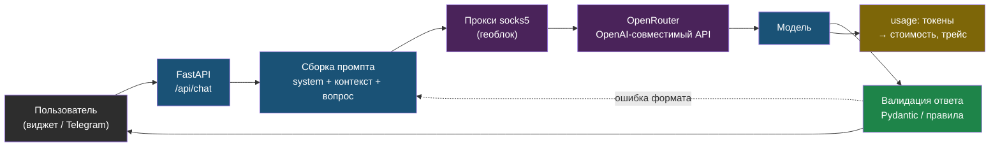

# День 1. Карта профессии и LLM-основы: суть

## Зачем это на собеседовании

Первые пятнадцать минут технического собеседования на AI-инженера — проверка, понимаешь ли ты, что происходит между твоим кодом и моделью. Что такое токен и почему счёт за русский текст выше, чем за английский. Почему модель «теряет» середину длинного документа. Чем temperature отличается от top_p и почему temperature=0 не даёт гарантированно одинаковый ответ. Как заставить модель вернуть строго JSON и почему без этого не строятся агенты. Каждый из этих вопросов — не теория, а причина конкретного бага или неожиданного счёта в проде, и интервьюер это знает.

Параллельно нужна вторая карта — рынка: как называется позиция, на которую ты откликаешься, что в ней просят и где на этой шкале стоишь ты. Без неё резюме будет написано на языке DevOps, а читать его будет человек, который ищет слова «RAG», «LangGraph» и «evals».

## Кто такой AI-инженер и чем он не является

Рынок смешивает четыре роли. Различать их нужно, чтобы не откликаться на чужие вакансии и не оправдываться на собеседовании за то, чего от тебя не должны ждать.

| Роль | Что делает | Чем измеряется | Инструменты |
|---|---|---|---|
| Data Scientist, ML-исследователь | Обучает и дообучает модели, ставит эксперименты | Метрики модели на датасете | PyTorch, notebooks, HuggingFace |
| ML-инженер (классический) | Доводит обученные модели до прода: пайплайны данных, serving, MLOps | Стабильность и скорость инференса, свежесть данных | Airflow, MLflow, Kubernetes, ONNX |
| **AI-инженер (LLM / GenAI)** | Строит продукты на готовых моделях: RAG, агенты, интеграции; отвечает за качество, стоимость и безопасность ответов | Качество на своих evals, стоимость запроса, латентность, инциденты | Python, LangChain/LangGraph, FastAPI, векторные БД, OpenAI-совместимые API, Langfuse |
| Промпт-инженер | Пишет и тестирует промпты без инфраструктуры | Качество ответов на тест-наборе | Playground, таблицы |

Ты — третья строка, причём с редким дополнением: DevOps-фундаментом. Большинство кандидатов на AI-инженера приходят из бэкенда или из data science и не умеют развернуть Postgres с pgvector за nginx, настроить CI с гейтом качества или разобраться, почему LXC с моделью упал по OOM. Ты умеешь. Индустрия называет это **LLMOps** — эксплуатация LLM-приложений в проде — и именно так тебе выгодно себя позиционировать.

Промпт-инженер как отдельная позиция на рынке РФ практически исчез: это часть работы AI-инженера, а не профессия. Если видишь вакансию «промпт-инженер» с зарплатой инженера — читай требования, обычно это тот же AI-инженер под другим названием.

## Рынок РФ: как называются вакансии и что в них просят

Названия, под которыми на hh.ru лежат нужные тебе позиции: **AI-инженер**, **LLM-инженер**, **ML-инженер (LLM / NLP)**, **разработчик AI-агентов**, **GenAI-разработчик**, **AI Solutions Engineer**, **Python-разработчик (LLM / RAG)**. Ищи по всем — одна и та же работа называется по-разному в разных компаниях.

Что просят чаще всего (по вакансиям на момент написания, сентябрь 2026; в лабе ты проверишь это на 20 живых объявлениях и получишь свою таблицу):

- **Python** — везде. FastAPI как стандарт для сервисов.
- **RAG** — как термин и как опыт: «строил RAG-систему», «векторные базы» (pgvector, Qdrant, Milvus, Chroma, Weaviate).
- **Фреймворки**: LangChain и LangGraph лидируют; LlamaIndex, Haystack, Pydantic AI — реже.
- **Работа с API моделей**: OpenAI-совместимые API, OpenRouter, YandexGPT, GigaChat; понимание токенов, лимитов, стоимости.
- **Open-weight модели и инференс**: Qwen, Llama, DeepSeek, T-Pro; vLLM, Ollama, квантизация — в вакансиях с on-prem-требованиями (банки, госсектор, промышленность).
- **Оценка качества**: «метрики», «evals», RAGAS, LLM-as-judge — реже, чем должно быть, но именно эти слова отличают middle от junior.
- **Инфраструктура**: Docker, PostgreSQL, Git, CI/CD, Linux — как должное; Kubernetes — в крупных компаниях.
- **Иногда**: PyTorch/HuggingFace и fine-tuning (LoRA) — это признак вакансии ближе к ML-инженеру, отсеивай такие, если fine-tuning указан как обязательный.

Уровни, как их видят работодатели:

- **Junior** — прошёл туториал по RAG, знает API одной модели, не выводил в прод.
- **Middle** — вывел RAG или агента в прод, умеет измерять качество и стоимость, знает, что ломается и как чинить.
- **Senior** — проектирует систему целиком, выбирает модели по evals, отвечает за бюджет, ведёт команду.

По активам ты между middle и middle+: multi-tenant RAG в проде с CI/CD, честный fallback, сервис памяти агентов, эксплуатация агента в Telegram с обходом геоблока. Чего не хватает до уверенного middle — измеримого качества (метрики поиска, evals) и словаря. Первое закрываем в дни 2 и 5, второе — сегодня.

## LLM за десять минут

**Токен** — единица, в которой модель читает и пишет текст. Это не слово и не символ: токенизатор (обычно BPE, byte-pair encoding) режет текст на частые фрагменты. Для английского один токен — примерно четыре символа, для русского в большинстве токенизаторов заметно меньше: два-три символа на токен. Практическое следствие: один и тот же текст на русском стоит в полтора-два раза больше токенов, чем на английском, и занимает больше места в контексте. В лабе ты это измеришь.

**Контекстное окно** — максимум токенов, которые модель обрабатывает за один вызов: системный промпт, история диалога, вставленные документы и сам ответ. Что не влезло — модель не видит. Окна в 2026 году измеряются сотнями тысяч токенов, но большое окно не значит, что модель одинаково внимательна ко всему содержимому: качество работы с информацией в середине длинного контекста ниже, чем в начале и конце. Поэтому RAG и не умирает с ростом окон: дешевле и точнее дать модели пять релевантных абзацев, чем весь корпус.

**Attention на пальцах.** Генерируя каждый следующий токен, модель «смотрит» на все токены контекста и взвешивает, какие важны сейчас. Отсюда два следствия. Первое: вычисления растут с длиной контекста — длинный промпт медленнее и дороже. Второе: чтобы не пересчитывать внимание к уже обработанным токенам, провайдер хранит их промежуточное представление — **KV-cache**. На нём построен prompt caching, о котором ниже.

**Генерация — по одному токену.** Модель выдаёт распределение вероятностей следующего токена, из него выбирается один, добавляется к контексту, и так до стоп-условия. Модель не «знает» ответ заранее и не проверяет факты: она продолжает текст наиболее правдоподобным образом. **Галлюцинация** — не сбой, а нормальная работа этого механизма при отсутствии нужной информации в контексте. Лечится не уговорами в промпте, а тем, что нужная информация в контексте появляется (RAG), а формат ответа проверяется кодом (structured outputs).

## Параметры генерации

| Параметр | Что делает | Когда какой |
|---|---|---|
| `temperature` | Сглаживает или обостряет распределение: 0 — почти всегда самый вероятный токен, 1 — как есть, выше — случайнее | 0–0.2 для извлечения данных, классификации, кода; 0.7–1.0 для текстов, где нужна вариативность |
| `top_p` | Nucleus sampling: выбирать только из токенов, чья суммарная вероятность ≤ p | Меняют либо temperature, либо top_p, не оба сразу |
| `max_tokens` | Потолок длины ответа | Всегда задавать: защита от бесконечного ответа и счёта |
| `stop` | Последовательности, на которых остановиться | Для жёстких форматов и диалоговых ролей |
| `seed` | Подсказка провайдеру для воспроизводимости | Не гарантия: батчинг, разные GPU и версии модели дают расхождения |

Важно для собеседования: **temperature=0 не гарантирует одинаковый ответ**. Провайдер может маршрутизировать запрос на разное железо, батчить его с другими, обновить версию модели. Детерминизм в LLM-системах достигается не параметрами, а архитектурой: валидацией вывода, кэшем ответов по хэшу запроса, идемпотентными операциями.

## Structured outputs: JSON, на который можно положиться

Если твой код разбирает ответ модели, ответ должен быть машиночитаемым. Три уровня надёжности:

1. **Просьба в промпте** «ответь JSON». Модель добавит пояснение, обернёт в код-блок, пропустит поле. Годится только с валидацией и ретраем.
2. **JSON mode** (`response_format: {"type": "json_object"}`) — провайдер гарантирует синтаксически корректный JSON, но не структуру.
3. **JSON Schema** (`response_format: {"type": "json_schema", ...}`) — провайдер ограничивает генерацию так, чтобы ответ соответствовал схеме (constrained decoding). Схему генерируешь из Pydantic-модели, ответ валидируешь ею же.

```python
from pydantic import BaseModel

class Lead(BaseModel):
    name: str
    phone: str | None = None
    email: str | None = None
    intent: str  # что хотел пользователь, одной фразой

schema = Lead.model_json_schema()
# → отдаём в response_format, ответ проверяем Lead.model_validate_json(raw)
```

Даже с json_schema валидация в коде обязательна: не все модели и провайдеры поддерживают режим одинаково, а бизнес-правила (телефон в правильном формате) схема не выразит. Правило: **ответ модели — недоверенный ввод**, как форма с сайта. В web-agent у тебя есть кандидат на такое извлечение: сбор имени и телефона в честном fallback — сейчас это диалог, а мог бы быть structured output с валидацией.

Ограничение режима `strict`: у некоторых провайдеров он требует, чтобы все поля были обязательными и `additionalProperties: false`. Pydantic-схема с `Optional`-полями в строгом режиме может не пройти — тогда либо убирай `strict`, либо делай поля обязательными с явным `null`.

## Function calling: модель не вызывает функции

Слово «вызов» вводит в заблуждение. Механика такая:

1. Ты передаёшь модели список инструментов: имя, описание, JSON-схема аргументов (снова из Pydantic).
2. Модель вместо текста возвращает `tool_calls`: имя инструмента и аргументы в JSON.
3. **Твой код** решает, выполнять ли, выполняет, получает результат.
4. Результат возвращается модели новым сообщением с ролью `tool`.
5. Модель либо отвечает пользователю, либо просит следующий инструмент.

Цикл «модель просит → код выполняет → модель смотрит на результат» и есть то, что называют **агентом**. Всё остальное — планирование, память, лимиты — надстройки над этим циклом, и ими займёмся в день 4. Сегодня важно уметь описать эти пять шагов и сказать, что безопасность и лимиты живут на шаге 3, в твоём коде, а не в модели.

## Промптинг, который действительно влияет

Большая часть «секретов промптинга» — шум. Что работает стабильно:

- **Структура системного промпта**: роль → контекст и данные → формат ответа → ограничения и что делать, если ответа нет. Последний пункт — то, что в web-agent стало честным fallback: «если в документах нет ответа, скажи об этом и предложи оставить контакт».
- **Few-shot**: два-три примера «вход → выход» дают больше, чем абзац инструкций, особенно для формата.
- **Chain-of-thought**: просьба рассуждать по шагам повышает качество на задачах с логикой у обычных моделей. Reasoning-модели делают это сами, и им такая инструкция обычно не нужна.
- **Разделение доверенного и недоверенного**: инструкции — в system, пользовательский текст и документы — отдельными блоками с явными границами. Это первая линия защиты от prompt injection (день 6).
- **Статичное — в начало.** Системный промпт и неизменные примеры ставь первыми, переменную часть — последней. Так работает prompt caching.

Что не работает: «магические» фразы, обещания награды, капслок. Что работает лучше любого промпта — проверка результата кодом.

## Стоимость и латентность

Цена запроса считается по формуле `input_tokens × цена_входа + output_tokens × цена_выхода`. Выходные токены у большинства моделей в три-пять раз дороже входных, поэтому длинный ответ стоит дороже длинного промпта. Типичный RAG-запрос — три-четыре тысячи токенов на входе (системный промпт, пять фрагментов документов, вопрос) и триста-пятьсот на выходе.

Рычаги снижения стоимости:

- **Prompt caching** — провайдер переиспользует KV-cache для повторяющегося начала промпта. На момент написания у Anthropic кэш задаётся явно (`cache_control` на блоках), чтение из кэша стоит около десятой части обычной цены, запись — дороже обычного ввода; у OpenAI кэш автоматический для длинных повторяющихся префиксов со скидкой около половины. Точные условия смотри в актуальном прайсе — они меняются. Условие срабатывания одно: **префикс должен совпадать байт в байт**, поэтому статичное — в начало.
- **Роутинг моделей**: дешёвая модель для классификации и извлечения, дорогая — только там, где измеренное качество этого требует.
- **Batch API**: для офлайн-задач (переиндексация, массовое извлечение) многие провайдеры дают скидку около половины за обработку в течение суток.
- **Кэш ответов** по хэшу нормализованного запроса — для повторяющихся вопросов в поддержке.

Латентность раскладывается на **TTFT** (time to first token — сколько ждать первого символа) и скорость генерации в токенах в секунду. Для чата важен TTFT, и его прячут **streaming**: пользователь видит текст по мере генерации. Для фоновых задач важна пропускная способность и стоимость, а не TTFT.

## Как выбрать модель

Критерии в порядке важности:

1. **Качество на твоих задачах**, измеренное на своём наборе из 20–50 вопросов (день 5), а не на публичных бенчмарках.
2. **Стоимость** при твоём профиле запросов — считай по прайсу, не по ощущениям.
3. **Латентность** — TTFT и tok/s под твоей нагрузкой.
4. **Контекст** — хватает ли для твоих документов с запасом.
5. **Доступность и ограничения**: из РФ прямой доступ к OpenAI, Anthropic и OpenRouter блокируется по IP — ты сам чинил это 3 сентября 2026 через socks5-прокси в Казахстан; для персональных данных и корпоративных документов часто требуют on-prem (152-ФЗ, политики безопасности).
6. **Лицензия** для open-weight моделей: можно ли коммерческое использование.

Open-weight модели (Qwen, Llama, DeepSeek, Mistral, российские T-Pro и другие) против API: локально — контроль данных, нулевая цена за токен, но железо, эксплуатация и обычно более слабое качество на сложных задачах. Подробно — день 6.

## Схема

Путь одного запроса в LLM-сервисе, как он выглядит у тебя в web-agent и как о нём говорят на собеседовании:



## Что у тебя уже есть

- **web-agent**: OpenAI-совместимый клиент к OpenRouter, системный промпт с подмешанными документами — это RAG (день 2); честный fallback с просьбой оставить контакт — это **guardrail** и **graceful degradation**; multi-tenant изоляция — **tenant isolation**; self-test-гейт в CI — зачаток **evals в CI** (день 5).
- **Hermes**: смена модели по цене и качеству — **model routing**; прокси при геоблоке — эксплуатация внешних API в условиях РФ; systemd с `Restart=always` — надёжность агента.
- **ai-agent-memory**: локальные эмбеддинги и семантический поиск — **embedding pipeline**, **vector store** (день 3); память между сессиями агента — **long-term memory** (день 4).
- **Книга 23 (devops)**: Ollama за nginx с авторизацией — **self-hosted inference** (день 6).
- **Лекции Anthropic** (`~/Documents/lessons/claud`, лекции 07–09): MCP и Claude API — источник для дня 4.

## Практика

1. Открой `~/proj/web-agent/services/agent-api/app/rag/chain.py` и выпиши, какие параметры генерации задаются сейчас (модель, temperature, max_tokens) и откуда берутся — из кода, настроек tenant или не задаются вовсе.
2. Найди, куда попадает `usage` из ответа модели: считается ли стоимость запроса и на каком уровне (на tenant, на диалог, никак). Запиши ответ — он пригодится в дни 5 и 7.

## Что проверить

- Могу за минуту объяснить разницу между AI-инженером, ML-инженером и data scientist и сказать, кем являюсь я.
- Назову семь-восемь названий вакансий, под которыми искать позицию, и пять требований, которые встречаются почти всегда.
- Объясню, что такое токен, почему русский текст дороже и что происходит, когда контекст переполнен.
- Скажу, чем temperature отличается от top_p, и почему temperature=0 не даёт детерминизма.
- Перечислю три уровня надёжности структурированного вывода и объясню, зачем валидация даже при json_schema.
- Опишу пять шагов function calling и укажу, где живут безопасность и лимиты.
- Напишу формулу стоимости запроса и назову четыре рычага её снижения, включая условие срабатывания prompt caching.
- Для каждого своего проекта назову два-три индустриальных термина, которыми описывается уже сделанное.
