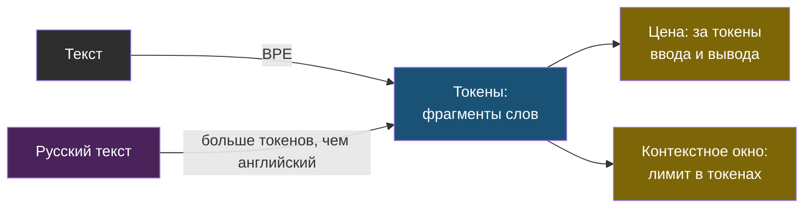
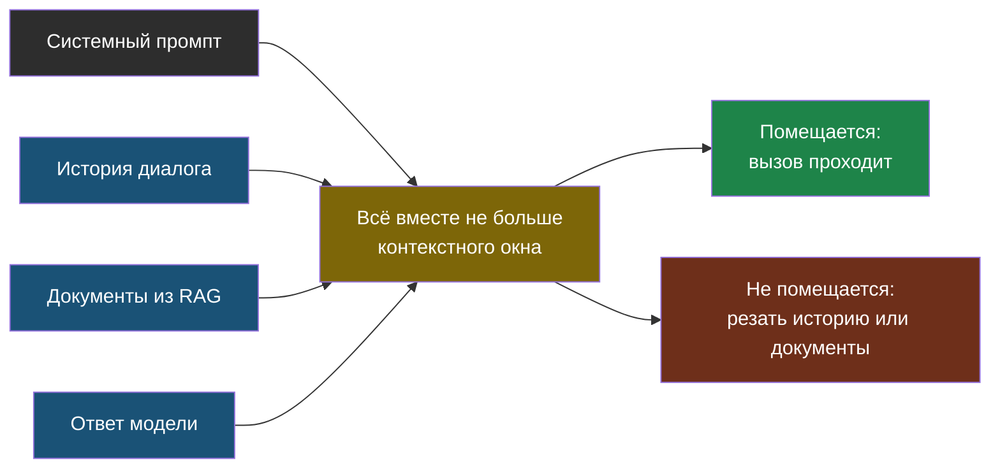
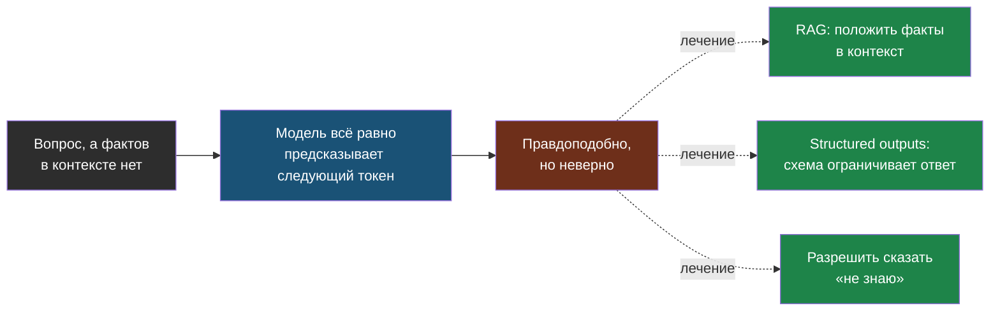
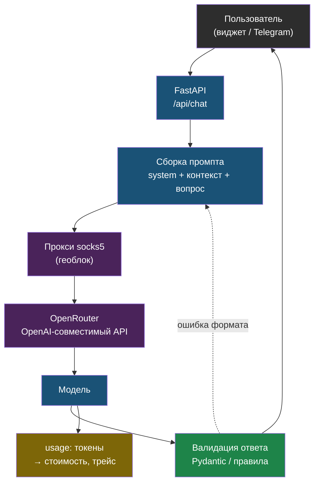

# День 1. Карта профессии и LLM-основы: суть

## Зачем это на собеседовании

Представь: ты вызываешь функцию, но у неё нет строгой сигнатуры — она принимает текст и возвращает текст, а что внутри происходит между входом и выходом, на первый взгляд непонятно. LLM (large language model, большая языковая модель) — это такая функция. Первые пятнадцать минут технического собеседования на AI-инженера — это проверка, понимаешь ли ты, что там внутри, хотя бы настолько, чтобы предсказывать поведение и не удивляться счёту в конце месяца.

Дальше в этой главе — пять конкретных вещей, которые интервьюер почти гарантированно спросит: что такое токен и почему русский текст обходится дороже английского; почему модель как будто «забывает» середину длинного текста; чем `temperature` отличается от `top_p`; как заставить модель вернуть именно JSON, а не «вот твой JSON, вот пояснение к нему»; и что вообще значит «агент» без магии в этом слове. Каждый пункт — не теория ради теории, а объяснение конкретного бага, который либо у тебя уже был, либо будет.

Отдельно нужна вторая карта — рынка: как называется позиция, на которую ты откликаешься, что от неё хотят и где на этой шкале сейчас ты сам. Без неё резюме получится написано на языке DevOps, а искать по нему будут слова «RAG», «LangGraph» и «evals».

## Кто такой AI-инженер и чем он не является

На рынке одним и тем же словом «AI» называют четыре разные профессии. Если не разделять их — будешь откликаться на чужие вакансии и оправдываться на собеседовании за то, чего от тебя вообще не ждали.

| Роль | Что делает | Чем измеряется | Инструменты |
|---|---|---|---|
| Data Scientist, ML-исследователь | Обучает и дообучает модели, ставит эксперименты | Метрики модели на датасете | PyTorch, notebooks, HuggingFace |
| ML-инженер (классический) | Доводит обученные модели до прода: пайплайны данных, serving, MLOps | Стабильность и скорость инференса, свежесть данных | Airflow, MLflow, Kubernetes, ONNX |
| **AI-инженер (LLM / GenAI)** | Строит продукты на готовых моделях: RAG, агенты, интеграции; отвечает за качество, стоимость и безопасность ответов | Качество на своих evals, стоимость запроса, латентность, инциденты | Python, LangChain/LangGraph, FastAPI, векторные БД, OpenAI-совместимые API, Langfuse |
| Промпт-инженер | Пишет и тестирует промпты без инфраструктуры | Качество ответов на тест-наборе | Playground, таблицы |

Разница простыми словами: Data Scientist сам учит модель весам — грубо говоря, сам пишет ту самую функцию с нуля и настраивает её параметры на данных. ML-инженер этого не делает, но умеет завести уже обученную модель в прод так, чтобы она не падала. AI-инженер модель вообще не трогает изнутри — он берёт готовую (через API или локально) и строит вокруг неё продукт: подмешивает нужные документы в промпт, даёт модели инструменты для вызова, следит, чтобы ответы были правильные, быстрые и не разоряли бюджет. Это третья строка таблицы, и это ты.

У тебя при этом редкое для новичков в AI дополнение — DevOps-фундамент. Большинство кандидатов на AI-инженера приходят из бэкенда или из data science и не умеют развернуть Postgres с pgvector за nginx, настроить CI с гейтом качества или разобраться, почему LXC с моделью упал по OOM (out of memory — процесс убило системой за то, что съел всю память). Ты умеешь. В индустрии это называется **LLMOps** — эксплуатация LLM-приложений в проде, по аналогии с DevOps/MLOps — и это стоит явно писать в резюме.

Промпт-инженер как отдельная штатная позиция на рынке РФ почти исчез: это стало частью работы AI-инженера, а не отдельной профессией. Если видишь вакансию «промпт-инженер» с зарплатой инженера — читай требования внимательно, обычно это тот же AI-инженер под старым названием.

## Рынок РФ: как называются вакансии и что в них просят

На hh.ru нужные тебе позиции лежат под разными названиями: **AI-инженер**, **LLM-инженер**, **ML-инженер (LLM / NLP)**, **разработчик AI-агентов**, **GenAI-разработчик**, **AI Solutions Engineer**, **Python-разработчик (LLM / RAG)**. Ищи по всем сразу — одна и та же работа в разных компаниях называется по-разному.

Что просят чаще всего (по вакансиям на момент написания, сентябрь 2026; в лабе ты проверишь это на 20 живых объявлениях и получишь свою таблицу):

- **Python** — везде. FastAPI как стандарт для сервисов.
- **RAG** — как термин и как опыт: «строил RAG-систему», «векторные базы» (pgvector, Qdrant, Milvus, Chroma, Weaviate). Что такое RAG — в дне 2, коротко: способ дать модели актуальные факты, не переобучая её.
- **Фреймворки**: LangChain и LangGraph лидируют; LlamaIndex, Haystack, Pydantic AI — реже.
- **Работа с API моделей**: OpenAI-совместимые API, OpenRouter, YandexGPT, GigaChat; понимание токенов, лимитов, стоимости.
- **Open-weight модели и инференс**: Qwen, Llama, DeepSeek, T-Pro; vLLM, Ollama, квантизация — в вакансиях с on-prem-требованиями (банки, госсектор, промышленность — там нельзя отправлять данные во внешний API).
- **Оценка качества**: «метрики», «evals», RAGAS, LLM-as-judge — упоминаются реже, чем следовало бы, но именно эти слова отличают middle от junior.
- **Инфраструктура**: Docker, PostgreSQL, Git, CI/CD, Linux — считается само собой разумеющимся; Kubernetes — в крупных компаниях.
- **Иногда**: PyTorch/HuggingFace и fine-tuning (LoRA, дообучение модели под свою задачу) — если это стоит в требованиях как обязательное, вакансия ближе к ML-инженеру, такие можно пропускать.

Как работодатели видят уровни:

- **Junior** — прошёл туториал по RAG, знает API одной модели, в прод не выводил.
- **Middle** — вывел RAG или агента в прод, умеет измерять качество и стоимость, знает, что в системе ломается и как это чинить.
- **Senior** — проектирует систему целиком, выбирает модели по измеримым метрикам (evals), отвечает за бюджет, ведёт команду.

По тому, что у тебя реально сделано, ты между middle и middle+: multi-tenant RAG в проде с CI/CD, честный fallback (когда модель не знает ответ — она так и говорит, а не выдумывает), сервис памяти агентов, эксплуатация агента в Telegram с обходом геоблока. Чего не хватает до уверенного middle — измеримого качества (метрики поиска, evals — дни 2 и 5) и словаря индустрии — им и займёмся сегодня.

## LLM за десять минут

Дальше — минимальный набор понятий, без которых непонятно, почему код в лабах написан именно так. Каждое определение — с диаграммой рядом: смотри на неё, если текста мало.

### Токен: как модель на самом деле читает текст

Ты не даёшь модели ни буквы, ни целые слова. Между твоим текстом и моделью стоит токенизатор — программа, которая режет текст на частые повторяющиеся кусочки, обычно по алгоритму BPE (byte-pair encoding). Кусочек — это и есть **токен**: иногда целое короткое слово, иногда часть слова, иногда один знак препинания. Например, слово «нарезка» токенизатор скорее всего разрежет на два-три куска, а не оставит целым словом — это зависит от того, как часто такое сочетание букв встречалось в данных, на которых токенизатор строился.

> **Токен** — единица, в которой модель читает и пишет текст. Это не слово и не символ: токенизатор (обычно BPE, byte-pair encoding) режет текст на частые фрагменты. Для английского один токен — примерно четыре символа, для русского в большинстве токенизаторов заметно меньше: два-три символа на токен. Практическое следствие: один и тот же текст на русском стоит в полтора-два раза больше токенов, чем на английском, и занимает больше места в контексте. В лабе ты это измеришь.



Почему это важно практически: и цена запроса, и лимит длины текста считаются не в буквах и не в словах, а в токенах. А большинство токенизаторов обучены в основном на английском тексте, поэтому английские слова чаще совпадают с «частыми кусочками» и режутся на меньшее число токенов, чем такой же по смыслу русский текст. Отсюда практический вывод: одна и та же мысль на русском обходится дороже, чем на английском, и занимает больше места в лимите. Точную разницу ты измеришь в лабе — это не абстракция, а число, которое можно посчитать для своей модели.

### Контекстное окно: у функции есть лимит на размер входа

Представь функцию, у которой есть жёсткий потолок на суммарный размер всех аргументов — если превысил, лишнее просто обрежется. У LLM это и есть **контекстное окно**.

> **Контекстное окно** — максимум токенов, которые модель обрабатывает за один вызов: системный промпт, история диалога, вставленные документы и сам ответ. Что не влезло — модель не видит. Окна в 2026 году измеряются сотнями тысяч токенов, но большое окно не значит, что модель одинаково внимательна ко всему содержимому: качество работы с информацией в середине длинного контекста ниже, чем в начале и конце. Поэтому RAG и не умирает с ростом окон: дешевле и точнее дать модели пять релевантных абзацев, чем весь корпус.



Важная деталь, которая на первый взгляд не очевидна: даже если весь текст физически влез в окно, это не значит, что модель одинаково хорошо «помнит» каждую его часть. Факт, спрятанный где-то в середине огромного документа, находится и используется хуже, чем факт в начале или в конце. Поэтому подход «закинуть в модель весь корпус документов целиком, окно же большое» работает хуже, чем кажется — и именно поэтому в дне 2 ты будешь строить поиск, который заранее выбирает 5 релевантных абзацев, а не сваливает всё подряд.

### Как модель вообще генерирует текст (и откуда берётся KV-cache)

Механика простая, если думать о ней как о цикле, а не как о чёрной магии. На каждом шаге модель смотрит на весь текст, который уже накопился (твой промпт плюс то, что она уже сама написала), и выбирает следующий токен. Этот выбор не случайный и не по правилам — модель предсказывает вероятность каждого возможного следующего токена и выбирает один (как именно выбирает — управляется параметром `temperature`, о нём чуть ниже). Выбранный токен добавляется к тексту, и всё повторяется — пока не встретится специальный «стоп»-токен или не кончится лимит.

Чтобы решить, какой токен важен для выбора следующего, модель на каждом шаге «пробегает» по всем токенам контекста и взвешивает, насколько каждый из них сейчас релевантен — этот механизм называется **attention** (внимание). Из этого следуют две практические вещи. Первая: чем длиннее контекст, тем больше вычислений на каждый новый токен — длинный промпт медленнее и дороже. Вторая: раз токены из начала текста участвуют в каждом следующем шаге одинаково, довольно расточительно пересчитывать их «вес» заново при каждом новом токене — поэтому провайдер один раз считает их представление и кеширует. Это и называется **KV-cache**, и на нём основан **prompt caching** (экономия на повторяющемся начале промпта, подробнее — в разделе про стоимость).

Из этого же вытекает важный факт о самой природе модели: она **не знает** ответ заранее и не сверяется с фактами — она на каждом шаге просто продолжает текст самым правдоподобным, по её обучению, образом. Отсюда прямо следует, что такое галлюцинация.

> **Галлюцинация** — не сбой, а нормальная работа этого механизма при отсутствии нужной информации в контексте. Лечится не уговорами в промпте, а тем, что нужная информация в контексте появляется (RAG), а формат ответа проверяется кодом (structured outputs).



Модель не «врёт» специально и не «не помнит» — она устроена так, что всегда выдаёт наиболее вероятное продолжение текста, и если правильного ответа в контексте нет, вероятное продолжение может оказаться неверным, но звучать при этом абсолютно уверенно. Это ключевая мысль для всей темы AI-инженерии: чинить это нужно не мольбами в промпте («пожалуйста, не выдумывай»), а инженерными средствами — дать модели нужные факты прямо в контексте (RAG, день 2) и заставить код проверять формат ответа (structured outputs, ниже).

## Параметры генерации

| Параметр | Что делает | Когда какой |
|---|---|---|
| `temperature` | Сглаживает или обостряет распределение вероятностей: 0 — почти всегда самый вероятный токен, 1 — как есть, выше — случайнее | 0–0.2 для извлечения данных, классификации, кода; 0.7–1.0 для текстов, где нужна вариативность |
| `top_p` | Nucleus sampling: выбирать только из токенов, чья суммарная вероятность ≤ p | Меняют либо temperature, либо top_p, не оба сразу |
| `max_tokens` | Потолок длины ответа | Всегда задавать: защита от бесконечного ответа и счёта |
| `stop` | Последовательности, на которых остановиться | Для жёстких форматов и диалоговых ролей |
| `seed` | Подсказка провайдеру для воспроизводимости | Не гарантия: батчинг, разные GPU и версии модели дают расхождения |

Самая частая ловушка на собеседовании: **`temperature=0` не гарантирует одинаковый ответ дважды**. Кажется логичным — 0 значит «без случайности», должен быть детерминизм, как в обычной функции. На практике провайдер может отправить одинаковые запросы на разное железо, объединить их в один батч с чужими запросами, незаметно обновить версию модели — и результат отличается. Вывод простой: детерминизм в LLM-системах строится не параметрами вызова, а архитектурой вокруг — валидацией вывода кодом, кэшем ответов по хэшу запроса, идемпотентными (безопасными для повтора) операциями.

## Structured outputs: JSON, на который можно положиться

Если твой код разбирает ответ модели программно (а не просто показывает его человеку), ответ должен быть машиночитаемым. Есть три уровня надёжности, от слабого к сильному:

1. **Просьба в промпте** «ответь JSON». Самый ненадёжный вариант: модель может добавить пояснение до или после, обернуть в код-блок с ```` ```json ````, пропустить поле. Годится только вместе с валидацией и ретраем (повторным запросом при ошибке).
2. **JSON mode** (`response_format: {"type": "json_object"}`) — провайдер гарантирует, что ответ синтаксически корректный JSON (откроется `json.loads`), но не гарантирует, что в нём будут нужные тебе поля.
3. **JSON Schema** (`response_format: {"type": "json_schema", ...}`) — провайдер технически ограничивает сам процесс генерации так, чтобы результат соответствовал заданной схеме (это называется constrained decoding — модель физически не может выбрать токен, который сломает схему). Схему получаешь из Pydantic-модели, тем же классом потом и проверяешь ответ.

```python
from pydantic import BaseModel

class Lead(BaseModel):
    name: str
    phone: str | None = None
    email: str | None = None
    intent: str  # что хотел пользователь, одной фразой

schema = Lead.model_json_schema()
# → отдаём в response_format, ответ проверяем Lead.model_validate_json(raw)
```

Даже с самым надёжным `json_schema` валидация в коде всё равно обязательна: не все модели и провайдеры поддерживают режим одинаково строго, а часть бизнес-правил (например, «телефон должен быть в формате +7...») схема просто не умеет выразить. Общее правило: **ответ модели — недоверенный ввод**, ровно как данные из формы на сайте, которые тоже нельзя использовать без проверки. В web-agent у тебя уже есть кандидат на такую обработку: сбор имени и телефона в честном fallback — сейчас это устроено как обычный диалог, а могло бы быть structured output с валидацией на каждом шаге.

Отдельная техническая деталь: строгий режим (`strict`) у некоторых провайдеров требует, чтобы все поля схемы были обязательными и стоял флаг `additionalProperties: false`. Pydantic-схема с необязательными (`Optional`) полями в таком строгом режиме может не пройти — тогда либо отключаешь `strict`, либо делаешь поля обязательными с явным значением `null` вместо отсутствия поля.

## Function calling: модель не вызывает функции

Само слово «вызов» тут вводит в заблуждение — модель ничего не выполняет сама, у неё физически нет доступа ни к какому коду. Реальная механика — это диалог из пяти шагов:

1. Ты передаёшь модели список доступных инструментов: имя, описание, JSON-схема аргументов (снова из Pydantic, как и в structured outputs).
2. Вместо обычного текста модель может вернуть `tool_calls` — структуру вида «хочу вызвать вот этот инструмент вот с такими аргументами».
3. **Твой код** — не модель — решает, выполнять ли это на самом деле, и если да, выполняет и получает результат.
4. Результат возвращается модели новым сообщением с ролью `tool` — как будто кто-то третий подсказал модели ответ инструмента.
5. Модель либо отвечает пользователю окончательно, либо просит ещё один инструмент, и цикл повторяется.

Именно этот цикл — «модель просит инструмент → твой код проверяет и выполняет → модель видит результат и решает, что дальше» — и называется **агентом**, без всякой мистики. Всё остальное, о чём говорят вокруг агентов — планирование, память между запросами, лимиты на число шагов — это надстройки над этим же циклом, ими займёмся отдельно в дне 4. На сегодня важно уметь по памяти назвать эти пять шагов и чётко сказать: безопасность и лимиты живут на шаге 3, в твоём коде, а не где-то «внутри» модели.

## Промптинг, который действительно влияет

Вокруг промптинга много шума — «секретных фраз», которые якобы магически улучшают ответ. Реально стабильно работает вот что:

- **Структура системного промпта**: роль → контекст и данные → формат ответа → что делать, если ответа нет. Последний пункт — ровно то, что в web-agent реализовано как честный fallback: «если в документах нет ответа, скажи об этом прямо и предложи оставить контакт», а не придумывай что-нибудь похожее на правду.
- **Few-shot**: два-три примера «вход → выход» прямо в промпте обычно работают лучше, чем абзац словесных инструкций — особенно когда важен именно формат ответа.
- **Chain-of-thought**: просьба «рассуждай по шагам» повышает качество на задачах с логикой у обычных моделей. Reasoning-модели (те, что уже обучены рассуждать перед ответом) делают это сами, и явно просить их об этом обычно не нужно.
- **Разделение доверенного и недоверенного**: твои инструкции — в system-сообщении, текст пользователя и документы — отдельными блоками с явно обозначенными границами. Это первая линия защиты от prompt injection — атаки, когда во входные данные подсовывают текст, маскирующийся под инструкцию (подробно — день 6).
- **Статичное — в начало.** Системный промпт и неизменные примеры ставь в начало запроса, переменную часть (сам вопрос) — в конец. Именно так работает prompt caching, о котором дальше.

А вот что не работает: «магические» фразы, обещания награды модели, капслок. Единственное, что работает надёжнее любого промпта — это проверка результата кодом после того, как модель уже ответила.

## Стоимость и латентность

Цена одного запроса считается по формуле `input_tokens × цена_входа + output_tokens × цена_выхода`. Важная асимметрия: у большинства моделей токены на выходе стоят в три-пять раз дороже токенов на входе — поэтому длинный ответ обходится дороже длинного вопроса. Типичный запрос в RAG-системе — это три-четыре тысячи токенов на входе (системный промпт, пять найденных фрагментов документов, сам вопрос) и триста-пятьсот токенов на выходе.

Способы снизить стоимость, от самого мощного к менее очевидному:

- **Prompt caching** — провайдер переиспользует тот самый KV-cache для повторяющегося начала промпта, вместо того чтобы пересчитывать его заново на каждый запрос. На момент написания у Anthropic кэш задаётся явно (`cache_control` на блоках), чтение из кэша стоит около десятой части обычной цены, запись — дороже обычного ввода; у OpenAI кэш срабатывает автоматически для длинных повторяющихся префиксов со скидкой около половины. Точные условия смотри в актуальном прайсе провайдера — они меняются. Но условие срабатывания одно и то же везде: **начало промпта должно совпадать байт в байт** — отсюда и правило «статичное в начало» из прошлого раздела.
- **Роутинг моделей**: дешёвую модель — на простые задачи вроде классификации или извлечения данных, дорогую — только туда, где измеренное (не на глаз) качество реально этого требует.
- **Batch API**: для офлайн-задач (переиндексация, массовое извлечение данных), где не важна мгновенная скорость, многие провайдеры дают скидку около половины за обработку в течение суток.
- **Кэш ответов** по хэшу нормализованного запроса — полезно там, где вопросы часто повторяются, например в поддержке.

Латентность (задержка ответа) раскладывается на две разные вещи: **TTFT** (time to first token — сколько ждать до первого символа ответа) и скорость самой генерации в токенах в секунду. Для чата с живым человеком критичен именно TTFT, и его субъективно прячет **streaming** — режим, при котором пользователь видит текст по мере генерации, а не ждёт полный ответ целиком. Для фоновых задач (например, ночной пакетной обработки) важнее не TTFT, а суммарная пропускная способность и итоговая стоимость.

## Как выбрать модель

Критерии выбора, в порядке важности:

1. **Качество на твоих конкретных задачах**, измеренное на своём наборе из 20–50 вопросов (день 5), а не на красивых цифрах из публичных бенчмарков — они мало что говорят про твой конкретный случай.
2. **Стоимость** при твоём реальном профиле запросов — считай по актуальному прайсу, а не по ощущению «вроде дёшево».
3. **Латентность** — TTFT и скорость в токенах в секунду именно под твоей нагрузкой, не в вакууме.
4. **Контекст** — хватает ли размера окна для твоих документов, и с запасом, а не впритык.
5. **Доступность и ограничения**: из РФ прямой доступ к OpenAI, Anthropic и OpenRouter блокируется по IP — ты сам чинил это 3 сентября 2026 через socks5-прокси в Казахстан; для персональных данных и корпоративных документов часто требуют on-prem-развёртывание (по 152-ФЗ и внутренним политикам безопасности компании, а не потому что «так надёжнее»).
6. **Лицензия** для open-weight моделей — можно ли использовать их в коммерческом продукте, а не только для личных экспериментов.

Открытые модели (Qwen, Llama, DeepSeek, Mistral, российские T-Pro и другие, чьи веса можно скачать и запустить самому) против доступа через API — это всегда компромисс: локально ты получаешь полный контроль над данными и нулевую цену за токен, но взамен несёшь на себе железо, эксплуатацию, и обычно получаешь более слабое качество на сложных задачах, чем у топовых моделей за API. Подробно про это — день 6.

## Схема

Путь одного запроса в LLM-сервисе, как он выглядит у тебя в web-agent и как о нём говорят на собеседовании:



## Что у тебя уже есть

- **web-agent**: OpenAI-совместимый клиент к OpenRouter, системный промпт с подмешанными документами — это RAG (день 2); честный fallback с просьбой оставить контакт — это **guardrail** и **graceful degradation**; multi-tenant изоляция — **tenant isolation**; self-test-гейт в CI — зачаток **evals в CI** (день 5).
- **Hermes**: смена модели по цене и качеству — **model routing**; прокси при геоблоке — эксплуатация внешних API в условиях РФ; systemd с `Restart=always` — надёжность агента.
- **ai-agent-memory**: локальные эмбеддинги и семантический поиск — **embedding pipeline**, **vector store** (день 3); память между сессиями агента — **long-term memory** (день 4).
- **Книга 23 (devops)**: Ollama за nginx с авторизацией — **self-hosted inference** (день 6).
- **Лекции Anthropic** (`~/Documents/lessons/claud`, лекции 07–09): MCP и Claude API — источник для дня 4.

## Практика

1. Открой `~/proj/web-agent/services/agent-api/app/rag/chain.py` и выпиши, какие параметры генерации задаются сейчас (модель, temperature, max_tokens) и откуда берутся — из кода, настроек tenant или не задаются вовсе.
2. Найди, куда попадает `usage` из ответа модели: считается ли стоимость запроса и на каком уровне (на tenant, на диалог, никак). Запиши ответ — он пригодится в дни 5 и 7.

## Что проверить

- Могу за минуту объяснить разницу между AI-инженером, ML-инженером и data scientist и сказать, кем являюсь я.
- Назову семь-восемь названий вакансий, под которыми искать позицию, и пять требований, которые встречаются почти всегда.
- Объясню, что такое токен, почему русский текст дороже и что происходит, когда контекст переполнен.
- Скажу, чем temperature отличается от top_p, и почему temperature=0 не даёт детерминизма.
- Перечислю три уровня надёжности структурированного вывода и объясню, зачем валидация даже при json_schema.
- Опишу пять шагов function calling и укажу, где живут безопасность и лимиты.
- Напишу формулу стоимости запроса и назову четыре рычага её снижения, включая условие срабатывания prompt caching.
- Для каждого своего проекта назову два-три индустриальных термина, которыми описывается уже сделанное.
