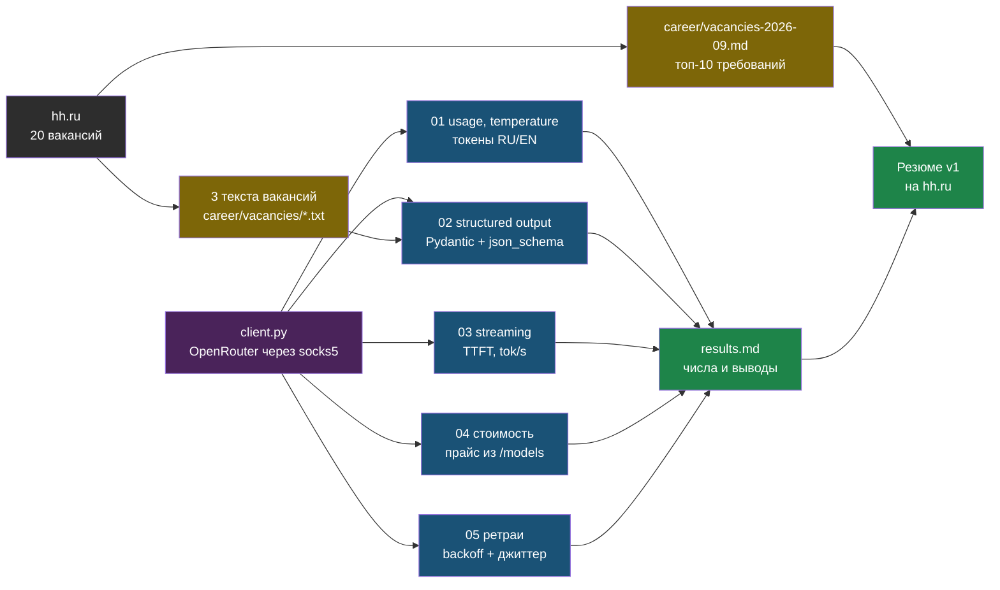

# День 1. Лаба: вакансии и первые запросы к LLM

## Результат

Два артефакта. Первый — `career/vacancies-2026-09.md`: таблица из 20 реальных вакансий с подсчётом требований; она заземляет карту профессии из главы 1 и станет основой резюме. Второй — публичный репозиторий портфолио `~/proj/ai-labs/` с папкой `day1-llm-basics/`: пять рабочих скриптов и `results.md` с измеренными числами (токены RU против EN, TTFT, стоимость сценария для двух моделей). Это первый код, который увидит работодатель, поэтому пишем аккуратно.

## Карта лабы



## Подготовка

Что нужно до старта (15 минут):

- Python 3.12 и `venv`. Ключ OpenRouter — отдельный учебный с ограниченным бюджетом, не продовый; создай его на с `openrouter.ai/keys`.
- Доступ к OpenRouter из РФ блокируется по IP (ты это видел 3 сентября: `403 Access denied by security policy`). Решение то же, что для Hermes: socks5-прокси через LXC 106 на kl-pc. Библиотеке `httpx`, на которой работает `openai`, нужен extra `socks`.
- Аккаунт на hh.ru с пустым или старым резюме — сегодня появится новое.

```bash
# Из корня репозитория курса; отличающиеся существующие файлы не перезаписываются.
python3 scripts/install_labs.py --dest ~/proj/ai-labs
cd ~/proj/ai-labs
git init -q
python3 -m venv .venv && source .venv/bin/activate
python -m pip install --require-hashes -r requirements.txt
cd day1-llm-basics
```

Установщик копирует готовые исходники, публичные fixtures и безопасный .gitignore: .env, .local/, corpus/, chroma/, out/ и локальные виртуальные окружения не публикуются. Не заменяй существующий .gitignore вслепую. Все команды Python дня 1 выполняй из day1-llm-basics; ниже разбирается уже установленный код.

Переменные окружения — в файле `~/proj/ai-labs/.env` (он в `.gitignore`). Содержимое:

```bash
export OPENROUTER_API_KEY="sk-or-..."
export LLM_MODEL="anthropic/claude-sonnet-4.6"
# прокси нужен только из РФ; убери, если запускаешь там, где OpenRouter доступен напрямую
# socks5h, а не socks5: имена резолвит прокси, а не локальный DNS провайдера
export HTTPS_PROXY="socks5h://192.168.0.106:1080"
export https_proxy="$HTTPS_PROXY"
```

Загрузка и проверка доступа:

```bash
source ~/proj/ai-labs/.env
curl -sS -o /dev/null -w '%{http_code}\n' https://openrouter.ai/api/v1/models
```

Ожидаемо `200`. При `403` проверь условия доступа провайдера и сетевой маршрут; код сам по себе не доказывает, что прокси не применился. `curl` читает `https_proxy` в нижнем регистре, `httpx` — в любом, поэтому в файле заданы оба. Модель по умолчанию взята из конфига web-agent; любую другую подставишь через `LLM_MODEL`, список — `openrouter.ai/models`.

## Шаг 1. Двадцать вакансий (30 минут, без кода)

Открой hh.ru и по очереди поищи: «AI инженер», «LLM инженер», «ML инженер LLM», «разработчик AI агентов», «RAG», «Python LLM». Отбери 20 вакансий, которые ты бы реально рассматривал (уровень middle или «без указания», Python, удалёнка или твой город). По каждой заполни строку таблицы в `~/Documents/lessons/ai-engineering/career/vacancies-2026-09.md`:

```markdown
| # | Компания | Название | Зарплата | Обязательно | Желательно | Есть у меня | Ссылка |
|---|---|---|---|---|---|---|---|
| 1 | … | AI-инженер | 250–350k | Python, RAG, LangChain, pgvector, FastAPI | Langfuse, vLLM | Python, RAG, FastAPI, Postgres | … |
```

Затем внизу файла — подсчёт: сколько раз встретилось каждое требование. Двадцать вакансий дадут честную картину: что в топе, чего у тебя нет, какие слова обязаны быть в резюме. Три вакансии с самым подробным текстом сохрани целиком в `career/vacancies/01.txt`, `02.txt`, `03.txt` — они пойдут в шаг 4.

Не пропускай этот шаг ради кода: он определяет, какими словами ты вечером напишешь резюме.

## Шаг 2. Общий клиент

Все скрипты используют один клиент, чтобы прокси, таймауты и заголовки настраивались в одном месте. `max_retries=0` — ретраи мы напишем сами в шаге 7 и хотим видеть ошибки, а не скрывать их.

```python
# ~/proj/ai-labs/day1-llm-basics/client.py
import os
from openai import OpenAI

BASE_URL = os.getenv("OPENROUTER_BASE_URL", "https://openrouter.ai/api/v1")
MODEL = os.getenv("LLM_MODEL", "anthropic/claude-sonnet-4.6")


def make_client(timeout: float = 60.0) -> OpenAI:
    """Клиент OpenAI-совместимого API. Прокси берётся из HTTPS_PROXY автоматически (httpx)."""
    api_key = os.environ["OPENROUTER_API_KEY"]  # KeyError лучше, чем тихий 401
    return OpenAI(
        base_url=BASE_URL,
        api_key=api_key,
        timeout=timeout,
        max_retries=0,
        default_headers={
            "HTTP-Referer": "https://ai-engineering.adelfos.ru",
            "X-Title": "ai-labs day1",
        },
    )
```

Проверка: `python -c "from client import make_client; print(make_client().models.list().data[0].id)"` печатает id какой-нибудь модели. Заголовки `HTTP-Referer` и `X-Title` — рекомендация OpenRouter для статистики, на работу не влияют.

## Шаг 3. Запрос, usage и temperature

Три вещи за один скрипт: как выглядит ответ и `usage`, как temperature меняет разброс, и сколько токенов занимает одинаковая фраза на русском и английском.

```python
# ~/proj/ai-labs/day1-llm-basics/01_basics.py
from client import make_client, MODEL

client = make_client()


def ask(prompt: str, temperature: float):
    r = client.chat.completions.create(
        model=MODEL,
        temperature=temperature,
        max_tokens=120,
        messages=[
            {"role": "system", "content": "Отвечай одним коротким предложением, без пояснений."},
            {"role": "user", "content": prompt},
        ],
    )
    if not r.choices or not r.choices[0].message.content or r.usage is None:
        raise RuntimeError("нет текста/usage: проверь отказ, лимит ответа и возможности провайдера")
    return r.choices[0].message.content.strip(), r.usage


QUESTION = "Придумай название для сервиса, который отвечает на вопросы по документам компании."
for t in (0.0, 1.0):
    print(f"\n=== temperature={t} ===")
    for i in range(3):
        text, usage = ask(QUESTION, t)
        print(f"{i + 1}. {text}   [in={usage.prompt_tokens} out={usage.completion_tokens}]")

print("\n=== токены: русский против английского ===")
for s in (
    "The quick brown fox jumps over the lazy dog near the river.",
    "Быстрая рыжая лиса перепрыгивает через ленивую собаку у реки.",
):
    r = client.chat.completions.create(model=MODEL, max_tokens=1, messages=[{"role": "user", "content": s}])
    print(f"{r.usage.prompt_tokens:4d} токенов | {len(s):3d} символов | {s}")
```

Что должно получиться: при `temperature=0.0` три ответа одинаковые или почти одинаковые, при `1.0` — заметно разные. Числа токенов для RU и EN могут различаться в любую сторону; соотношение зависит от токенизатора модели, поэтому запиши обе цифры в `results.md`. В `prompt_tokens` входят служебные токены разметки сообщения — это нормально.

## Шаг 4. Structured output: вакансия → объект

Берём три текста вакансий из шага 1 и превращаем их в Pydantic-объекты. Схема — из модели, режим — `json_schema`, при отказе провайдера — запасной путь через промпт со схемой. В обоих случаях ответ проходит `model_validate_json`.

```python
# ~/proj/ai-labs/day1-llm-basics/02_structured.py
import json
import re
import sys
from pathlib import Path

from typing import Literal
from openai import BadRequestError
from pydantic import BaseModel, ConfigDict, Field, ValidationError, model_validator

from client import make_client, MODEL


class Vacancy(BaseModel):
    model_config = ConfigDict(extra="forbid")
    title: str = Field(description="Название позиции как в тексте")
    company: str = Field(description="Компания или unknown")
    seniority: Literal["junior", "middle", "senior", "unknown"]
    must_have: list[str]
    nice_to_have: list[str]
    salary_min: int | None = Field(description="Нижняя граница в рублях или null")
    salary_max: int | None = Field(description="Верхняя граница в рублях или null")
    remote: bool | None

    @model_validator(mode="after")
    def check_salary(self):
        if any(v is not None and v < 0 for v in (self.salary_min, self.salary_max)):
            raise ValueError("зарплата не может быть отрицательной")
        if self.salary_min is not None and self.salary_max is not None and self.salary_min > self.salary_max:
            raise ValueError("нижняя граница зарплаты выше верхней")
        return self


SYSTEM = "Ты извлекаешь структурированные данные из текста вакансии. Отвечай только JSON по схеме, без пояснений и без markdown."
FENCE = re.compile(r"^```(?:json)?\s*|\s*```$", re.S)


def extract(client, text: str) -> Vacancy:
    schema = Vacancy.model_json_schema()
    messages = [{"role": "system", "content": SYSTEM}, {"role": "user", "content": text}]
    try:
        r = client.chat.completions.create(
            model=MODEL,
            temperature=0,
            max_tokens=600,
            response_format={"type": "json_schema", "json_schema": {"name": "vacancy", "strict": True, "schema": schema}},
            messages=messages,
        )
        mode = "json_schema"
    except BadRequestError as exc:
        # Не маскируем auth/rate limit/сетевые ошибки и произвольные 400.
        if not any(word in str(exc).lower() for word in ("json_schema", "response_format", "structured output")):
            raise
        print(f"  json_schema не прошёл ({type(exc).__name__}), запасной путь через промпт", file=sys.stderr)
        messages[0]["content"] += "\nСхема JSON:\n" + json.dumps(schema, ensure_ascii=False)
        r = client.chat.completions.create(model=MODEL, temperature=0, max_tokens=600, messages=messages)
        mode = "prompt+validate"
    if not r.choices or not r.choices[0].message.content or r.choices[0].finish_reason == "length":
        raise RuntimeError("structured output отсутствует/оборван; отказ или лимит не считается успешным JSON")
    raw = FENCE.sub("", r.choices[0].message.content.strip())
    vacancy = Vacancy.model_validate_json(raw)  # ValidationError не замалчивается и не публикуется как успех
    print(f"  режим: {mode}, usage={r.usage}")
    return vacancy


if __name__ == "__main__":
    client = make_client()
    if len(sys.argv) < 2:
        raise SystemExit("передай пути к публичным текстам вакансий")
    out = Path(__file__).resolve().parent / "out"
    out.mkdir(exist_ok=True)
    for path in map(Path, sys.argv[1:]):
        print(f"\n{path.name}")
        v = extract(client, path.read_text(encoding="utf-8"))
        (out / f"{path.stem}.json").write_text(v.model_dump_json(indent=2, ensure_ascii=False), encoding="utf-8")
        print(f"  {v.title} @ {v.company} [{v.seniority}] must={len(v.must_have)} remote={v.remote}")
```

Запуск: `python 02_structured.py ~/Documents/lessons/ai-engineering/career/vacancies/0*.txt`. Три JSON-файла в `out/`, в консоли — режим (`json_schema` или запасной) и токены. Если в `stderr` каждый раз запасной путь — модель не поддерживает structured outputs через OpenRouter; выбери на `openrouter.ai/models` модель с фильтром «Structured Outputs» и повтори с другим `LLM_MODEL`. Оба варианта — легитимный результат для `results.md`: на собеседовании ценят именно понимание, что запасной путь обязателен.

## Шаг 5. Streaming: время до первого токена

```python
# ~/proj/ai-labs/day1-llm-basics/03_streaming.py
import time

from client import make_client, MODEL

client = make_client()
t0 = time.perf_counter()
first = None
usage = None

stream = client.chat.completions.create(
    model=MODEL,
    stream=True,
    stream_options={"include_usage": True},
    max_tokens=300,
    messages=[{"role": "user", "content": "Объясни в пяти предложениях, что такое RAG, для DevOps-инженера."}],
)
for event in stream:
    if event.usage:
        usage = event.usage  # приходит в последнем чанке
    if not event.choices:
        continue
    delta = event.choices[0].delta.content or ""
    if delta and first is None:
        first = time.perf_counter()
    print(delta, end="", flush=True)

t1 = time.perf_counter()
if first is None:
    raise RuntimeError("стрим не содержал текста: проверь отказ и finish_reason")
print(f"\n\nTTFT: {first - t0:.2f}s | всего: {t1 - t0:.2f}s", end="")
if usage and first:
    print(f" | out={usage.completion_tokens} → {max(0, usage.completion_tokens - 1) / max(t1 - first, 1e-9):.1f} tok/s")
else:
    print(" | usage в стриме не пришёл — провайдер не поддерживает include_usage")
```

Запусти три раза и запиши медиану TTFT и tok/s. Через socks5-прокси в Казахстан TTFT будет выше, чем «из мира», — это тоже число для отчёта и хороший разговор про латентность в условиях РФ.

## Шаг 6. Стоимость по прайсу провайдера

OpenRouter отдаёт цены за токен в `GET /api/v1/models`. Считаем стоимость типичного RAG-запроса (3500 токенов на входе, 400 на выходе) для месяца с тысячей запросов в день и сравниваем твою модель с дешёвой. Дешёвую выбери из списка, который печатает скрипт, и передай через `LLM_MODEL_CHEAP`.

```python
# ~/proj/ai-labs/day1-llm-basics/04_cost.py
import os

import httpx

from client import BASE_URL, MODEL

IN_TOKENS, OUT_TOKENS, REQ_PER_MONTH = 3500, 400, 1000 * 30


def load_models() -> list[dict]:
    r = httpx.get(f"{BASE_URL}/models", timeout=30)  # прокси из HTTPS_PROXY подхватится сам
    r.raise_for_status()
    return r.json()["data"]


def price(models: list[dict], model_id: str) -> tuple[float, float, int | None]:
    for m in models:
        if m["id"] == model_id:
            p = m["pricing"]
            return float(p["prompt"]), float(p["completion"]), m.get("context_length")
    raise SystemExit(f"модель {model_id} не найдена в /models")


def monthly_cost(p_in: float, p_out: float) -> float:
    return (IN_TOKENS * p_in + OUT_TOKENS * p_out) * REQ_PER_MONTH


models = load_models()
cheap_candidates = sorted(
    (m for m in models if float(m["pricing"]["prompt"]) > 0 and (m.get("context_length") or 0) >= 100_000),
    key=lambda m: float(m["pricing"]["prompt"]),
)[:10]
print("10 самых дешёвых моделей с контекстом ≥ 100k (цена за 1M входных токенов, USD):")
for m in cheap_candidates:
    print(f"  {float(m['pricing']['prompt']) * 1e6:8.3f}  {m['id']}")

for label, mid in (("основная", MODEL), ("дешёвая", os.getenv("LLM_MODEL_CHEAP", ""))):
    if not mid:
        continue
    p_in, p_out, ctx = price(models, mid)
    print(f"\n{label}: {mid} (контекст {ctx})")
    print(f"  вход ${p_in * 1e6:.2f}/1M, выход ${p_out * 1e6:.2f}/1M, отношение выход/вход: {p_out / p_in if p_in else None}")
    print(f"  один RAG-запрос: ${IN_TOKENS * p_in + OUT_TOKENS * p_out:.5f}")
    print(f"  {REQ_PER_MONTH} запросов в месяц: ${monthly_cost(p_in, p_out):.2f}")
```

Запиши обе месячные суммы и коэффициент «выход дороже входа». Разница между моделями в десятки раз при одинаковом сценарии — главный аргумент за роутинг моделей и за evals: дешёвая модель годится ровно там, где измеренное качество не падает.

## Шаг 7. Ретраи с backoff

Сетевые ошибки, `429 Too Many Requests` и `5xx` от провайдера — норма, и клиент обязан их переживать. Повторяем только то, что имеет смысл повторять; `400`/`404` (неверная модель, плохой запрос) повторять бессмысленно.

```python
# ~/proj/ai-labs/day1-llm-basics/05_retry.py
import random
import sys
import time

from openai import APIConnectionError, APITimeoutError, InternalServerError, RateLimitError

from client import make_client, MODEL

RETRYABLE = (RateLimitError, APIConnectionError, APITimeoutError, InternalServerError)


def with_retries(fn, attempts: int = 5, base: float = 1.0, cap: float = 20.0):
    for attempt in range(1, attempts + 1):
        try:
            return fn()
        except RETRYABLE as exc:
            if attempt == attempts:
                raise
            delay = min(cap, base * 2 ** (attempt - 1)) + random.uniform(0, 0.5)  # экспонента + джиттер
            print(f"попытка {attempt} не удалась: {type(exc).__name__}; жду {delay:.1f}s", file=sys.stderr)
            time.sleep(delay)


client = make_client(timeout=float(sys.argv[1]) if len(sys.argv) > 1 else 60.0)
answer = with_retries(
    lambda: client.chat.completions.create(
        model=MODEL,
        max_tokens=60,
        messages=[{"role": "user", "content": "Одним предложением: зачем клиенту к LLM нужны ретраи?"}],
    )
)
print(answer.choices[0].message.content)
```

Два прогона. Обычный: `python 05_retry.py` — ответ с первой попытки. С искусственно малым таймаутом: `python 05_retry.py 0.3` — в `stderr` видны попытки с растущими паузами, потом либо успех, либо исключение после пятой. Затем `LLM_MODEL=nonexistent/model python 05_retry.py` — падает сразу, без ретраев: `NotFoundError` не входит в `RETRYABLE`, и это правильно.

## Шаг 8. results.md и коммит

Собери числа в `~/proj/ai-labs/day1-llm-basics/results.md`:

```markdown
# День 1 — измерения (дата, модель)

| Что | Значение |
|---|---|
| Токены EN / RU для сопоставимых фраз | … / … |
| temperature 0.0 — совпадений из 3 | … |
| Structured output — режим | json_schema / запасной |
| TTFT (медиана из 3) | … s через socks5 |
| Скорость генерации | … tok/s |
| Выход дороже входа | …x |
| 30k RAG-запросов/мес, основная модель | $… |
| 30k RAG-запросов/мес, дешёвая модель | $… |
| Ретраи при timeout=0.3 | … попыток до успеха / исключение |

Выводы в три строки: что удивило, что пойдёт в резюме, что проверить в день 5.
```

Перед публикацией из `~/proj/ai-labs`: `git add day1-llm-basics/*.py day1-llm-basics/results.md .gitignore`, затем `git diff --cached`. Проверь отсутствие ключей, приватного текста и URL с credentials; только после проверки коммит и push. Репозиторий портфолио публичный, .env и out не добавляй.

## Если не получилось

- **`403` от OpenRouter** — прокси не применился. Проверь `echo $HTTPS_PROXY`, что LXC 106 жив (`curl --proxy socks5h://192.168.0.106:1080 https://openrouter.ai/api/v1/models -o /dev/null -w '%{http_code}'`), и что стоит `httpx[socks]`, иначе создание SOCKS-транспорта завершается ошибкой отсутствующей зависимости.
- **`curl: (97) Can't complete SOCKS5 connection … (5)` или код `000`** — в `HTTPS_PROXY` стоит `socks5://` без `h`. Тогда curl резолвит `openrouter.ai` через локальный DNS, а резолвер провайдера отдаёт для этого имени другой адрес, до которого прокси в Казахстане не достучится. С `socks5h://` имя резолвит сам прокси. Python-скрипты дня этой ошибки не покажут: httpx всегда передаёт прокси имя хоста, поэтому расхождение видно только в curl.
- **`402 Payment Required`** — кончился баланс OpenRouter; пополни или переключись на бесплатную модель (в id есть `:free`), понимая, что у них лимиты и очередь.
- **`400` на `response_format`** — модель не поддерживает json_schema; скрипт сам уходит на запасной путь. Хочешь настоящий json_schema — смени модель.
- **`ValidationError`** в шаге 4 — модель вернула JSON не по схеме или обернула в текст. Посмотри `raw`, добавь в системный промпт «без markdown» (уже есть) или сделай второй запрос с текстом ошибки — это и есть ретрай с валидацией.
- **`usage` в стриме `None`** — провайдер или модель не отдают usage в стриме; посчитай tok/s по длине текста и оценке четыре символа на токен, пометив в отчёте как оценку.
- **Медленно всё** — socks5 через Казахстан добавляет сотни миллисекунд. Замерь TTFT без прокси там, где OpenRouter доступен напрямую, если есть такая возможность, и запиши обе цифры.

## Практика

Расширения на выбор, если осталось время:

1. Прогони `01_basics.py` и `03_streaming.py` против локальной Ollama из книги 23 (`OPENROUTER_BASE_URL=http://localhost:11434/v1`, `OPENROUTER_API_KEY=ollama`, `LLM_MODEL=<имя модели в Ollama>`): тот же код, нулевая цена за токен, другое качество и другая скорость — впиши в отчёт.
2. Проверь prompt caching: сделай системный промпт длиной больше двух тысяч токенов (вставь кусок документации), отправь два одинаковых запроса подряд и сравни поля usage, связанные с кэшем (у разных провайдеров называются по-разному; напечатай `r.usage` целиком).
3. Добавь в `02_structured.py` автоматический ретрай при `ValidationError`: второй запрос с сообщением роли `user` вида «ошибка валидации: …, исправь JSON».

## Что проверить

- `career/vacancies-2026-09.md` содержит 20 строк и подсчёт требований; три полных текста лежат в `career/vacancies/`.
- В `~/proj/ai-labs/day1-llm-basics/` семь файлов: `client.py`, пять скриптов `01`–`05`, плюс `results.md`; репозиторий закоммичен и запушен.
- `02_structured.py` вернул валидные объекты для всех трёх вакансий; в отчёте указан режим.
- `results.md` содержит числа: токены RU/EN, TTFT, tok/s, коэффициент выход/вход, две месячные стоимости.
- `05_retry.py 0.3` показал растущие паузы, а несуществующая модель упала без ретраев.
- В отчёте есть три строки выводов, и одна из них — про то, что пойдёт в резюме.
