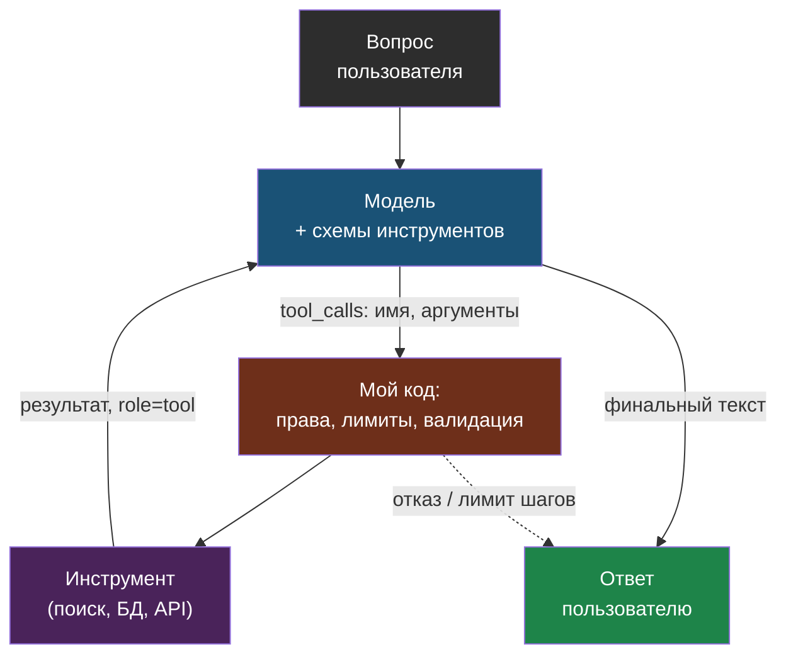
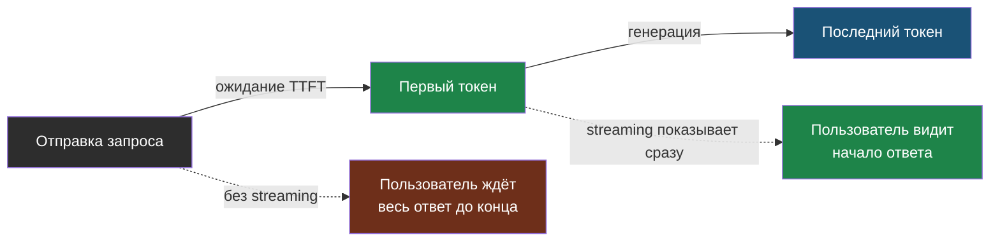

# День 1. Вопросы собеседования: LLM-основы

## Как отвечать

Структура ответа, которая работает на любом техническом вопросе: **определение в одно предложение → зачем это нужно и что ломается без этого → пример из своего проекта → trade-off или ограничение**. Пример из проекта — обязательная часть: «в web-agent мы…» превращает заученный ответ в подтверждённый опыт. Не тяни ответ дольше минуты-полутора: интервьюер задаст уточняющий вопрос, если захочет глубже. Если не знаешь — скажи, как бы выяснил, а не выдумывай.

Ниже 18 вопросов. Отвечай вслух, не глядя в текст, потом сверяйся.

## Базовые (junior / middle)

### Что такое токен и почему это важно для стоимости и контекста?

Токен — единица, на которые токенизатор режет текст, обычно алгоритмом BPE: частые фрагменты слов становятся отдельными токенами. Модель читает и генерирует токены, а не символы, поэтому и цена, и лимит контекста измеряются в токенах. Для английского токен — около четырёх символов, для русского обычно два-три: русский текст занимает в полтора-два раза больше токенов. В лабе я сравнивал одинаковые фразы и получил конкретные числа для своей модели. Практическое следствие: при оценке стоимости RAG для русскоязычных документов нельзя брать английские ориентиры — нужно измерять на своём корпусе.

### Что такое контекстное окно и что происходит при переполнении?

Контекстное окно — максимум токенов, которые модель обрабатывает за один вызов, включая системный промпт, историю, документы и сам ответ. При переполнении провайдер вернёт ошибку либо обрежет — зависит от API, и полагаться на обрезку нельзя. Поэтому в RAG-сервисе бюджет контекста считается явно: столько на систему, столько на фрагменты документов, столько на историю, остаток на ответ. В web-agent история диалога виджета ограничена скользящим окном, чтобы не выталкивать документы. Большое окно не отменяет этого: качество работы с информацией в середине длинного контекста ниже, чем в начале и конце.

### Чем temperature отличается от top_p?

Оба управляют случайностью выбора следующего токена. Temperature масштабирует распределение: ноль — почти всегда самый вероятный токен, единица — распределение как есть, выше — площе. Top_p (nucleus sampling) отсекает хвост: выбираем только из токенов, чья суммарная вероятность не превышает p. Обычно меняют один из них, не оба. Для извлечения данных, классификации и кода — temperature около нуля; для генерации текстов с вариативностью — 0.7–1.0.

### Почему temperature=0 не гарантирует одинаковый ответ?

Потому что детерминизм зависит не только от сэмплинга. Провайдер батчит запросы с чужими, маршрутизирует на разное железо, где арифметика с плавающей точкой даёт микроразличия, обновляет версию модели под тем же именем. Параметр seed — подсказка, не гарантия. Поэтому детерминизм в системе достигается архитектурно: валидацией вывода по схеме, кэшем ответов по хэшу запроса, идемпотентными операциями на стороне кода.

### Что такое галлюцинация и как с ней бороться?

Галлюцинация — правдоподобный, но неверный ответ. Это не сбой, а нормальная работа механизма «предсказать следующий токен» при отсутствии нужной информации в контексте. Борьба — не уговоры в промпте, а три вещи: дать модели факты в контекст (RAG), ограничить формат ответа и проверить его кодом (structured outputs, валидация), явно разрешить модели сказать «не знаю». В web-agent третий пункт реализован как честный fallback: если ответа в документах нет, агент говорит об этом и предлагает оставить контакт, вместо того чтобы сочинять.

### Чем json_schema отличается от JSON mode и от просьбы «ответь JSON» в промпте?

Три уровня надёжности. Просьба в промпте — модель может добавить пояснение, обернуть в код-блок, пропустить поле; работает только с валидацией и ретраем. JSON mode гарантирует синтаксически корректный JSON, но не структуру. JSON Schema — провайдер ограничивает генерацию под схему, и структура почти всегда верна. Схему генерирую из Pydantic-модели, ответ валидирую ею же — даже при json_schema, потому что бизнес-правила схема не выражает, а поддержка у провайдеров разная. В лабе я реализовал json_schema с запасным путём через промпт и валидацию.

### Опиши, как работает function calling.

Я передаю модели список инструментов с JSON-схемами аргументов. Модель вместо текста возвращает `tool_calls`: имя и аргументы. Мой код решает, выполнять ли, выполняет, и возвращает результат сообщением с ролью `tool`. Модель либо отвечает пользователю, либо запрашивает следующий инструмент. Ключевое: модель ничего не вызывает сама, выполнение, права и лимиты — в моём коде. Этот цикл и есть основа агента.

### Что такое system prompt и как его структурировать?

Системный промпт — инструкции, которые задают роль, контекст, формат и ограничения и не видны пользователю. Рабочая структура: роль → данные и контекст → формат ответа → ограничения и поведение при отсутствии ответа. Статичную часть ставлю в начало, переменную — в конец, чтобы работал prompt caching. Пользовательский ввод и документы отделяю явными границами и никогда не смешиваю с инструкциями — это первая защита от prompt injection.

### Что такое few-shot и когда он полезнее инструкций?

Few-shot — два-три примера «вход → выход» в промпте. Полезнее длинных инструкций, когда нужен точный формат, стиль или разбор пограничных случаев: модели проще повторить образец, чем интерпретировать описание. Цена — токены на каждом запросе; при кэшировании префикса это окупается.

### Что такое chain-of-thought и нужен ли он reasoning-моделям?

Chain-of-thought — просьба рассуждать по шагам до ответа; у обычных моделей это заметно повышает качество на задачах с логикой и арифметикой ценой лишних выходных токенов. Reasoning-модели рассуждают сами во внутреннем «думающем» блоке, и явная инструкция им обычно не нужна, а иногда мешает. На собеседовании стоит добавить: рассуждения не нужно показывать пользователю — их можно скрыть или отделить структурой ответа.

### Чем AI-инженер отличается от ML-инженера?

ML-инженер доводит до прода обученные модели: пайплайны данных, serving, MLOps, часто с PyTorch и fine-tuning. AI-инженер строит продукты на готовых моделях через API или self-hosted инференс: RAG, агенты, интеграции; отвечает за качество ответов, стоимость, латентность и безопасность. Я — AI-инженер с DevOps-базой: помимо RAG и агентов умею развернуть и эксплуатировать всё это — Postgres с pgvector, Ollama за nginx, CI с гейтом качества, мониторинг.

## Углублённые (middle+)

### Как считается стоимость запроса и какие рычаги её снижения ты знаешь?

Стоимость равна входным токенам, умноженным на цену входа, плюс выходные на цену выхода; выход у большинства моделей в три-пять раз дороже. Рычаги: prompt caching для повторяющегося префикса, роутинг — дешёвая модель там, где измеренное качество не падает, Batch API для офлайн-задач со скидкой, кэш ответов по хэшу запроса для повторяющихся вопросов, ограничение max_tokens и длины контекста. В лабе я посчитал по прайсу провайдера сценарий в тридцать тысяч RAG-запросов в месяц для двух моделей и получил разницу в разы.

### Как работает prompt caching и как строить промпт, чтобы он срабатывал?

Провайдер сохраняет KV-cache для префикса промпта и при следующем запросе с тем же префиксом не пересчитывает его: чтение из кэша стоит малую долю обычной цены. Условие — префикс совпадает байт в байт, поэтому системный промпт, инструменты и few-shot примеры идут первыми, а переменные данные и вопрос пользователя — последними. Любая динамика в начале, даже временная метка, ломает кэш. Механика отличается у провайдеров: у одних кэш задаётся явно, у других автоматический для длинных префиксов; условия и скидки надо смотреть в актуальном прайсе.

### Почему длинный контекст дорог и при чём тут KV-cache?

При генерации каждого токена attention обращается ко всем токенам контекста, поэтому вычисления и память растут с его длиной. Чтобы не пересчитывать представления уже обработанных токенов, они хранятся в KV-cache, и этот кэш занимает память GPU пропорционально длине контекста и числу параллельных запросов. Отсюда практические следствия: длинный контекст — это медленнее, дороже и ограничивает число одновременных запросов на одном GPU; RAG с отбором пяти релевантных фрагментов выигрывает у «закинуть весь корпус» и по деньгам, и по качеству.

### Из чего складывается латентность и зачем streaming?

> **Латентность** — это время до первого токена (TTFT: сеть, очередь провайдера, обработка промпта) плюс время генерации, которое зависит от длины ответа и скорости в токенах в секунду. Для чата критичен TTFT, и streaming делает его субъективно незаметным: пользователь видит текст по мере генерации.

Для фоновых задач важнее пропускная способность и цена. В лабе я замерял TTFT через socks5-прокси из РФ — сеть добавляет заметную долю, это реальность эксплуатации здесь.

### Как обрабатывать ошибки API и лимиты?

Разделяю ошибки на повторяемые и нет. Сетевые сбои, таймауты, 429 и 5xx — повторяю с экспоненциальным backoff и джиттером, с потолком попыток. 400 и 404 — ошибка запроса или модели, повторять бессмысленно, надо чинить. Для 429 дополнительно ограничиваю параллелизм семафором и уважаю заголовок с рекомендуемой паузой, если он есть. Операции делаю идемпотентными, чтобы повтор не создал дубликат. Ретраи в клиенте выключаю и пишу свои, чтобы видеть ошибки в логах и метриках.

### По каким критериям выбираешь модель под задачу?

Сначала качество на своём наборе вопросов — не на публичных бенчмарках. Потом стоимость под свой профиль запросов по прайсу, латентность под нагрузкой, размер контекста с запасом. Отдельно — доступность и ограничения: из РФ прямой доступ к зарубежным API блокируется по IP, нужен прокси или российский провайдер; для персональных данных и корпоративных документов часто требуется on-prem, тогда выбор — среди open-weight моделей с подходящей лицензией. Итог — обычно не одна модель, а роутинг: дешёвая для простых шагов, сильная для сложных.

### Что такое OpenAI-совместимый API и почему это важно?

Формат запросов и ответов OpenAI (chat completions) стал де-факто стандартом: его поддерживают OpenRouter, Ollama, vLLM и большинство провайдеров, включая российские. Это позволяет менять модель и провайдера, меняя base_url и имя модели, без переписывания кода — в лабе один клиент работает и с OpenRouter, и с локальной Ollama. Ограничение: расширенные возможности (structured outputs, caching, reasoning-параметры) поддерживаются неодинаково, и на них нужен запасной путь.

## Вопрос на проектирование

### Спроектируй сервис, который принимает текст вакансии и возвращает структурированную запись для базы, при нагрузке десять тысяч вакансий в день.

Начну с требований: десять тысяч в день — это около семи в минуту в среднем, с пиками, и задача офлайновая — секунды ответа не критичны. Архитектура: FastAPI принимает текст и кладёт задачу в очередь, воркеры забирают и вызывают модель, результат — в PostgreSQL. Извлечение — structured output по Pydantic-схеме с temperature около нуля, валидация в коде, при ошибке валидации один ретрай с текстом ошибки, при повторной — в очередь ручной проверки. Модель — дешёвая, потому что задача простая; качество подтверждаю на golden-наборе из ста размеченных вакансий и меряю точность по полям; сильную модель подключаю только для тех записей, где дешёвая не прошла валидацию. Стоимость: три тысячи токенов вход, триста выход, десять тысяч в день — считаю по прайсу и показываю два варианта; для такой нагрузки без требований к латентности использую Batch API со скидкой. Дедупликация по хэшу текста, чтобы не платить за повторы. Наблюдаемость: токены и стоимость на запись, доля ошибок валидации, доля отправленных на ручную проверку — это и есть метрики дрейфа. Безопасность: текст вакансии — недоверенный ввод, он идёт отдельным блоком, а не в инструкции, и модель не имеет инструментов, чтобы инъекция ничего не могла сделать. Ограничения из РФ: провайдер через прокси или российский, персональных данных в вакансиях обычно нет, но телефоны рекрутеров маскирую до отправки.

## Практика

1. Запиши ответы на три самых слабых для себя вопроса голосом на телефон, прослушай и сократи каждый до минуты.
2. К каждому из десяти базовых вопросов допиши одной строкой, какой пример из своего проекта приводишь.

## Что проверить

- Ответил без подсказки не меньше чем на 12 из 18 вопросов; по остальным понимаю, что именно не знаю.
- В каждом ответе есть пример из web-agent, ai-agent-memory, Hermes или сегодняшней лабы.
- Ответ на вопрос о проектировании укладываюсь в три минуты и содержит: очередь, structured output с валидацией, выбор модели по evals, стоимость, наблюдаемость, безопасность ввода.
