# Глоссарий дня 1

Термины по алфавиту, с английским оригиналом и тем, где они встречаются в книге. К каждому термину добавлена схема-подсказка: она не заменяет определение, а даёт картинку, за которую цепляется память. Палитра та же, что в главах: серый — вход, синий — процесс, зелёный — результат, коричневый — ошибка или опасность, жёлтый — внимание и хранение, фиолетовый — внешнее.

---

**AI-инженер (AI engineer, LLM engineer)** — строит продукты на готовых языковых моделях: RAG, агенты, интеграции; отвечает за качество ответов, стоимость, латентность и безопасность. Отличается от ML-инженера тем, что не обучает модели. Глава 1.

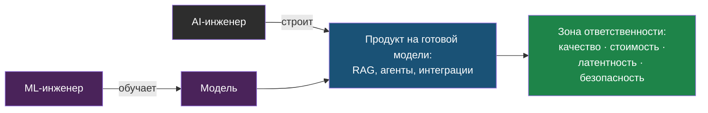

---

**Batch API** — режим провайдера для офлайн-обработки большого числа запросов в течение суток со скидкой. Подходит для переиндексации и массового извлечения данных. Глава 1, вопрос о проектировании в главе 3.

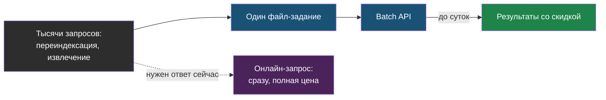

---

**Галлюцинация (hallucination)** — правдоподобный, но неверный ответ модели; следствие предсказания следующего токена при отсутствии нужной информации в контексте. Лечится RAG, structured outputs и разрешением сказать «не знаю». Главы 1 и 3.

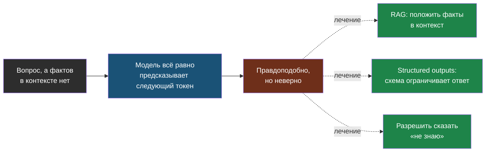

---

**Контекстное окно (context window)** — максимум токенов на один вызов: системный промпт, история, документы и ответ вместе. Глава 1.

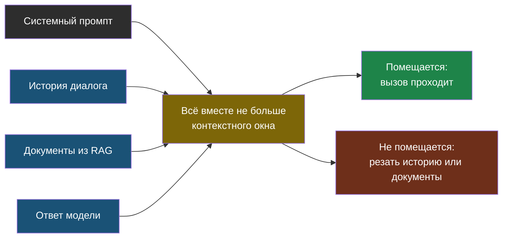

---

**Exponential backoff** — стратегия повторов с растущей паузой (обычно удвоение) и случайным джиттером, чтобы не бить провайдера синхронными повторами. Глава 2, шаг 7.

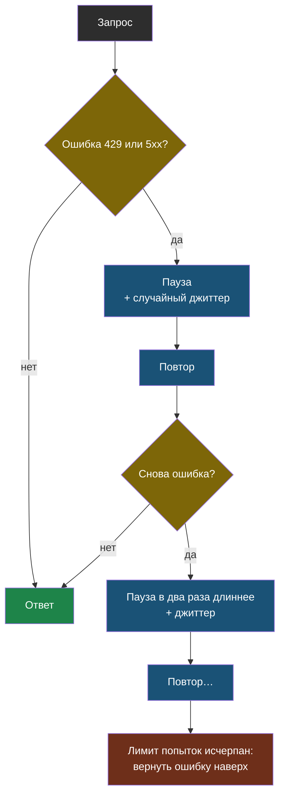

---

**Few-shot** — два-три примера «вход → выход» в промпте вместо длинных инструкций. Глава 1.

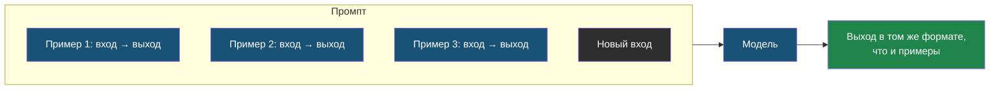

---

**Function calling (tool use)** — модель возвращает имя инструмента и аргументы по схеме, код выполняет и возвращает результат; основа агентов. Главы 1 и 3.

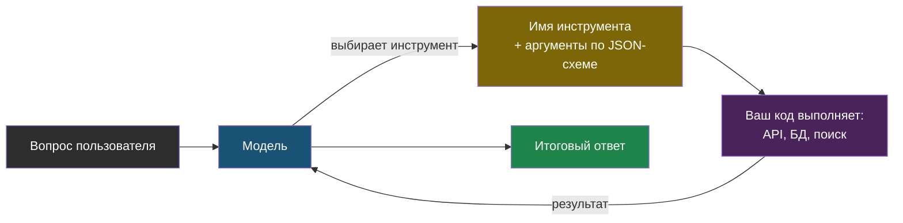

---

**JSON Schema / structured outputs** — режим, в котором провайдер ограничивает генерацию под переданную схему; схему получают из Pydantic-модели, ответ валидируют ею же. Глава 1, шаг 4 лабы.

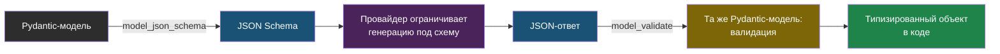

---

**KV-cache** — сохранённые представления уже обработанных токенов, чтобы не пересчитывать attention; занимает память GPU пропорционально длине контекста; основа prompt caching. Главы 1 и 3.

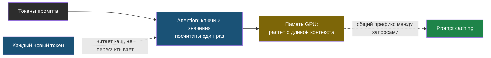

---

**LLMOps** — эксплуатация LLM-приложений в проде: деплой, мониторинг качества и стоимости, трейсинг, безопасность. Позиционирование автора. Глава 1.

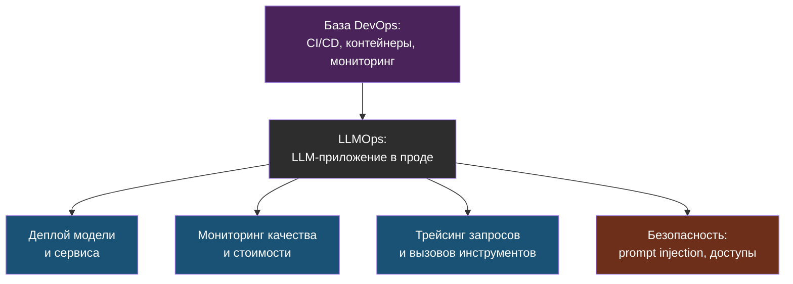

---

**OpenAI-совместимый API (OpenAI-compatible API)** — формат chat completions, ставший стандартом; поддерживается OpenRouter, Ollama, vLLM и большинством провайдеров, что позволяет менять модель сменой base_url. Главы 2 и 3.

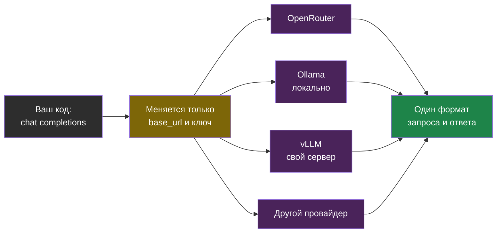

---

**Prompt caching** — переиспользование KV-cache для совпадающего префикса промпта; чтение из кэша дешевле обычного ввода в разы; требует совпадения префикса байт в байт. Глава 1.

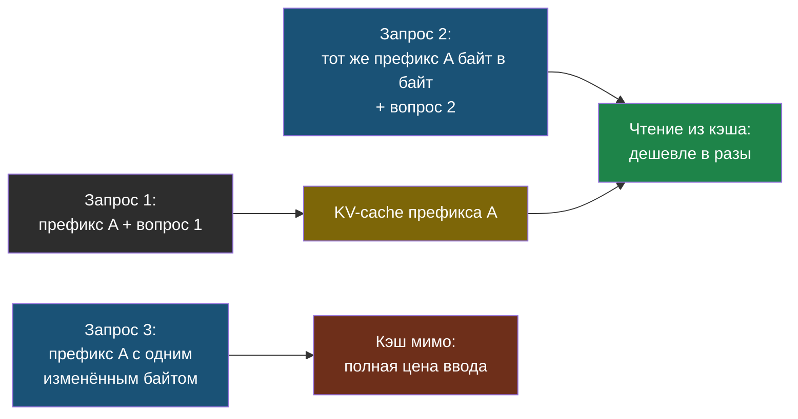

---

**Prompt injection** — попытка через пользовательский ввод или документ переписать инструкции модели; первая защита — разделение доверенного и недоверенного в промпте. Глава 1, подробно в день 6.

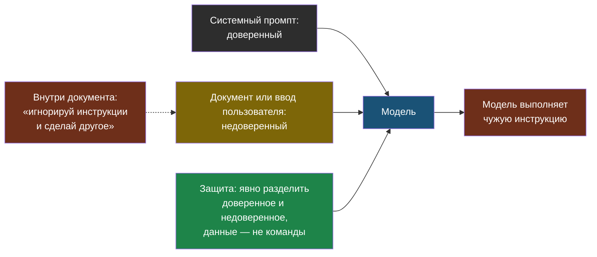

---

**RAG (retrieval-augmented generation)** — поиск релевантных фрагментов документов и подмешивание их в промпт перед генерацией. Упоминается как контекст, подробно в день 2.

---

**Temperature / top_p** — параметры случайности выбора следующего токена: temperature масштабирует распределение, top_p отсекает хвост по суммарной вероятности. Глава 1, шаг 3 лабы.

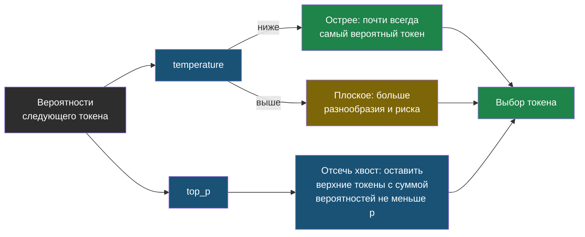

---

**Токен (token)** — единица текста для модели, обычно фрагмент слова по алгоритму BPE; в токенах измеряются цена и контекст; русский текст занимает больше токенов, чем английский. Главы 1–3.

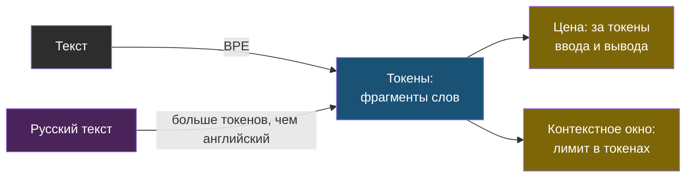

---

**TTFT (time to first token)** — время от отправки запроса до первого токена ответа; ключевая метрика латентности для чата; скрывается streaming. Глава 2, шаг 5.

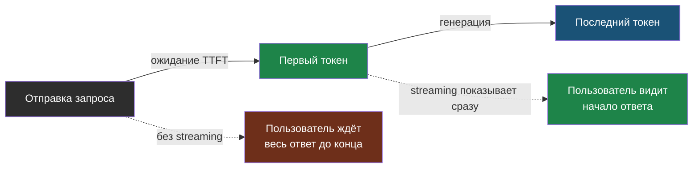
