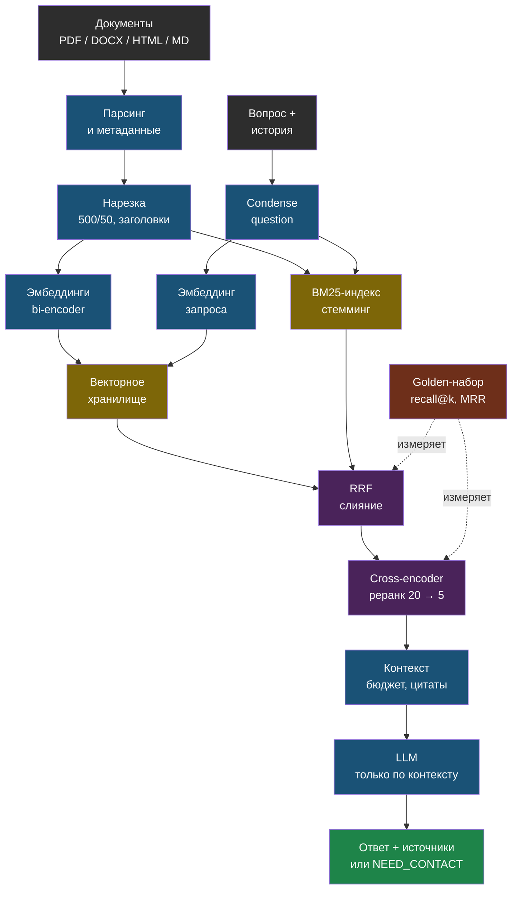

# День 2. RAG глубоко: суть

## Зачем это на собеседовании

«Расскажите, как вы строили RAG» — вопрос, с которого начинается почти каждое собеседование на AI-инженера в 2026 году, и ответ «взял LangChain, нарезал по 500 символов, положил в Chroma» отправляет кандидата в junior. Интервьюер ждёт другого: какую стратегию нарезки выбрал и почему, какой моделью эмбеддингов и как проверил, что она подходит для русского, почему добавил или не добавил гибридный поиск и реранкинг, и главное — **как измерил, что поиск стал лучше**. У тебя есть RAG в проде, но нет ни одного числа о качестве его поиска. Сегодня число появится, а вместе с ним — язык, чтобы говорить о том, что ты уже построил.

## RAG — это четыре контура, а не векторный поиск

Retrieval-augmented generation чаще всего рисуют как «вопрос → вектор → топ-5 → промпт». Это один из четырёх контуров, и в проде ломаются все четыре:

1. **Индексация** (ingestion): документы → текст → чанки с метаданными → эмбеддинги → хранилище. Ломается на извлечении текста из PDF, на границах чанков, на смене модели эмбеддингов без переиндексации.
2. **Поиск** (retrieval): вопрос → (переформулировка) → кандидаты из векторного и полнотекстового поиска → слияние → реранкинг → топ-k. Ломается на точных терминах, синонимах, уточняющих вопросах.
3. **Генерация**: сборка контекста в бюджет токенов → промпт с инструкцией «только по контексту» → ответ с цитатами → проверка. Ломается на переполнении, «потерянной середине», галлюцинациях поверх нерелевантного контекста.
4. **Оценка** (evaluation): golden-набор вопросов → метрики поиска и ответа → запуск при каждом изменении. Обычно отсутствует, и тогда первые три контура чинят по ощущениям.

В web-agent есть первые три контура в базовом виде и нет четвёртого. День построен так, чтобы четвёртый появился.

## Нарезка: чанк — единица поиска

Эмбеддинг чанка — это один вектор на весь его текст. Маленький чанк точно описывает одну мысль, но теряет контекст; большой содержит контекст, но его вектор «размазан» между несколькими темами и хуже матчится с конкретным вопросом.

| Стратегия | Как | Когда |
|---|---|---|
| Фиксированный размер с перекрытием | N символов или токенов, overlap 10–20 % | Базовый вариант; так сделано в web-agent: `RecursiveCharacterTextSplitter(500, 50)` — обрати внимание, в **символах**, не токенах |
| Рекурсивная по разделителям | Сначала по абзацам, потом по предложениям, потом по словам, пока не влезет | То же самое, но границы уважают структуру текста; это и делает RecursiveCharacterTextSplitter |
| По заголовкам | Markdown и HTML режутся по секциям; заголовок идёт в метаданные и в текст чанка | Документация, базы знаний, статьи — структура уже есть |
| Семантическая | Границы там, где эмбеддинги соседних предложений расходятся | Сплошной текст без структуры; дороже, эффект не всегда стоит затрат |
| Родитель–потомок (small-to-big) | Ищем по маленьким чанкам, в промпт отдаём родительский абзац или секцию | Когда нужны и точность поиска, и контекст для ответа |
| Контекстная нарезка | Перед эмбеддингом к чанку добавляется название документа и секции, иногда одно-два предложения резюме | Почти всегда полезно и почти бесплатно; чанк «Стоимость — 5000 рублей» без заголовка «Абонемент на месяц» бесполезен |

Overlap нужен, чтобы предложение, разрезанное границей, целиком попало хотя бы в один чанк. Метаданные — имя файла, секция, страница, дата, tenant — нужны для фильтрации, цитат и удаления при переиндексации; в web-agent это `doc_id`, `filename`, `chunk_index`.

Размер в токенах важнее размера в символах: 500 символов русского текста — это примерно 150–250 токенов в зависимости от модели. Знай эту цифру для своего проекта.

## Эмбеддинги: какие, для какого языка и почему смена модели — это переиндексация

Модель эмбеддингов (**bi-encoder**) превращает текст в вектор фиксированной размерности так, что близкие по смыслу тексты дают близкие векторы. Близость измеряется косинусным сходством, скалярным произведением или евклидовым расстоянием; для нормализованных векторов все три дают одинаковый порядок. Важная деталь про Chroma: по умолчанию коллекция использует евклидово расстояние (L2), а не косинус; задаётся при создании через `metadata={"hnsw:space": "cosine"}`. В web-agent коллекции создаются без этого параметра — для нормализованных векторов OpenAI порядок тот же, но при переходе на локальную модель это надо проверить.

Векторы разных моделей несовместимы: разная размерность и разное пространство. **Смена модели эмбеддингов означает полную переиндексацию**, и коллекция Chroma «залипает» на размерности первого вставленного вектора — ты уже наступал на это в web-agent (dimension mismatch после смены модели у одного из сайтов). На собеседовании это отличная история: реальный инцидент, причина, фикс через коллекцию на tenant.

Для русского языка на момент написания (сентябрь 2026) выбор такой — проверяй актуальность на ruMTEB и MIRACL, а решение принимай по своему golden-набору:

| Модель | Тип | Заметки |
|---|---|---|
| `openai/text-embedding-3-small` / `-large` через OpenRouter | API | То, что стоит в web-agent; хорошее качество на русском, зависимость от прокси и цены за токен |
| `BAAI/bge-m3` | open, MIT, 1024 dim, контекст 8192 токена | Сильная многоязычная база; лидирует на MIRACL для русского; умеет dense + sparse режимы |
| `deepvk/USER-bge-m3` | open | Дообученная на русском версия bge-m3; выигрывает на узких русских доменах, проигрывает на смешанных RU+EN |
| `intfloat/multilingual-e5-large` | open | Требует префиксы `query: ` и `passage: ` — без них качество падает |
| `ai-forever/FRIDA` | open | Первое место ruMTEB на момент выхода (2025); префиксы `search_query: ` и `search_document: ` |
| GigaEmbeddings (Sber) | open / API | Российская модель, ориентирована на русский; смотри условия лицензии |

Правило про префиксы: у e5 и FRIDA запрос и документ кодируются с разными префиксами, и это часть модели, а не совет. Забытый префикс — тихая деградация без ошибок.

## Гибридный поиск: вектор не видит артикулы

Плотный (dense) поиск отлично находит смысл и синонимы, но плохо — точные строки: артикулы, названия моделей, номера, аббревиатуры, фамилии, редкие термины. Классический полнотекстовый поиск **BM25** — наоборот: точные совпадения ловит идеально, синонимов не знает. Гибрид берёт лучшее.

BM25 на пальцах: очко за каждое слово запроса в документе, с насыщением (десятое вхождение слова весит меньше второго), с весом редких слов выше (IDF) и нормализацией на длину документа. Для русского обязательна морфология: хотя бы стемминг (snowball), лучше лемматизация (pymorphy3), иначе «абонемент» и «абонемента» — разные слова.

Слияние двух списков — **Reciprocal Rank Fusion** (RRF): каждый документ получает сумму `1 / (k + rank)` по каждому списку, где он встретился, обычно `k = 60`. Не требует нормализации несравнимых скорингов, поэтому предпочтительнее взвешенной суммы. Альтернатива в Postgres — `tsvector` и pgvector в одном запросе (день 3); у bge-m3 есть собственный sparse-режим, который заменяет BM25.

## Реранкинг: дорогая модель на короткий список

Bi-encoder кодирует запрос и документ **по отдельности**, поэтому не видит их взаимодействия. **Cross-encoder** (реранкер) читает пару «запрос + фрагмент» вместе и выдаёт одно число релевантности — заметно точнее, но это отдельный прямой проход модели на каждую пару. Поэтому схема всегда двухступенчатая: дешёвый поиск отдаёт 20–50 кандидатов, реранкер сортирует их и оставляет 5.

Модели: `BAAI/bge-reranker-v2-m3` — многоязычный, работает с русским, запускается через `sentence_transformers.CrossEncoder`, скор через сигмоиду отображается в [0, 1]; облачные реранкеры (Cohere и подобные) — недоступны напрямую из РФ; LLM в роли реранкера — точно, но дорого и медленно. Бюджет латентности: на CPU реранк 20 пар занимает от долей секунды до пары секунд в зависимости от длины чанков — измерь в лабе, это число спросят.

Реранкер решает и вторую задачу: его скор — это порог. Если у лучшего кандидата релевантность ниже порога, честнее сказать «в документах нет ответа», чем скармливать модели мусор. В web-agent сейчас порога нет: топ-5 уходит в промпт всегда.

## Фильтрация по метаданным и изоляция tenant

Фильтр `where` по метаданным сужает поиск до нужного документа, типа, даты, клиента. Есть два способа изолировать данные клиентов в мультитенантной системе: фильтр по `tenant_id` в общей коллекции или **коллекция на tenant**. Второй способ надёжнее: забытый фильтр в одном запросе не приведёт к утечке чужих документов. Именно так сделано в web-agent (`documents_{site_id}`), и это осознанное решение, которое стоит проговаривать на собеседовании как выбор безопасности ценой чуть большего числа коллекций.

## Запрос тоже надо готовить

Пользователь пишет «а сколько это стоит?» после вопроса про абонемент. Если искать по этой строке, поиск не найдёт ничего осмысленного. В web-agent история диалога передаётся модели, но **поиск идёт по сырому последнему сообщению** — это реальный пробел, и его закрывает шаг **condense question**: перед поиском модель переформулирует вопрос с учётом истории в самостоятельный («сколько стоит абонемент на месяц»). Дальше по важности: **multi-query** (несколько переформулировок, объединение результатов) и **HyDE** (сгенерировать гипотетический ответ и искать по нему). Каждая техника стоит лишний вызов модели, поэтому включается по результатам оценки, а не по умолчанию.

## Сборка контекста

Топ-k фрагментов не просто склеиваются. Убирается дублирование (соседние чанки с overlap), проверяется бюджет токенов, самое релевантное ставится в начало или в конец — модели хуже используют середину длинного контекста («lost in the middle»). Каждый фрагмент помечается источником, чтобы модель цитировала: в web-agent это `[filename #chunk_index]`. В системном промпте — инструкция отвечать только по контексту и явный сигнал на случай отсутствия ответа: у тебя это маркер `[[NEED_CONTACT]]`, который код вырезает и превращает в честный fallback. Это и есть **grounding**, и это то, что нужно назвать этим словом в резюме.

## Метрики поиска: чтобы спорить числами

Golden-набор — 20–50 пар «вопрос → где ответ» (документ и ключевая фраза, которая должна быть в найденном фрагменте). Источник вопросов — реальные диалоги: в web-agent есть журнал чатов, там лежат настоящие формулировки пользователей, включая неудобные.

- **recall@k** (при одном релевантном фрагменте на вопрос — hit rate): доля вопросов, для которых нужный фрагмент попал в топ-k. Главная метрика для RAG, потому что модель ответит правильно только если фрагмент вообще есть в контексте.
- **precision@k**: какая доля из k найденных релевантна; важна, когда контекст дорог.
- **MRR** (mean reciprocal rank): среднее по вопросам от `1 / позиция первого релевантного`; показывает, насколько высоко стоит нужное.
- **nDCG@k**: учитывает градации релевантности и позиции; нужен, когда релевантных фрагментов несколько и они не равноценны.

Метрики ответа — faithfulness (ответ не противоречит контексту), answer relevancy, context precision и recall из RAGAS — это день 5. Сегодня только поиск: он первичен, потому что генерация не спасёт то, что не нашли.

## Типичные ошибки

- Нарезка в символах при бюджете в токенах; таблицы, разрезанные посередине; PDF, из которого извлеклись обрывки.
- Смена модели эмбеддингов без переиндексации, забытые префиксы e5/FRIDA.
- Только векторный поиск в корпусе с артикулами и названиями; `top_k=5` «потому что так в туториале».
- Поиск по сырому уточняющему вопросу без учёта истории.
- Отсутствие порога релевантности: модель получает пять нерелевантных фрагментов и уверенно отвечает не то.
- Нет golden-набора — любое изменение проверяется «на глаз», и регрессии замечают пользователи.

## Схема

## Что у тебя уже есть

- **Индексация**: лёгкий парсер PDF/DOCX/HTML/MD без тяжёлых зависимостей (осознанное решение после переполнения диска — история для собеседования), `RecursiveCharacterTextSplitter` 500/50, метаданные `doc_id / filename / chunk_index`, переиндексация с удалением старых чанков по `doc_id`, краулер сайта с sitemap и robots.txt.
- **Поиск**: dense-поиск в Chroma, `top_k = 5`, коллекция на tenant — **tenant isolation**.
- **Генерация**: контекст с цитатами `[filename #chunk]`, короткая память диалога (4 обмена), маркер `[[NEED_CONTACT]]` — **grounding** и **graceful degradation**, учёт токенов и стоимости из ответа OpenRouter.
- **Оценка**: self-test «эмбеддинг → запись → поиск → совпадение» в CI — это **smoke-test пайплайна**, но не оценка качества.
- **Пробелы**, которые закрывает сегодняшняя лаба и следующие дни: нет гибридного поиска и реранкинга, нет порога релевантности, поиск по сырому уточняющему вопросу, нет golden-набора и метрик, расстояние в Chroma по умолчанию L2.

## Практика

1. Посчитай, сколько токенов в среднем занимает чанк web-agent: возьми любые пять чанков (через `collection.get` или из логов), отправь каждый в модель с `max_tokens=1` и прочитай `usage.prompt_tokens`, как в лабе дня 1. Запиши среднее — это твой реальный размер чанка.
2. Открой журнал чатов в админке web-agent и выпиши 30 реальных вопросов пользователей, включая уточняющие и неудачные. Это заготовка golden-набора для лабы.

## Что проверить

- Называю четыре контура RAG и для каждого — что ломается в проде.
- Объясняю пять стратегий нарезки и говорю, какая стоит в web-agent, в каких единицах и почему контекстная нарезка почти бесплатна.
- Знаю, почему смена модели эмбеддингов требует переиндексации, и рассказываю инцидент с dimension mismatch как историю.
- Называю три-четыре модели эмбеддингов для русского и помню, у каких из них обязательны префиксы.
- Объясняю, что не находит dense-поиск, как работает BM25 и зачем RRF вместо взвешенной суммы.
- Отличаю bi-encoder от cross-encoder и объясняю, почему реранкер применяется к 20–50 кандидатам, а не ко всему корпусу.
- Определяю recall@k, MRR и nDCG и говорю, какая метрика главная для RAG и почему.
- Называю три пробела web-agent на языке индустрии и знаю, какой из них закрывается сегодня.
