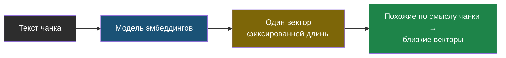
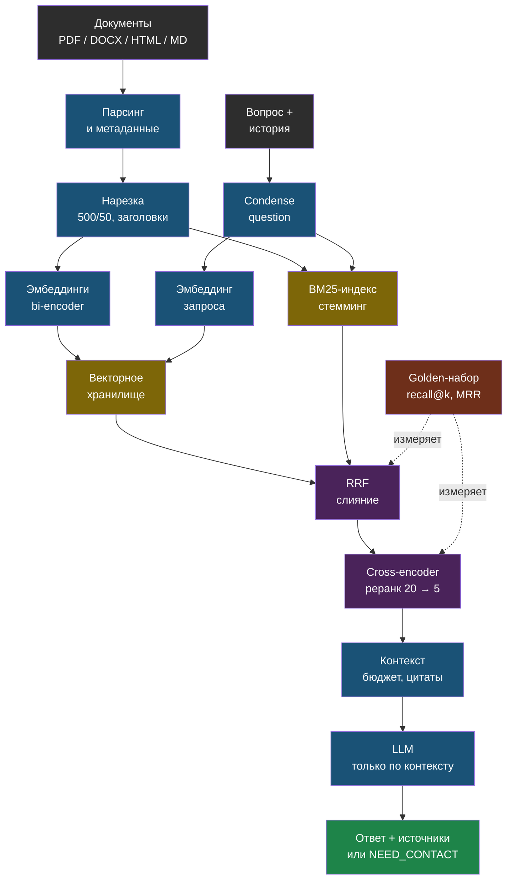

# День 2. RAG глубоко: суть

## Зачем это на собеседовании

«Расскажите, как вы строили RAG» — вопрос, с которого начинается почти каждое собеседование на AI-инженера в 2026 году. Ответ вида «взял LangChain, нарезал по 500 символов, положил в Chroma» сразу выдаёт junior-уровень: это про то, какие кубики использовал, а не про то, как система на самом деле работает и почему. Интервьюер ждёт другого: какую стратегию нарезки текста ты выбрал и почему, какой моделью считал эмбеддинги и как проверил, что она вообще годится для русского языка, добавлял ли гибридный поиск и реранкинг и зачем, и главное — **как ты измерил, что поиск стал лучше**, а не просто «стало ощущение, что лучше». У тебя уже есть RAG в проде, но пока нет ни одного числа о качестве его поиска. Сегодня это число появится, а вместе с ним — язык, чтобы говорить о том, что ты уже построил, теми словами, которые ждёт индустрия.

## RAG — это четыре контура, а не векторный поиск

RAG (retrieval-augmented generation, «генерация, дополненная поиском») чаще всего рисуют одной строкой: «вопрос → вектор → топ-5 → промпт». Проблема в том, что это лишь один из четырёх независимых контуров системы, и в проде ломаться может любой из четырёх — не только тот, про который все думают в первую очередь:

1. **Индексация** (ingestion): документы → текст → чанки (кусочки текста) с метаданными → эмбеддинги (векторы) → хранилище. Ломается на извлечении текста из PDF, на неудачных границах чанков, на смене модели эмбеддингов без переиндексации всего заново.
2. **Поиск** (retrieval): вопрос → (переформулировка) → кандидаты из векторного и полнотекстового поиска → слияние → реранкинг → топ-k лучших. Ломается на точных терминах, синонимах, уточняющих вопросах вроде «а сколько это стоит?».
3. **Генерация**: сборка контекста в рамках бюджета токенов → промпт с инструкцией «отвечай только по контексту» → ответ с цитатами → проверка. Ломается на переполнении контекста, на «потерянной середине» (см. день 1), на галлюцинациях поверх нерелевантного контекста.
4. **Оценка** (evaluation): golden-набор вопросов с известными правильными ответами → метрики поиска и ответа → запуск при каждом изменении системы. Этот контур обычно отсутствует вообще — и тогда первые три чинят «на глаз», по ощущению, а не по цифрам.

В web-agent первые три контура есть, хотя бы в базовом виде, а четвёртого нет совсем. Сегодняшний день построен так, чтобы он появился.

## Нарезка: чанк — единица поиска

Прежде чем что-то искать, документ нужно разрезать на кусочки — **чанки** (chunk, кусок). Почему нельзя просто искать по документу целиком: у эмбеддинга (векторного представления текста) есть жёсткое ограничение.

> **Эмбеддинг чанка** — это один вектор на весь его текст. Маленький чанк точно описывает одну мысль, но теряет контекст; большой содержит контекст, но его вектор «размазан» между несколькими темами и хуже матчится с конкретным вопросом.

Отсюда прямое следствие: весь документ целиком в один вектор не запихнёшь без потери точности — значит, нужна стратегия, как резать. Вот основные, от простой к сложной:

| Стратегия | Как | Когда |
|---|---|---|
| Фиксированный размер с перекрытием | N символов или токенов, overlap 10–20 % | Базовый вариант; так сделано в web-agent: `RecursiveCharacterTextSplitter(500, 50)` — обрати внимание, в **символах**, не токенах |
| Рекурсивная по разделителям | Сначала по абзацам, потом по предложениям, потом по словам, пока не влезет | То же самое, но границы уважают структуру текста; это и делает RecursiveCharacterTextSplitter |
| По заголовкам | Markdown и HTML режутся по секциям; заголовок идёт в метаданные и в текст чанка | Документация, базы знаний, статьи — структура уже есть |
| Семантическая | Границы там, где эмбеддинги соседних предложений расходятся | Сплошной текст без структуры; дороже, эффект не всегда стоит затрат |
| Родитель–потомок (small-to-big) | Ищем по маленьким чанкам, в промпт отдаём родительский абзац или секцию | Когда нужны и точность поиска, и контекст для ответа |
| Контекстная нарезка | Перед эмбеддингом к чанку добавляется название документа и секции, иногда одно-два предложения резюме | Почти всегда полезно и почти бесплатно; чанк «Стоимость — 5000 рублей» без заголовка «Абонемент на месяц» бесполезен |

Зачем нужен overlap (перекрытие соседних чанков): если важное предложение оказалось ровно на границе разреза, без перекрытия оно может целиком не попасть ни в один чанк. С перекрытием оно почти наверняка целиком войдёт хотя бы в один из двух соседних. Метаданные при этом — имя файла, секция, страница, дата, tenant (арендатор, см. день 3) — нужны для фильтрации при поиске, для цитирования источника в ответе и для удаления старых чанков при переиндексации; в web-agent это поля `doc_id`, `filename`, `chunk_index`.

Ещё одна практическая деталь: размер чанка важнее считать в токенах, а не в символах, потому что именно токены — это единица, в которой у модели есть лимит (день 1). Условно, 500 символов русского текста — это примерно 150–250 токенов в зависимости от модели. Эту цифру полезно знать именно для своего проекта, а не в общем виде.

## Эмбеддинги: какие, для какого языка и почему смена модели — это переиндексация

Модель эмбеддингов (в терминологии — **bi-encoder**, потому что кодирует текст независимо, без сравнения с чем-либо ещё в момент кодирования) превращает текст в вектор фиксированной размерности так, что тексты, близкие по смыслу, дают близкие по расположению в пространстве векторы. «Близость» двух векторов можно измерить тремя способами: косинусным сходством, скалярным произведением или евклидовым расстоянием — если векторы заранее нормализованы (приведены к длине 1), все три способа дают один и тот же порядок результатов (это разобрано подробно в отдельной интерактивной демонстрации в дне 3, где встретится евклидово расстояние снова).

Практически важная деталь именно про Chroma (векторную базу, которую ты используешь): по умолчанию коллекция сравнивает векторы по евклидову расстоянию (L2), а не по косинусу; чтобы явно задать косинус, нужно при создании коллекции передать `metadata={"hnsw:space": "cosine"}`. В web-agent коллекции создаются без этого параметра — для нормализованных векторов OpenAI порядок результатов совпадает в любом случае, но при переходе на локальную модель эмбеддингов это стоит перепроверить, а не полагаться на совпадение по умолчанию.

Важное следствие того, что векторы — это просто числа определённой размерности: векторы, посчитанные разными моделями эмбеддингов, между собой несовместимы — у них может быть разная размерность и вообще разное «пространство смыслов». Отсюда практическое правило: **смена модели эмбеддингов означает полную переиндексацию** всего корпуса заново, а не просто замену одной строчки конфига. У Chroma есть и коварная деталь: коллекция «залипает» на размерности первого вставленного в неё вектора — если потом попробовать вставить вектор другого размера, будет ошибка. Ты уже сталкивался с этим на практике в web-agent (dimension mismatch, «несовпадение размерности», после смены модели у одного из сайтов) — это готовая история для собеседования: что случилось, почему, как в итоге почини́л через отдельную коллекцию на каждый tenant.

Для русского языка на момент написания (сентябрь 2026) выбор такой — актуальность стоит перепроверять на бенчмарках ruMTEB и MIRACL, а окончательное решение принимать по своему собственному golden-набору, а не по чужому рейтингу:

| Модель | Тип | Заметки |
|---|---|---|
| `openai/text-embedding-3-small` / `-large` через OpenRouter | API | То, что стоит в web-agent; хорошее качество на русском, зависимость от прокси и цены за токен |
| `BAAI/bge-m3` | open, MIT, 1024 dim, контекст 8192 токена | Сильная многоязычная база; лидирует на MIRACL для русского; умеет dense + sparse режимы |
| `deepvk/USER-bge-m3` | open | Дообученная на русском версия bge-m3; выигрывает на узких русских доменах, проигрывает на смешанных RU+EN |
| `intfloat/multilingual-e5-large` | open | Требует префиксы `query: ` и `passage: ` — без них качество падает |
| `ai-forever/FRIDA` | open | Первое место ruMTEB на момент выхода (2025); префиксы `search_query: ` и `search_document: ` |
| GigaEmbeddings (Sber) | open / API | Российская модель, ориентирована на русский; смотри условия лицензии |

Отдельно стоит запомнить правило про префиксы: у моделей вроде e5 и FRIDA запрос и документ специально кодируются с разными текстовыми префиксами перед тем, как отправить в модель — это часть того, как модель обучалась, а не просто «совет для лучшего результата». Если префикс забыть, ошибки не будет — просто качество поиска незаметно просядет, и это самая коварная разновидность бага: тихая деградация без единого сообщения об ошибке.

## Гибридный поиск: вектор не видит артикулы

У векторного (плотного, dense) поиска есть слабое место. Он отлично находит смысл и синонимы («абонемент» найдётся по запросу «подписка»), но плохо справляется с точными строками: артикулами, названиями моделей, номерами, аббревиатурами, фамилиями, редкими терминами — потому что эмбеддинг усредняет смысл всего текста, а не запоминает конкретные символы. Классический полнотекстовый поиск **BM25**, наоборот, точные совпадения ловит идеально, а синонимов вообще не понимает. Гибридный поиск объединяет оба подхода и берёт от каждого лучшее.

Как устроен BM25 на пальцах: документ получает очко за каждое слово из запроса, которое в нём встречается, но с насыщением (десятое вхождение слова весит заметно меньше, чем второе — иначе можно накрутить счёт простым повторением слова), с повышенным весом для редких слов (IDF — чем реже слово встречается во всём корпусе, тем оно информативнее) и с нормализацией на длину документа (иначе длинные документы получали бы преимущество просто за счёт объёма). Для русского языка обязательна хотя бы базовая морфология — стемминг (snowball, отбрасывание окончаний) или, лучше, лемматизация (pymorphy3, приведение к словарной форме) — иначе слова «абонемент» и «абонемента» BM25 сочтёт двумя разными словами и не свяжет их между собой.

Два списка результатов — от векторного поиска и от BM25 — нужно как-то объединить в один. Стандартный способ — **Reciprocal Rank Fusion** (RRF): каждый документ получает сумму `1 / (k + rank)` по каждому списку, в котором он встретился (обычно `k = 60`). У RRF есть удобное свойство: он смотрит только на позицию документа в каждом списке, а не на абсолютное числовое значение скора — а скоры у dense-поиска и BM25 в принципе не сравнимы напрямую (разные шкалы, разный смысл чисел), поэтому просто сложить их было бы некорректно. Отсюда и предпочтение RRF перед взвешенной суммой скоров. Альтернативный путь — сделать и то и другое прямо внутри Postgres через `tsvector` и pgvector в одном запросе (день 3); у модели bge-m3 есть и собственный встроенный sparse-режим, который в принципе может заменить отдельный BM25.

## Реранкинг: дорогая модель на короткий список

У bi-encoder (модели эмбеддингов) есть архитектурное ограничение: она кодирует запрос и документ **по отдельности**, независимо друг от друга, и поэтому не видит, как именно они взаимодействуют между собой. **Cross-encoder** (реранкер) устроен иначе: он читает пару «запрос + фрагмент документа» вместе, за один проход, и сразу выдаёт одно число — насколько эта пара релевантна друг другу. Это заметно точнее, но и заметно дороже: такой отдельный проход модели приходится делать на каждую пару отдельно, а не один раз на весь корпус заранее, как с эмбеддингами. Именно поэтому реранкинг всегда двухступенчатый: сначала дешёвый поиск быстро отбирает 20–50 кандидатов, а потом уже более медленный и точный реранкер сортирует именно этот короткий список и оставляет топ-5.

Практика: модель `BAAI/bge-reranker-v2-m3` — многоязычная, работает с русским, запускается через `sentence_transformers.CrossEncoder`, скор через сигмоиду приводится к диапазону [0, 1]. Облачные реранкеры вроде Cohere напрямую из РФ недоступны. Использовать саму LLM в роли реранкера тоже можно — это точно, но заметно дороже и медленнее, чем специализированная маленькая модель. Про бюджет по времени: на CPU реранк 20 пар занимает от долей секунды до пары секунд в зависимости от длины чанков — точное число нужно измерить у себя в лабе, и его вполне могут спросить на собеседовании.

У реранкера есть и вторая полезная функция помимо сортировки: его числовой скор можно использовать как порог отсечения. Если даже у лучшего из найденных кандидатов релевантность ниже разумного порога, честнее прямо сказать «в документах нет ответа на этот вопрос», чем всё равно скормить модели то, что нашлось, и понадеяться, что она разберётся. В web-agent сейчас такого порога нет вообще: топ-5 результатов всегда уходит в промпт, независимо от того, насколько они на самом деле релевантны.

## Фильтрация по метаданным и изоляция tenant

Фильтр `where` по метаданным сужает поиск до нужного документа, типа, даты или конкретного клиента — примерно как `WHERE` в SQL-запросе. Отдельный частный случай такого фильтра — изоляция данных разных клиентов в мультитенантной системе (когда одной системой пользуются несколько разных клиентов и их данные не должны смешиваться, см. день 3). Есть два способа это сделать: фильтровать по полю `tenant_id` внутри одной общей коллекции, либо завести **отдельную коллекцию на каждый tenant**. Второй способ надёжнее: если в одном конкретном запросе кто-то забудет добавить фильтр, к утечке чужих документов это не приведёт, потому что чужих документов физически нет в той коллекции, к которой обращается запрос. Именно так сделано в web-agent (`documents_{site_id}` — отдельная коллекция на каждый сайт), и это осознанный выбор безопасности ценой чуть большего числа коллекций — стоит явно проговаривать это на собеседовании именно так, а не как «просто так получилось».

## Запрос тоже надо готовить

Представь диалог: пользователь сначала спрашивает про абонемент, а затем пишет «а сколько это стоит?». Если искать по этой второй фразе буквально, как она есть, поиск не найдёт ничего осмысленного — в ней самой по себе нет слова «абонемент». В web-agent история диалога передаётся модели при генерации ответа, но **поиск идёт по сырому последнему сообщению** — и это реальный, конкретный пробел. Закрывает его шаг под названием **condense question** («сжатие вопроса»): перед тем как искать, отдельный (обычно дешёвый) вызов модели переформулирует вопрос с учётом истории диалога в самостоятельный, понятный вне контекста («сколько стоит абонемент на месяц»). Дальше по важности идут ещё две техники: **multi-query** (сгенерировать сразу несколько разных переформулировок вопроса и объединить результаты поиска по всем) и **HyDE** (попросить модель сначала сгенерировать гипотетический, возможно неточный, ответ на вопрос — и искать уже по нему, а не по самому вопросу, потому что ответ по стилю ближе к документам, чем вопрос). Каждая из этих техник стоит лишнего вызова модели, поэтому включать их стоит по результатам измерений, а не просто «на всякий случай», по умолчанию.

## Сборка контекста

Топ-k найденных фрагментов нельзя просто взять и склеить подряд в промпт. Сначала убирается дублирование — например, если два соседних чанка с перекрытием оба попали в топ. Затем проверяется бюджет по токенам, чтобы не выйти за контекстное окно (день 1). Самые релевантные фрагменты имеет смысл ставить в начало или в конец собранного контекста — потому что, как разобрано в дне 1, модель хуже использует информацию из середины длинного контекста («потерянная середина», lost in the middle). Каждый фрагмент помечается своим источником, чтобы модель могла на него сослаться в ответе — в web-agent это выглядит как `[filename #chunk_index]`. В системном промпте при этом обязательно должна быть явная инструкция отвечать только по контексту и явный сигнал на случай, если ответа в контексте вообще нет: у тебя это специальный маркер `[[NEED_CONTACT]]`, который код потом вырезает из ответа и превращает в честное предложение оставить контакт, вместо того чтобы модель придумывала что-то похожее на правду. Весь этот принцип — «отвечай строго на основе данных, а не из общих знаний, и явно признавайся, если данных не хватает» — называется **grounding** («заземление»), и это ровно то слово, которым стоит описывать эту часть системы в резюме.

## Метрики поиска: чтобы спорить числами

Чтобы вообще было что измерять, нужен golden-набор — 20–50 пар «вопрос → где должен быть ответ» (конкретный документ и ключевая фраза, которая обязательно должна встретиться в найденном фрагменте). Хороший источник таких вопросов — реальные диалоги: в web-agent есть журнал чатов, и там уже лежат настоящие формулировки живых пользователей, включая неудобные и странно сформулированные.

- **recall@k** (при одном релевантном фрагменте на вопрос это иногда называют hit rate): доля вопросов, для которых нужный фрагмент вообще попал в топ-k результатов поиска. Это главная метрика именно для RAG, потому что модель на этапе генерации сможет ответить правильно только в том случае, если нужный факт вообще оказался у неё в контексте — дальше уже неважно, насколько хороша генерация, если поиск ничего не нашёл.
- **precision@k**: какая доля из k найденных фрагментов реально релевантна вопросу. Важна, когда контекст (то есть место в окне и токены) стоит дорого и нельзя позволить себе балласт.
- **MRR** (mean reciprocal rank): среднее по всем вопросам от величины `1 / позиция первого релевантного результата`. Показывает не просто «нашли ли», а насколько высоко в списке результатов стоит нужный фрагмент.
- **nDCG@k**: более сложная метрика, которая учитывает не только позицию, но и градации релевантности («этот фрагмент отвечает частично, а этот — полностью»). Нужна, когда релевантных фрагментов у вопроса несколько и они не равноценны между собой.

Метрики самого ответа — faithfulness (не противоречит ли ответ контексту), answer relevancy, context precision и recall из библиотеки RAGAS — будут в дне 5. Сегодня разговор только про поиск: он первичен по отношению ко всему остальному, потому что даже самая лучшая генерация не спасёт ситуацию, если нужный документ вообще не был найден.

## Типичные ошибки

- Нарезка считается в символах, а бюджет — в токенах; таблицы, случайно разрезанные посередине; PDF, из которого текст извлёкся рваными обрывками.
- Смена модели эмбеддингов без полной переиндексации; забытые обязательные префиксы у e5/FRIDA.
- Используется только векторный поиск в корпусе, где важны точные артикулы и названия; `top_k=5` выбрано просто «потому что так было в туториале», без проверки на своих данных.
- Поиск идёт по сырому уточняющему вопросу без учёта предыдущей истории диалога.
- Нет порога релевантности: модель получает пять совершенно нерелевантных фрагментов и всё равно уверенно отвечает не то, что нужно.
- Нет golden-набора — любое изменение в системе проверяется «на глаз», а реальные регрессии в качестве замечают уже сами пользователи, а не ты.

## Схема

## Что у тебя уже есть

- **Индексация**: лёгкий парсер PDF/DOCX/HTML/MD без тяжёлых зависимостей (осознанное решение после переполнения диска — история для собеседования), `RecursiveCharacterTextSplitter` 500/50, метаданные `doc_id / filename / chunk_index`, переиндексация с удалением старых чанков по `doc_id`, краулер сайта с sitemap и robots.txt.
- **Поиск**: dense-поиск в Chroma, `top_k = 5`, коллекция на tenant — **tenant isolation**.
- **Генерация**: контекст с цитатами `[filename #chunk]`, короткая память диалога (4 обмена), маркер `[[NEED_CONTACT]]` — **grounding** и **graceful degradation**, учёт токенов и стоимости из ответа OpenRouter.
- **Оценка**: self-test «эмбеддинг → запись → поиск → совпадение» в CI — это **smoke-test пайплайна**, но не оценка качества.
- **Пробелы**, которые закрывает сегодняшняя лаба и следующие дни: нет гибридного поиска и реранкинга, нет порога релевантности, поиск по сырому уточняющему вопросу, нет golden-набора и метрик, расстояние в Chroma по умолчанию L2.

## Практика

1. Посчитай, сколько токенов в среднем занимает чанк web-agent: возьми любые пять чанков (через `collection.get` или из логов), отправь каждый в модель с `max_tokens=1` и прочитай `usage.prompt_tokens`, как в лабе дня 1. Запиши среднее — это твой реальный размер чанка.
2. Открой журнал чатов в админке web-agent и выпиши 30 реальных вопросов пользователей, включая уточняющие и неудачные. Это заготовка golden-набора для лабы.

## Что проверить

- Называю четыре контура RAG и для каждого — что ломается в проде.
- Объясняю пять стратегий нарезки и говорю, какая стоит в web-agent, в каких единицах и почему контекстная нарезка почти бесплатна.
- Знаю, почему смена модели эмбеддингов требует переиндексации, и рассказываю инцидент с dimension mismatch как историю.
- Называю три-четыре модели эмбеддингов для русского и помню, у каких из них обязательны префиксы.
- Объясняю, что не находит dense-поиск, как работает BM25 и зачем RRF вместо взвешенной суммы.
- Отличаю bi-encoder от cross-encoder и объясняю, почему реранкер применяется к 20–50 кандидатам, а не ко всему корпусу.
- Определяю recall@k, MRR и nDCG и говорю, какая метрика главная для RAG и почему.
- Называю три пробела web-agent на языке индустрии и знаю, какой из них закрывается сегодня.
