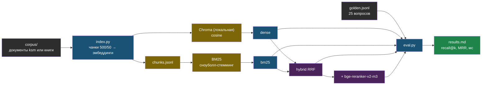

# День 2. Лаба: golden-набор и четыре ретривера

## Результат

Папка `~/proj/ai-labs/day2-rag-eval/` с воспроизводимым экспериментом: тот же чанкер и та же модель эмбеддингов, что в проде web-agent, локальный индекс, golden-набор из 25 вопросов и таблица `results.md`, где четыре ретривера — dense, BM25, hybrid RRF, hybrid + reranker — сравниваются по recall@1/3/5, MRR и латентности. Это первое измеримое утверждение о качестве твоего RAG, и оно пойдёт в резюме и в кейс.

## Карта лабы



## Подготовка

Окружение — то же `~/proj/ai-labs/.venv` и `.env` из дня 1 (ключ OpenRouter, прокси). Новые зависимости заметные по весу: `torch` для реранкера ставь CPU-сборкой явно, иначе pip притянет CUDA-библиотеки на гигабайты.

```bash
cd ~/proj/ai-labs && source .venv/bin/activate && source .env
pip install -q torch --index-url https://download.pytorch.org/whl/cpu
pip install -q chromadb langchain-text-splitters rank-bm25 snowballstemmer sentence-transformers pypdf python-docx beautifulsoup4
mkdir -p day2-rag-eval/corpus && cd day2-rag-eval
cp ~/proj/web-agent/services/doc-parser/app/parser.py parse.py
```

Парсер берём из web-agent без изменений — он самодостаточен, и лаба честно воспроизводит прод. Модель реранкера скачается при первом запуске (порядка двух гигабайт); если Hugging Face отдаёт медленно, задай `export HF_ENDPOINT=https://hf-mirror.com`.

## Шаг 1. Корпус (15 минут)

Основной вариант — документы клиента ksm из web-agent. Если они загружены файлами, на сервере они лежат в `data/documents/ksm/` внутри каталога приложения (см. `app_dir` в `ansible/inventory/hosts.ini`):

```bash
rsync -av <ssh-хост-web-agent>:<app_dir>/data/documents/ksm/ corpus/
ls corpus | head
```

Если документы ksm добавлены краулером и файлов на диске нет, не трать время на экспорт из прода — возьми запасной корпус: пять-семь markdown-глав из своих книг devops, например `23-local-llm-devops` и `36-vault-devops`. Русский, техничный, с точными терминами (имена команд, порты, флаги), на которых хорошо видна разница между dense и BM25:

```bash
cp ~/Documents/lessons/dev-ops/docs/books/23-local-llm-devops/chapter-0{1,3,5,8}.md corpus/
cp ~/Documents/lessons/dev-ops/docs/books/36-vault-devops/chapter-0{2,4,6}.md corpus/
```

Методика и цифры не зависят от корпуса; в отчёте укажи, какой использовал.

## Шаг 2. Golden-набор (20 минут)

Файл `golden.jsonl`, одна строка на вопрос: `q` — вопрос как его задал бы пользователь, `doc` — имя файла, где ответ, `must` — короткая фраза (2–5 слов), которая обязана быть в найденном фрагменте. Состав 25 вопросов: 15 обычных, 5 перефразированных синонимами (проверяют dense), 5 с точными терминами — команда, порт, номер, название (проверяют BM25). Для корпуса ksm бери формулировки из журнала чатов.

```json
{"q": "как посмотреть, какие модели уже скачаны", "doc": "chapter-01.md", "must": "ollama list"}
{"q": "на каком порту слушает оллама по умолчанию", "doc": "chapter-03.md", "must": "11434"}
{"q": "чем отличается seal от unseal", "doc": "chapter-02.md", "must": "unseal"}
```

Фраза `must` должна быть в тексте документа буквально — проверь `grep -il "ollama list" corpus/*`. Если фраза есть в документе, а ретривер её не находит, это промах поиска; если фразу разрезала граница чанка — это промах нарезки, и это тоже результат.

## Шаг 3. Эмбеддер с префиксами

Один класс на два источника векторов: OpenRouter (как в проде) и локальная модель через sentence-transformers. Префиксы для e5 и FRIDA зашиты сюда, чтобы их нельзя было забыть.

```python
# ~/proj/ai-labs/day2-rag-eval/embed.py
import os

from openai import OpenAI


class Embedder:
    """kind='openrouter' — как в web-agent; kind='local' — sentence-transformers на CPU."""

    def __init__(self, kind: str, model: str):
        self.kind, self.model = kind, model
        if kind == "openrouter":
            self.client = OpenAI(
                base_url=os.getenv("OPENROUTER_BASE_URL", "https://openrouter.ai/api/v1"),
                api_key=os.environ["OPENROUTER_API_KEY"],
                timeout=60,
                max_retries=2,
            )
        else:
            from sentence_transformers import SentenceTransformer

            self.st = SentenceTransformer(model)

    def _prefix(self, texts: list[str], role: str) -> list[str]:
        name = self.model.lower()
        if "e5" in name:
            p = "query: " if role == "query" else "passage: "
        elif "frida" in name:
            p = "search_query: " if role == "query" else "search_document: "
        else:
            p = ""  # bge-m3 и OpenAI префиксов не требуют
        return [p + t for t in texts]

    def embed_documents(self, texts: list[str]) -> list[list[float]]:
        return self._embed(self._prefix(texts, "document"))

    def embed_query(self, text: str) -> list[float]:
        return self._embed(self._prefix([text], "query"))[0]

    def _embed(self, texts: list[str]) -> list[list[float]]:
        if self.kind == "openrouter":
            out: list[list[float]] = []
            for s in range(0, len(texts), 64):
                r = self.client.embeddings.create(model=self.model, input=texts[s : s + 64])
                out.extend(d.embedding for d in sorted(r.data, key=lambda d: d.index))
            return out
        return self.st.encode(texts, normalize_embeddings=True, batch_size=16, show_progress_bar=False).tolist()
```

## Шаг 4. Индексация: как в проде, но локально

Тот же сплиттер и те же параметры, что в `services/doc-parser/app/indexer.py`. Отличие одно, и оно намеренное: коллекция создаётся с косинусным расстоянием. Все чанки дополнительно сохраняются в `chunks.jsonl` — по ним строится BM25 и разбираются промахи.

```python
# ~/proj/ai-labs/day2-rag-eval/index.py
import argparse
import json
from pathlib import Path

import chromadb
from langchain_text_splitters import RecursiveCharacterTextSplitter

from embed import Embedder
from parse import parse

SUPPORTED = {".md", ".txt", ".pdf", ".docx", ".html", ".htm"}


def main() -> None:
    ap = argparse.ArgumentParser()
    ap.add_argument("--corpus", default="corpus")
    ap.add_argument("--collection", default="chunks_openai")
    ap.add_argument("--embedder", default="openrouter", choices=["openrouter", "local"])
    ap.add_argument("--model", default="openai/text-embedding-3-small")
    ap.add_argument("--chunk-size", type=int, default=500)
    ap.add_argument("--chunk-overlap", type=int, default=50)
    ap.add_argument("--title-prefix", action="store_true", help="контекстная нарезка: имя документа в начало чанка перед эмбеддингом")
    a = ap.parse_args()

    splitter = RecursiveCharacterTextSplitter(chunk_size=a.chunk_size, chunk_overlap=a.chunk_overlap)
    ids, docs, metas = [], [], []
    for path in sorted(Path(a.corpus).rglob("*")):
        if path.suffix.lower() not in SUPPORTED:
            continue
        for i, chunk in enumerate(splitter.split_text(parse(path))):
            ids.append(f"{path.name}:{i}")
            docs.append(chunk)
            metas.append({"filename": path.name, "chunk_index": i})
    print(f"документов: {len({m['filename'] for m in metas})}, чанков: {len(docs)}")

    with open("chunks.jsonl", "w", encoding="utf-8") as fh:
        for i, d, m in zip(ids, docs, metas):
            fh.write(json.dumps({"id": i, "text": d, **m}, ensure_ascii=False) + "\n")

    to_embed = [f"{m['filename']}\n{d}" for d, m in zip(docs, metas)] if a.title_prefix else docs
    vectors = Embedder(a.embedder, a.model).embed_documents(to_embed)

    client = chromadb.PersistentClient(path="chroma")
    try:
        client.delete_collection(a.collection)
    except Exception:
        pass  # первой сборки ещё нет
    col = client.create_collection(a.collection, metadata={"hnsw:space": "cosine"})
    for s in range(0, len(ids), 500):
        col.add(ids=ids[s : s + 500], documents=docs[s : s + 500], embeddings=vectors[s : s + 500], metadatas=metas[s : s + 500])
    print(f"коллекция {a.collection}: {col.count()} векторов, размерность {len(vectors[0])}")


if __name__ == "__main__":
    main()
```

Запуск: `python index.py`. Ожидаемо несколько сотен чанков и размерность 1536 для `text-embedding-3-small`. Запиши число чанков и стоимость индексации: OpenRouter возвращает `usage` и на эмбеддинги, посмотри в личном кабинете или добавь печать `r.usage` в `embed.py`.

## Шаг 5. Четыре ретривера

```python
# ~/proj/ai-labs/day2-rag-eval/retrievers.py
import json
import re
from functools import lru_cache

import chromadb
import snowballstemmer
from rank_bm25 import BM25Okapi

from embed import Embedder

STEMMER = snowballstemmer.stemmer("russian")
WORD = re.compile(r"\w+", re.UNICODE)


def tokenize(text: str) -> list[str]:
    """lower → слова → стемминг. Без морфологии BM25 по русскому почти бесполезен."""
    return STEMMER.stemWords(WORD.findall(text.lower()))


@lru_cache(maxsize=1)
def reranker():
    from sentence_transformers import CrossEncoder

    return CrossEncoder("BAAI/bge-reranker-v2-m3", max_length=512)


class Store:
    def __init__(self, collection: str, embedder: Embedder):
        self.col = chromadb.PersistentClient(path="chroma").get_collection(collection)
        self.embedder = embedder
        rows = [json.loads(line) for line in open("chunks.jsonl", encoding="utf-8")]
        self.by_id = {r["id"]: r for r in rows}
        self.ids = [r["id"] for r in rows]
        self.bm25 = BM25Okapi([tokenize(r["text"]) for r in rows])

    def dense(self, q: str, k: int) -> list[dict]:
        res = self.col.query(query_embeddings=[self.embedder.embed_query(q)], n_results=k)
        return [self.by_id[i] for i in res["ids"][0]]

    def bm25_search(self, q: str, k: int) -> list[dict]:
        scores = self.bm25.get_scores(tokenize(q))
        top = sorted(range(len(scores)), key=lambda i: scores[i], reverse=True)[:k]
        return [self.by_id[self.ids[i]] for i in top if scores[i] > 0]

    def hybrid(self, q: str, k: int, candidates: int = 20, rrf_k: int = 60) -> list[dict]:
        """Reciprocal Rank Fusion: сумма 1/(rrf_k + позиция) по обоим спискам, нормализация не нужна."""
        fused: dict[str, float] = {}
        for ranked in (self.dense(q, candidates), self.bm25_search(q, candidates)):
            for pos, r in enumerate(ranked):
                fused[r["id"]] = fused.get(r["id"], 0.0) + 1.0 / (rrf_k + pos + 1)
        return [self.by_id[i] for i in sorted(fused, key=fused.get, reverse=True)[:k]]

    def hybrid_rerank(self, q: str, k: int, candidates: int = 20) -> list[dict]:
        cands = self.hybrid(q, candidates)
        scores = reranker().predict([(q, c["text"]) for c in cands])
        order = sorted(range(len(cands)), key=lambda i: float(scores[i]), reverse=True)[:k]
        return [cands[i] for i in order]
```

Быстрая проверка перед оценкой: `python -c "from embed import Embedder; from retrievers import Store; s=Store('chunks_openai', Embedder('openrouter','openai/text-embedding-3-small')); print([r['filename'] for r in s.hybrid('на каком порту слушает ollama', 3)])"` — должны вернуться осмысленные файлы.

## Шаг 6. Оценка

Попадание засчитывается, если среди топ-k есть фрагмент из нужного документа, содержащий фразу `must`. Один релевантный фрагмент на вопрос, поэтому recall@k здесь равен hit rate; MRR показывает позицию.

```python
# ~/proj/ai-labs/day2-rag-eval/eval.py
import json
import sys
import time
from statistics import mean

from embed import Embedder
from retrievers import Store

KS = (1, 3, 5)


def is_hit(result: dict, gold: dict) -> bool:
    return result["filename"] == gold["doc"] and gold["must"].lower() in result["text"].lower()


def evaluate(name: str, search, golden: list[dict], k_max: int = 5) -> dict:
    ranks, latencies = [], []
    for g in golden:
        t0 = time.perf_counter()
        results = search(g["q"], k_max)
        latencies.append(time.perf_counter() - t0)
        ranks.append(next((pos + 1 for pos, r in enumerate(results) if is_hit(r, g)), None))
    row = {"retriever": name, "latency_ms": 1000 * mean(latencies)}
    for k in KS:
        row[f"recall@{k}"] = sum(1 for r in ranks if r is not None and r <= k) / len(ranks)
    row["mrr"] = mean((1.0 / r) if r else 0.0 for r in ranks)
    row["misses"] = [g["q"] for g, r in zip(golden, ranks) if r is None]
    return row


if __name__ == "__main__":
    collection = sys.argv[1] if len(sys.argv) > 1 else "chunks_openai"
    kind = sys.argv[2] if len(sys.argv) > 2 else "openrouter"
    model = sys.argv[3] if len(sys.argv) > 3 else "openai/text-embedding-3-small"
    golden = [json.loads(line) for line in open("golden.jsonl", encoding="utf-8") if line.strip()]
    store = Store(collection, Embedder(kind, model))

    rows = [
        evaluate("dense", store.dense, golden),
        evaluate("bm25", store.bm25_search, golden),
        evaluate("hybrid RRF", store.hybrid, golden),
        evaluate("hybrid + rerank", store.hybrid_rerank, golden),
    ]
    print(f"\nкорпус: {collection}, вопросов: {len(golden)}\n")
    print("| retriever | recall@1 | recall@3 | recall@5 | MRR | латентность, мс |")
    print("|---|---|---|---|---|---|")
    for r in rows:
        print(f"| {r['retriever']} | {r['recall@1']:.2f} | {r['recall@3']:.2f} | {r['recall@5']:.2f} | {r['mrr']:.2f} | {r['latency_ms']:.0f} |")
    for r in rows:
        if r["misses"]:
            print(f"\nпромахи «{r['retriever']}»: " + " | ".join(r["misses"][:6]))
```

Запуск: `python eval.py`. Первый прогон с реранкером медленный — качается модель. Таблицу целиком скопируй в `results.md`. Затем разбери промахи: для каждого вопроса, который не нашёл даже hybrid + rerank, найди `grep -n` фразу в `chunks.jsonl` и запиши причину — фраза разрезана границей чанка, документ извлёкся плохо, вопрос сформулирован иначе, чем текст. Три-пять разобранных промахов ценнее ещё одного процента recall.

## Шаг 7. Второй прогон: контекстная нарезка

Один флаг — и это уже эксперимент, который стоит показать: переиндексируй с именем документа в начале каждого чанка и сравни.

```bash
python index.py --collection chunks_openai_ctx --title-prefix
python eval.py chunks_openai_ctx
```

Дописывай строки в `results.md` с пометкой конфигурации. Если корпус — главы книг с говорящими именами файлов, эффект будет заметен на вопросах про «где» и «в какой книге»; на корпусе ksm — проверь.

## Шаг 8. Сравнение моделей эмбеддингов (30 минут, по желанию)

Локальная модель против API — главный вопрос для on-prem вакансий. `bge-m3` тяжёлая для CPU, но несколько сотен чанков переживёт за минуты:

```bash
python index.py --collection chunks_bge --embedder local --model BAAI/bge-m3
python eval.py chunks_bge local BAAI/bge-m3
```

Хочешь третью строку — `intfloat/multilingual-e5-large` (префиксы подставятся сами). В отчёт: recall@5 и латентность dense-поиска для каждой модели плюс стоимость индексации API-моделью — это готовое сравнение «облако против локально» для собеседования.

## Шаг 9. results.md и коммит

```markdown
# День 2 — качество поиска (дата, корпус: ksm / книги 23+36, чанков: N)

## Основной прогон (text-embedding-3-small, 500/50)
<таблица из eval.py>

## Контекстная нарезка (--title-prefix)
<таблица>

## Локальные модели
| модель | recall@5 dense | MRR | латентность, мс | стоимость индексации |

## Разбор промахов (3–5 штук)
- вопрос → причина → что изменить

## Выводы
- какой ретривер идёт в web-agent первым кандидатом и почему
- что пойдёт в резюме одной строкой с числами
```

Коммит: `git add -A && git commit -m "day2: retrieval eval — golden set, dense/bm25/hybrid/rerank, recall@k"`, push.

## Если не получилось

- **`pip install torch` тянет гигабайты** — ты забыл `--index-url .../whl/cpu`; сними и поставь CPU-сборку.
- **Скачивание реранкера обрывается** — `HF_ENDPOINT=https://hf-mirror.com`, либо докачай `huggingface-cli download BAAI/bge-reranker-v2-m3` с возобновлением.
- **`Dimension mismatch` в Chroma** — индексируешь другой моделью в существующую коллекцию; каждая модель — своя коллекция (`--collection`). Это ровно инцидент web-agent, теперь ты его воспроизвёл руками.
- **BM25 возвращает пусто или мусор** — токенизация запроса и документов должна быть одинаковой (обе через `tokenize`); проверь, что стеммер `russian` создан.
- **recall у dense подозрительно низкий** — проверь `hnsw:space`, префиксы для e5/FRIDA и что запрос эмбеддится той же моделью, что документы.
- **403 от OpenRouter** — прокси из дня 1; `HTTPS_PROXY` должен быть в окружении процесса Python.
- **Реранкер медленный** — 20 кандидатов по 500 символов на CPU занимают секунду-две; это нормально, запиши число и обсуди в отчёте, где реранкер уместен (поддержка) и где нет (автодополнение).

## Практика

1. **Feature flag в web-agent**: спроектируй режим `retrieval_mode = dense | hybrid` в настройках сайта. BM25-индекс строится при старте из `collection.get(include=["documents","metadatas"])` и кэшируется в памяти на tenant; при переиндексации документа инвалидируется. Опиши в `~/proj/web-agent/docs/` план изменения `retriever.py` — реализация пойдёт после недели, но план с оценкой трудозатрат уже показывает инженерный подход.
2. **Порог релевантности**: добавь в `hybrid_rerank` возврат скоров и посмотри, какой порог отделяет попадания от промахов на golden-наборе; это будущий сигнал «в документах нет ответа» вместо галлюцинации.
3. **Condense question**: напиши функцию, которая по истории из двух реплик и уточняющему вопросу делает самостоятельный вопрос одним вызовом дешёвой модели, и проверь на трёх примерах из журнала чатов.

## Что проверить

- В `golden.jsonl` 25 строк, для каждой фраза `must` буквально присутствует в указанном документе (проверено grep).
- `index.py` отработал: напечатано число чанков и размерность; `chunks.jsonl` существует.
- `eval.py` выдал таблицу для четырёх ретриверов; hybrid не хуже dense по recall@5, реранкер не хуже hybrid по MRR — если иначе, причина разобрана и записана.
- В `results.md` есть латентность каждого ретривера в миллисекундах и стоимость индексации API-моделью.
- Разобраны три-пять промахов с причинами.
- Есть строка выводов «что идёт в web-agent первым» и строка для резюме с числами.
- Коммит запушен в `iRoboTron/ai-labs`.
