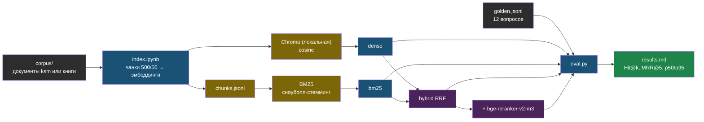

# День 2. Лаба: golden-набор и четыре ретривера

## Результат

Папка `~/proj/ai-labs/day2-rag-eval/` с воспроизводимым экспериментом: тот же чанкер и та же модель эмбеддингов, что в проде web-agent, локальный индекс, открытый golden-набор из 12 вопросов и таблица `results.md`, где четыре ретривера — dense, BM25, hybrid RRF, hybrid + reranker — сравниваются по Hit@1/3/5, MRR@5 и p50/p95 латентности. Это первое измеримое утверждение о качестве твоего RAG, и оно пойдёт в резюме и в кейс.

## Карта лабы



## Подготовка

Первый прогон — на открытом синтетическом корпусе из репозитория, без SSH, клиентских документов и журналов чатов. Из корня курса установи готовые файлы: `python3 scripts/install_labs.py --dest ~/proj/ai-labs`. Установщик пропускает идентичные файлы и отказывается перезаписывать отличающиеся. Разбор кода ниже нужен для понимания, вручную создавать каждый файл не требуется.

Окружение — `~/proj/ai-labs/.venv` из дня 1. Для API-модели загрузи `.env`; запросы платные. Зависимости бери из зафиксированного окружения курса. CPU-сборка torch не делает загрузку моделей offline: первый запуск sentence-transformers всё равно скачивает веса.

```bash
cd ~/proj/ai-labs && source .venv/bin/activate
source .env
cd day2-rag-eval
ls ../fixtures/corpus
```

Готовый `parse.py` поставляется вместе с лабой, а не копируется из непубличного web-agent. Парсер подходит для простых документов; таблицы DOCX/PDF и OCR требуют отдельной проверки качества.

## Шаг 1. Безопасный корпус (5 минут)

По умолчанию используются четыре синтетических документа `../fixtures/corpus/`. Никаких реальных клиентов, ключей или переписки. Любой читатель получает одинаковые входные данные; результаты зависят от корпуса, поэтому на другом корпусе цифры будут другими.

Приватный эксперимент возможен только отдельно: проверь разрешение на обработку и передачу API-провайдеру, положи разрешённый корпус в `.local/private-corpus/` и передай `--corpus .local/private-corpus`. Индексы и полные тексты остаются в `.local/`, исключённом из Git. В публичное портфолио — только обезличенные агрегаты после ручной проверки.

## Шаг 2. Golden-набор

Открытый `../fixtures/golden.jsonl` содержит 12 проверяемых вопросов. Поля: `q` — вопрос; `doc` — относительный путь документа; `must` — фраза в найденном фрагменте. Начни с него, затем отдельно расширь набор до 25 вопросов и зафиксируй holdout, не используемый для настройки.

```json
{"q": "Как найти конкретный фильтр ВЕНТ-204?", "doc": "01-retrieval.md", "must": "ВЕНТ-204"}
```

Скрипты проверяют, что документы golden-набора входят в снимок корпуса. Буквальная фраза — простой прокси достаточности контекста, а не исчерпывающая разметка всех релевантных чанков. Поэтому отчёт называет метрику **Hit@k**, а не общий recall. MRR ограничен топ-5 и подписан **MRR@5**. Семантически верный фрагмент без фразы даст ложный промах — такие случаи разбирай вручную.

## Общие функции и пути

Снимок `.local/<collection>/` содержит собственные `chunks.jsonl`, `config.json` и `chroma/`. Новая нарезка — новое имя снимка; старые данные не перезаписываются. Пути независимы от текущей рабочей директории.

```python
# ~/proj/ai-labs/day2-rag-eval/common.py
"""Общие функции: где лежит снимок индекса, как читать golden-вопросы. Импортируется другими файлами дня."""
import hashlib
import json
import re
from pathlib import Path

ROOT = Path(__file__).resolve().parent          # папка day2-rag-eval, не зависит от того, откуда запущен скрипт
FIXTURES = ROOT.parent / "fixtures"              # публичные учебные документы курса

def snapshot_path(collection: str) -> Path:
    """Папка одного снимка индекса: .local/<имя коллекции>/."""
    if not re.fullmatch(r"[A-Za-z0-9][A-Za-z0-9_-]{2,63}", collection):
        raise ValueError("collection: 3–64 буквы, цифры, дефис или подчёркивание")
    return ROOT / ".local" / collection

def load_config(collection: str) -> dict:
    """Настройки, с которыми был построен снимок: модель эмбеддингов, размер чанка и т.д."""
    return json.loads((snapshot_path(collection) / "config.json").read_text(encoding="utf-8"))

def load_rows(collection: str) -> list[dict]:
    """Все чанки снимка построчным JSON — по ним строится BM25 и разбираются промахи."""
    return [json.loads(line) for line in (snapshot_path(collection) / "chunks.jsonl").read_text(encoding="utf-8").splitlines() if line.strip()]

def load_golden(path=None) -> list[dict]:
    """Проверочные вопросы: q — вопрос, doc — где должен быть ответ, must — обязательная фраза."""
    source = Path(path) if path else FIXTURES / "golden.jsonl"
    rows = [json.loads(line) for line in source.read_text(encoding="utf-8").splitlines() if line.strip()]
    if not rows or any(not all(isinstance(r.get(k), str) and r[k].strip() for k in ("q", "doc", "must")) for r in rows):
        raise ValueError("golden: требуется непустой список q/doc/must")
    return rows

def tenant_map(filenames) -> dict[str, int]:
    """Делит документы поровну между двумя учебными арендаторами (пригодится в дне 3)."""
    names = sorted(set(filenames))
    if len(names) < 2:
        raise ValueError("для сравнения tenant нужны минимум два документа")
    boundary = (len(names) + 1) // 2
    return {name: 1 if i < boundary else 2 for i, name in enumerate(names)}

def dataset_hash(rows: list[dict]) -> str:
    """Отпечаток набора чанков — чтобы проверить, что Chroma и Postgres содержат один и тот же снимок."""
    payload = json.dumps(rows, ensure_ascii=False, sort_keys=True, separators=(",", ":"))
    return hashlib.sha256(payload.encode("utf-8")).hexdigest()

def golden_for_rows(golden: list[dict], rows: list[dict], require_all=False) -> list[dict]:
    """Оставляет из golden только вопросы, чей документ реально есть в текущем снимке."""
    names = {r["filename"] for r in rows}
    missing = {g["doc"] for g in golden} - names
    if require_all and missing:
        raise ValueError("golden ссылается на отсутствующие документы: " + ", ".join(sorted(missing)))
    return [g for g in golden if g["doc"] in names]
```

```python
# ~/proj/ai-labs/day2-rag-eval/parse.py
"""Один файл → один текст. Каждый формат разбирается своей библиотекой, все они уже в requirements.txt."""
from pathlib import Path

def parse(path: Path) -> str:
    ext = path.suffix.lower()
    if ext in {".md", ".txt"}:                              # уже текст, просто читаем
        return path.read_text(encoding="utf-8")
    if ext == ".pdf":
        from pypdf import PdfReader                          # достаёт текстовый слой PDF
        return "\n\n".join(page.extract_text() or "" for page in PdfReader(str(path)).pages)
    if ext == ".docx":
        from docx import Document                            # python-docx: абзацы Word-документа
        return "\n\n".join(p.text for p in Document(str(path)).paragraphs if p.text.strip())
    if ext in {".html", ".htm"}:
        from bs4 import BeautifulSoup                         # разбирает HTML в дерево тегов
        soup = BeautifulSoup(path.read_text(encoding="utf-8"), "html.parser")
        for node in soup(["script", "style", "nav", "footer", "header", "noscript"]):
            node.decompose()                                  # убираем не-контент перед извлечением текста
        return soup.get_text(separator="\n\n", strip=True)
    raise ValueError(f"неподдерживаемый формат: {ext}")
```

## Шаг 3. Эмбеддер с префиксами

Один класс на два источника векторов: OpenRouter (как в проде) и локальная модель через sentence-transformers. Префиксы для e5 и FRIDA зашиты сюда, чтобы их нельзя было забыть.

```python
# ~/proj/ai-labs/day2-rag-eval/embed.py
"""Превращает текст в вектор. Один класс, два источника: платный API или бесплатная модель на CPU."""
import labkit
from functools import lru_cache

from openai import OpenAI


class Embedder:
    """kind='openrouter' — платный API, как в web-agent; kind='local' — sentence-transformers на CPU, бесплатно."""

    def __init__(self, kind: str, model: str):
        self.kind, self.model = kind, model
        if kind == "openrouter":
            self.client = OpenAI(
                base_url=labkit.env("OPENROUTER_BASE_URL", "https://openrouter.ai/api/v1"),
                api_key=labkit.env("OPENROUTER_API_KEY", required=True),
                timeout=60,
                max_retries=2,
            )
        else:
            from sentence_transformers import SentenceTransformer   # тянет модель с Hugging Face при первом запуске

            self.st = SentenceTransformer(model, device="cpu")

    def _prefix(self, texts: list[str], role: str) -> list[str]:
        """Некоторые модели просят приписать 'query:'/'passage:' перед текстом — иначе поиск хуже. Легко забыть, поэтому здесь."""
        name = self.model.lower()
        if "e5" in name:
            p = "query: " if role == "query" else "passage: "
        elif "frida" in name:
            p = "search_query: " if role == "query" else "search_document: "
        else:
            p = ""  # bge-m3 и OpenAI префиксов не требуют
        return [p + t for t in texts]

    def embed_documents(self, texts: list[str]) -> list[list[float]]:
        """Векторы для чанков документов — вызывается при индексации."""
        return self._embed(self._prefix(texts, "document"))

    def embed_query(self, text: str) -> list[float]:
        """Вектор одного поискового запроса; результат кэшируется — один вопрос эмбеддится только раз."""
        return list(self._query_cached(text))

    @lru_cache(maxsize=4096)                                  # повтор того же запроса не платит за эмбеддинг второй раз
    def _query_cached(self, text: str) -> tuple:
        return tuple(self._embed(self._prefix([text], "query"))[0])

    def _embed(self, texts: list[str]) -> list[list[float]]:
        if self.kind == "openrouter":
            out: list[list[float]] = []
            for s in range(0, len(texts), 64):                # пачками по 64, чтобы не упереться в лимит запроса
                r = self.client.embeddings.create(model=self.model, input=texts[s : s + 64])
                out.extend(d.embedding for d in sorted(r.data, key=lambda d: d.index))   # ответ может прийти не по порядку
            return out
        return self.st.encode(texts, normalize_embeddings=True, batch_size=16, show_progress_bar=False).tolist()
```

## Шаг 4. Индексация: как в проде, но локально

Тот же сплиттер и те же параметры, что в `services/doc-parser/app/indexer.py`. В учебной версии дополнительно есть снимки, стабильные относительные пути и fixture-tenant. Также коллекция создаётся с косинусным расстоянием. Все чанки дополнительно сохраняются в `.local/<collection>/chunks.jsonl` — по ним строится BM25 и разбираются промахи.

```python
# ~/proj/ai-labs/day2-rag-eval/index.py
"""Строит один снимок индекса: режет документы на чанки, считает векторы, кладёт в Chroma и в chunks.jsonl.
Настройки — константы ниже, не аргументы командной строки: поменял значение, сохранил файл, нажал Run —
получил новый снимок под новым именем. Старые снимки не трогает и не перезаписывает."""
import json

import labkit                          # noqa: F401  подключает .env и пути labkit.FIXTURES/labkit.ROOT
from common import FIXTURES, dataset_hash, snapshot_path, tenant_map
from parse import parse

# --- НАСТРОЙКИ: поменяй и запусти снова, чтобы получить другой снимок для сравнения ---
CORPUS = FIXTURES / "corpus"           # папка с документами; по умолчанию — учебные fixture курса
COLLECTION = "chunks_openai"           # имя снимка: у каждого эксперимента своё, старое не стирается
EMBEDDER = "openrouter"                # "openrouter" — платный API, "local" — бесплатная модель на CPU
MODEL = "openai/text-embedding-3-small"    # модель эмбеддингов; для EMBEDDER="local" — например BAAI/bge-m3
CHUNK_SIZE = 500                       # символов в одном чанке
CHUNK_OVERLAP = 50                     # перекрытие между соседними чанками, чтобы не резать мысль пополам
TITLE_PREFIX = False                   # True — дописывать имя файла перед текстом каждого чанка (шаг 7)

SUPPORTED = {".md", ".txt", ".pdf", ".docx", ".html", ".htm"}


def main() -> None:
    dest = snapshot_path(COLLECTION)
    if dest.exists():
        raise SystemExit(f"снимок {COLLECTION} уже существует: смени COLLECTION вверху файла, перезаписи нет")
    if not CORPUS.is_dir():
        raise SystemExit("каталог корпуса не существует")
    from langchain_text_splitters import RecursiveCharacterTextSplitter
    splitter = RecursiveCharacterTextSplitter(chunk_size=CHUNK_SIZE, chunk_overlap=CHUNK_OVERLAP)
    rows = []
    for path in sorted(CORPUS.rglob("*")):
        if not path.is_file() or path.suffix.lower() not in SUPPORTED:
            continue
        filename = path.relative_to(CORPUS).as_posix()
        for i, chunk in enumerate(splitter.split_text(parse(path))):
            rows.append({"id": f"{filename}:{i}", "text": chunk, "filename": filename, "chunk_index": i})
    if not rows:
        raise SystemExit("не извлечено ни одного чанка")
    tenants = tenant_map(r["filename"] for r in rows)          # делит документы на двух учебных арендаторов (день 3)
    for row in rows:
        row["tenant_id"] = tenants[row["filename"]]
    from embed import Embedder
    to_embed = [f"{r['filename']}\n{r['text']}" if TITLE_PREFIX else r["text"] for r in rows]
    vectors = Embedder(EMBEDDER, MODEL).embed_documents(to_embed)
    if len(vectors) != len(rows):
        raise RuntimeError("число векторов не совпадает с числом чанков")
    config = {"collection": COLLECTION, "embedder": EMBEDDER, "model": MODEL,
              "dimension": len(vectors[0]), "chunk_size": CHUNK_SIZE,
              "chunk_overlap": CHUNK_OVERLAP, "title_prefix": TITLE_PREFIX,
              "dataset_hash": dataset_hash(rows), "documents": len(tenants)}
    dest.mkdir(parents=True, exist_ok=False)
    import chromadb
    client = chromadb.PersistentClient(path=str(dest / "chroma"))     # локальная векторная база, файлы на диске
    col = client.create_collection(COLLECTION, metadata={"hnsw:space": "cosine"})
    for s in range(0, len(rows), 500):                         # пачками, чтобы не упереться в лимит одного add()
        batch = rows[s:s + 500]
        col.add(ids=[r["id"] for r in batch], documents=[r["text"] for r in batch],
                embeddings=vectors[s:s + 500],
                metadatas=[{k: v for k, v in r.items() if k not in {"id", "text"}} for r in batch])
    (dest / "chunks.jsonl").write_text("".join(json.dumps(r, ensure_ascii=False) + "\n" for r in rows), encoding="utf-8")
    (dest / "config.json").write_text(json.dumps(config, ensure_ascii=False, indent=2), encoding="utf-8")
    print(f"снимок {COLLECTION}: документов {len(tenants)}, чанков {col.count()}, dim={config['dimension']}")


if __name__ == "__main__":
    main()
```

Запуск: открой `index.ipynb` в VS Code и нажми ▶ Run All. На fixture ожидаемо несколько десятков чанков и размерность 1536 для `text-embedding-3-small`. Запиши число чанков и стоимость индексации: OpenRouter возвращает `usage` и на эмбеддинги, посмотри в личном кабинете или добавь печать `r.usage` в `embed.py`.

## Шаг 5. Четыре ретривера

```python
# ~/proj/ai-labs/day2-rag-eval/retrievers.py
"""Четыре способа искать релевантные чанки. Store — единая точка входа, используется во всех днях."""
import re
from functools import lru_cache

from common import load_config, load_rows, snapshot_path

WORD = re.compile(r"\w+", re.UNICODE)               # разбивает текст на слова для BM25

@lru_cache(maxsize=1)                                # модель стеммера грузится один раз на процесс
def stemmer():
    import snowballstemmer
    return snowballstemmer.stemmer("russian")        # приводит слова к основе: «нашёл»/«находит» → одна форма

def tokenize(text: str) -> list[str]:
    return stemmer().stemWords(WORD.findall(text.lower()))

@lru_cache(maxsize=1)                                # реранкер тяжёлый — загружаем один раз, не на каждый вопрос
def reranker():
    from sentence_transformers import CrossEncoder
    return CrossEncoder("BAAI/bge-reranker-v2-m3", max_length=512, device="cpu")

class Store:
    """Один снимок индекса плюс BM25 поверх него. tenant_id=None — видно всё; иначе — только свой tenant (день 3)."""

    def __init__(self, collection: str, embedder, tenant_id: int | None = None):
        import chromadb
        from rank_bm25 import BM25Okapi
        cfg = load_config(collection)
        if (cfg["embedder"], cfg["model"]) != (embedder.kind, embedder.model):
            raise ValueError("эмбеддер запроса не совпадает со снимком")
        self.col = chromadb.PersistentClient(path=str(snapshot_path(collection) / "chroma")).get_collection(collection)
        self.embedder, self.tenant_id = embedder, tenant_id
        rows = [r for r in load_rows(collection) if tenant_id is None or r["tenant_id"] == tenant_id]
        if not rows:
            raise ValueError("нет документов для выбранного tenant")
        self.by_id = {r["id"]: r for r in rows}
        self.ids = list(self.by_id)
        self.bm25 = BM25Okapi([tokenize(r["text"]) for r in rows])   # индекс BM25 строится в памяти при старте

    def dense(self, q: str, k: int) -> list[dict]:
        """Поиск по смыслу: вектор вопроса ближе всего к векторам нужных чанков."""
        args = {"query_embeddings": [self.embedder.embed_query(q)], "n_results": min(k, len(self.ids))}
        if self.tenant_id is not None:
            args["where"] = {"tenant_id": self.tenant_id}
        res = self.col.query(**args)
        return [self.by_id[i] for i in res["ids"][0]]

    def bm25_search(self, q: str, k: int) -> list[dict]:
        """Поиск по словам: хорош для точных терминов, кодов, названий."""
        scores = self.bm25.get_scores(tokenize(q))
        top = sorted(range(len(scores)), key=lambda i: scores[i], reverse=True)[:k]
        return [self.by_id[self.ids[i]] for i in top if scores[i] > 0]

    def hybrid(self, q: str, k: int, candidates: int = 20, rrf_k: int = 60) -> list[dict]:
        """Складывает dense и BM25 через RRF (reciprocal rank fusion): чем выше место в обоих списках, тем выше итог."""
        fused = {}
        for ranked in (self.dense(q, candidates), self.bm25_search(q, candidates)):
            for pos, r in enumerate(ranked, start=1):
                fused[r["id"]] = fused.get(r["id"], 0.0) + 1.0 / (rrf_k + pos)
        return [self.by_id[i] for i in sorted(fused, key=fused.get, reverse=True)[:k]]

    def hybrid_rerank(self, q: str, k: int, candidates: int = 20) -> list[dict]:
        """Берёт кандидатов из hybrid, затем модель-реранкер читает пары (вопрос, чанк) вместе и уточняет порядок."""
        cands = self.hybrid(q, candidates, candidates=candidates)
        if not cands:
            return []
        scores = reranker().predict([(q, c["text"]) for c in cands])
        order = sorted(range(len(cands)), key=lambda i: float(scores[i]), reverse=True)[:k]
        return [cands[i] for i in order]
```

Быстрая проверка перед оценкой: `python -c "from embed import Embedder; from retrievers import Store; s=Store('chunks_openai', Embedder('openrouter','openai/text-embedding-3-small')); print([r['filename'] for r in s.hybrid('как найти ВЕНТ-204', 3)])"` — должны вернуться файлы fixture; замени вопрос на «как найти ВЕНТ-204».

## Шаг 6. Оценка

Попадание — нужный документ и фраза `must` в топ-k. Это Hit@k, а не полнота по всем релевантным фрагментам. MRR@5 обнуляет вопросы без попадания в первых пяти. Query-векторы и прогрев вынесены за steady-state таймер: таблица показывает поиск и реранкинг с готовым вектором. End-to-end задержку приложения измеряем отдельно, в день 5.

```python
# ~/proj/ai-labs/day2-rag-eval/eval.py
"""Прогоняет golden-вопросы через четыре ретривера и печатает таблицу Hit@k / MRR / латентность.
COLLECTION внизу должен совпадать с тем, что ты только что построил в index.py."""
import math
import time
from statistics import mean, median

import labkit                          # noqa: F401  подключает .env
from common import golden_for_rows, load_config, load_golden, load_rows

# --- НАСТРОЙКИ ---
COLLECTION = "chunks_openai"           # тот же снимок, что в index.py
GOLDEN_PATH = None                     # None — стандартный fixtures/golden.jsonl; можно указать свой файл
REPEATS = 3                            # сколько раз повторить прогон для честной медианы латентности

KS = (1, 3, 5)

def is_hit(result: dict, gold: dict) -> bool:
    """Попадание: тот же файл, что ожидался, и в тексте чанка есть обязательная фраза."""
    return result["filename"] == gold["doc"] and gold["must"].lower() in result["text"].lower()

def evaluate(name: str, search, golden: list[dict], k_max: int = 5, repeats: int = 3) -> dict:
    if not golden or repeats < 1 or k_max < max(KS):
        raise ValueError("нужны вопросы, repeats >= 1 и k_max >= 5")
    warm_t0 = time.perf_counter()
    for g in golden:
        search(g["q"], k_max)  # модель, соединения и query-cache вне steady-state таймера
    warmup_ms = 1000 * (time.perf_counter() - warm_t0)
    ranks, latencies = [], []
    for repeat in range(repeats):
        for g in golden:
            t0 = time.perf_counter()
            results = search(g["q"], k_max)
            latencies.append(1000 * (time.perf_counter() - t0))
            if repeat == 0:
                ranks.append(next((pos + 1 for pos, r in enumerate(results) if is_hit(r, g)), None))
    row = {"retriever": name, "latency_ms": median(latencies),
           "p95_ms": sorted(latencies)[math.ceil(.95 * len(latencies)) - 1],
           "warmup_ms": warmup_ms, "samples": len(latencies)}
    # Ключи recall@k оставлены для совместимости адаптеров; здесь это Hit@k, не общий recall.
    for k in KS:
        row[f"recall@{k}"] = sum(r is not None and r <= k for r in ranks) / len(ranks)
    row["mrr"] = mean(1.0 / r if r else 0.0 for r in ranks)  # MRR@k_max
    row["misses"] = [g["q"] for g, r in zip(golden, ranks) if r is None]
    return row

def main() -> None:
    cfg = load_config(COLLECTION)
    golden = golden_for_rows(load_golden(GOLDEN_PATH), load_rows(COLLECTION), require_all=True)
    from embed import Embedder
    from retrievers import Store
    embedder = Embedder(cfg["embedder"], cfg["model"])
    t0 = time.perf_counter()
    for g in golden:
        embedder.embed_query(g["q"])
    print(f"query embeddings (один раз, вне поиска): {time.perf_counter() - t0:.2f} s")
    store = Store(COLLECTION, embedder)
    print(f"snapshot={cfg['dataset_hash']} questions={len(golden)} repeats={REPEATS}")
    print("| retriever | Hit@1 | Hit@3 | Hit@5 | MRR@5 | p50 ms | p95 ms | warmup ms |")
    print("|---|---|---|---|---|---|---|---|")
    for name, fn in (("dense", store.dense), ("bm25", store.bm25_search), ("hybrid RRF", store.hybrid), ("hybrid + rerank", store.hybrid_rerank)):
        r = evaluate(name, fn, golden, repeats=REPEATS)
        print(f"| {name} | {r['recall@1']:.2f} | {r['recall@3']:.2f} | {r['recall@5']:.2f} | {r['mrr']:.2f} | {r['latency_ms']:.1f} | {r['p95_ms']:.1f} | {r['warmup_ms']:.0f} |")
        if r["misses"]:
            print("Промахи:", " | ".join(r["misses"][:6]))

if __name__ == "__main__":
    main()
```

Запуск: `python eval.py` (этот файл остаётся обычным скриптом, не ноутбуком: его импортирует `eval_pg.py` в дне 3, а ноутбук нельзя импортировать как модуль). Первый прогрев с реранкером медленный — качается и загружается модель; это отдельный warmup, не латентность поиска. Таблицу с p50/p95 и числом повторов скопируй в `results.md`. Затем разбери промахи: для каждого вопроса, который не нашёл даже hybrid + rerank, найди `grep -n` фразу в `.local/<collection>/chunks.jsonl` и запиши причину — фраза разрезана границей чанка, документ извлёкся плохо, вопрос сформулирован иначе, чем текст. Три-пять разобранных промахов ценнее ещё одного процента recall.

## Шаг 7. Второй прогон: контекстная нарезка

Новый снимок не меняет старую коллекцию и её чанки. Один флаг — и это отдельный эксперимент: индексируй с именем документа в начале каждого чанка и сравни.

В `index.ipynb` поставь `COLLECTION = "chunks_openai_ctx"` и `TITLE_PREFIX = True`, сохрани и нажми ▶ Run All.
В `eval.py` поставь `COLLECTION = "chunks_openai_ctx"`, сохрани и запусти (`python eval.py`).

Дописывай строки в `results.md` с пометкой конфигурации. Если корпус — главы книг с говорящими именами файлов, эффект будет заметен на вопросах про «где» и «в какой книге»; на корпусе ksm — проверь.

## Шаг 8. Сравнение моделей эмбеддингов (30 минут, по желанию)

Локальная модель против API — главный вопрос для on-prem вакансий. `bge-m3` тяжёлая для CPU, но несколько сотен чанков переживёт за минуты:

В `index.ipynb` поставь `COLLECTION = "chunks_bge"`, `EMBEDDER = "local"`, `MODEL = "BAAI/bge-m3"`, сохрани и нажми ▶ Run All.
В `eval.py` поставь `COLLECTION = "chunks_bge"`, сохрани и запусти (`python eval.py`).

Хочешь третью строку — `intfloat/multilingual-e5-large` (префиксы подставятся сами). В отчёт: recall@5 и латентность dense-поиска для каждой модели плюс стоимость индексации API-моделью — это готовое сравнение «облако против локально» для собеседования.

На четырёх синтетических документах легко получить высокий Hit@5: это smoke/regression проверка, не доказательство качества на клиентах. Следующий эксперимент — отдельный разрешённый датасет с holdout и отрицательными вопросами.

## Шаг 9. results.md и коммит

```markdown
# День 2 — качество поиска (дата, корпус: public synthetic fixtures v1, чанков: N)

## Основной прогон (text-embedding-3-small, 500/50)
<таблица из eval.py>

## Контекстная нарезка (--title-prefix)
<таблица>

## Локальные модели
| модель | Hit@5 dense | MRR@5 | p50/p95, мс | стоимость индексации |

## Разбор промахов (3–5 штук)
- вопрос → причина → что изменить

## Выводы
- какой ретривер идёт в web-agent первым кандидатом и почему
- что пойдёт в резюме одной строкой с числами
```

Перед публикацией проверь `git status --short` и отсутствие приватных данных в `results.md`. Из `~/proj/ai-labs`: `git add day2-rag-eval/*.py day2-rag-eval/results.md fixtures/`, затем `git diff --cached`. Только после проверки — коммит и push; приватные данные не добавляй.

## Если не получилось

- **`pip install torch` тянет гигабайты** — ты забыл `--index-url .../whl/cpu`; сними и поставь CPU-сборку.
- **Скачивание реранкера обрывается** — проверь доступ к официальному Hugging Face и место на диске; повторный запуск использует кэш. Не меняй источник весов на неизвестное зеркало без проверки доверия и revision.
- **`Dimension mismatch` в Chroma** — индексируешь другой моделью в существующую коллекцию; каждая модель — своя коллекция (`--collection`). Это ровно инцидент web-agent, теперь ты его воспроизвёл руками.
- **BM25 возвращает пусто или мусор** — токенизация запроса и документов должна быть одинаковой (обе через `tokenize`); проверь, что стеммер `russian` создан.
- **recall у dense подозрительно низкий** — проверь `hnsw:space`, префиксы для e5/FRIDA и что запрос эмбеддится той же моделью, что документы.
- **403 от OpenRouter** — прокси из дня 1; `HTTPS_PROXY` должен быть в окружении процесса Python.
- **Реранкер медленный** — 20 кандидатов по 500 символов на CPU занимают секунду-две; это нормально, запиши число и обсуди в отчёте, где реранкер уместен (поддержка) и где нет (автодополнение).

## Практика

1. **Feature flag в web-agent**: спроектируй режим `retrieval_mode = dense | hybrid` в настройках сайта. BM25-индекс строится при старте из `collection.get(include=["documents","metadatas"])` и кэшируется в памяти на tenant; при переиндексации документа инвалидируется. Опиши в `~/proj/web-agent/docs/` план изменения `retriever.py` — реализация пойдёт после недели, но план с оценкой трудозатрат уже показывает инженерный подход.
2. **Порог релевантности**: добавь в `hybrid_rerank` возврат скоров и посмотри, какой порог отделяет попадания от промахов на golden-наборе; это будущий сигнал «в документах нет ответа» вместо галлюцинации.
3. **Condense question**: напиши функцию, которая по истории из двух реплик и уточняющему вопросу делает самостоятельный вопрос одним вызовом дешёвой модели, и проверь на трёх примерах из журнала чатов.

## Что проверить

- В `../fixtures/golden.jsonl` 12 строк; расширенный набор хранится отдельно, для каждой фраза `must` буквально присутствует в указанном документе (проверено grep).
- `index.ipynb` отработал: напечатано число чанков и размерность; `.local/<collection>/chunks.jsonl` существует.
- `eval.py` выдал таблицу для четырёх ретриверов; сравнены Hit@5 и MRR@5, улучшение не предполагается заранее; любое ухудшение разобрано без подгонки holdout.
- В `results.md` есть латентность каждого ретривера в миллисекундах и стоимость индексации API-моделью.
- Разобраны три-пять промахов с причинами.
- Есть строка выводов «что идёт в web-agent первым» и строка для резюме с числами.
- Коммит запушен в `iRoboTron/ai-labs`.
