# Глоссарий дня 2

Термины по алфавиту, с английским оригиналом и указанием, где встречаются. К каждому термину — схема-подсказка в палитре курса: серый — вход, синий — процесс, зелёный — результат, коричневый — ошибка, жёлтый — данные/хранение, фиолетовый — внешнее/сравнение.

---

**Bi-encoder** — модель эмбеддингов: кодирует запрос и документ независимо в векторы, близость которых сравнивается. Быстрая, но не видит взаимодействия запроса и текста. Глава 1.

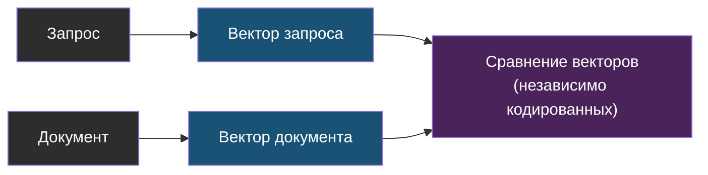

---

**BM25** — классическая функция ранжирования полнотекстового поиска: частота слова с насыщением, вес редких слов (IDF), нормализация на длину. Для русского требует стемминга или лемматизации. Главы 1–2.

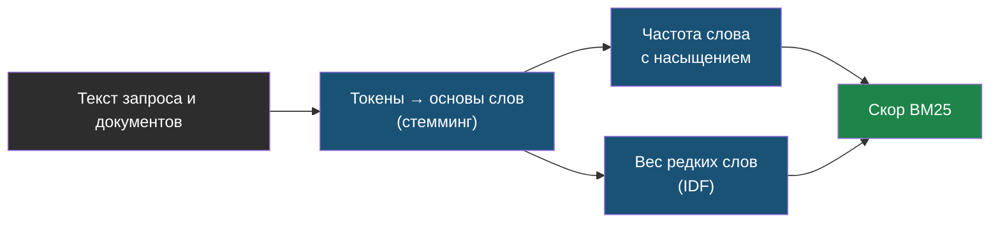

---

**Condense question** — переформулировка уточняющего вопроса с учётом истории диалога в самостоятельный перед поиском. Пробел web-agent. Главы 1 и 3.

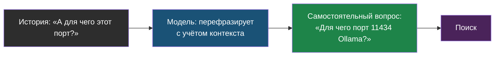

---

**Cross-encoder (реранкер, reranking)** — модель, читающая пару «запрос + фрагмент» вместе и выдающая релевантность; точнее bi-encoder, применяется к 20–50 кандидатам. В лабе — `BAAI/bge-reranker-v2-m3`. Главы 1–3.

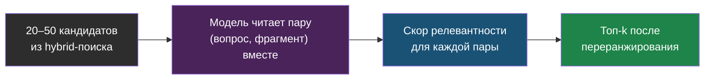

---

**Dimension mismatch** — ошибка при вставке вектора другой размерности в коллекцию: следствие смены модели эмбеддингов без переиндексации. Инцидент web-agent. Главы 1 и 3.

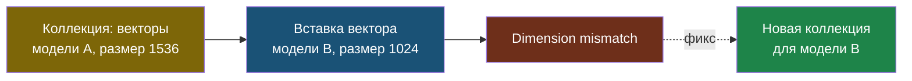

---

**Golden-набор (golden set)** — набор пар «вопрос → где ответ» для регрессионной оценки поиска и ответов; собирается из реальных вопросов пользователей, хранится в git. Глава 2.

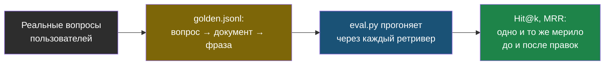

---

**Grounding** — привязка ответа модели к предоставленному контексту: инструкция отвечать только по документам, цитаты, честный отказ при отсутствии ответа. Глава 1.

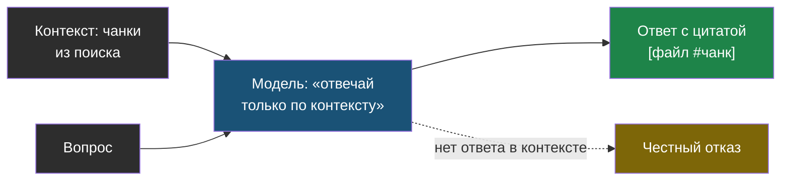

---

**Гибридный поиск (hybrid search)** — объединение векторного и полнотекстового поиска; закрывает слабость dense на точных терминах и слабость BM25 на синонимах. Главы 1–2.

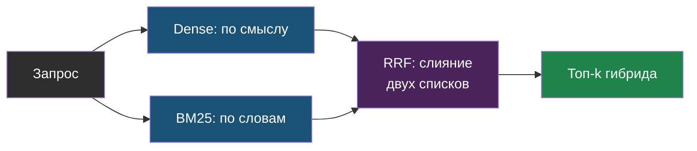

---

**HyDE** — генерация гипотетического ответа моделью и поиск по его эмбеддингу вместо эмбеддинга вопроса. Глава 1.


---

**Изоляция tenant (tenant isolation)** — разделение данных клиентов в мультитенантной системе; в web-agent — коллекция на tenant, а не фильтр в общей. Главы 1 и 3.

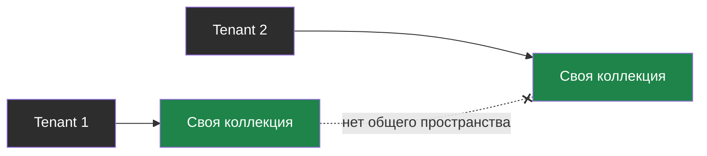

---

**Контекстная нарезка (contextual chunking)** — добавление названия документа и секции к чанку перед эмбеддингом, чтобы фрагмент без заголовка не терял смысл. Лаба, шаг 7.

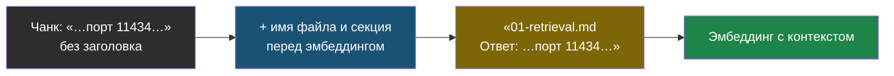

---

**Косинусное сходство (cosine similarity)** — мера близости векторов по углу; для нормализованных векторов эквивалентна по порядку скалярному произведению и L2. Chroma по умолчанию использует L2. Глава 1.

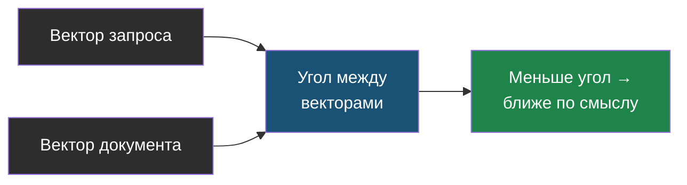

---

**Lost in the middle** — снижение внимания модели к информации в середине длинного контекста; влияет на порядок фрагментов при сборке контекста. Главы 1 и 3.

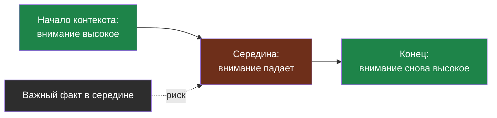

---

**Metadata filtering** — сужение поиска по атрибутам чанка: документ, дата, тип, tenant. Глава 1.

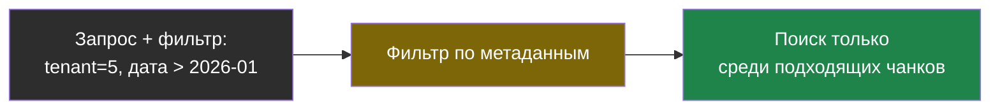

---

**MRR (mean reciprocal rank)** — среднее по вопросам от `1 / позиция первого релевантного результата`; показывает, насколько высоко стоит нужное. Главы 1–2.

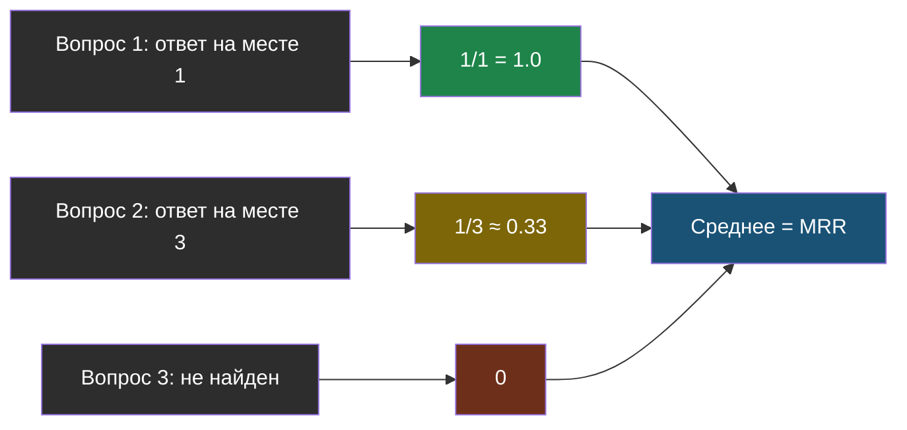

---

**nDCG@k** — метрика ранжирования с учётом градаций релевантности и позиций; нужна при нескольких неравноценных релевантных фрагментах. Глава 1.

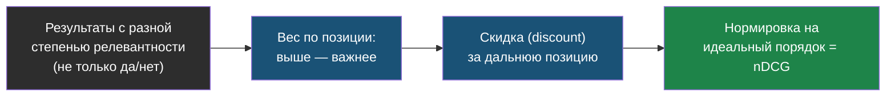

---

**Overlap (перекрытие)** — общая часть соседних чанков, чтобы разрезанный границей факт целиком попал хотя бы в один. Глава 1.

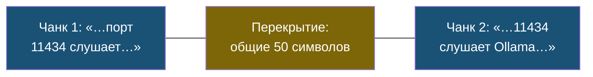

---

**recall@k** — доля вопросов, для которых релевантный фрагмент попал в топ-k результатов; при одном релевантном на вопрос совпадает с hit rate. Главная метрика поиска для RAG. Главы 1–2.

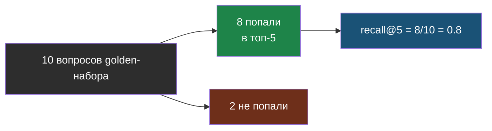

---

**RRF (reciprocal rank fusion)** — слияние ранжированных списков суммой `1 / (k + позиция)`, обычно k = 60; не требует нормализации скорингов. Главы 1–2.

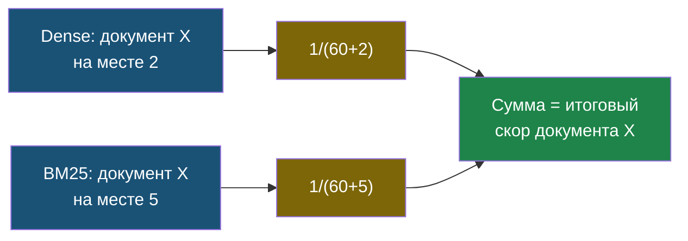

---

**Стемминг (stemming)** — отсечение окончаний до основы слова (snowball); минимальная морфология для BM25 по русскому. Лаба, шаг 5.

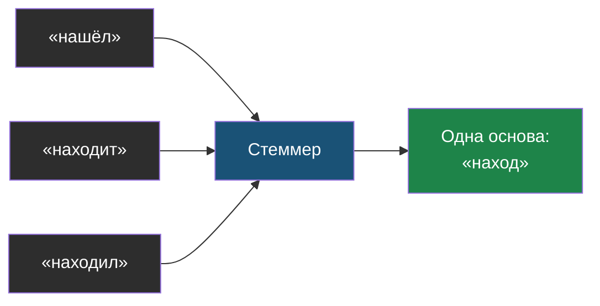

---

**Чанк (chunk), нарезка (chunking)** — фрагмент документа как единица индексации и поиска; стратегии: фиксированная, рекурсивная, по заголовкам, семантическая, родитель–потомок. Глава 1.

```mermaid
flowchart LR
    DOC["Документ:\nдлинный текст"] --> SPLIT["Нарезка\n(рекурсивная, 500/50)"]
    SPLIT --> C1["Чанк 1"]
    SPLIT --> C2["Чанк 2"]
    SPLIT --> C3["Чанк 3"]
    style DOC fill:#2d2d2d,color:#fff
    style SPLIT fill:#1a5276,color:#fff
    style C1 fill:#7d6608,color:#fff
    style C2 fill:#7d6608,color:#fff
    style C3 fill:#7d6608,color:#fff
```

---

**Эмбеддинг (embedding)** — вектор фиксированной размерности, представляющий смысл текста; для русского — text-embedding-3, bge-m3, USER-bge-m3, multilingual-e5 (с префиксами), FRIDA (с префиксами). Глава 1.

```mermaid
flowchart LR
    T["Текст: «порт Ollama»"] --> M["Модель эмбеддингов"]
    M --> V["Вектор: [0.02, -0.14, …]\nфиксированная длина"]
    V --> SIM["Похожие по смыслу тексты →\nблизкие векторы"]
    style T fill:#2d2d2d,color:#fff
    style M fill:#1a5276,color:#fff
    style V fill:#7d6608,color:#fff
    style SIM fill:#1e8449,color:#fff
```
