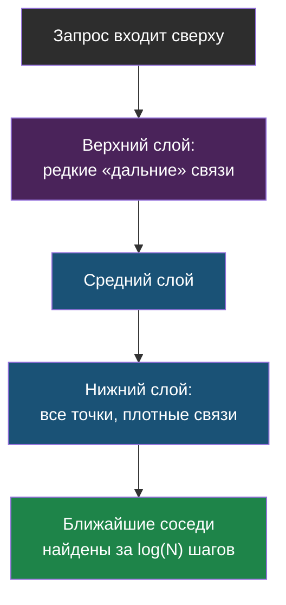
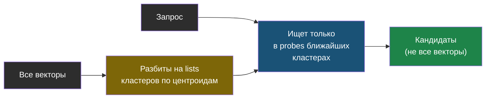
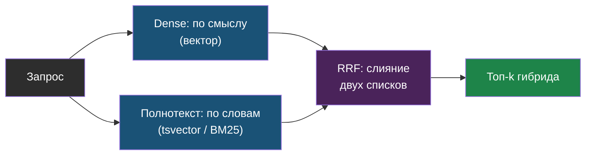
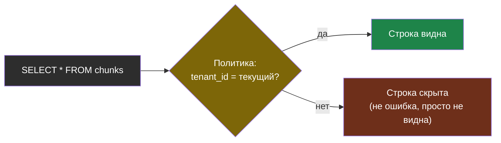
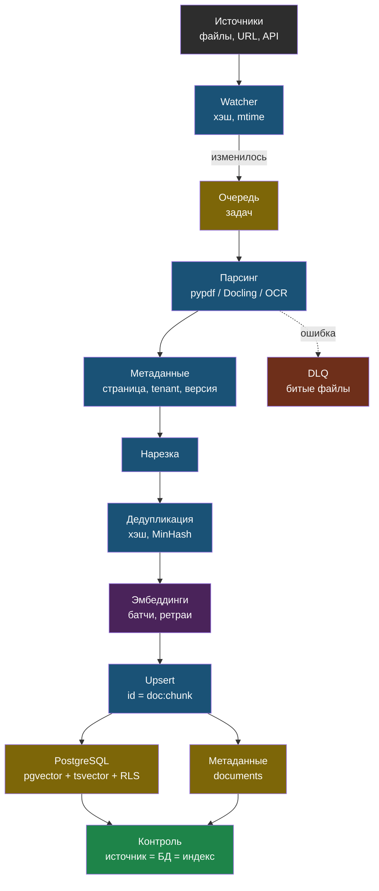

# День 3. Векторные хранилища и пайплайн индексации: суть

## Зачем это на собеседовании

«Почему Chroma, а не pgvector?», «Что будет с вашим поиском на миллионе документов?», «Как вы переиндексируете, если документ изменился?», «Как гарантируете, что клиент А не увидит документы клиента Б?» — на этих вопросах RAG-разработчик без инфраструктурного опыта обычно начинает путаться, потому что для него база данных — это чёрный ящик, который «просто хранит векторы». У тебя есть то, чего у большинства кандидатов нет: годы практики с PostgreSQL, Docker и nginx. Сегодня к этому добавляется словарь векторных индексов и понимание, где заканчивается простое «положил в Chroma» и начинается настоящая инженерия хранения данных. Это день, в котором твоя DevOps-база превращается в конкретное конкурентное преимущество на собеседовании.

## Индекс — торг между recall и латентностью

Самый честный способ найти ближайшие векторы — это точный перебор: сравнить вектор запроса с каждым вектором в базе по очереди и выбрать самые близкие. Проблема в том, что время такого перебора растёт линейно с числом векторов: для тысяч это миллисекунды, никакой хитрости не нужно; для миллионов — уже секунды на каждый запрос, и это неприемлемо для живого поиска. Поэтому и придумали **приближённый поиск** (ANN, approximate nearest neighbours): вместо гарантированно точного ответа он отдаёт почти те же самые ближайшие соседи, но в разы быстрее — просто иногда пропускает настоящего ближайшего соседа ради скорости. Долю действительно найденных настоящих соседей называют **recall индекса** — и это не то же самое, что recall поиска по golden-набору из дня 2: там мерился весь пайплайн целиком, здесь — конкретно точность индексной структуры.

> **HNSW** (hierarchical navigable small world) — граф, где каждый вектор связан с ближайшими, а верхние «этажи» графа разрежены и служат для быстрого спуска к нужной области. Параметры: `m` — число связей на узел (больше — точнее и больше памяти, обычно 16); `ef_construction` — ширина поиска при построении (больше — качественнее граф, дольше строится, обычно 64–200); `ef_search` — ширина поиска при запросе (больше — выше recall, медленнее; подкручивается без перестроения). Индекс живёт в памяти, строится минуты-часы на миллионах, обновляется инкрементально.

Идея HNSW похожа на то, как выглядит поиск нужной страницы в бумажной книге через оглавление с несколькими уровнями: сначала смотришь на разделы (верхний, редкий слой связей, чтобы быстро попасть в нужную примерную область), потом на подразделы (средний слой), и только внизу читаешь конкретные страницы подряд (нижний слой, где связаны уже все точки). Именно поэтому поиск занимает не линейное время от размера всей книги, а логарифмическое — примерно как бинарный поиск в отсортированном массиве, только устроенный сложнее из-за многомерности векторов.



> **IVFFlat** (inverted file, flat) — векторы кластеризуются на `lists` центроидов; при запросе смотрим только `probes` ближайших кластеров. Строится быстро, памяти меньше, но recall ниже, и индекс нужно строить по уже наполненной таблице — центроиды считаются по данным. Правило pgvector: `lists ≈ rows / 1000` до миллиона строк, `probes ≈ sqrt(lists)`.

Идея IVFFlat проще, чем HNSW, и её легко представить через аналогию с сортировкой посылок на почте: все векторы заранее группируются в кучки — кластеры — вокруг нескольких «центров» (центроидов), примерно как посылки раскладывают по районам города. При поиске не нужно проверять все районы — достаточно заглянуть в несколько ближайших к запросу (`probes`) и искать подробно только среди них.



Отдельная тема — как экономить память на самих векторах, если их очень много. **Квантизация** — это способ хранить каждое число вектора не в полной точности, а более грубо, жертвуя немного точностью ради заметной экономии места: `halfvec` (числа половинной точности, 16 бит вместо обычных 32) экономит память примерно в два раза почти без потери качества; int8 (целые числа в один байт) — уже в четыре раза; бинарная квантизация (каждое число сжимается всего до одного бита) экономит в 32 раза, но с заметной потерей точности, которую потом обычно компенсируют, дополнительно перепроверяя короткий список кандидатов уже полными, неквантованными векторами. В pgvector `halfvec` заодно снимает и техническое ограничение в 2000 измерений, которое есть у обычного индекса.

Отдельно стоит запомнить одну классическую ловушку, в которую попадают почти все, кто строит поиск с фильтрами впервые. **Фильтрация и индекс** — индекс сначала отдаёт top-k результатов просто по расстоянию, ничего не зная о фильтрах, и только потом к этим результатам применяется фильтр вроде `WHERE tenant_id = 5`. Если из десяти найденных индексом векторов фильтру удовлетворяют только два — на выходе будет два результата, а не запрошенные в `LIMIT` пять, даже если подходящих записей в базе на самом деле полно, просто индекс до них не добрался. Способы обхода этой ловушки: индекс, который умеет учитывать фильтр прямо во время поиска (так делает Qdrant), разбиение данных на партиции по значению фильтра, или **итеративный скан** — начиная с версии pgvector 0.8 индекс умеет продолжать обход графа, пока не наберёт нужное число подходящих строк (`hnsw.iterative_scan = relaxed_order`, с потолком `hnsw.max_scan_tuples`, чтобы не уйти в бесконечный обход). Знание про эту ловушку — верный признак человека, который уже реально ловил на проде пустые ответы поиска там, где данные точно были.

## Хранилища: критерии, а не мода

| Хранилище | Сильные стороны | Границы | Когда |
|---|---|---|---|
| **ChromaDB** | Простота, встраиваемый и серверный режимы, коллекции; переписан на Rust в 1.x | Один узел, HNSW в памяти, слабая авторизация, нет RLS и транзакций с остальными данными; multi-tenancy — коллекциями | Прототипы, малые проды до сотен тысяч чанков; то, что стоит в web-agent |
| **pgvector** | Векторы рядом с данными в PostgreSQL: транзакции, бэкапы, права, RLS, tsvector для гибрида, знакомая эксплуатация | Один узел на запись, HNSW строится долго на десятках миллионов, память под индекс | Команда уже живёт на Postgres; до нескольких миллионов векторов; требования к консистентности и доступу |
| **Qdrant** | Rust, фильтруемый HNSW, payload-индексы, sparse-векторы для гибрида, квантизация, multi-tenancy через tenant-ключ в payload, снапшоты | Отдельная система: свои бэкапы, мониторинг, права; консистентность с основной БД — на тебе | Десятки миллионов векторов, сложные фильтры, гибрид «из коробки», отдельный сервис поиска |
| **Milvus / Weaviate** | Распределённые, горизонтальное масштабирование, много типов индексов (GPU в Milvus) | Тяжёлая эксплуатация: несколько компонентов, etcd, object storage | Сотни миллионов векторов, отдельная команда платформы |
| **Elasticsearch / OpenSearch** | kNN рядом с зрелым полнотекстовым поиском, агрегации, привычный стек логов | Ресурсоёмкость, лицензии, ANN уступает специализированным | Уже есть Elastic для поиска и логов; гибрид нужен «вчера» |
| **Redis, SQLite-vec, FAISS** | Скорость в памяти, встраиваемость (FAISS — библиотека, не БД) | Нет персистентности или нет сервера | Кэш, edge, эксперименты |

Как выбирать, а не гадать по моде: смотри по порядку — **где уже живут данные и права доступа** (если это уже Postgres — pgvector становится первым естественным кандидатом, а не одним из вариантов), объём и ожидаемый рост (тысячи, миллионы или сотни миллионов векторов), насколько сложные нужны фильтры и требования по multi-tenancy, нужен ли гибридный поиск «из коробки» без ручной сборки, и, наконец, кто вообще будет это эксплуатировать и делать бэкапы. Российский контекст: все перечисленные варианты — open source и ставятся у себя (on-prem); managed-облака за рубежом либо недоступны, либо нежелательны из-за 152-ФЗ (закон о персональных данных), а российские облака обычно дают managed PostgreSQL с уже включённым pgvector и managed OpenSearch — актуальные варианты стоит проверять отдельно, они меняются.

## pgvector: векторы как обычная колонка

Главная концептуальная разница между Chroma и pgvector в том, что во втором случае вектор — это просто ещё один тип колонки в обычной таблице PostgreSQL, рядом с текстом и числами, а не отдельная специализированная система:

```sql
CREATE EXTENSION IF NOT EXISTS vector;

CREATE TABLE chunks (
    id          text PRIMARY KEY,
    tenant_id   int  NOT NULL,
    filename    text NOT NULL,
    chunk_index int  NOT NULL,
    text        text NOT NULL,
    embedding   vector(1536),
    tsv         tsvector GENERATED ALWAYS AS (to_tsvector('russian', text)) STORED
);

CREATE INDEX chunks_embedding_hnsw ON chunks USING hnsw (embedding vector_cosine_ops) WITH (m = 16, ef_construction = 64);
CREATE INDEX chunks_tsv_gin ON chunks USING gin (tsv);

-- ближайшие по косинусу: оператор <=> возвращает расстояние, 1 - расстояние = сходство
SELECT id, filename, 1 - (embedding <=> $1) AS score
FROM chunks
WHERE tenant_id = $2
ORDER BY embedding <=> $1
LIMIT 5;
```

У pgvector есть три оператора расстояния между векторами: `<=>` (косинусное расстояние), `<->` (евклидово) и `<#>` (отрицательное скалярное произведение) — и класс операторов у индекса обязательно должен совпадать с тем оператором, который используется в запросе (для `<=>` нужен `vector_cosine_ops`, как в примере выше), иначе индекс просто не будет использован. Команда `SET hnsw.ef_search = 100` поднимает точность поиска (recall) для конкретного запроса ценой скорости. На маленькой таблице планировщик PostgreSQL сам предпочтёт обычный последовательный перебор строк вместо индекса — это ожидаемое поведение, не баг: индекс реально начинает выигрывать только на достаточно большом объёме данных; чтобы продемонстрировать работу индекса на маленькой тестовой таблице, его включают принудительно командой `SET enable_seqscan = off`.

**Гибрид в одном SQL**: можно посчитать `tsv @@ plainto_tsquery('russian', $q)` с `ts_rank_cd` для полнотекстовой части запроса, вектор — для смысловой части, и слить оба результата через RRF (день 2) прямо в одном SQL-запросе через CTE (временную именованную подзапрос-таблицу). Стоит сделать честную оговорку: встроенное ранжирование PostgreSQL — это не настоящий BM25, а более простая взвешенная частота слов с нормализацией; полноценный BM25 дают отдельные расширения вроде ParadeDB `pg_search`. Для большинства реальных корпусов разница на практике не решающая, но на собеседовании стоит называть вещи их точными именами, а не путать одно с другим. Сам принцип слияния при этом одинаков независимо от конкретного движка:



> **Изоляция tenant через RLS**: политика `USING (tenant_id = current_setting('app.tenant_id')::int)` и роль приложения без права обхода — забытый `WHERE` в коде больше не приводит к утечке, потому что фильтр живёт в базе. Это ответ уровня senior на вопрос про multi-tenancy, и он естественен для человека с твоей базой.

Смысл RLS (row-level security, безопасность на уровне строк) в том, что фильтр по tenant больше не зависит от того, не забыл ли программист написать `WHERE` в конкретном запросе — база данных сама, на уровне политики безопасности, прячет чужие строки от роли приложения, даже если запрос попросил вообще всё:



## Пайплайн индексации — это ETL

Индексация — это не разовое действие «загрузил файлы», а постоянно работающий поток данных, у которого есть состояние, ошибки и повторы, совсем как классический ETL (extract-transform-load) в data-инженерии:

1. **Извлечение текста**. Для обычных цифровых PDF — `pypdf` (лёгкая библиотека, как в web-agent) или `PyMuPDF` (быстрее и точнее сохраняет порядок текста). Когда важны таблицы и общая структура документа — **Docling** (библиотека от IBM, лицензия Apache 2.0): она восстанавливает раскладку страницы, правильный порядок чтения, превращает таблицы в Markdown или JSON без необходимости в мощном GPU; `unstructured` даёт типизированные элементы документа и готовые коннекторы к источникам, но продвинутые возможности там смещаются в платный облачный API; `pdfplumber` — когда единственная задача — вытащить таблицы. Для сканов нужен OCR (распознавание текста по картинке): Tesseract или PaddleOCR — для русского языка качество стоит проверять на своих реальных документах, а не доверять общим отзывам. Решение, принятое в web-agent — использовать лёгкие парсеры вместо тяжёлого `unstructured` после того, как тот переполнил диск своими зависимостями — правильное именно для его класса задач, и это хорошая история про осознанный компромисс для собеседования.
2. **Нормализация и метаданные**: заголовки, номера страниц, даты, тип документа, tenant, версия, источник (файл или URL) — всё, что потом пойдёт в фильтры поиска и в цитаты источников.
3. **Нарезка** — это уже разобрано в дне 2.
4. **Дедупликация**: точные дубли ловятся по хэшу нормализованного текста чанка; почти-дубли (например, одни и те же абзацы, повторяющиеся в десяти разных версиях одного и того же регламента) — через MinHash (алгоритм приближённого сравнения похожести множеств) или порог косинусного сходства между векторами. Дубли вредны не только тем, что тратят место в базе — они ещё и способны занять сразу несколько мест из пяти в топ-k результатов одним и тем же текстом, вытеснив действительно разные и полезные фрагменты.
5. **Эмбеддинги считаются батчами** (пачками, а не по одному) с ретраями при сетевых сбоях и с ограничением на число параллельных запросов; стоимость и время индексации при этом стоит фиксировать как метрики, а не забывать про них.
6. **Запись с идемпотентностью** (идемпотентная операция — та, которую можно повторить много раз с одним и тем же результатом, без побочных эффектов от повтора): детерминированные (предсказуемые, вычисляемые по формуле, а не случайные) id вида `doc_id:chunk_index`, upsert (вставка или обновление, если запись с таким id уже есть) вместо простой вставки, удаление старых чанков документа перед записью новых версий — именно так работает `reindex` в web-agent. Удаление документа при этом обязано удалять и все его чанки целиком — это не только логично, но и прямое требование права на удаление персональных данных (152-ФЗ, GDPR): векторы тоже считаются персональными данными, если по ним можно восстановить исходный текст.
7. **Инкрементальность**: переиндексировать нужно только то, что реально изменилось — по хэшу содержимого и времени последнего изменения файла, а не по расписанию «пересчитать всё заново». Для этого нужна очередь задач и DLQ (dead letter queue, «очередь для писем, которые не удалось доставить») для файлов, которые не удалось обработать, с повтором через растущую паузу (день 1, exponential backoff).
8. **Наблюдаемость**: сколько документов и чанков приходится на каждый tenant, какая доля файлов не спарсилась, сколько времени и денег занимает индексация, и — что особенно важно — не разошлись ли между собой источник, база метаданных и векторный индекс. Именно этот последний вид контроля, если бы он уже был настроен, поймал бы реальный инцидент миграции web-agent на сутки раньше, чем его нашли вручную.

> **Смена модели эмбеддингов** — это полная переиндексация с двойной записью: новая коллекция или колонка заполняется параллельно, переключение атомарное, старая удаляется после проверки на golden-наборе.

## Multi-tenancy: четыре модели

| Модель | Как | Плюсы | Минусы |
|---|---|---|---|
| Коллекция на tenant | Chroma `documents_{site_id}` — как в web-agent | Утечка невозможна без явной ошибки в имени | Тысячи коллекций — накладные расходы; общие операции сложнее |
| Ключ tenant + фильтр | Qdrant payload с tenant-индексом; pgvector `WHERE tenant_id` | Одна коллекция, простые операции | Забытый фильтр = утечка; нужна дисциплина или RLS |
| RLS в Postgres | Политика на таблице, фильтр применяет база | Защита на уровне БД, аудит | Только Postgres; настройка ролей и `current_setting` |
| Схема или БД на tenant | Отдельная схема/база | Полная изоляция, простые бэкапы клиента | Дорого при сотнях клиентов, миграции умножаются |

Выбор конкретной модели зависит от числа клиентов (tenant) и требований к безопасности: для десятков клиентов разумны отдельная коллекция на каждого или RLS; для тысяч клиентов практичнее общий ключ с индексом, но тогда обязателен фильтр на уровне API и отдельные тесты именно на утечку данных между клиентами, а не только на функциональность.

## Схема



## Что у тебя уже есть

- **Хранилище**: ChromaDB в Docker, серверный режим (`HttpClient`), коллекция на tenant, метаданные `doc_id / filename / chunk_index` — это **collection-per-tenant isolation** и **deterministic chunk ids**.
- **Пайплайн**: `doc-parser` как отдельный сервис — watcher по файлам и краулер по sitemap, лёгкие парсеры, `reindex` с удалением старых чанков, параметры из единого источника (Settings) — это **ingestion service**, **idempotent reindex**, **single source of configuration**.
- **Эксплуатация**: Docker Compose, Ansible-плейбук установки, rolling update, бэкапы LXC перед релизом, self-test round-trip в CI — **LLMOps** в чистом виде, и слово это надо произносить.
- **Пробелы**: нет контроля расхождения между Postgres и Chroma (инцидент миграции), нет дедупликации, нет метрик индексации, RLS отсутствует по определению (Chroma), полнотекстовый поиск невозможен в текущем хранилище. Всё это закрывает pgvector — и сегодня ты соберёшь доказательство.

## Практика

1. Посчитай, сколько чанков и документов сейчас у каждого tenant в проде web-agent (`collection.count()` по коллекциям) и оцени, на какой объём это вырастет за год. Сопоставь с границами Chroma и pgvector из таблицы.
2. Найди в `services/doc-parser/app/watcher.py`, как определяется «документ изменился», и запиши, есть ли хэш содержимого или только имя и время файла.

## Что проверить

- Объясняю HNSW и IVFFlat на пальцах и называю параметры, которые крутят recall и латентность без перестроения индекса.
- Знаю ловушку фильтра после индекса и два-три способа её обойти, включая итеративный скан pgvector.
- Сравниваю Chroma, pgvector и Qdrant по пяти критериям и говорю, при каком объёме и требованиях менять одно на другое.
- Пишу по памяти таблицу pgvector с векторной колонкой, HNSW-индексом и tsvector, и запрос ближайших с фильтром по tenant.
- Перечисляю восемь этапов пайплайна индексации и для трёх из них — что ломается в проде.
- Называю четыре модели multi-tenancy и объясняю, какая в web-agent и почему, и какую даёт Postgres.
- Знаю, что смена модели эмбеддингов — это двойная запись и атомарное переключение, а удаление документа — удаление всех его векторов.
