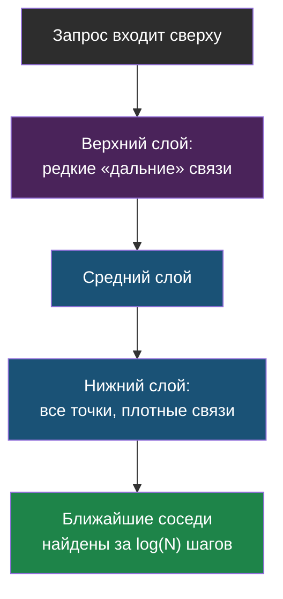
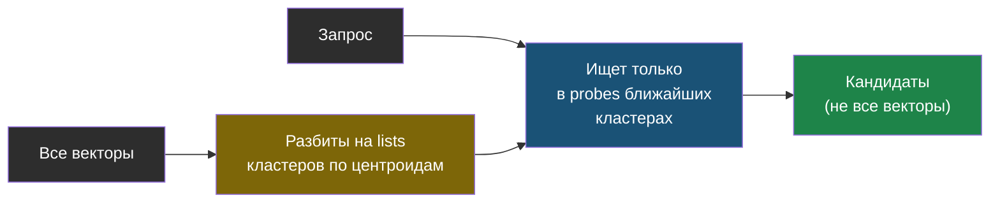
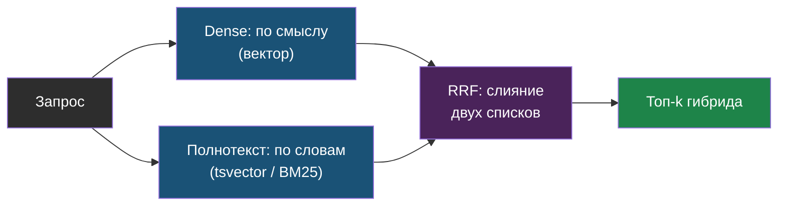
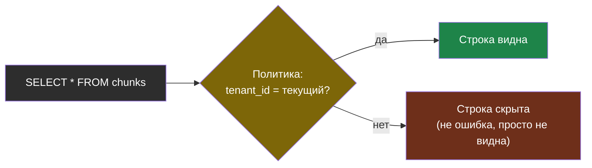
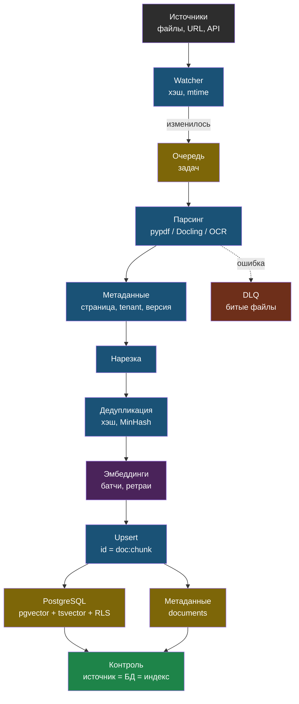

# День 3. Векторные хранилища и пайплайн индексации: суть

## Зачем это на собеседовании

«Почему Chroma, а не pgvector?», «Что будет с вашим поиском на миллионе документов?», «Как вы переиндексируете, если документ изменился?», «Как гарантируете, что клиент А не увидит документы клиента Б?» — вопросы, на которых RAG-разработчик без инфраструктурного опыта начинает путаться. У тебя этот опыт есть: ты годами работаешь с PostgreSQL, Docker и nginx. Сегодня к нему добавляется словарь векторных индексов и понимание, где заканчивается «положил в Chroma» и начинается инженерия хранения. Это день, где твоя DevOps-база превращается в конкурентное преимущество.

## Индекс — торг между recall и латентностью

Точный поиск ближайших соседей — сравнить запрос с каждым вектором — линеен по размеру корпуса. Для тысяч векторов это миллисекунды и никакого индекса не нужно; для миллионов — секунды, и появляется **приближённый поиск** (ANN, approximate nearest neighbours), который отдаёт почти те же соседи в разы быстрее, но иногда пропускает настоящего ближайшего. Доля найденных настоящих соседей — **recall индекса**; его меряют отдельно от recall поиска по golden-набору.

> **HNSW** (hierarchical navigable small world) — граф, где каждый вектор связан с ближайшими, а верхние «этажи» графа разрежены и служат для быстрого спуска к нужной области. Параметры: `m` — число связей на узел (больше — точнее и больше памяти, обычно 16); `ef_construction` — ширина поиска при построении (больше — качественнее граф, дольше строится, обычно 64–200); `ef_search` — ширина поиска при запросе (больше — выше recall, медленнее; подкручивается без перестроения). Индекс живёт в памяти, строится минуты-часы на миллионах, обновляется инкрементально.



> **IVFFlat** (inverted file, flat) — векторы кластеризуются на `lists` центроидов; при запросе смотрим только `probes` ближайших кластеров. Строится быстро, памяти меньше, но recall ниже, и индекс нужно строить по уже наполненной таблице — центроиды считаются по данным. Правило pgvector: `lists ≈ rows / 1000` до миллиона строк, `probes ≈ sqrt(lists)`.



**Квантизация** уменьшает память: `halfvec` (16-битные числа) — в два раза без заметной потери; int8 — в четыре; бинарная — в 32 раза с потерей, которую компенсируют переранжированием точными векторами. В pgvector `halfvec` также снимает ограничение в 2000 измерений для индекса.

**Фильтрация и индекс** — классическая ловушка. Индекс отдаёт top-k по расстоянию, потом применяется фильтр `WHERE tenant_id = 5`, и из десяти найденных остаётся два — меньше, чем просил `LIMIT`. Решения: индекс с фильтром внутри (Qdrant так делает), партиционирование по фильтру, **итеративный скан** — pgvector 0.8 умеет продолжать обход индекса, пока не наберёт нужное число строк (`hnsw.iterative_scan = relaxed_order`, потолок `hnsw.max_scan_tuples`). Знать про это — признак человека, который ловил пустые ответы на проде.

## Хранилища: критерии, а не мода

| Хранилище | Сильные стороны | Границы | Когда |
|---|---|---|---|
| **ChromaDB** | Простота, встраиваемый и серверный режимы, коллекции; переписан на Rust в 1.x | Один узел, HNSW в памяти, слабая авторизация, нет RLS и транзакций с остальными данными; multi-tenancy — коллекциями | Прототипы, малые проды до сотен тысяч чанков; то, что стоит в web-agent |
| **pgvector** | Векторы рядом с данными в PostgreSQL: транзакции, бэкапы, права, RLS, tsvector для гибрида, знакомая эксплуатация | Один узел на запись, HNSW строится долго на десятках миллионов, память под индекс | Команда уже живёт на Postgres; до нескольких миллионов векторов; требования к консистентности и доступу |
| **Qdrant** | Rust, фильтруемый HNSW, payload-индексы, sparse-векторы для гибрида, квантизация, multi-tenancy через tenant-ключ в payload, снапшоты | Отдельная система: свои бэкапы, мониторинг, права; консистентность с основной БД — на тебе | Десятки миллионов векторов, сложные фильтры, гибрид «из коробки», отдельный сервис поиска |
| **Milvus / Weaviate** | Распределённые, горизонтальное масштабирование, много типов индексов (GPU в Milvus) | Тяжёлая эксплуатация: несколько компонентов, etcd, object storage | Сотни миллионов векторов, отдельная команда платформы |
| **Elasticsearch / OpenSearch** | kNN рядом с зрелым полнотекстовым поиском, агрегации, привычный стек логов | Ресурсоёмкость, лицензии, ANN уступает специализированным | Уже есть Elastic для поиска и логов; гибрид нужен «вчера» |
| **Redis, SQLite-vec, FAISS** | Скорость в памяти, встраиваемость (FAISS — библиотека, не БД) | Нет персистентности или нет сервера | Кэш, edge, эксперименты |

Критерии выбора по порядку: **где уже живут данные и права** (если в Postgres — pgvector первым кандидатом), объём и рост (тысячи, миллионы, сотни миллионов), сложность фильтров и требования multi-tenancy, нужен ли гибрид «из коробки», кто это эксплуатирует и бэкапит. Российский контекст: все перечисленные — open source и ставятся on-prem; managed-облака за рубежом недоступны или нежелательны по 152-ФЗ, российские облака дают managed PostgreSQL с pgvector и managed OpenSearch — проверяй актуальные каталоги.

## pgvector: векторы как обычная колонка

```sql
CREATE EXTENSION IF NOT EXISTS vector;

CREATE TABLE chunks (
    id          text PRIMARY KEY,
    tenant_id   int  NOT NULL,
    filename    text NOT NULL,
    chunk_index int  NOT NULL,
    text        text NOT NULL,
    embedding   vector(1536),
    tsv         tsvector GENERATED ALWAYS AS (to_tsvector('russian', text)) STORED
);

CREATE INDEX chunks_embedding_hnsw ON chunks USING hnsw (embedding vector_cosine_ops) WITH (m = 16, ef_construction = 64);
CREATE INDEX chunks_tsv_gin ON chunks USING gin (tsv);

-- ближайшие по косинусу: оператор <=> возвращает расстояние, 1 - расстояние = сходство
SELECT id, filename, 1 - (embedding <=> $1) AS score
FROM chunks
WHERE tenant_id = $2
ORDER BY embedding <=> $1
LIMIT 5;
```

Операторы: `<=>` косинусное расстояние, `<->` евклидово, `<#>` отрицательное скалярное произведение; класс операторов индекса должен совпадать с оператором запроса (`vector_cosine_ops` для `<=>`). `SET hnsw.ef_search = 100` поднимает recall на запрос. На маленькой таблице планировщик предпочтёт последовательный скан — это нормально, индекс включится на объёме; для демонстрации его принудительно включают `SET enable_seqscan = off`.

**Гибрид в одном SQL**: `tsv @@ plainto_tsquery('russian', $q)` с `ts_rank_cd` для полнотекстовой части, вектор для плотной, слияние через RRF в CTE. Честная оговорка: встроенное ранжирование Postgres — не BM25, а взвешенная частота с нормализацией; BM25 дают расширения вроде ParadeDB `pg_search`. Для большинства корпусов разница не решающая, но на собеседовании называй вещи своими именами. Тот же принцип слияния — независимо от движка:



> **Изоляция tenant через RLS**: политика `USING (tenant_id = current_setting('app.tenant_id')::int)` и роль приложения без права обхода — забытый `WHERE` в коде больше не приводит к утечке, потому что фильтр живёт в базе. Это ответ уровня senior на вопрос про multi-tenancy, и он естественен для человека с твоей базой.



## Пайплайн индексации — это ETL

Индексация — не «загрузил файлы», а поток с состоянием, ошибками и повторами:

1. **Извлечение текста**. Для цифровых PDF — `pypdf` (как в web-agent, лёгкий) или `PyMuPDF` (быстрее, точнее с порядком текста). Когда важны таблицы и структура — **Docling** (IBM, Apache 2.0): раскладка, порядок чтения, таблицы в Markdown или JSON без тяжёлого GPU; `unstructured` — типизированные элементы и коннекторы, но продвинутое смещается в платный API; `pdfplumber` — когда таблицы и есть весь смысл. Сканы — OCR: Tesseract или PaddleOCR, для русского проверяй качество на своих документах. Решение web-agent — лёгкие парсеры вместо `unstructured` после переполнения диска зависимостями — правильное для его класса задач и хорошая история про trade-off.
2. **Нормализация и метаданные**: заголовки, страницы, даты, тип документа, tenant, версия, источник (файл или URL). Всё, что потом пойдёт в фильтры и цитаты.
3. **Нарезка** — вчера.
4. **Дедупликация**: точная — по хэшу нормализованного текста чанка; почти-дубли (те же абзацы в десяти версиях регламента) — MinHash или порог косинусного сходства. Дубли не только тратят место — они занимают все пять мест в топ-k одним и тем же текстом.
5. **Эмбеддинги батчами** с ретраями и лимитом параллелизма; стоимость и время индексации — метрики.
6. **Запись с идемпотентностью**: детерминированные id (`doc_id:chunk_index`), upsert, удаление старых чанков документа перед записью новых — так делает `reindex` в web-agent. Удаление документа — удаление всех его чанков, и это же требование права на удаление данных (152-ФЗ, GDPR): векторы — тоже персональные данные, если из них восстанавливается текст.
7. **Инкрементальность**: переиндексировать только изменившееся — по хэшу содержимого и времени изменения, а не по расписанию «всё заново». Очередь задач, DLQ для битых файлов, повтор с backoff.
8. **Наблюдаемость**: документов и чанков на tenant, доля ошибок парсинга, время и стоимость индексации, расхождение между источником, БД метаданных и векторным индексом — именно этот последний контроль поймал бы инцидент миграции web-agent на сутки раньше.

> **Смена модели эмбеддингов** — это полная переиндексация с двойной записью: новая коллекция или колонка заполняется параллельно, переключение атомарное, старая удаляется после проверки на golden-наборе.

## Multi-tenancy: четыре модели

| Модель | Как | Плюсы | Минусы |
|---|---|---|---|
| Коллекция на tenant | Chroma `documents_{site_id}` — как в web-agent | Утечка невозможна без явной ошибки в имени | Тысячи коллекций — накладные расходы; общие операции сложнее |
| Ключ tenant + фильтр | Qdrant payload с tenant-индексом; pgvector `WHERE tenant_id` | Одна коллекция, простые операции | Забытый фильтр = утечка; нужна дисциплина или RLS |
| RLS в Postgres | Политика на таблице, фильтр применяет база | Защита на уровне БД, аудит | Только Postgres; настройка ролей и `current_setting` |
| Схема или БД на tenant | Отдельная схема/база | Полная изоляция, простые бэкапы клиента | Дорого при сотнях клиентов, миграции умножаются |

Выбор зависит от числа tenant и требований: для десятков клиентов — коллекция на tenant или RLS; для тысяч — ключ с индексом и обязательным фильтром на уровне API плюс тесты на утечку.

## Схема



## Что у тебя уже есть

- **Хранилище**: ChromaDB в Docker, серверный режим (`HttpClient`), коллекция на tenant, метаданные `doc_id / filename / chunk_index` — это **collection-per-tenant isolation** и **deterministic chunk ids**.
- **Пайплайн**: `doc-parser` как отдельный сервис — watcher по файлам и краулер по sitemap, лёгкие парсеры, `reindex` с удалением старых чанков, параметры из единого источника (Settings) — это **ingestion service**, **idempotent reindex**, **single source of configuration**.
- **Эксплуатация**: Docker Compose, Ansible-плейбук установки, rolling update, бэкапы LXC перед релизом, self-test round-trip в CI — **LLMOps** в чистом виде, и слово это надо произносить.
- **Пробелы**: нет контроля расхождения между Postgres и Chroma (инцидент миграции), нет дедупликации, нет метрик индексации, RLS отсутствует по определению (Chroma), полнотекстовый поиск невозможен в текущем хранилище. Всё это закрывает pgvector — и сегодня ты соберёшь доказательство.

## Практика

1. Посчитай, сколько чанков и документов сейчас у каждого tenant в проде web-agent (`collection.count()` по коллекциям) и оцени, на какой объём это вырастет за год. Сопоставь с границами Chroma и pgvector из таблицы.
2. Найди в `services/doc-parser/app/watcher.py`, как определяется «документ изменился», и запиши, есть ли хэш содержимого или только имя и время файла.

## Что проверить

- Объясняю HNSW и IVFFlat на пальцах и называю параметры, которые крутят recall и латентность без перестроения индекса.
- Знаю ловушку фильтра после индекса и два-три способа её обойти, включая итеративный скан pgvector.
- Сравниваю Chroma, pgvector и Qdrant по пяти критериям и говорю, при каком объёме и требованиях менять одно на другое.
- Пишу по памяти таблицу pgvector с векторной колонкой, HNSW-индексом и tsvector, и запрос ближайших с фильтром по tenant.
- Перечисляю восемь этапов пайплайна индексации и для трёх из них — что ломается в проде.
- Называю четыре модели multi-tenancy и объясняю, какая в web-agent и почему, и какую даёт Postgres.
- Знаю, что смена модели эмбеддингов — это двойная запись и атомарное переключение, а удаление документа — удаление всех его векторов.
