# Глоссарий дня 3

Термины по алфавиту, с английским оригиналом и указанием, где встречаются. К каждому термину — схема-подсказка в палитре курса: серый — вход, синий — процесс, зелёный — результат, коричневый — ошибка/опасность, жёлтый — данные/хранение, фиолетовый — внешнее.

---

**ANN (approximate nearest neighbours)** — приближённый поиск ближайших соседей: быстрее точного перебора ценой пропуска части настоящих соседей; качество измеряется recall индекса. Глава 1.

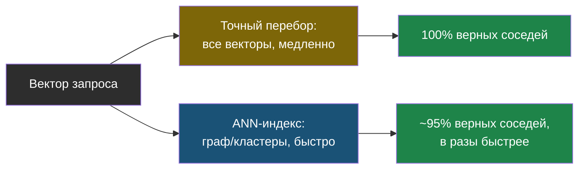

---

**BYPASSRLS** — атрибут роли PostgreSQL, позволяющий обходить политики row-level security; нужен загрузчикам и администраторам, не приложению. Лаба, шаг 3.

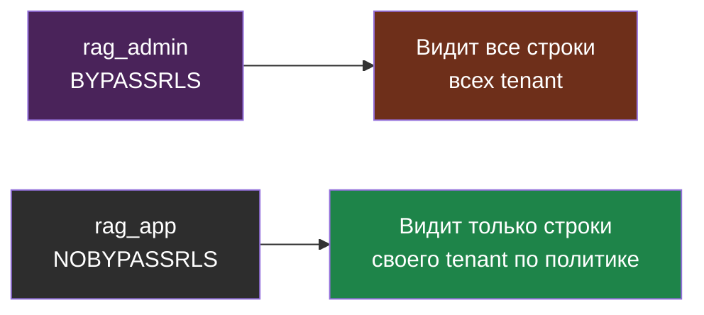

---

**DLQ (dead-letter queue)** — очередь для задач, которые не удалось обработать после повторов (битые файлы, недоступный источник); разбирается отдельно. Главы 1 и 3.

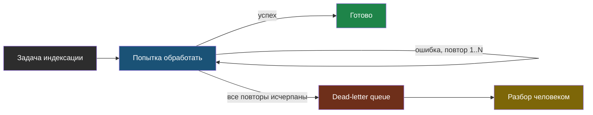

---

**Docling** — открытый инструмент IBM для преобразования документов: раскладка, порядок чтения, таблицы в Markdown или JSON без тяжёлого GPU. Лаба, шаг 8.

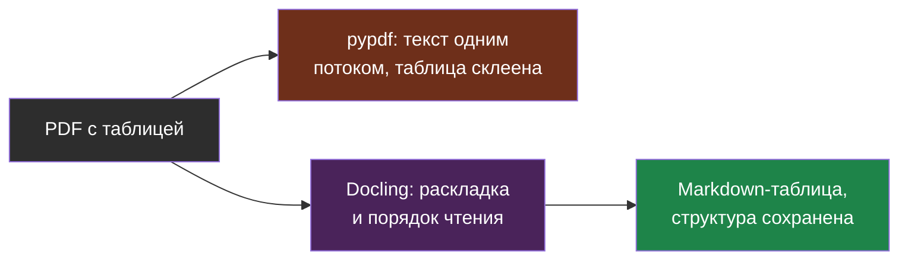

---

**ef_search / ef_construction / m** — параметры HNSW: ширина поиска при запросе (меняет recall без перестроения), ширина поиска при построении, число связей на узел. Глава 1.

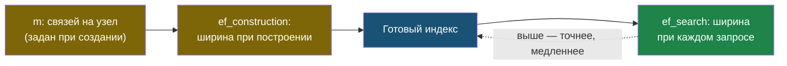

---

**GIN-индекс** — обобщённый инвертированный индекс PostgreSQL; используется для `tsvector` в полнотекстовом поиске. Лаба, шаг 4.

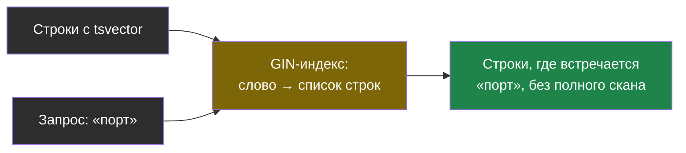

---

**halfvec** — тип pgvector с 16-битными компонентами: вдвое меньше памяти, снимает лимит 2000 измерений для индекса. Глава 1, практика.

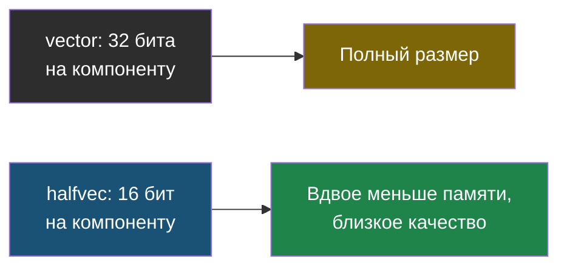

---

**HNSW (hierarchical navigable small world)** — многоуровневый граф ближайших соседей; индекс по умолчанию для векторного поиска в pgvector, Qdrant, Chroma. Глава 1.

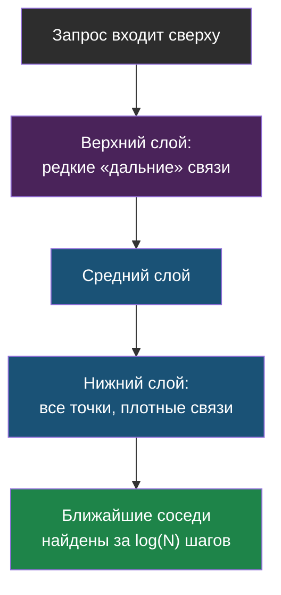

---

**Идемпотентность (idempotency)** — повтор операции даёт тот же результат; в индексации достигается детерминированными id чанков и upsert. Главы 1 и 3.

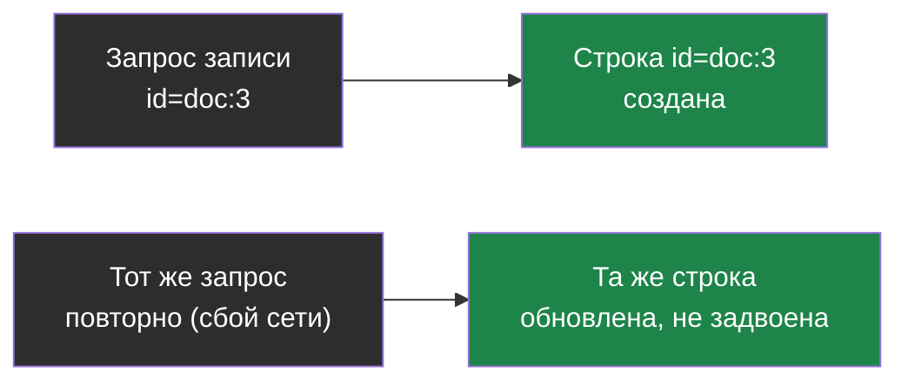

---

**Итеративный скан (iterative index scan)** — режим pgvector 0.8+: обход индекса продолжается, пока после фильтра не наберётся LIMIT строк; `hnsw.iterative_scan = strict_order | relaxed_order`. Глава 1, лаба шаг 4.

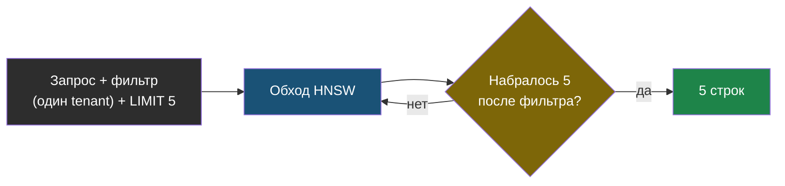

---

**IVFFlat** — индекс на кластерах (центроидах): параметры `lists` и `probes`; быстрее строится, меньше памяти, ниже recall, требует построения по заполненной таблице. Глава 1.

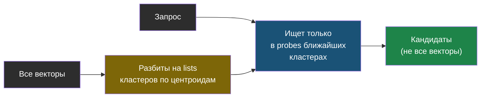

---

**Квантизация (quantization)** — сжатие векторов: half (16 бит), int8, бинарная; экономит память ценой точности, компенсируемой переранжированием. Глава 1.

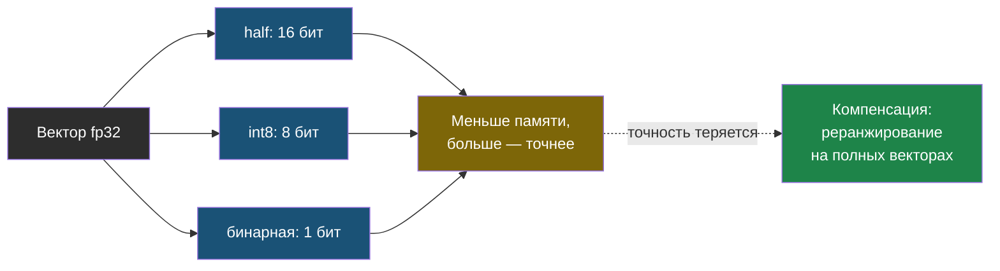

---

**MinHash** — техника поиска почти-дублей текстов через хэширование множеств шинглов; для дедупликации версий документов. Главы 1 и 3.

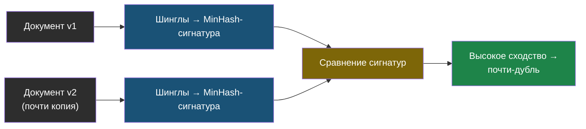

---

**Multi-tenancy** — обслуживание нескольких клиентов одним инстансом с изоляцией данных: коллекция на tenant, ключ + фильтр, RLS, схема или база на tenant. Глава 1.

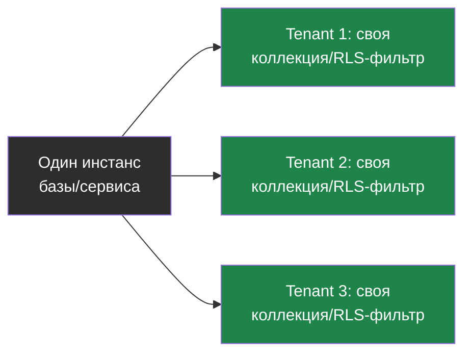

---

**pgvector** — расширение PostgreSQL с типами `vector`, `halfvec`, `sparsevec`, операторами `<=>`, `<->`, `<#>` и индексами HNSW и IVFFlat. Главы 1–3.

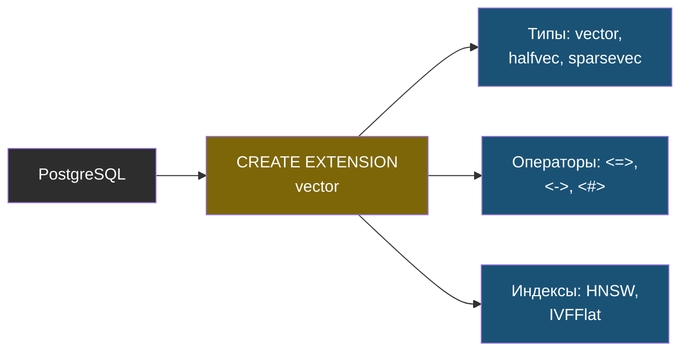

---

**Qdrant** — векторная БД на Rust: фильтруемый HNSW, payload-индексы, sparse-векторы, квантизация, снапшоты, multi-tenancy через tenant-ключ. Глава 1, практика.

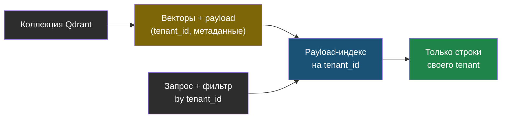

---

**RLS (row-level security)** — политики PostgreSQL, фильтрующие строки на уровне базы; `FORCE ROW LEVEL SECURITY` применяет их и к владельцу. Лаба, шаги 2 и 7.

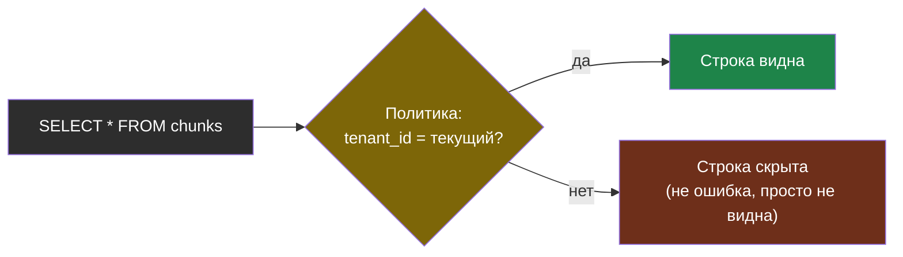

---

**RRF в SQL** — слияние dense- и полнотекстового списков через CTE и `row_number()`; тот же алгоритм, что вчера, но внутри базы. Лаба, шаг 5.

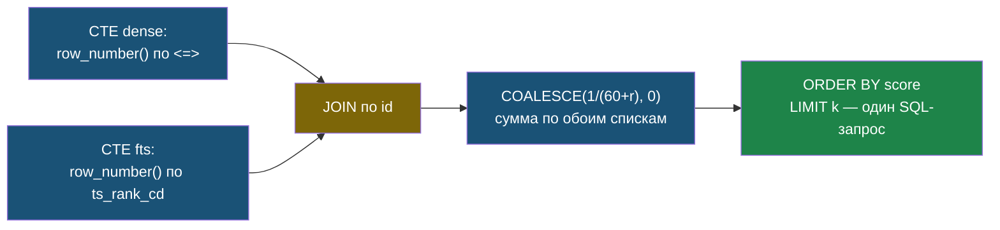

---

**tsvector / tsquery** — типы полнотекстового поиска PostgreSQL; конфигурация `russian` даёт стемминг; `ts_rank_cd` — ранжирование (не BM25). Главы 1–2.

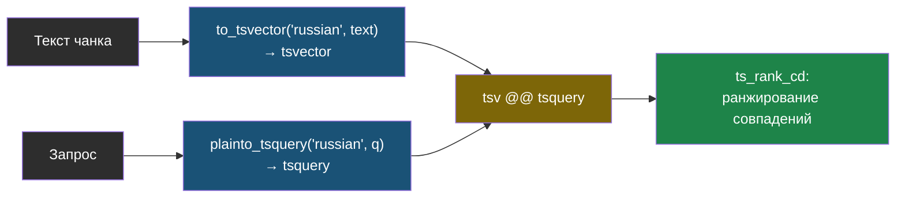

---

**Upsert** — вставка с обновлением при конфликте ключа (`ON CONFLICT ... DO UPDATE`); основа идемпотентной записи чанков. Лаба, шаг 3.

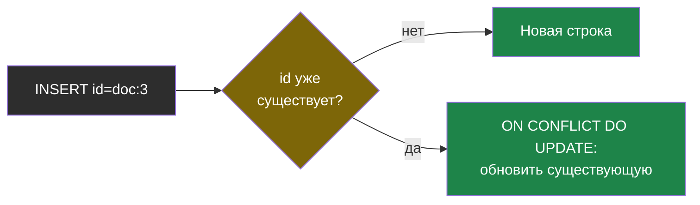

---

**Watcher** — компонент, отслеживающий изменения источника (файлы, sitemap) по времени или хэшу и ставящий задачи индексации; в web-agent — `doc-parser/app/watcher.py`. Глава 1.

```mermaid
flowchart LR
    SRC["Источник: файлы,\nsitemap"] --> W["Watcher: проверяет\nвремя/хэш периодически"]
    W --> CHG{"Изменилось?"}
    CHG -- да --> TASK["Задача индексации\nв очередь"]
    CHG -- нет --> W
    style SRC fill:#2d2d2d,color:#fff
    style W fill:#1a5276,color:#fff
    style CHG fill:#7d6608,color:#fff
    style TASK fill:#1e8449,color:#fff
```
