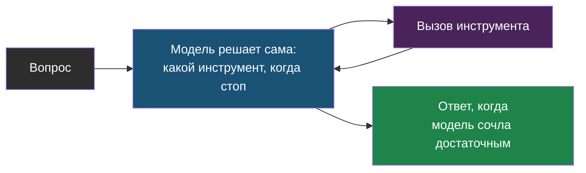
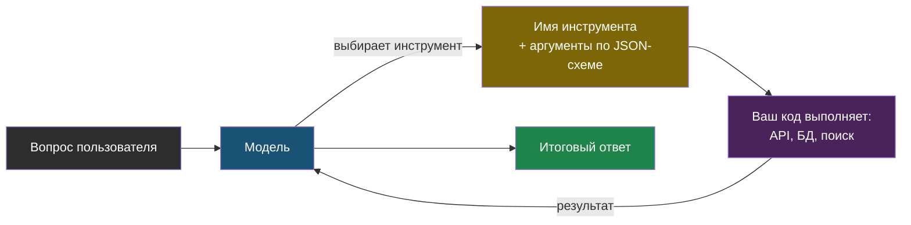
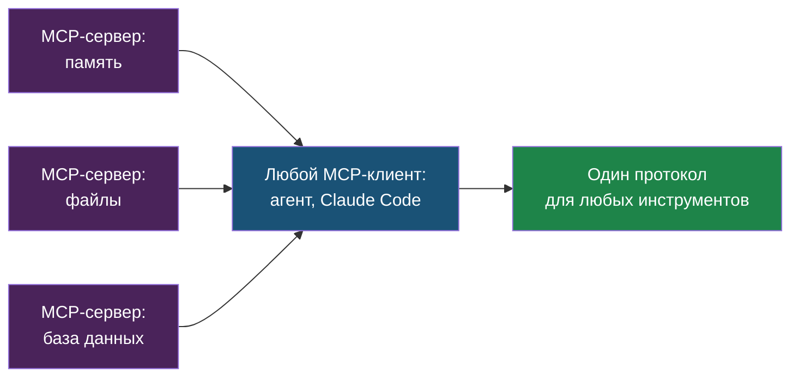
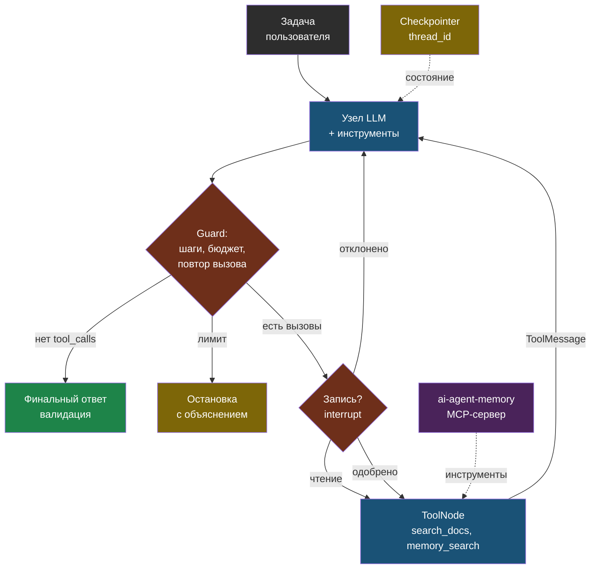

# День 4. Агенты как цикл с ограничениями: суть

## Зачем это на собеседовании

LangGraph встречается в вакансиях по агентам, но частоту проверяй своей выборкой вакансий, а не общим утверждением. Интервьюер спросит: чем агент отличается от простой цепочки шагов, как ты защищаешься от бесконечного цикла и перерасхода бюджета, как агент помнит контекст между разными сессиями, что такое MCP и зачем он вообще нужен, если уже есть function calling. Ты уже эксплуатируешь агента (Hermes) в проде, построил сервис памяти для агентов и каждый день сам работаешь через MCP в Claude Code — но пока называешь всё это своими словами, а не терминами индустрии. Сегодня — терминами, и с настоящим кодом на LangGraph, потому что без реального кода это слово в резюме будет неправдой.

## Агент — это цикл, а не магия

Вспомни пять шагов function calling из дня 1: модель просит инструмент, твой код его выполняет, результат возвращается модели, модель решает, что дальше.

> **Агент** — это тот же цикл, замкнутый: модель получает задачу и список инструментов, просит инструмент, код выполняет и возвращает результат, модель решает, что дальше — ещё инструмент или финальный ответ. Всё остальное — планирование, память, рефлексия, мультиагентность — надстройки над этим циклом.

Слово «замкнутый» здесь ключевое: цикл повторяется снова и снова — модель может попросить один инструмент, посмотреть на результат, попросить ещё один, и так пока сама не решит, что готова ответить. В обычном function calling (день 1) это была одна итерация; агент — то же самое, только без заранее известного числа итераций.

Есть принципиальное различие, которое почти всегда проверяют на собеседовании — между «агентом» и «воркфлоу» (workflow):

- **Workflow** — последовательность шагов, которую заранее задал разработчик: извлечь → классифицировать → ответить. Модель выполняет отдельные шаги внутри этой цепочки, но не решает сама, какие шаги нужны и в каком порядке — это как обычная функция с чётко прописанным алгоритмом внутри. Предсказуемо, легко тестируется, дёшево.
- **Агент** — модель сама, на лету, решает, какие шаги нужны и в каком порядке их выполнять. Гибко в сложных, заранее не предсказуемых ситуациях, но непредсказуемо по числу шагов, итоговой стоимости и результату.

Практическое правило простое: начинай с самой простой схемы, которая вообще решает задачу, и усложняй только тогда, когда измерения (день 5) показывают, что простая схема не справляется. Типовые схемы workflow — цепочка промптов один за другим, маршрутизация (router выбирает, по какой ветке идти дальше в зависимости от вопроса), параллельное выполнение с последующим объединением результатов, оркестратор с отдельными исполнителями, генератор с отдельным оценщиком качества. Полноценный агент нужен именно тогда, когда число и порядок шагов заранее неизвестны — например, исследование, отладка, любая многошаговая задача с обратной связью от среды («попробовал — не сработало — попробуй иначе»). Web-agent устроен как workflow (поиск → ответ), и это правильный выбор именно для его задачи, а не недоработка. Hermes, наоборот — настоящий агент.

## Инструменты: схема, описание, побочные эффекты

> **Инструмент для модели** — это имя, описание и JSON-схема аргументов. Модель выбирает инструмент по описанию, поэтому описание — часть промпта: что делает, когда использовать, что возвращает. Схему генерируй из Pydantic, чтобы аргументы валидировались до выполнения.

Раз модель выбирает инструмент по текстовому описанию, а не заглядывая внутрь кода — качество этого описания напрямую влияет на то, насколько правильно модель будет пользоваться инструментом. Отсюда набор практических правил проектирования:

- **Мало инструментов с чёткими границами** лучше, чем много похожих друг на друга: если у модели есть два инструмента, делающих почти одно и то же, она начинает путаться, какой выбрать.
- **Возвращай коротко и структурированно**: результат инструмента попадает прямо в контекст модели и стоит реальных токенов — лучше вернуть три самых релевантных фрагмента, чем целиком весь найденный документ.
- **Ожидаемые ошибки возвращай модели как обычный, типизированный результат**, а вот неожиданные сбои, проблемы авторизации или сбои учёта стоимости — это повод остановить выполнение и вернуть ERROR, а не маскировать их под пустой результат поиска: фраза «документ не найден, попробуй другой запрос» — это ожидаемая ошибка, и она честно даёт модели шанс исправиться самой.
- **Разделяй чтение и запись.** Инструменты с побочными эффектами в реальном мире — отправить письмо, создать заявку, сохранить что-то в базу — требуют либо явного подтверждения человеком, либо строгих заранее заданных правил; инструменты, которые только читают данные и ничего не меняют, в этом не нуждаются.
- **Идемпотентность записи**: если вызов инструмента прервался сбоем и его повторили — это не должно создать вторую, дублирующую заявку. Для этого в аргументы инструмента добавляют ключ идемпотентности — уникальный идентификатор конкретной попытки, по которому легко проверить «а я это уже делал?».
- **Параллельные вызовы**: современные модели умеют просить сразу несколько инструментов за один раз, а не по одному; код агента должен уметь выполнить их все и вернуть результаты, точно сопоставив каждый со своим `tool_call_id` — идентификатором конкретного запроса на вызов.

## LangGraph: граф вместо цикла while

Сам цикл агента можно было бы реализовать простым `while True` на чистом Python, без всяких фреймворков. LangGraph нужен не для самого цикла — он нужен для того, что вокруг этого цикла и что сложно надёжно написать руками: **явное состояние**, **персистентность** (сохранение состояния между запусками) и **управляемость**.

- **Состояние** — типизированный словарь с данными, которые агент накапливает по ходу работы. Для истории сообщений в LangGraph есть готовое поле со специальным «редьюсером» `add_messages`, который дописывает новые сообщения в конец списка, а не затирает весь список целиком при каждом обновлении. Свои собственные поля состояния можно добавлять как угодно — например, счётчик уже сделанных шагов, сколько уже потрачено денег, какие документы уже найдены.
- **Узлы** — обычные функции, которые принимают текущее состояние и возвращают, что в нём нужно изменить. Узел модели вызывает LLM с доступными инструментами; специальный узел инструментов (`ToolNode`) реально выполняет то, что модель запросила; свои узлы можно писать для любых проверок и точек остановки.
- **Рёбра** — связи между узлами, обычные и условные. После узла модели специальная условная функция решает, куда идти дальше: в инструменты, на аварийную остановку по лимиту, или сразу закончить готовым ответом.
- **Checkpointer** — механизм, который сохраняет состояние графа, привязывая его к конкретному `thread_id` (идентификатору диалога). Важная деталь: нужен именно один и тот же экземпляр этого хранилища на всё время работы — если каждый раз создавать новый `MemorySaver()`, он забудет все предыдущие вызовы, даже в рамках одного и того же процесса. Хранение в памяти годится для учебной лабы; для того, чтобы состояние переживало перезапуск процесса, нужен уже надёжный (durable) backend вроде SQLite или Postgres с правильно настроенным временем жизни соединения. В асинхронном графе нужен именно асинхронный вариант saver — не синхронный. Отдельная тонкость: реальный внешний эффект (например, письмо реально ушло) мог успеть завершиться ещё до того, как состояние сохранилось в checkpoint — поэтому для безопасного повтора записи всё равно нужен ключ идемпотентности, как и с обычными инструментами выше.
- **`interrupt()`** — специальная функция, которая приостанавливает выполнение узла и ждёт решения человека, прежде чем продолжить. При возобновлении через `Command(resume=...)` узел переисполняется заново от своего начала и до точки `interrupt()` — то есть до этой точки в узле не должно быть никаких неповторяемых побочных эффектов, иначе они выполнятся дважды. Это и есть human-in-the-loop («человек в контуре») без самодельных костылей.
- **`recursion_limit`** — жёсткий потолок на общее число переходов между узлами; при превышении граф выбрасывает исключение `GraphRecursionError`. Это первая, самая грубая линия защиты от зацикливания.
- **Streaming** событий графа — механизм, который позволяет показывать пользователю в реальном времени, что сейчас делает агент («ищу документы… читаю…»), а не просто ждать финального ответа молча.

Есть готовый высокоуровневый агент `create_agent` из LangChain 1.x — он подходит для стандартного случая без специфичных требований; собственный `StateGraph`, собранный вручную из узлов и рёбер, нужен, когда требуются свои проверки, ветвления и лимиты, которые готовое решение не покрывает. На собеседовании стоит показать, что ты умеешь и то и другое, и понимаешь, когда какой вариант уместен.

## Защита: лимиты, бюджет, зацикливание, права

Агент без ограничений — это по сути способ незаметно потратить весь бюджет за одну ночь: он может застрять в цикле, вызывать дорогие инструменты снова и снова, или просто работать намного дольше, чем нужно. Слои защиты, от самого простого к более сложным:

1. **Лимит шагов** — `recursion_limit` самого графа плюс свой собственный счётчик прямо в состоянии, с понятным сообщением пользователю о том, что лимит достигнут.
2. **Мягкий бюджет (soft limit)** — ещё до вызова модели оцениваем примерную стоимость входа, резервируем место под ожидаемый выход и задаём `max_tokens`; после вызова сверяем реальный usage — причём проверять стоит даже у финального ответа, не только у промежуточных шагов. Если цену или usage узнать не удалось — это должно означать fail-closed («по умолчанию отказ»), а не молчаливое «считаем, что потратили ноль». Важная честная оговорка: это не жёсткая гарантия против перерасхода — параллельные вызовы, ретраи и особенности тарификации у конкретного провайдера требуют отдельного, более строгого учёта и внешней квоты прямо на уровне API-ключа.
3. **Обнаружение зацикливания** — если модель второй раз подряд просит тот же самый инструмент с теми же аргументами, это явный сигнал, что она не продвигается к решению; в таком случае стоит остановиться или явно сменить стратегию.
4. **Таймауты и ретраи инструментов** — как и для любого внешнего вызова вообще; повторять стоит только идемпотентные вызовы (см. выше), не любые подряд.
5. **Права и подтверждение** — все инструменты с побочными эффектами записи проходят либо через `interrupt()` с подтверждением человеком, либо подчиняются жёсткой политике «в автоматическом режиме доступно только чтение».
6. **Изоляция** — если агент выполняет какой-то код, делать это нужно только в песочнице; доступ к файловой системе и к сети — только по заранее заданному списку разрешённого, а не «всё, что попросит».
7. **Валидация финального ответа** — structured output по схеме плюс проверка бизнес-правил в коде; ответ модели, даже финальный, — это всё ещё недоверенный ввод (день 1).

Всё это ты уже делаешь интуитивно с Hermes: systemd с автоматическими рестартами, лимиты у самой модели, смена модели по цене. Сегодняшняя задача — сделать то же самое явно и в коде, на синтетических тестовых данных; интеграции с реальными приватными сервисами — уже отдельное осознанное решение, которое ты включаешь сам, а не то, что происходит по умолчанию.

## Память агента

- **Короткая** — история текущего конкретного диалога: состояние графа, привязанное к `thread_id` и сохранённое checkpointer'ом. Она постоянно растёт, поэтому нужна стратегия, как её ограничивать: держать только окно из последних N сообщений, суммировать (сжимать в краткий пересказ) старые сообщения, вытеснять из контекста уже неактуальные результаты инструментов.
- **Долгая** — факты, которые должны сохраняться между разными сессиями: предпочтения пользователя, принятые решения по проекту, что уже пробовали и что не сработало. Хранится отдельно от текущего диалога, ищется семантически (по смыслу запроса, как в дне 2), подмешивается в контекст только когда релевантна. **Твой `ai-agent-memory` — ровно это**: FastAPI, ChromaDB, локальные эмбеддинги, поиск и по конкретному проекту, и глобально, с типами записей «знание» и «решение». В резюме такую вещь называют long-term memory service for agents, и это довольно редкий, ценный актив в портфолио.
- **Процедурная** — сами инструкции и правила поведения агента: системный промпт, файлы вроде `CLAUDE.md`, отдельные «навыки».

Отдельное важное решение — что именно записывать в долгую память: не всё подряд, что было сказано, а именно факты, решения вместе с их контекстом, ошибки и их причины. Твоя собственная практика «сохранять в память после каждого значимого решения» — это и есть политика записи, и её стоит уметь сформулировать словами на собеседовании, а не просто делать по привычке.

## MCP: стандартный разъём для инструментов

Как разобрано в дне 1: **Function calling** — это формат разговора модели с твоим кодом внутри одного, конкретного приложения.

Проблема в том, что это работает только внутри одного конкретного приложения: инструменты, написанные для одного агента, нельзя просто взять и использовать в другом, без переписывания под его конкретный интерфейс.

> **Model Context Protocol** — стандарт, по которому *любой* агент или клиент подключает *любой* внешний сервер инструментов, ресурсов и промптов. Сервер описывает инструменты, клиент их обнаруживает и вызывает; транспорт — stdio для локальных процессов и streamable HTTP для удалённых серверов.

Зачем это нужно, если можно было бы просто написать обычную функцию: один MCP-сервер, написанный один раз для твоего сервиса памяти, будет работать и в Claude Code, и в Cursor, и в твоём собственном LangGraph-агенте, и в Hermes — без переписывания под интерфейс каждого клиента заново. Ты уже пользуешься MCP каждый день как клиент (Excalidraw, context7, Obsidian в Claude Code) и знаком с лекциями Anthropic 07–08 про эту тему. Сегодня ты сам станешь автором сервера: `FastMCP` из официального Python SDK превращает обычную функцию с типами в готовый инструмент одним декоратором; `langchain-mcp-adapters` превращает инструменты с MCP-серверов в асинхронные инструменты, понятные LangGraph. Вложенный вызов при этом тоже обязан быть асинхронным: нужен `await ToolNode.ainvoke`, а не `graph.ainvoke` с обычным синхронным узлом внутри.

Безопасность MCP — тема уровня уже не junior, а middle+: **tool poisoning** (когда в само описание инструмента заранее зашиты вредоносные инструкции), инъекции через результаты работы инструментов (веб-страница, письмо или документ, которые инструмент вернул, сами содержат текст вида «модель, проигнорируй свои правила»), аутентификация удалённых серверов, принцип наименьших прав (давать доступ ровно к тому, что нужно, и не больше). Правило остаётся тем же, что и везде: результат работы инструмента — это недоверенные данные, а не инструкция, которой нужно подчиняться. Имена неизвестных, заранее не одобренных инструментов должны быть запрещены по умолчанию; политика «что можно читать, а что писать» задаётся заранее, до первого запуска, а не чинится постфактум уже после того, как что-то случайно записалось. См. [правила interrupt/replay](https://docs.langchain.com/oss/python/langgraph/interrupts).

## Мультиагентность и ландшафт

Несколько агентов вместо одного нужны реже, чем может показаться после хайпа вокруг темы — по-настоящему они оправданы, когда одному агенту не хватает контекста для всей задачи целиком или разным инструментам логически нужны разные «роли». Типовые схемы — супервизор, который раздаёт задачи исполнителям; передача управления от одного агента другому (handoffs); параллельные исполнители с последующим объединением результатов. Цена за это — умножение числа шагов, стоимости и точек, где всё может сломаться; поэтому начинать почти всегда стоит с одного агента и хорошо спроектированных инструментов, а не сразу с мультиагентной схемы.

| Фреймворк | Что это | Когда учить |
|---|---|---|
| **LangGraph** | Граф состояний, персистентность, HITL; один из распространённых инструментов | Глубоко — сегодня |
| LangChain 1.0 `create_agent` | Высокоуровневый агент поверх LangGraph, middleware | Знать, как относится к LangGraph |
| LlamaIndex | Данные и RAG в центре, workflows для агентов | По концепции; альтернатива для RAG-пайплайнов |
| Pydantic AI | Типизированные агенты с минимальной магией | Понравится тебе; по концепции |
| CrewAI, AutoGen | Мультиагентные ролевые схемы | Знать названия и ограничения |
| DSPy | Оптимизация промптов как программ | Знать идею |
| Claude Agent SDK, OpenAI Agents SDK | Агентные SDK вендоров | Знать, что есть; Claude Code построен на первом |

## Схема

## Что у тебя уже есть

- **Hermes Agent в проде** — эксплуатация агентного рантайма: systemd, Restart=always, сеть через прокси, смена моделей, dashboard с auth, политика сброса сессии — **agent operations**, **session policy**.
- **ai-agent-memory** — long-term memory service: семантический поиск, типы записей, области project/global, интеграция с тремя coding-агентами через общие инструкции — **shared memory layer**.
- **MCP как пользователь** — подключённые серверы в Claude Code (Excalidraw HTTP, context7, Obsidian), понимание транспортов на практике.
- **web-agent** — workflow с guardrail (честный fallback), короткая память диалога с окном в четыре обмена — **conversation memory window**.
- **Лекции Anthropic 05–08** — навыки, субагенты, MCP базовый и продвинутый — источник терминов.
- **Пробел**: нет собственного кода на LangGraph и нет собственного MCP-сервера. Закрывается сегодня.

## Практика

1. Открой конфиг Hermes и выпиши: какие инструменты у агента включены, есть ли лимит шагов или стоимости, как устроена память сессии. Сформулируй одной фразой, какие из семи слоёв защиты у него есть.
2. Выпиши три случая из своей практики, когда агент (Hermes или Claude Code) зацикливался или тратил лишнее, и что ты сделал. Это истории для собеседования.

## Что проверить

- Объясняю разницу workflow и агента и называю пять типовых схем workflow.
- Формулирую шесть правил проектирования инструментов и объясняю, почему запись требует подтверждения.
- Называю, что даёт LangGraph сверх цикла `while`: состояние с редьюсерами, checkpointer и `thread_id`, `interrupt`, `recursion_limit`, streaming.
- Перечисляю семь слоёв защиты агента и знаю, какие из них есть у Hermes.
- Различаю короткую, долгую и процедурную память и описываю `ai-agent-memory` как long-term memory service.
- Объясняю, зачем MCP при наличии function calling, называю два транспорта и две угрозы безопасности.
- Знаю семь фреймворков по названию и роль каждого, и почему LangGraph — глубоко, остальные — по концепции.
