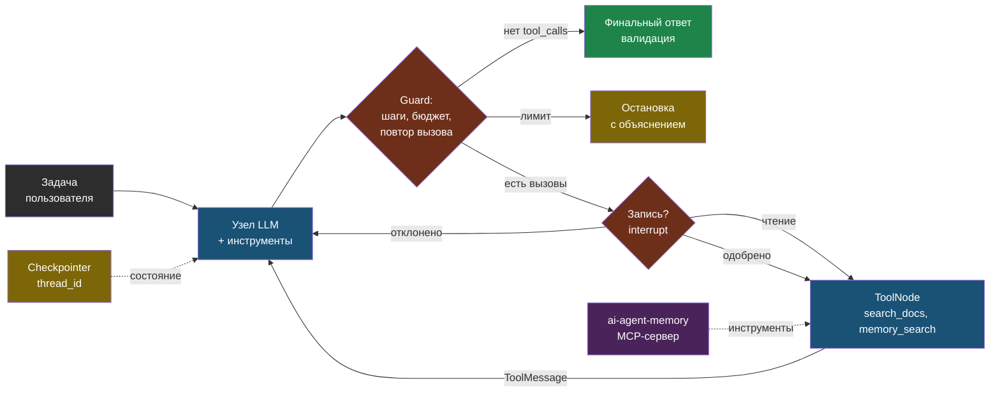

# День 4. Агенты как цикл с ограничениями: суть

## Зачем это на собеседовании

«Разработчик AI-агентов» — так называется заметная доля вакансий, и почти в каждой стоит LangGraph. Интервьюер спросит: чем агент отличается от цепочки, как вы защищаетесь от бесконечного цикла и перерасхода, как агент помнит контекст между сессиями, что такое MCP и зачем он, если есть function calling. Ты эксплуатируешь агента (Hermes) в проде, построил сервис памяти для агентов и ежедневно работаешь через MCP в Claude Code — но пока называешь это своими словами. Сегодня — индустриальными, и с кодом на LangGraph, без которого слово в резюме будет ложью.

## Агент — это цикл, а не магия

Вспомни пять шагов function calling из дня 1. Агент — это тот же цикл, замкнутый: модель получает задачу и список инструментов, просит инструмент, код выполняет и возвращает результат, модель решает, что дальше — ещё инструмент или финальный ответ. Всё остальное — планирование, память, рефлексия, мультиагентность — надстройки над этим циклом.

Принципиальное различие, которое проверяют на собеседовании:

- **Workflow** — последовательность шагов, которую задал разработчик: извлечь → классифицировать → ответить. Модель выполняет шаги, но не выбирает их. Предсказуемо, тестируемо, дёшево.
- **Агент** — модель сама решает, какие шаги и в каком порядке. Гибко, но непредсказуемо по числу шагов, стоимости и результату.

Практическое правило: начинай с самой простой схемы, которая решает задачу, и усложняй только по результатам оценки. Типовые схемы workflow — цепочка промптов, маршрутизация (router выбирает ветку), параллелизация с агрегацией, оркестратор с исполнителями, генератор с оценщиком. Полноценный агент нужен, когда число и порядок шагов заранее неизвестны — исследование, отладка, многошаговые задачи с обратной связью от среды. Web-agent — workflow (поиск → ответ), и это правильно для его задачи. Hermes — агент.

## Инструменты: схема, описание, побочные эффекты

Инструмент для модели — это имя, описание и JSON-схема аргументов. Модель выбирает инструмент по описанию, поэтому описание — часть промпта: что делает, когда использовать, что возвращает. Схему генерируй из Pydantic, чтобы аргументы валидировались до выполнения.

Правила проектирования:

- **Мало инструментов с чёткими границами** лучше многих похожих: модель путается в выборе.
- **Возвращай коротко и структурированно**: результат инструмента идёт в контекст и стоит токенов; три релевантных фрагмента, а не весь документ.
- **Ошибки — текстом модели**, а не исключением наверх: «документ не найден, попробуй другой запрос» даёт модели шанс исправиться.
- **Разделяй чтение и запись.** Инструменты с побочными эффектами — отправить письмо, создать заявку, сохранить в базу — требуют подтверждения человеком или строгих правил; чтение — нет.
- **Идемпотентность записи**: повтор вызова после сбоя не должен создать вторую заявку — ключ идемпотентности в аргументах.
- **Параллельные вызовы**: современные модели просят несколько инструментов за раз; код должен уметь выполнить их и вернуть результаты по `tool_call_id`.

## LangGraph: граф вместо цикла while

Цикл агента можно реализовать на `while True`. LangGraph нужен не для цикла, а для того, что вокруг: **явное состояние**, **персистентность** и **управляемость**.

- **Состояние** — типизированный словарь; для сообщений есть готовое поле с редьюсером `add_messages`, который дописывает новые сообщения, а не заменяет список. Свои поля — счётчик шагов, потраченные деньги, найденные документы.
- **Узлы** — функции, принимающие состояние и возвращающие изменения. Узел модели вызывает LLM с инструментами; узел инструментов (`ToolNode`) выполняет запрошенные вызовы; свои узлы — проверки и остановки.
- **Рёбра** — обычные и условные: после узла модели условная функция решает, идти в инструменты, остановиться по лимиту или закончить ответом.
- **Checkpointer** сохраняет состояние после каждого шага по `thread_id`: диалог продолжается через день, упавший процесс возобновляется с места сбоя, можно посмотреть историю состояний. В памяти для разработки, SQLite или Postgres для прода.
- **`interrupt()`** останавливает граф внутри узла и ждёт решения человека; `Command(resume=...)` продолжает с того же места. Это human-in-the-loop без костылей.
- **`recursion_limit`** — жёсткий потолок числа переходов; при превышении — исключение `GraphRecursionError`. Первая, грубая защита от зацикливания.
- **Streaming** событий графа — для UI, показывающего «ищу документы… читаю…».

Готовый агент одной строкой — `create_react_agent` из `langgraph.prebuilt` или `create_agent` из LangChain 1.0 — подходит для стандартного случая; собственный `StateGraph` нужен для своих проверок, ветвлений и лимитов. На собеседовании покажи, что умеешь и то и другое, и знаешь, когда что.

## Защита: лимиты, бюджет, зацикливание, права

Агент без ограничений — способ потратить бюджет за ночь. Слои защиты, от простого к сложному:

1. **Лимит шагов** — `recursion_limit` графа плюс свой счётчик в состоянии с понятным сообщением пользователю.
2. **Бюджет** — токены и стоимость суммируются из `usage_metadata` каждого ответа модели; при превышении порога агент останавливается и говорит об этом. Цены — из прайса провайдера, как в дне 1.
3. **Обнаружение зацикливания** — тот же инструмент с теми же аргументами второй раз подряд означает, что модель не продвигается; останавливаемся или меняем стратегию.
4. **Таймауты и ретраи инструментов** — как у любого внешнего вызова; повторяем только идемпотентные.
5. **Права и подтверждение** — инструменты записи проходят через `interrupt()` или политику «только чтение в автоматическом режиме».
6. **Изоляция** — выполнение кода только в песочнице, доступ к файлам и сети — по списку разрешённого.
7. **Валидация финального ответа** — structured output по схеме, проверки бизнес-правил; ответ модели — недоверенный ввод.

Всё это ты уже делаешь интуитивно с Hermes (systemd с рестартами, лимиты модели, смена модели по цене). Сегодня — явно и в коде.

## Память агента

- **Короткая** — история текущего диалога: состояние графа под `thread_id`, сохранённое checkpointer'ом. Растёт, поэтому нужна стратегия: окно последних сообщений, суммаризация старого, вытеснение результатов инструментов.
- **Долгая** — факты между сессиями: предпочтения пользователя, решения по проекту, что не сработало. Хранится отдельно, ищется семантически, подмешивается в контекст по релевантности. **Твой `ai-agent-memory` — ровно это**: FastAPI, ChromaDB, локальные эмбеддинги, поиск по проекту и глобально, типы «знание» и «решение». В резюме это называется long-term memory service for agents, и это редкий актив.
- **Процедурная** — инструкции и правила поведения: системный промпт, файлы вроде `CLAUDE.md`, навыки.

Что записывать в долгую память — отдельное решение: не всё подряд, а факты, решения с контекстом, ошибки. Твоя инструкция «сохранять после каждого значимого решения» — политика записи, и её стоит проговорить.

## MCP: стандартный разъём для инструментов

Function calling — это формат разговора модели с твоим кодом внутри одного приложения. **Model Context Protocol** — стандарт, по которому *любой* агент или клиент подключает *любой* внешний сервер инструментов, ресурсов и промптов. Сервер описывает инструменты, клиент их обнаруживает и вызывает; транспорт — stdio для локальных процессов и streamable HTTP для удалённых серверов.

Зачем, если можно реализовать функцию: один MCP-сервер к твоему сервису памяти работает в Claude Code, в Cursor, в LangGraph-агенте, в Hermes — без переписывания под каждый клиент. Ты уже клиент MCP каждый день (Excalidraw, context7, Obsidian в Claude Code) и знаешь лекции 07–08 Anthropic. Сегодня станешь автором сервера: `FastMCP` из Python SDK делает из функции с типами инструмент одним декоратором; `langchain-mcp-adapters` превращает инструменты MCP-серверов в инструменты LangGraph.

Безопасность MCP — тема для middle+: **tool poisoning** (вредоносные инструкции в описании инструмента), инъекции через результаты инструментов (веб-страница, письмо, документ говорят модели «проигнорируй правила»), аутентификация удалённых серверов, принцип наименьших прав. Правило прежнее: результат инструмента — недоверенные данные, а не инструкции.

## Мультиагентность и ландшафт

Несколько агентов нужны реже, чем кажется: когда одному не хватает контекста или инструменты конфликтуют. Схемы — супервизор с исполнителями, передача управления (handoffs), параллельные исполнители с агрегацией. Цена — умножение шагов, стоимости и точек отказа; начинай с одного агента и хороших инструментов.

| Фреймворк | Что это | Когда учить |
|---|---|---|
| **LangGraph** | Граф состояний, персистентность, HITL; стандарт де-факто в вакансиях РФ | Глубоко — сегодня |
| LangChain 1.0 `create_agent` | Высокоуровневый агент поверх LangGraph, middleware | Знать, как относится к LangGraph |
| LlamaIndex | Данные и RAG в центре, workflows для агентов | По концепции; альтернатива для RAG-пайплайнов |
| Pydantic AI | Типизированные агенты с минимальной магией | Понравится тебе; по концепции |
| CrewAI, AutoGen | Мультиагентные ролевые схемы | Знать названия и ограничения |
| DSPy | Оптимизация промптов как программ | Знать идею |
| Claude Agent SDK, OpenAI Agents SDK | Агентные SDK вендоров | Знать, что есть; Claude Code построен на первом |

## Схема

## Что у тебя уже есть

- **Hermes Agent в проде** — эксплуатация агентного рантайма: systemd, Restart=always, сеть через прокси, смена моделей, dashboard с auth, политика сброса сессии — **agent operations**, **session policy**.
- **ai-agent-memory** — long-term memory service: семантический поиск, типы записей, области project/global, интеграция с тремя coding-агентами через общие инструкции — **shared memory layer**.
- **MCP как пользователь** — подключённые серверы в Claude Code (Excalidraw HTTP, context7, Obsidian), понимание транспортов на практике.
- **web-agent** — workflow с guardrail (честный fallback), короткая память диалога с окном в четыре обмена — **conversation memory window**.
- **Лекции Anthropic 05–08** — навыки, субагенты, MCP базовый и продвинутый — источник терминов.
- **Пробел**: нет собственного кода на LangGraph и нет собственного MCP-сервера. Закрывается сегодня.

## Практика

1. Открой конфиг Hermes и выпиши: какие инструменты у агента включены, есть ли лимит шагов или стоимости, как устроена память сессии. Сформулируй одной фразой, какие из семи слоёв защиты у него есть.
2. Выпиши три случая из своей практики, когда агент (Hermes или Claude Code) зацикливался или тратил лишнее, и что ты сделал. Это истории для собеседования.

## Что проверить

- Объясняю разницу workflow и агента и называю пять типовых схем workflow.
- Формулирую шесть правил проектирования инструментов и объясняю, почему запись требует подтверждения.
- Называю, что даёт LangGraph сверх цикла `while`: состояние с редьюсерами, checkpointer и `thread_id`, `interrupt`, `recursion_limit`, streaming.
- Перечисляю семь слоёв защиты агента и знаю, какие из них есть у Hermes.
- Различаю короткую, долгую и процедурную память и описываю `ai-agent-memory` как long-term memory service.
- Объясняю, зачем MCP при наличии function calling, называю два транспорта и две угрозы безопасности.
- Знаю семь фреймворков по названию и роль каждого, и почему LangGraph — глубоко, остальные — по концепции.
