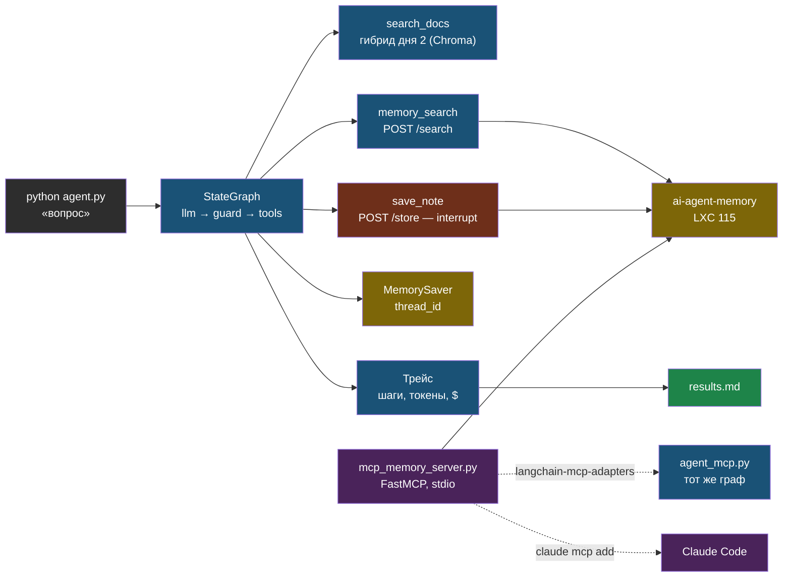

# День 4. Лаба: агент на LangGraph и MCP-сервер памяти

## Результат

Папка `~/proj/ai-labs/day4-agent/`: агент на LangGraph с двумя инструментами чтения (поиск по документам дня 2 и поиск в твоём сервисе памяти) и одним инструментом записи (сохранить заметку в память) под подтверждением человека. Лимит шагов, бюджет в долларах, обнаружение повторного вызова, checkpointer с продолжением диалога. Затем — MCP-сервер поверх `ai-agent-memory`, подключённый и к этому агенту, и к Claude Code. В `results.md` — трейсы прогонов с шагами, токенами и стоимостью, включая принудительную остановку и отклонённую запись.

## Карта лабы



## Подготовка

Нужны: окружение дней 1–2 (`.venv`, `.env` с ключом и прокси, локальная Chroma `chunks_openai` и `chunks.jsonl`), доступный сервис памяти (`curl -sf http://100.69.146.20:443/health`). Модель — с поддержкой tool calling; та, что в `.env`, подходит.

```bash
cd ~/proj/ai-labs && source .venv/bin/activate && source .env
pip install -q "langgraph>=1.0" "langchain>=1.0" langchain-openai "mcp>=1.10" langchain-mcp-adapters httpx
mkdir -p day4-agent && cd day4-agent
export MEMORY_URL="http://100.69.146.20:443"
python -c "import langgraph, langchain; print(langgraph.__version__ if hasattr(langgraph,'__version__') else 'ok', langchain.__version__)"
```

## Шаг 1. Инструменты

Два чтения и одна запись. Описания — часть промпта, пиши их так, как хотел бы, чтобы тебе объяснил коллега. Поиск по документам переиспользует гибридный ретривер дня 2.

```python
# ~/proj/ai-labs/day4-agent/tools.py
import os
import sys

import httpx
from langchain_core.tools import tool
from pydantic import BaseModel, Field

sys.path.insert(0, os.path.expanduser("~/proj/ai-labs/day2-rag-eval"))
os.chdir(os.path.expanduser("~/proj/ai-labs/day2-rag-eval"))  # Store читает chunks.jsonl и chroma/ из своей папки
from embed import Embedder        # noqa: E402
from retrievers import Store      # noqa: E402

os.chdir(os.path.expanduser("~/proj/ai-labs/day4-agent"))
MEMORY_URL = os.getenv("MEMORY_URL", "http://100.69.146.20:443")
_store = Store("chunks_openai", Embedder("openrouter", "openai/text-embedding-3-small"))


class SearchArgs(BaseModel):
    query: str = Field(description="Поисковый запрос на русском, самостоятельный (без «это», «оно»)")


@tool(args_schema=SearchArgs)
def search_docs(query: str) -> str:
    """Ищет фрагменты в базе документов (гибридный поиск). Используй для вопросов по содержимому документов.
    Возвращает до трёх фрагментов с именем файла. Если ничего не найдено — скажи об этом пользователю."""
    hits = _store.hybrid(query, 3)
    if not hits:
        return "ничего не найдено — переформулируй запрос или скажи пользователю, что ответа в документах нет"
    return "\n\n".join(f"[{h['filename']} #{h['chunk_index']}]\n{h['text'][:600]}" for h in hits)


class MemorySearchArgs(BaseModel):
    query: str = Field(description="Что искать в долговременной памяти проектов")
    project: str | None = Field(default=None, description="Имя проекта (web-agent, ai-engineering, pxhome…) или пусто для всех")


@tool(args_schema=MemorySearchArgs)
def memory_search(query: str, project: str | None = None) -> str:
    """Семантический поиск по долговременной памяти: решения, факты и заметки по проектам автора.
    Используй для вопросов «что решали», «как настроено», «что не сработало»."""
    r = httpx.post(f"{MEMORY_URL}/search", json={"query": query, "limit": 5, "project": project}, timeout=30)
    r.raise_for_status()
    items = r.json()["results"]
    if not items:
        return "в памяти ничего не найдено"
    return "\n\n".join(f"[{i['type']}] {i['title']}\n{i['content'][:500]}" for i in items)


class SaveNoteArgs(BaseModel):
    title: str = Field(description="Короткий заголовок заметки")
    content: str = Field(description="Содержание: факт или решение с контекстом")
    project: str | None = Field(default=None, description="Проект; пусто — глобальная заметка")


@tool(args_schema=SaveNoteArgs)
def save_note(title: str, content: str, project: str | None = None) -> str:
    """Сохраняет заметку в долговременную память. Побочное действие — требует подтверждения человека.
    Вызывай только если пользователь явно попросил что-то запомнить."""
    payload = {"title": title, "content": content, "type": "knowledge", "project": project, "scope": "project" if project else "global"}
    r = httpx.post(f"{MEMORY_URL}/store", json=payload, timeout=30)
    r.raise_for_status()
    return f"сохранено, id={r.json()['id']}"


TOOLS = [search_docs, memory_search, save_note]
WRITE_TOOLS = {"save_note"}
```

Проверка: `python -c "from tools import search_docs; print(search_docs.invoke({'query': 'на каком порту слушает ollama'})[:300])"`.

## Шаг 2. Граф: модель → guard → инструменты

```python
# ~/proj/ai-labs/day4-agent/agent.py
import json
import os
import sys
from typing import Annotated, TypedDict

import httpx
from langchain_core.messages import AIMessage, HumanMessage, SystemMessage, ToolMessage
from langchain_openai import ChatOpenAI
from langgraph.checkpoint.memory import MemorySaver
from langgraph.errors import GraphRecursionError
from langgraph.graph import END, START, StateGraph
from langgraph.graph.message import add_messages
from langgraph.prebuilt import ToolNode
from langgraph.types import Command, interrupt

from tools import TOOLS, WRITE_TOOLS

BASE_URL = os.getenv("OPENROUTER_BASE_URL", "https://openrouter.ai/api/v1")
MODEL = os.getenv("LLM_MODEL", "anthropic/claude-sonnet-4.6")
MAX_STEPS = int(os.getenv("MAX_STEPS", "6"))       # вызовов модели на одну задачу
COST_CAP = float(os.getenv("COST_CAP", "0.05"))    # долларов на одну задачу

SYSTEM = (
    "Ты ассистент инженера. Отвечай по-русски, коротко. Для вопросов по документам используй search_docs, "
    "для вопросов о прошлых решениях и настройках — memory_search. Сохраняй заметки (save_note) только по явной просьбе. "
    "Если инструмент ничего не нашёл — скажи об этом честно, не выдумывай."
)


class AgentState(TypedDict):
    messages: Annotated[list, add_messages]
    steps: int
    cost_usd: float


def pricing(model_id: str) -> tuple[float, float]:
    """Цена за токен (вход, выход) из прайса OpenRouter; при недоступности — нули и предупреждение."""
    try:
        data = httpx.get(f"{BASE_URL}/models", timeout=20).json()["data"]
        m = next(m for m in data if m["id"] == model_id)
        return float(m["pricing"]["prompt"]), float(m["pricing"]["completion"])
    except Exception as exc:  # прайс недоступен — бюджет не считается, но агент работает
        print(f"[warn] прайс недоступен ({type(exc).__name__}); стоимость = 0", file=sys.stderr)
        return 0.0, 0.0


def build_graph(tools, checkpointer=None):
    llm = ChatOpenAI(model=MODEL, base_url=BASE_URL, api_key=os.environ["OPENROUTER_API_KEY"], temperature=0, timeout=60, max_retries=2)
    llm_tools = llm.bind_tools(tools)
    p_in, p_out = pricing(MODEL)
    tool_node = ToolNode(tools)
    write_tools = WRITE_TOOLS

    def call_llm(state: AgentState) -> dict:
        resp = llm_tools.invoke([SystemMessage(SYSTEM)] + state["messages"])
        usage = resp.usage_metadata or {}
        cost = usage.get("input_tokens", 0) * p_in + usage.get("output_tokens", 0) * p_out
        return {"messages": [resp], "steps": state["steps"] + 1, "cost_usd": state["cost_usd"] + cost}

    def repeated_call(state: AgentState) -> bool:
        """Тот же инструмент с теми же аргументами, что в предыдущем ходе модели, — признак зацикливания."""
        ai = [m for m in state["messages"] if isinstance(m, AIMessage) and m.tool_calls]
        if len(ai) < 2:
            return False
        sig = lambda m: sorted(json.dumps({"n": c["name"], "a": c["args"]}, sort_keys=True, ensure_ascii=False) for c in m.tool_calls)
        return sig(ai[-1]) == sig(ai[-2])

    def route(state: AgentState) -> str:
        last = state["messages"][-1]
        if not getattr(last, "tool_calls", None):
            return END
        if state["steps"] >= MAX_STEPS:
            return "stop_steps"
        if state["cost_usd"] >= COST_CAP:
            return "stop_cost"
        if repeated_call(state):
            return "stop_loop"
        return "tools"

    def stop(reason: str):
        def node(state: AgentState) -> dict:
            last = state["messages"][-1]
            # закрываем незавершённые tool_calls, чтобы история осталась валидной для следующего хода
            closers = [ToolMessage(content="не выполнено: агент остановлен", tool_call_id=c["id"]) for c in last.tool_calls]
            return {"messages": closers + [AIMessage(content=f"Остановлено: {reason}. Шагов: {state['steps']}, потрачено ${state['cost_usd']:.4f}.")]}
        return node

    def guarded_tools(state: AgentState) -> dict:
        """Инструменты записи — только после подтверждения человеком (interrupt)."""
        last = state["messages"][-1]
        approved, denied = [], []
        for call in last.tool_calls:
            if call["name"] in write_tools:
                ok = interrupt({"tool": call["name"], "args": call["args"]})
                if not ok:
                    denied.append(ToolMessage(content="отклонено пользователем — не повторяй этот вызов", tool_call_id=call["id"]))
                    continue
            approved.append(call)
        out = []
        if approved:
            out = tool_node.invoke({"messages": [last.model_copy(update={"tool_calls": approved})]})["messages"]
        return {"messages": out + denied}

    g = StateGraph(AgentState)
    g.add_node("llm", call_llm)
    g.add_node("tools", guarded_tools)
    g.add_node("stop_steps", stop("лимит шагов"))
    g.add_node("stop_cost", stop("лимит бюджета"))
    g.add_node("stop_loop", stop("повторный вызов инструмента — зацикливание"))
    g.add_edge(START, "llm")
    g.add_conditional_edges("llm", route, {"tools": "tools", "stop_steps": "stop_steps", "stop_cost": "stop_cost", "stop_loop": "stop_loop", END: END})
    g.add_edge("tools", "llm")
    for n in ("stop_steps", "stop_cost", "stop_loop"):
        g.add_edge(n, END)
    return g.compile(checkpointer=checkpointer or MemorySaver())


def print_trace(messages) -> None:
    for m in messages:
        if isinstance(m, HumanMessage):
            print(f"\n👤 {m.content}")
        elif isinstance(m, AIMessage):
            u = m.usage_metadata or {}
            tag = f"[in={u.get('input_tokens', 0)} out={u.get('output_tokens', 0)}]"
            if m.tool_calls:
                for c in m.tool_calls:
                    print(f"🤖 → {c['name']}({json.dumps(c['args'], ensure_ascii=False)}) {tag}")
            else:
                print(f"🤖 {m.content} {tag}")
        elif isinstance(m, ToolMessage):
            text = str(m.content).replace("\n", " ")
            print(f"🔧 {text[:160]}{'…' if len(text) > 160 else ''}")


def run(question: str, thread_id: str = "cli") -> None:
    graph = build_graph(TOOLS)
    config = {"configurable": {"thread_id": thread_id}, "recursion_limit": 2 * MAX_STEPS + 4}
    try:
        result = graph.invoke({"messages": [HumanMessage(question)], "steps": 0, "cost_usd": 0.0}, config)
        while "__interrupt__" in result:
            req = result["__interrupt__"][0].value
            answer = input(f"\n⚠️  Разрешить {req['tool']} с аргументами {json.dumps(req['args'], ensure_ascii=False)}? [y/N] ")
            result = graph.invoke(Command(resume=answer.strip().lower() == "y"), config)
    except GraphRecursionError:
        print("GraphRecursionError: сработал recursion_limit — жёсткий потолок графа")
        return
    print_trace(result["messages"])
    print(f"\n— шагов модели: {result['steps']}, стоимость: ${result['cost_usd']:.4f}")


if __name__ == "__main__":
    run(" ".join(sys.argv[1:]) or "На каком порту слушает Ollama и что мы решали про прокси для Hermes?")
```

## Шаг 3. Первый прогон и трейс

```bash
python agent.py "На каком порту слушает Ollama по умолчанию и как закрыть его от интернета?"
python agent.py "Что мы решали про геоблок OpenRouter для Hermes?"
```

Ожидаемо: первый вопрос — один-два вызова `search_docs` и ответ с именем файла; второй — `memory_search` с `project` вида `pxhome` и ответ про socks5-прокси. В трейсе — токены каждого хода и итоговая стоимость. Запиши оба трейса в `results.md`: вопрос, число шагов, какие инструменты, токены, доллары, время.

## Шаг 4. Подтверждение записи (HITL)

```bash
python agent.py "Запомни в проект ai-engineering: день 4 сделан, агент на LangGraph работает"
```

Граф остановится на `interrupt`, в консоли — вопрос «Разрешить save_note…?». Ответь `n` — агент получит «отклонено» и завершит без записи; повтори с `y` — заметка появится в памяти (`mem-recent ai-engineering 1`). Оба трейса — в отчёт: это демонстрация, что побочные действия под контролем человека, а состояние графа пережило паузу.

## Шаг 5. Лимиты: шаги, бюджет, зацикливание

```bash
MAX_STEPS=2 python agent.py "Найди в документах пять разных команд Ollama и для каждой проверь в памяти, использовали ли мы её"
COST_CAP=0.0005 python agent.py "Найди в документах, как настроить nginx перед Ollama"
```

Первый прогон упирается в лимит шагов: сообщение «Остановлено: лимит шагов» с числом шагов и стоимостью, незакрытые вызовы закрыты служебными `ToolMessage`. Второй — в бюджет уже после первого-второго хода. Для зацикливания: временно замени в `tools.py` возврат `search_docs` на постоянную строку «ничего не найдено» (модель повторит тот же запрос) и запусти любой вопрос по документам — сработает `stop_loop`; верни код обратно. Все три остановки — в отчёт с формулировками сообщений.

## Шаг 6. Продолжение диалога через checkpointer

Тот же `thread_id` продолжает разговор: состояние лежит в `MemorySaver`. В одном процессе:

```bash
python -c "
from agent import run
run('Какие расширения Postgres нужны для векторов?', thread_id='t1')
run('А как это называлось в проде у нас?', thread_id='t1')
"
```

Второй вопрос — уточняющий; модель видит историю ветки `t1` и понимает «это». Между процессами память теряется — для этого есть `SqliteSaver` и `PostgresSaver` из пакетов `langgraph-checkpoint-sqlite` и `langgraph-checkpoint-postgres`; замена одной строки. В отчёт — одна фраза, что и как проверил.

## Шаг 7. MCP-сервер поверх ai-agent-memory

Те же два инструмента памяти — теперь как MCP-сервер, доступный любому клиенту.

```python
# ~/proj/ai-labs/day4-agent/mcp_memory_server.py
import os

import httpx
from mcp.server.fastmcp import FastMCP

MEMORY_URL = os.getenv("MEMORY_URL", "http://100.69.146.20:443")
mcp = FastMCP("agent-memory")


@mcp.tool()
def memory_search(query: str, project: str | None = None, limit: int = 5) -> str:
    """Семантический поиск по долговременной памяти проектов автора: решения, факты, заметки."""
    r = httpx.post(f"{MEMORY_URL}/search", json={"query": query, "project": project, "limit": limit}, timeout=30)
    r.raise_for_status()
    items = r.json()["results"]
    return "\n\n".join(f"[{i['type']}] {i['title']}\n{i['content'][:500]}" for i in items) or "ничего не найдено"


@mcp.tool()
def memory_store(title: str, content: str, project: str | None = None) -> str:
    """Сохранить факт или решение в долговременную память (побочное действие)."""
    payload = {"title": title, "content": content, "type": "knowledge", "project": project, "scope": "project" if project else "global"}
    r = httpx.post(f"{MEMORY_URL}/store", json=payload, timeout=30)
    r.raise_for_status()
    return f"сохранено, id={r.json()['id']}"


if __name__ == "__main__":
    mcp.run(transport="stdio")
```

Клиент — тот же граф, инструменты приходят из MCP через адаптер; инструменты MCP асинхронные, поэтому вызываем граф через `ainvoke`:

```python
# ~/proj/ai-labs/day4-agent/agent_mcp.py
import asyncio
import os
import sys

from langchain_core.messages import HumanMessage
from langchain_mcp_adapters.client import MultiServerMCPClient

from agent import MAX_STEPS, build_graph, print_trace
from tools import search_docs


async def main(question: str) -> None:
    client = MultiServerMCPClient({
        "memory": {"command": sys.executable, "args": [os.path.abspath("mcp_memory_server.py")], "transport": "stdio"},
    })
    mcp_tools = await client.get_tools()
    print("инструменты из MCP:", [t.name for t in mcp_tools])
    graph = build_graph([search_docs, *mcp_tools])
    config = {"configurable": {"thread_id": "mcp"}, "recursion_limit": 2 * MAX_STEPS + 4}
    result = await graph.ainvoke({"messages": [HumanMessage(question)], "steps": 0, "cost_usd": 0.0}, config)
    print_trace(result["messages"])
    print(f"\n— шагов: {result['steps']}, стоимость: ${result['cost_usd']:.4f}")


if __name__ == "__main__":
    asyncio.run(main(" ".join(sys.argv[1:]) or "Что мы решали про модель для Hermes?"))
```

Запуск: `python agent_mcp.py "Что мы решали про модель для Hermes?"` — в первой строке имена инструментов, полученные по протоколу, дальше обычный трейс. Обрати внимание: `memory_store` из MCP не попал в `WRITE_TOOLS`, поэтому подтверждение на него не сработает — добавь имя в множество в `tools.py` и убедись, что `interrupt` снова срабатывает. Это ровно тот случай, когда защита должна жить в твоём коде, а не в чужом сервере.

Подключение к Claude Code — одна команда, и твоя память доступна там как инструмент без `mem-search` в bash:

```bash
claude mcp add --scope user agent-memory -- $(pwd)/../.venv/bin/python $(pwd)/mcp_memory_server.py
claude mcp list
```

## Шаг 8. results.md и коммит

```markdown
# День 4 — агент на LangGraph (дата, модель, MAX_STEPS, COST_CAP)

| прогон | вопрос | шагов | инструменты | токены in/out | $ | итог |
|---|---|---|---|---|---|---|
| docs | … | … | search_docs ×… | … | … | ответ с файлом |
| memory | … | … | memory_search | … | … | ответ про прокси |
| HITL n | запомни … | … | save_note → отклонено | … | … | без записи |
| HITL y | запомни … | … | save_note → id … | … | … | запись в памяти |
| stop_steps | … | 2 | … | … | … | «лимит шагов» |
| stop_cost | … | … | … | … | … | «лимит бюджета» |
| stop_loop | … | … | search_docs ×2 одинаково | … | … | «зацикливание» |
| mcp | … | … | memory_search (MCP) | … | … | инструменты по протоколу |

## Что понял про защиту (3 строки)
## Что пойдёт в web-agent / Hermes (2 строки)
```

Коммит: `git add -A && git commit -m "day4: LangGraph agent — tools, guards, HITL interrupt, checkpointer, MCP memory server"`, push.

## Если не получилось

- **Модель не вызывает инструменты** — выбранная модель без tool calling через OpenRouter; смени `LLM_MODEL` на модель с пометкой поддержки tools.
- **`interrupt` не останавливает** — граф скомпилирован без checkpointer или вызов без `thread_id`; оба обязательны для пауз.
- **После `n` агент снова просит `save_note`** — модель не увидела причину; текст «отклонено пользователем — не повторяй» должен вернуться как `ToolMessage` с тем же `tool_call_id`.
- **Ошибка про незавершённые tool_calls** — история содержит вызов без результата; узел `stop` закрывает их служебными сообщениями — проверь, что он вызывается до `END`.
- **`GraphRecursionError` на нормальном вопросе** — `recursion_limit` меньше, чем нужно шагов; каждый ход модели плюс инструменты — два перехода; формула `2 * MAX_STEPS + 4` даёт запас.
- **MCP-сервер не стартует из адаптера** — путь к python и файлу должен быть абсолютным; проверь сервер отдельно: `python mcp_memory_server.py` должен ждать stdin без ошибок.
- **Стоимость всегда 0** — прайс недоступен (прокси) или модель не отдаёт `usage_metadata`; бюджетный стоп тогда не срабатывает, что и надо зафиксировать в отчёте как риск.

## Практика

1. **Суммаризация истории**: добавь узел, который при длине истории больше N сообщений заменяет старые на одно резюме; проверь, что уточняющие вопросы после сжатия всё ещё работают.
2. **Structured final answer**: заставь финальный ответ соответствовать Pydantic-схеме `{answer, sources, confidence}` через structured output и валидируй перед печатью.
3. **PostgresSaver**: перенеси checkpointer в Postgres дня 3 и покажи, что диалог продолжается между запусками процесса.
4. **Hermes**: найди в его конфигурации, есть ли аналоги `MAX_STEPS` и бюджета, и запиши, что бы ты добавил.

## Что проверить

- `agent.py` отвечает на вопрос по документам с вызовом `search_docs` и на вопрос о решениях с вызовом `memory_search`; трейсы в отчёте с токенами и стоимостью.
- HITL: отказ не сохраняет заметку, согласие — сохраняет (проверено `mem-recent`).
- Три остановки воспроизведены: лимит шагов, лимит бюджета, повторный вызов; сообщения в отчёте.
- Уточняющий вопрос в том же `thread_id` понят благодаря checkpointer.
- `agent_mcp.py` печатает инструменты, полученные по MCP, и отвечает через них; `claude mcp list` показывает `agent-memory`.
- В `results.md` — таблица из восьми прогонов и выводы; коммит запушен.
