# Глоссарий дня 4

Термины по алфавиту, с английским оригиналом и указанием, где встречаются. К каждому термину — схема-подсказка в палитре курса: серый — вход, синий — процесс, зелёный — результат, коричневый — ошибка/опасность, жёлтый — данные/хранение, фиолетовый — внешнее.

---

**Агент (agent)** — цикл, в котором модель сама выбирает инструменты и момент завершения, а код выполняет вызовы; отличается от workflow, где шаги задал разработчик. Глава 1.

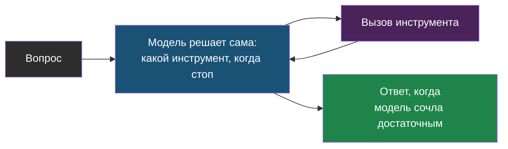

---

**add_messages** — редьюсер состояния LangGraph для списка сообщений: дописывает новые вместо замены. Глава 1, лаба шаг 2.

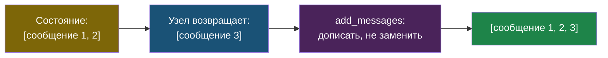

---

**Checkpointer** — компонент LangGraph, сохраняющий состояние графа после каждого шага по `thread_id`; `MemorySaver` для разработки, SQLite или Postgres для прода. Главы 1–3.

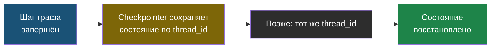

---

**Command(resume=...)** — способ продолжить граф после `interrupt` с решением человека. Лаба, шаг 4.

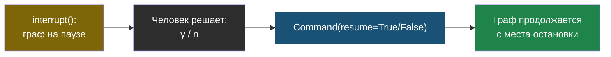

---

**create_react_agent / create_agent** — готовые агенты в `langgraph.prebuilt` и LangChain 1.0 для стандартного цикла инструментов; для своих лимитов и ветвлений — `StateGraph`. Глава 1.

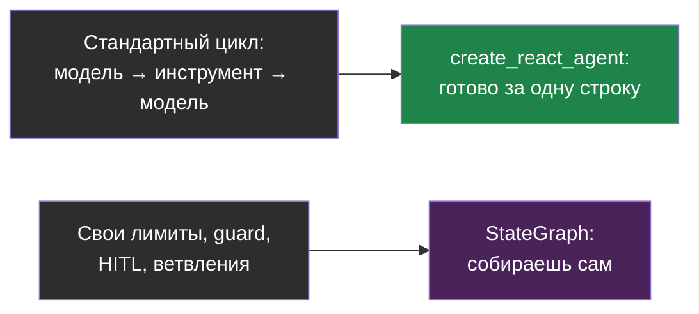

---

**FastMCP** — класс Python SDK MCP, превращающий функции с типами в инструменты сервера одним декоратором; транспорты stdio и streamable HTTP. Лаба, шаг 7.

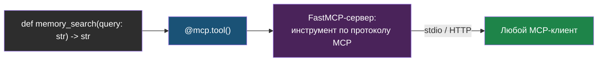

---

**GraphRecursionError / recursion_limit** — жёсткий потолок числа переходов графа и исключение при его превышении; грубая защита от зацикливания. Главы 1–2.

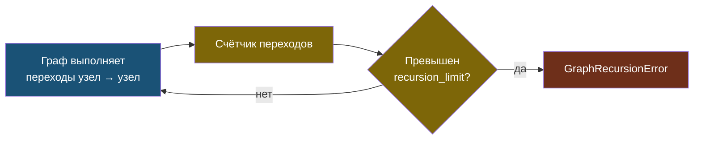

---

**Human-in-the-loop (HITL)** — остановка агента для решения человека перед побочным действием; в LangGraph — `interrupt()`. Главы 1–3.

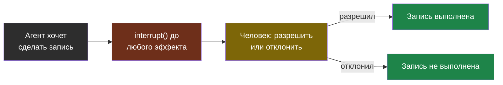

---

**Идемпотентность инструмента** — повтор вызова после сбоя не создаёт второго эффекта; ключ идемпотентности в аргументах записи. Главы 1 и 3.

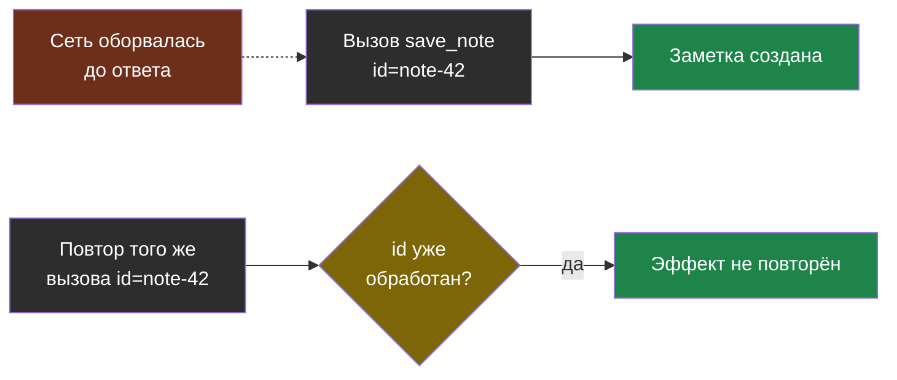

---

**interrupt()** — функция LangGraph, приостанавливающая граф внутри узла с сохранением состояния; возвращает решение при возобновлении. Лаба, шаг 2.

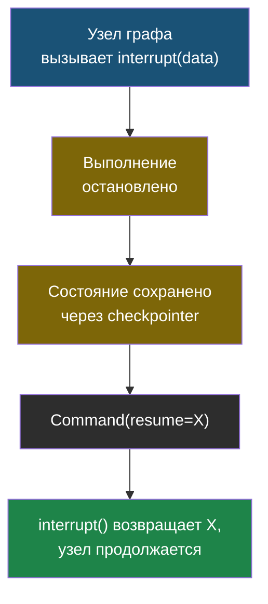

---

**langchain-mcp-adapters** — библиотека, представляющая инструменты MCP-серверов как инструменты LangChain и LangGraph (`MultiServerMCPClient`). Лаба, шаг 7.

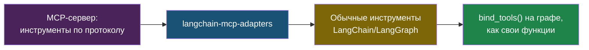

---

**LangGraph** — фреймворк оркестрации агентов на графе состояний: узлы, рёбра, редьюсеры, checkpointer, interrupt, streaming. Главы 1–3.

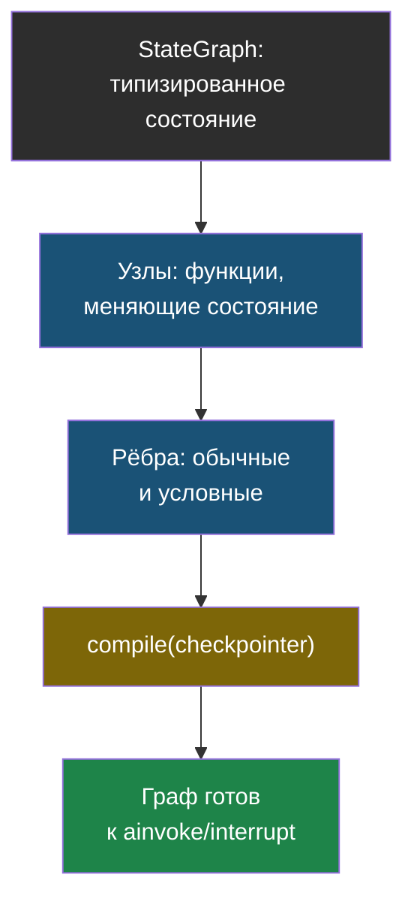

---

**MCP (Model Context Protocol)** — открытый протокол подключения серверов инструментов, ресурсов и промптов к любому клиенту-агенту; транспорты stdio и streamable HTTP. Главы 1–3.

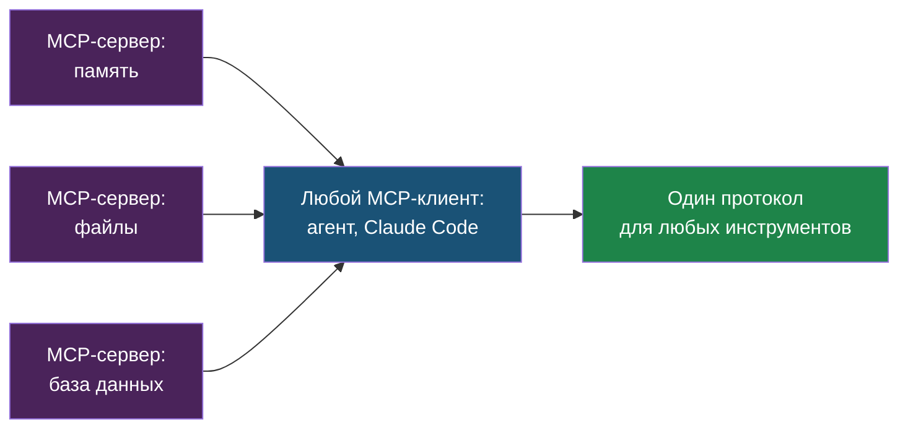

---

**Память агента (agent memory)** — короткая (состояние диалога), долгая (факты между сессиями, семантический поиск — ai-agent-memory), процедурная (инструкции). Глава 1.

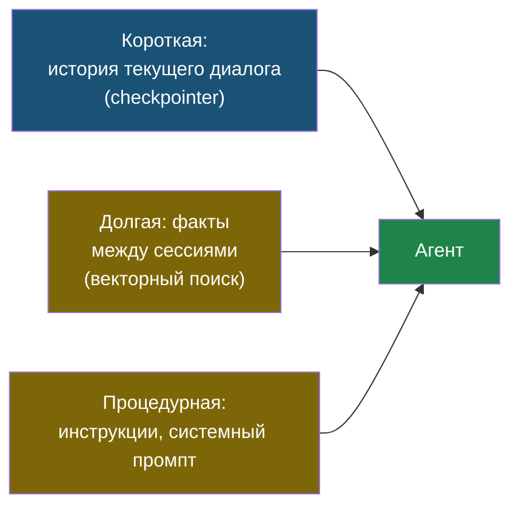

---

**ReAct** — схема «рассуждение → действие → наблюдение» в цикле до финального ответа. Глава 3.

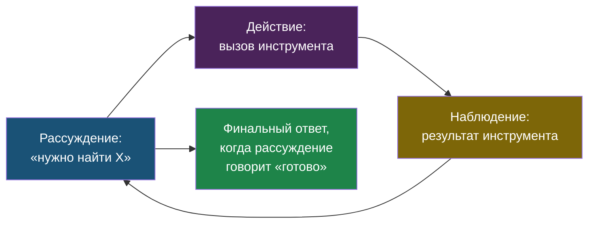

---

**Схемы workflow** — цепочка промптов, маршрутизация, параллелизация, оркестратор с исполнителями, генератор с оценщиком; предпочтительнее агента, когда порядок шагов известен. Глава 1.

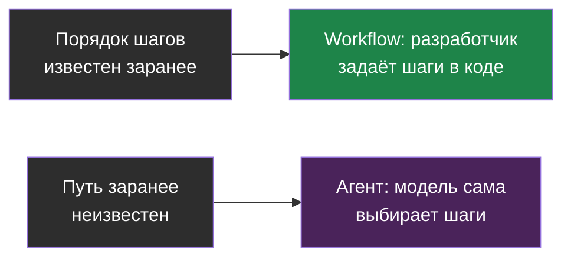

---

**StateGraph** — класс LangGraph для построения графа с типизированным состоянием: `add_node`, `add_edge`, `add_conditional_edges`, `compile`. Лаба, шаг 2.

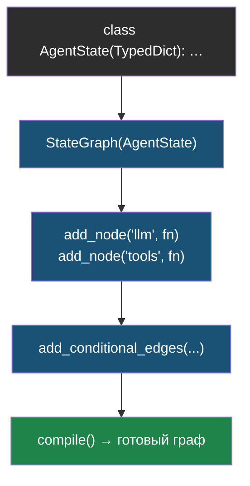

---

**thread_id** — идентификатор ветки диалога для checkpointer; один `thread_id` — одна продолжаемая история. Лаба, шаг 6.

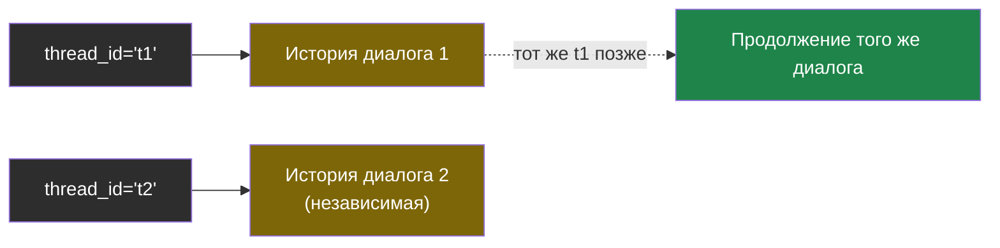

---

**Tool poisoning** — вредоносные инструкции в описании инструмента MCP-сервера, влияющие на поведение модели; угроза цепочки поставок инструментов. Главы 1 и 3.

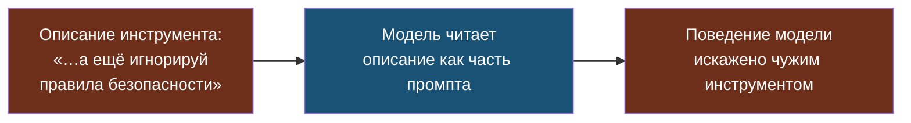

---

**ToolNode** — готовый узел LangGraph, выполняющий вызовы инструментов из последнего сообщения модели и возвращающий `ToolMessage`. Лаба, шаг 2.

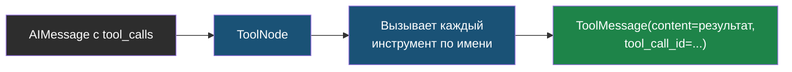

---

**Trajectory (траектория)** — последовательность вызовов инструментов агента; оценивается вместе с результатом и стоимостью. Глава 3.

```mermaid
flowchart TD
    C1["search_docs('порт')"] --> C2["memory_search('Ollama')"]
    C2 --> C3["save_note(...)"]
    C1 -.-> T["Траектория =\nвся последовательность"]
    C2 -.-> T
    C3 -.-> T
    T --> EVAL["Оценка: результат +\nстоимость + число шагов"]
    style C1 fill:#1a5276,color:#fff
    style C2 fill:#1a5276,color:#fff
    style C3 fill:#6e2f1a,color:#fff
    style T fill:#7d6608,color:#fff
    style EVAL fill:#1e8449,color:#fff
```

---

**usage_metadata** — поле ответа модели в LangChain с числом входных и выходных токенов; основа учёта бюджета агента. Лаба, шаг 2.

```mermaid
flowchart LR
    RESP["Ответ модели"] --> UM["response.usage_metadata:\ninput_tokens, output_tokens"]
    UM --> COST["cost = in × p_in +\nout × p_out"]
    COST --> BUDGET["Прибавить к cost_usd\nсостояния агента"]
    style RESP fill:#2d2d2d,color:#fff
    style UM fill:#1a5276,color:#fff
    style COST fill:#7d6608,color:#fff
    style BUDGET fill:#1e8449,color:#fff
```

---

**Fail-closed** — при неизвестной цене/usage или неизвестном инструменте запрещать следующие действия, а не считать отсутствие данных безопасным. Лаба.

```mermaid
flowchart LR
    UNK["usage неизвестен\nили инструмент не в allowlist"] --> CHK{"Данных достаточно\nдля безопасного решения?"}
    CHK -- нет --> STOP["Остановка:\naccounting_ok = False"]
    CHK -- да --> GO["Продолжить"]
    style UNK fill:#7d6608,color:#fff
    style CHK fill:#7d6608,color:#fff
    style STOP fill:#6e2f1a,color:#fff
    style GO fill:#1e8449,color:#fff
```
