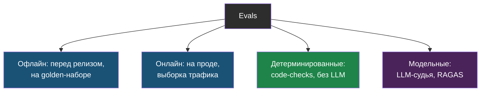
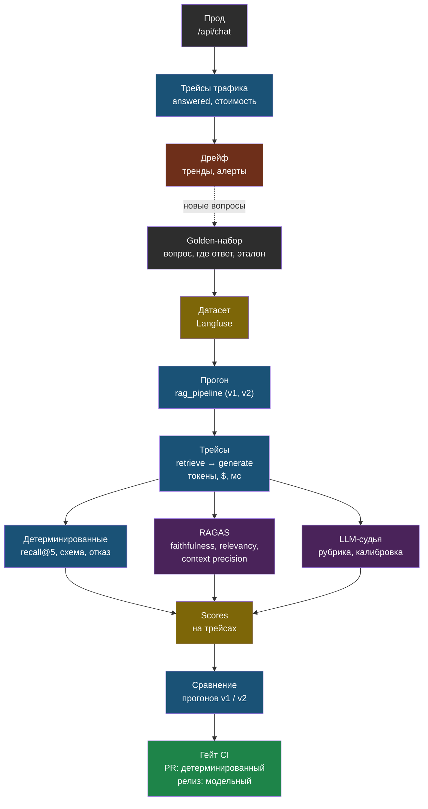

# День 5. Измерять, а не верить: суть

## Зачем это на собеседовании

«Как вы понимаете, что ваш RAG стал лучше после изменения?» — этот вопрос проверяет не впечатления от нескольких ответов, а наличие доказательств. Ответ уровня middle звучит так: «golden-набор, метрики поиска и генерации, трейсы каждого запроса в проде, регрессионный гейт в CI, тренды по неделям» — то есть цепочка конкретных, измеримых вещей, а не «мы посмотрели, стало вроде лучше». В днях 2 и 3 ты уже считал recall@k для поиска — сегодня добавляешь метрики самого ответа, модель-судью, трейсинг и весь процесс вокруг. Результатом сегодняшней практики должны стать реальные числа о качестве твоей системы и понятное место, где эти числа хранятся и с чем их можно сравнивать завтра.

## Что такое evals и почему они разные

> **Evals** — систематическая оценка качества LLM-системы на наборе примеров с известным ожиданием.

Слово «систематическая» здесь ключевое: это не разовая проверка «на глаз», а повторяемый процесс — один и тот же набор примеров прогоняется через систему снова и снова, и результаты можно сравнивать между собой.

Есть три независимые оси, по которым evals различаются между собой:

- **Что оцениваем**: поиск (нашли ли вообще нужный документ — дни 2–3), генерацию (правильно ли ответили, опираясь ли на найденный контекст, полно ли), систему целиком (решена ли реальная задача пользователя, а не просто «ответ формально похож на правильный»), агента (итоговый результат, траектория его действий, потраченные деньги — день 4).
- **Как оцениваем**: детерминированные проверки прямо кодом (есть ли нужная подстрока, валидна ли JSON-схема, проходит ли regex, посчитан ли recall@k) — дёшево, полностью воспроизводимо, но узко по охвату; модель-судья (LLM-as-judge, отдельная модель, которая сама оценивает качество ответа) — гибко, дорого, и с элементом шума в оценках; человек — самый надёжный эталон, но и самый медленный и дорогой способ.
- **Когда**: офлайн — на заранее подготовленном golden-наборе, ещё до релиза изменений; онлайн — уже на реальном трафике пользователей, через их явные оценки, косвенные сигналы поведения, и выборочную проверку судьёй.

Из этого следует практическое правило: для каждого изменения в системе сначала прогоняется дешёвый детерминированный гейт, затем, если он прошёл — модельная оценка на выборке, и только потом наблюдение уже на реальном онлайн-трафике. Нет смысла звать дорогого судью оценивать качество ответа, если элементарная проверка кодом уже показала, что поиск даже не нашёл нужный документ.

## Golden-набор для генерации

К паре «вопрос → где искать ответ» из дня 2 сегодня добавляется **эталонный ответ** (reference) — короткий текст, написанный человеком, содержащий факты, которые обязательно должны присутствовать в правильном ответе модели. Без эталона можно измерить faithfulness и relevancy (см. таблицу ниже); с эталоном становятся доступны ещё и correctness и context recall. Для первого пробного (smoke) прогона достаточно написать эталоны для 10–15 вопросов из 25 — но важно честно понимать: это ещё не статистически достаточная оценка реального качества прода, а лишь первая проверка, что процесс вообще работает. Перед тем как принимать по этим числам серьёзные решения, выборку и покрытие ошибок/отказов стоит расширять.

Хороший источник вопросов — реальные диалоги (журнал чатов web-agent), включая те, где бот честно ответил «у меня нет информации по этому вопросу» — такие случаи специально нужны, чтобы проверять именно честный отказ, а не только «правильные» ответы. Сам набор должен лежать в git и версионироваться, а меняться — только осознанно: если незаметно для себя «подкручивать» набор так, чтобы система на нём выглядела лучше, метрики просто потеряют всякий смысл — это как переписывать экзаменационные вопросы под уже известные ответы студента.

## Метрики RAGAS: что измеряют и где врут

RAGAS — библиотека готовых метрик специально для RAG-систем, где в роли того, кто выставляет оценку, выступает сама LLM. Основные метрики:

| Метрика | Что измеряет | Как | Нужен эталон | Где врёт |
|---|---|---|---|---|
| **Faithfulness** | Ответ не выдумывает: каждое утверждение подтверждено контекстом | Разбить ответ на утверждения, проверить каждое по контексту | Нет | Правильный ответ из знаний модели, а не из контекста, получит низкий балл — это правильно для RAG, но надо понимать |
| **Response relevancy** | Ответ отвечает на вопрос, а не на соседний | Сгенерировать вопросы к ответу, сравнить эмбеддингами с исходным | Нет | Честный отказ «в документах нет» получит низкий балл — исключай такие вопросы или оценивай отдельно |
| **Context precision** | Релевантные фрагменты стоят выше нерелевантных | Судья размечает каждый фрагмент, взвешивает по позиции | Опционально | Зависит от судьи; шум на коротких чанках |
| **Context recall** | Контекст покрывает утверждения эталона | Каждое утверждение эталона ищется в контексте | Да | Эталон, написанный шире документов, занижает метрику |
| **Answer correctness** | Ответ совпадает с эталоном по фактам и смыслу | Утверждения + семантическое сходство | Да | Штрафует за лишние верные детали |

Важно правильно понимать сами числа: метрики RAGAS дают значения от 0 до 1, но сравнивать их корректно только внутри одной и той же системы с одним и тем же судьёй. Фраза «сегодня 0.82 против вчерашних 0.74 на тех же вопросах» осмысленна и полезна; фраза «у нас 0.82, а у конкурента где-то видел 0.79» — нет, потому что это совсем разные условия измерения.

## LLM-as-judge: правила, без которых это шум

Модель-судья оценивает готовый ответ по заранее заданной рубрике (набору критериев). Такая оценка приносит реальную пользу только при соблюдении нескольких правил:

1. **Рубрика явная**: критерии и шкала прописаны словами заранее, а не отданы на усмотрение модели; лучше использовать бинарные (да/нет) или трёхуровневые оценки, чем расплывчатую шкалу «от 1 до 10», где непонятно, чем 7 отличается от 8.
2. **Structured output** — оценка и обоснование этой оценки возвращаются в JSON строго по схеме (день 1); при этом обоснование должно идти в схеме до самой оценки, а не после — так модель сначала честно рассуждает, а потом выводит число, а не наоборот подгоняет рассуждение под уже выданную оценку.
3. **Фиксация конфигурации** — конкретная модель, её версия, конкретный текст рубрики и `temperature=0` снижают случайный разброс между запусками, но не дают полной гарантии детерминизма и уж точно не гарантируют, что судья компетентен в самой предметной области.
4. **Калибровка**: 5–10 ответов, размеченных вручную самим человеком — это только smoke-тест самой рубрики, проверка, что она вообще работает разумно. Перед тем как масштабировать оценку на тысячи ответов, нужны уже независимая, статистически представительная выборка, разбор ошибок по категориям и оценка с доверительным интервалом — простое совпадение судьи с человеком в 4 случаях из 5 ничего не доказывает о надёжности на большом масштабе.
5. **Известные смещения**, которые нужно знать и учитывать: позиционное (в парном сравнении двух ответов первый вариант чаще побеждает просто потому, что он первый — лечится тем, что порядок время от времени меняют местами), к многословию (длинный ответ автоматически кажется более качественным, даже если это не так), к себе (модель предпочитает стиль, похожий на её же собственный — поэтому в судьи лучше брать модель другого семейства, не ту же самую, что генерирует ответы), к уверенному тону (уверенно звучащий, но неверный ответ оценивается выше, чем осторожный правильный).

Судья — это не полная замена человеку, а способ масштабировать именно человеческую разметку на намного больший объём данных. Поэтому пять оценок, сделанных руками самим человеком, — обязательная, не пропускаемая часть сегодняшней лабы.

## Наблюдаемость: трейс, span, generation

В обычном бэкенде трейс — это путь одного запроса через разные сервисы системы. В LLM-системе к этому добавляется ещё и содержимое: какой именно промпт ушёл в модель, какой контекст в него подмешали, что конкретно вернула модель, сколько токенов и денег стоил каждый отдельный шаг. Вот термины, которые ввела платформа Langfuse и которые де-факто стали общими для всей индустрии:

- **Trace** — один запрос пользователя целиком, вместе с метаданными: кто пользователь, какая сессия, какой tenant, какая версия промпта использовалась, какие теги на него навешаны.
- **Span** — отдельный шаг внутри этого запроса: поиск, реранкинг, вызов инструмента — с длительностью и тем, что было на входе и на выходе именно этого шага.
- **Generation** — конкретно вызов модели: какая модель, с какими параметрами, какой промпт, какой ответ, сколько токенов, сколько стоило, какой был TTFT (день 1).
- **Score** — оценка, привязанная к конкретному трейсу: от пользователя (лайк/дизлайк), от судьи, от детерминированной проверки кодом.
- **Dataset / experiment** — golden-набор, загруженный прямо в платформу, и прогоны системы по этому набору, которые можно сравнивать между версиями.
- **Prompt management** — версии промптов с явными метками, чтобы, глядя на трейс, всегда можно было точно сказать, какой именно версией промпта был сделан этот конкретный запрос.

Что стоит смотреть на дашборде наблюдаемости: стоимость на каждого tenant и на каждый отдельный запрос, латентность по шагам и отдельно p95 (95-й процентиль — значение, хуже которого только 5% случаев), долю ошибок по типам, долю ответов «нет ответа», тренд оценок качества по дням. Отдельная и важная тема — **PII и секреты** (персональные данные и чувствительная информация): промпты, ответы, аргументы инструментов и тексты исключений вполне могут содержать персональные данные и даже API-ключи. Поэтому по умолчанию стоит отключать автоматический захват input/output целиком и отправлять на платформу только заранее одобренный список (allowlist) конкретных метрик; любая передача полных текстов требует отдельного осознанного решения, понятных сроков хранения и ограничения доступа. Важная честная оговорка: простой regex для поиска телефонов и email не покрывает все виды персональных данных, а сам факт self-hosting (размещения у себя, а не в чужом облаке) сам по себе ещё не подтверждает соответствие 152-ФЗ — это отдельная юридическая и организационная работа.

> **Langfuse** — open source платформа наблюдаемости LLM: трейсы, генерации, оценки, датасеты, версии промптов; self-hosted через Docker Compose (v3: Postgres для метаданных, ClickHouse для трейсов, Redis, MinIO), Python SDK с декоратором `@observe`, интеграции с OpenAI SDK и LangChain.

Альтернативы Langfuse: Arize Phoenix (open source, построен на стандарте OpenTelemetry), LangSmith (облачный сервис от создателей LangChain, из РФ пользоваться неудобно), OpenLLMetry/OpenTelemetry GenAI-конвенции — для тех, у кого уже настроены Tempo или Jaeger для обычного мониторинга. У тебя уже есть Prometheus и Grafana (книга 38) — метрики стоимости и латентности логично отправлять именно туда, а вот подробное содержимое трейсов — в Langfuse, это разные по природе данные.

## Дрейф: когда стало хуже, а никто не менял код

Качество системы может незаметно упасть даже без единого релиза с твоей стороны: провайдер обновил модель, оставив то же самое имя; пользователи стали спрашивать о чём-то новом, чего раньше не было (данные «дрейфуют» — меняются со временем); документы в источнике обновились, а поисковый индекс — ещё нет; провайдер незаметно сменил саму модель эмбеддингов на своей стороне. Способ это обнаружить — следить за трендами, а не за отдельными значениями: доля ответов «нет ответа» и доля передач диалога живому оператору по неделям, средняя faithfulness от судьи на случайной выборке реального трафика, recall на golden-наборе по расписанию, распределение длины ответов и их стоимости. Алерт (автоматическое уведомление) должен срабатывать именно на изменение тренда, а не на единичное отклонившееся значение — иначе он будет ложно срабатывать постоянно. В web-agent флаг `answered` в каждой записи чата — это уже готовый онлайн-сигнал для отслеживания дрейфа, его нужно просто вывести на график по времени, а не изобретать заново.

## Evals в CI: три скорости

1. **На pull request** — офлайн-тест контракта системы и ветки честного отказа с помощью моков (подставных, не настоящих вызовов); отдельно подготовленный retrieval-гейт: recall@5 на golden-наборе выше заданного порога, схема ответа валидна, честный отказ срабатывает на вопросах, ответа на которые заведомо нет. Судья на этом этапе не участвует — это дорого и медленно для каждого PR — но реальные эмбеддинги при этом могут обращаться к API. Пропущенный из-за отсутствия окружения тест должен честно помечаться как SKIPPED, а не тихо засчитываться как пройденный PASS. В web-agent уже есть self-test round-trip перед переключением трафика — сегодняшняя задача продолжает именно эту идею, а не изобретает новую.
2. **По расписанию или по тегу релиза** — RAGAS и судья прогоняются уже на полном наборе, с сравнением против предыдущего прогона прямо в Langfuse; заметное падение метрики либо блокирует релиз автоматически, либо требует явного осознанного решения человека выпустить его всё равно.
3. **Онлайн** — выборочная оценка судьёй уже реального трафика, явные оценки от пользователей, сигналы дрейфа из предыдущего раздела; еженедельный отчёт — у тебя он уже есть по диалогам, сегодняшняя задача — добавить в него метрики качества, а не строить с нуля.

Важный принцип: изменения промпта и изменения модели должны проходить через тот же самый процесс, что и изменения кода — отдельная ветка, гейт, прогон тестов, сравнение результатов, релиз с обязательной фиксацией версии промпта прямо в трейсе.

## Схема

## Что у тебя уже есть

- **Онлайн-сигналы в web-agent**: флаг `answered` на каждом сообщении (честный отказ — измеримое событие), `retrieved_chunks` в записи чата (контекст сохранён — можно оценить faithfulness постфактум), токены и стоимость на сообщение, еженедельный отчёт по диалогам, статус RAG в `/api/status`. Это **implicit feedback** и **cost accounting per tenant** — только без графиков.
- **Smoke-гейт в CI**: self-test «эмбеддинг → запись → поиск → совпадение» перед переключением трафика — начало регрессионного контура.
- **Метрики поиска**: golden-набор и таблица recall@k из дней 2–3.
- **Мониторинг**: Prometheus и Grafana (книга 38) — место для метрик стоимости и латентности.
- **Пробелы**: нет трейсов по шагам, нет метрик генерации, нет судьи, нет датасета в системе, нет трендов дрейфа. Лаба даёт учебные реализации; production-интеграция, накопление representative трафика и настройка алертов — отдельные задачи, не автоматический результат чтения.

## Практика

1. Выгрузи из web-agent 20 последних диалогов с `answered = false` и посмотри: сколько из них — честный отказ по делу, а сколько — поиск не нашёл существующий ответ. Второе — кандидаты в golden-набор и первый честный сигнал о качестве прода.
2. Оцени, сколько стоит один прогон RAGAS по 25 вопросам тремя метриками с судьёй уровня Sonnet: посчитай по прайсу дня 1, зная, что каждая метрика — один-три вызова модели на вопрос. Это число определяет, как часто ты сможешь запускать модельную оценку.

## Что проверить

- Различаю три оси evals и объясняю, почему детерминированный гейт идёт до судьи.
- Называю пять метрик RAGAS, для каждой — что измеряет, нужен ли эталон и где она врёт.
- Перечисляю пять правил судьи и три смещения; знаю, зачем калибровка на ручной разметке.
- Определяю trace, span, generation, score, dataset и говорю, что смотреть на дашборде.
- Объясняю четыре причины дрейфа и как его ловить трендами, включая готовый сигнал `answered` в web-agent.
- Описываю три скорости evals в CI и место self-test-гейта web-agent в них.
- Знаю, почему трейсы — это персональные данные, и что с этим делать (маскирование, хранение, self-hosted).
