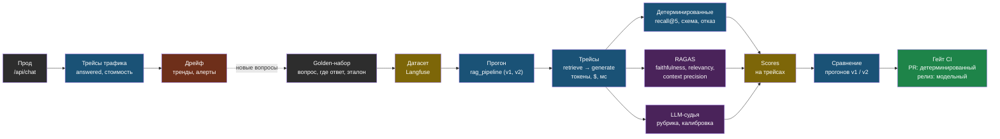

# День 5. Измерять, а не верить: суть

## Зачем это на собеседовании

«Как вы понимаете, что ваш RAG стал лучше после изменения?» — вопрос о доказательствах, а не впечатлениях от нескольких ответов. Ответ уровня middle: «golden-набор, метрики поиска и генерации, трейсы каждого запроса в проде, регрессионный гейт в CI, тренды по неделям». В днях 2 и 3 ты уже считал recall@k — сегодня добавляешь метрики ответа, судью, трейсинг и процесс. Результатом практики должны стать: числа о качестве своей системы и место, где они хранятся.

## Что такое evals и почему они разные

**Evals** — систематическая оценка качества LLM-системы на наборе примеров с известным ожиданием. Три оси, по которым их различают:

- **Что оцениваем**: поиск (нашли ли нужное — дни 2–3), генерацию (правильно ли, по контексту ли, полно ли ответили), систему целиком (решена ли задача пользователя), агента (результат, траектория, стоимость).
- **Как оцениваем**: детерминированные проверки кодом (подстрока, схема JSON, regex, recall@k) — дёшево, воспроизводимо, узко; модель-судья (LLM-as-judge) — гибко, дорого, шумно; человек — эталон, медленно.
- **Когда**: офлайн на golden-наборе до релиза; онлайн на реальном трафике — оценки пользователей, неявные сигналы, выборочная проверка судьёй.

Правило: для каждого изменения — сначала дешёвый детерминированный гейт, потом модельная оценка на выборке, потом наблюдение онлайн. Нет смысла звать судью, если поиск не находит документ.

## Golden-набор для генерации

К паре «вопрос → где ответ» из дня 2 добавляется **эталонный ответ** (reference) — короткий, написанный человеком, с фактами, которые обязаны быть в ответе. Без эталона можно измерить faithfulness и relevancy, с эталоном — correctness и context recall. Для первого smoke-прогона возьми эталоны на 10–15 вопросов из 25; это не статистически достаточная оценка качества прода. Перед решениями расширяй независимую выборку и покрытие ошибок/отказов.

Источник вопросов — реальные диалоги (журнал чатов web-agent), включая те, где бот ответил «нет информации»: они проверяют честный отказ. Набор — в git, версионируется, меняется только осознанно: если «улучшить» набор под систему, метрики потеряют смысл.

## Метрики RAGAS: что измеряют и где врут

RAGAS — библиотека метрик для RAG, где судья — модель. Основные:

| Метрика | Что измеряет | Как | Нужен эталон | Где врёт |
|---|---|---|---|---|
| **Faithfulness** | Ответ не выдумывает: каждое утверждение подтверждено контекстом | Разбить ответ на утверждения, проверить каждое по контексту | Нет | Правильный ответ из знаний модели, а не из контекста, получит низкий балл — это правильно для RAG, но надо понимать |
| **Response relevancy** | Ответ отвечает на вопрос, а не на соседний | Сгенерировать вопросы к ответу, сравнить эмбеддингами с исходным | Нет | Честный отказ «в документах нет» получит низкий балл — исключай такие вопросы или оценивай отдельно |
| **Context precision** | Релевантные фрагменты стоят выше нерелевантных | Судья размечает каждый фрагмент, взвешивает по позиции | Опционально | Зависит от судьи; шум на коротких чанках |
| **Context recall** | Контекст покрывает утверждения эталона | Каждое утверждение эталона ищется в контексте | Да | Эталон, написанный шире документов, занижает метрику |
| **Answer correctness** | Ответ совпадает с эталоном по фактам и смыслу | Утверждения + семантическое сходство | Да | Штрафует за лишние верные детали |

Метрики RAGAS дают числа 0–1, но сравнимы только внутри одной системы и одного судьи: сегодня 0.82 против вчера 0.74 — осмысленно, «у нас 0.82, а у конкурента 0.79» — нет.

## LLM-as-judge: правила, без которых это шум

Модель-судья оценивает ответ по рубрике. Работает, если:

1. **Рубрика явная**: критерии и шкала описаны словами; лучше бинарные или трёхуровневые оценки, чем «от 1 до 10».
2. **Structured output** — оценка и обоснование в JSON по схеме; обоснование до оценки, не после.
3. **Фиксация конфигурации** — модель/версия/рубрика и temperature 0 снижают вариативность, но не гарантируют детерминизм или компетентность судьи.
4. **Калибровка**: 5–10 ручных примеров — smoke-тест рубрики. Перед масштабированием нужны независимая стратифицированная выборка, ошибки по классам и интервальные оценки; 4/5 совпадений не дают надёжности на тысячах ответов.
5. **Известные смещения**: позиционное (в парном сравнении первый вариант выигрывает чаще — меняй порядок), к многословию (длинный ответ кажется лучше), к себе (модель предпочитает свой стиль — судья другого семейства), к уверенному тону.

Судья — не замена человеку, а масштабирование его разметки. Пять ручных оценок — обязательная часть лабы.

## Наблюдаемость: трейс, span, generation

В обычном бэкенде трейс — путь запроса через сервисы. В LLM-системе к этому добавляется содержимое: какой промпт ушёл, какой контекст, что вернула модель, сколько токенов и денег стоил каждый шаг. Термины Langfuse, ставшие общими:

- **Trace** — один запрос пользователя целиком, с метаданными: пользователь, сессия, tenant, версия промпта, теги.
- **Span** — шаг внутри: поиск, реранкинг, вызов инструмента; с длительностью и входом-выходом.
- **Generation** — вызов модели: модель, параметры, промпт, ответ, токены, стоимость, TTFT.
- **Score** — оценка, привязанная к трейсу: от пользователя, от судьи, от детерминированной проверки.
- **Dataset / experiment** — golden-набор внутри платформы и прогоны системы по нему, сравнимые между версиями.
- **Prompt management** — версии промптов с метками, чтобы трейс знал, какой версией был сделан.

Что смотреть на дашборде: стоимость на tenant и на запрос, латентность по шагам и p95, доля ошибок по типам, доля «нет ответа», тренд оценок по дням. **PII и секреты**: промпты, ответы, аргументы и exception messages могут содержать персональные данные и API-ключи. По умолчанию отключай автозахват input/output, отправляй только allowlist метрик; любые тексты требуют отдельного одобрения, сроков хранения и доступа. Regex телефонов/email не охватывает все ПДн; self-hosting сам по себе не подтверждает соответствие 152-ФЗ.

**Langfuse** — open source, self-hosted через Docker Compose (v3: Postgres для метаданных, ClickHouse для трейсов, Redis, MinIO), Python SDK с декоратором `@observe`, интеграции с OpenAI SDK и LangChain, датасеты, оценки, судьи. Альтернативы: Arize Phoenix (open source, OpenTelemetry), LangSmith (облако LangChain, из РФ неудобно), OpenLLMetry/OpenTelemetry GenAI-конвенции для тех, у кого уже есть Tempo или Jaeger. У тебя есть Prometheus и Grafana из книги 38 — метрики стоимости и латентности логично отдать туда, содержимое трейсов — в Langfuse.

## Дрейф: когда стало хуже, а никто не менял код

Качество падает без релизов: провайдер обновил модель под тем же именем; пользователи стали спрашивать о новом (данные дрейфуют); документы обновились, а индекс нет; эмбеддинг-модель провайдера сменилась. Обнаружение — тренды: доля «нет ответа» и передач оператору по неделям, средняя faithfulness судьи на выборке трафика, recall на golden-наборе по расписанию, распределение длины ответов и стоимости. Алерт — на изменение тренда, не на единичное значение. В web-agent флаг `answered` в каждой записи чата — уже готовый онлайн-сигнал дрейфа, его надо просто вывести на график.

## Evals в CI: три скорости

1. **На pull request** — offline-тест контракта/ветки отказа с mocks; отдельный подготовленный retrieval-гейт: recall@5 на golden-наборе выше порога, схема ответа валидна, честный отказ на вопросах без ответа. Без судьи, но эмбеддинги могут обращаться к API. Пропущенная интеграция — SKIPPED, не доказанный PASS. В web-agent уже есть self-test round-trip перед переключением трафика — это его продолжение.
2. **По расписанию или по тегу релиза** — RAGAS и судья на полном наборе, сравнение с предыдущим прогоном в Langfuse; падение метрики блокирует релиз или требует явного решения.
3. **Онлайн** — выборочная оценка судьёй трафика, оценки пользователей, сигналы дрейфа; еженедельный отчёт — у тебя он уже есть по диалогам, добавить метрики качества.

Изменения промпта и модели идут через тот же процесс, что изменения кода: ветка, гейт, прогон, сравнение, релиз с версией промпта в трейсе.

## Схема

## Что у тебя уже есть

- **Онлайн-сигналы в web-agent**: флаг `answered` на каждом сообщении (честный отказ — измеримое событие), `retrieved_chunks` в записи чата (контекст сохранён — можно оценить faithfulness постфактум), токены и стоимость на сообщение, еженедельный отчёт по диалогам, статус RAG в `/api/status`. Это **implicit feedback** и **cost accounting per tenant** — только без графиков.
- **Smoke-гейт в CI**: self-test «эмбеддинг → запись → поиск → совпадение» перед переключением трафика — начало регрессионного контура.
- **Метрики поиска**: golden-набор и таблица recall@k из дней 2–3.
- **Мониторинг**: Prometheus и Grafana (книга 38) — место для метрик стоимости и латентности.
- **Пробелы**: нет трейсов по шагам, нет метрик генерации, нет судьи, нет датасета в системе, нет трендов дрейфа. Лаба даёт учебные реализации; production-интеграция, накопление representative трафика и настройка алертов — отдельные задачи, не автоматический результат чтения.

## Практика

1. Выгрузи из web-agent 20 последних диалогов с `answered = false` и посмотри: сколько из них — честный отказ по делу, а сколько — поиск не нашёл существующий ответ. Второе — кандидаты в golden-набор и первый честный сигнал о качестве прода.
2. Оцени, сколько стоит один прогон RAGAS по 25 вопросам тремя метриками с судьёй уровня Sonnet: посчитай по прайсу дня 1, зная, что каждая метрика — один-три вызова модели на вопрос. Это число определяет, как часто ты сможешь запускать модельную оценку.

## Что проверить

- Различаю три оси evals и объясняю, почему детерминированный гейт идёт до судьи.
- Называю пять метрик RAGAS, для каждой — что измеряет, нужен ли эталон и где она врёт.
- Перечисляю пять правил судьи и три смещения; знаю, зачем калибровка на ручной разметке.
- Определяю trace, span, generation, score, dataset и говорю, что смотреть на дашборде.
- Объясняю четыре причины дрейфа и как его ловить трендами, включая готовый сигнал `answered` в web-agent.
- Описываю три скорости evals в CI и место self-test-гейта web-agent в них.
- Знаю, почему трейсы — это персональные данные, и что с этим делать (маскирование, хранение, self-hosted).
