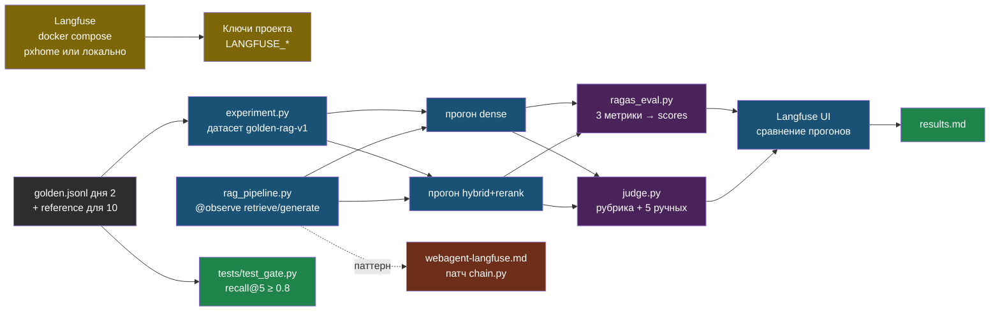

# День 5. Лаба: Langfuse, RAGAS и гейт качества

## Результат

Папка `~/proj/ai-labs/day5-evals/`: Langfuse self-hosted, RAG-пайплайн дня 2 с трейсами по шагам, golden-набор как датасет в Langfuse, два прогона (dense и hybrid + rerank) с оценками RAGAS и судьи на каждом трейсе, сравнение прогонов, pytest-гейт без LLM и готовый патч для web-agent. `results.md` — первая таблица качества генерации твоего RAG, а не только поиска.

## Карта лабы



## Подготовка

Нужны результаты дня 2 (Chroma `chunks_openai`, `chunks.jsonl`, `golden.jsonl`). Добавь эталонные ответы: открой `golden.jsonl` и к 10 вопросам допиши поле `"reference": "…"` — одно-два предложения с фактами из документа, своими словами. Это 15 минут ручной работы, без неё не будет context recall и калибровки судьи.

```bash
cd ~/proj/ai-labs && source .venv/bin/activate && source .env
pip install -q langfuse ragas langchain-openai pytest pandas
mkdir -p day5-evals/tests && cd day5-evals
```

## Шаг 1. Langfuse self-hosted (30–40 минут)

Вариант для портфолио — на pxhome в отдельном LXC (Debian 12, Docker CE, 4 vCPU, 6 ГБ RAM, 40 ГБ диска: ClickHouse любит память). Вариант для экономии времени — тот же compose на рабочей машине. Команды одинаковые:

```bash
git clone --depth 1 https://github.com/langfuse/langfuse.git && cd langfuse
openssl rand -hex 32      # ENCRYPTION_KEY — ровно 64 hex-символа
openssl rand -base64 32   # NEXTAUTH_SECRET и SALT — два разных значения
```

Открой `docker-compose.yml` и замени все секреты и пароли по умолчанию (ClickHouse, MinIO, Redis, Postgres, `NEXTAUTH_SECRET`, `SALT`, `ENCRYPTION_KEY`); `NEXTAUTH_URL` — адрес, по которому будешь открывать UI (`http://192.168.0.1xx:3000` или домен через NPM). Имена переменных сверяй с актуальным файлом репозитория — они меняются между версиями.

```bash
docker compose up -d
docker compose ps        # web, worker, postgres, clickhouse, redis, minio — все healthy через минуту-две
```

UI на порту 3000: регистрация, организация, проект `ai-labs`, ключи API → в `~/proj/ai-labs/.env`:

```bash
export LANGFUSE_PUBLIC_KEY="pk-lf-..."
export LANGFUSE_SECRET_KEY="sk-lf-..."
export LANGFUSE_HOST="http://192.168.0.1xx:3000"
```

Проверка из Python: `python -c "from langfuse import get_client; print(get_client().auth_check())"` → `True`. Если хочешь домен и HTTPS — proxy host в NPM, как для остальных сервисов на pxhome.

## Шаг 2. Система под тестом с трейсами

Поиск дня 2 плюс генерация; каждый шаг — наблюдение в трейсе, генерация — с токенами и моделью.

```python
# ~/proj/ai-labs/day5-evals/rag_pipeline.py
import os
import sys

from langfuse import get_client, observe
from openai import OpenAI

DAY2 = os.path.expanduser("~/proj/ai-labs/day2-rag-eval")
sys.path.insert(0, DAY2)
os.chdir(DAY2)  # Store читает chunks.jsonl и chroma/ относительно своей папки
from embed import Embedder      # noqa: E402
from retrievers import Store    # noqa: E402

BASE_URL = os.getenv("OPENROUTER_BASE_URL", "https://openrouter.ai/api/v1")
MODEL = os.getenv("LLM_MODEL", "anthropic/claude-sonnet-4.6")
SYSTEM = (
    "Отвечай только по контексту, по-русски, два-четыре предложения. После каждого факта указывай источник в виде [файл #чанк]. "
    "Если ответа в контексте нет — ответь ровно: «В документах нет ответа на этот вопрос»."
)

langfuse = get_client()
client = OpenAI(base_url=BASE_URL, api_key=os.environ["OPENROUTER_API_KEY"], timeout=60, max_retries=2)
store = Store("chunks_openai", Embedder("openrouter", "openai/text-embedding-3-small"))


@observe(name="retrieve")
def retrieve(question: str, mode: str, k: int = 5) -> list[dict]:
    hits = store.hybrid_rerank(question, k) if mode == "hybrid_rerank" else store.dense(question, k)
    langfuse.update_current_span(metadata={"mode": mode, "k": k, "files": [h["filename"] for h in hits]})
    return hits


@observe(as_type="generation", name="generate")
def generate(question: str, chunks: list[dict]) -> str:
    context = "\n\n".join(f"[{c['filename']} #{c['chunk_index']}]\n{c['text']}" for c in chunks)
    messages = [{"role": "system", "content": SYSTEM}, {"role": "user", "content": f"Контекст:\n{context}\n\nВопрос: {question}"}]
    r = client.chat.completions.create(model=MODEL, temperature=0, max_tokens=400, messages=messages)
    text = r.choices[0].message.content
    langfuse.update_current_generation(
        model=MODEL,
        input=messages,
        output=text,
        usage_details={"input": r.usage.prompt_tokens, "output": r.usage.completion_tokens},
    )
    return text


@observe(name="rag")
def rag(question: str, mode: str = "hybrid_rerank") -> dict:
    chunks = retrieve(question, mode)
    answer = generate(question, chunks)
    langfuse.update_current_trace(tags=[mode], input={"question": question}, output={"answer": answer})
    return {
        "answer": answer,
        "contexts": [c["text"] for c in chunks],
        "sources": [f"{c['filename']}#{c['chunk_index']}" for c in chunks],
    }


if __name__ == "__main__":
    out = rag(" ".join(sys.argv[1:]) or "На каком порту слушает Ollama по умолчанию?")
    print(out["answer"], "\n", out["sources"])
    langfuse.flush()
```

Запуск: `python rag_pipeline.py "как закрыть Ollama от интернета"`. В Langfuse появляется трейс `rag` с двумя вложенными наблюдениями; у `generate` видны модель, токены и — если в настройках проекта заведены цены модели — стоимость. Заведи цену своей модели в настройках Langfuse из прайса дня 1: без этого стоимость будет пустой.

## Шаг 3. Датасет и два прогона

```python
# ~/proj/ai-labs/day5-evals/experiment.py
import json
import os
import sys

from langfuse import get_client

from rag_pipeline import rag

DATASET = "golden-rag-v1"
GOLDEN = os.path.expanduser("~/proj/ai-labs/day2-rag-eval/golden.jsonl")
langfuse = get_client()


def ensure_dataset() -> None:
    try:
        if langfuse.get_dataset(DATASET).items:
            return
    except Exception:
        pass
    langfuse.create_dataset(name=DATASET, description="25 вопросов дня 2; reference у части")
    for line in open(GOLDEN, encoding="utf-8"):
        if not line.strip():
            continue
        g = json.loads(line)
        langfuse.create_dataset_item(
            dataset_name=DATASET,
            input={"question": g["q"]},
            expected_output={"doc": g["doc"], "must": g["must"], "reference": g.get("reference")},
        )


def run(mode: str, run_name: str) -> list[dict]:
    rows = []
    for item in langfuse.get_dataset(DATASET).items:
        with item.run(run_name=run_name, run_metadata={"mode": mode}) as root:
            out = rag(item.input["question"], mode)  # вложенный трейс привязывается к элементу датасета
            exp = item.expected_output
            hit = any(exp["must"].lower() in c.lower() for c in out["contexts"])
            root.score_trace(name="retrieval_hit", value=float(hit), comment=exp["must"])
            rows.append({
                "trace_id": root.trace_id,
                "question": item.input["question"],
                "answer": out["answer"],
                "contexts": out["contexts"],
                "reference": exp.get("reference"),
                "hit": hit,
            })
    langfuse.flush()
    return rows


if __name__ == "__main__":
    mode = sys.argv[1] if len(sys.argv) > 1 else "hybrid_rerank"
    run_name = sys.argv[2] if len(sys.argv) > 2 else f"{mode}-v1"
    ensure_dataset()
    rows = run(mode, run_name)
    json.dump(rows, open(f"run-{run_name}.json", "w", encoding="utf-8"), ensure_ascii=False, indent=2)
    print(f"{run_name}: {len(rows)} вопросов, retrieval_hit={sum(r['hit'] for r in rows) / len(rows):.2f}")
```

```bash
python experiment.py dense dense-v1
python experiment.py hybrid_rerank hybrid-v1
```

В Langfuse: Datasets → `golden-rag-v1` → два прогона, у каждого элемента — трейс и оценка `retrieval_hit`. Уже сейчас видно сравнение поиска по прогонам; дальше добавим оценки генерации.

## Шаг 4. RAGAS: три метрики на каждый трейс

Судья — сильная модель через OpenRouter; эмбеддинги для relevancy — та же модель, что в поиске. Флаг `check_embedding_ctx_length=False` обязателен: иначе LangChain отправит токены вместо текста, и OpenRouter вернёт ошибку.

```python
# ~/proj/ai-labs/day5-evals/ragas_eval.py
import json
import os
import sys

from langchain_openai import ChatOpenAI, OpenAIEmbeddings
from langfuse import get_client
from ragas import EvaluationDataset, evaluate
from ragas.embeddings import LangchainEmbeddingsWrapper
from ragas.llms import LangchainLLMWrapper
from ragas.metrics import Faithfulness, LLMContextPrecisionWithoutReference, LLMContextRecall, ResponseRelevancy

BASE_URL = os.getenv("OPENROUTER_BASE_URL", "https://openrouter.ai/api/v1")
JUDGE = os.getenv("JUDGE_MODEL", "anthropic/claude-sonnet-4.6")
KEY = os.environ["OPENROUTER_API_KEY"]
langfuse = get_client()

rows = json.load(open(sys.argv[1], encoding="utf-8"))
judge = LangchainLLMWrapper(ChatOpenAI(model=JUDGE, base_url=BASE_URL, api_key=KEY, temperature=0, timeout=120))
emb = LangchainEmbeddingsWrapper(OpenAIEmbeddings(model="openai/text-embedding-3-small", base_url=BASE_URL, api_key=KEY, check_embedding_ctx_length=False))

samples = [{"user_input": r["question"], "response": r["answer"], "retrieved_contexts": r["contexts"], **({"reference": r["reference"]} if r.get("reference") else {})} for r in rows]
with_ref = [s for s in samples if "reference" in s]

result = evaluate(EvaluationDataset.from_list(samples), metrics=[Faithfulness(), ResponseRelevancy(), LLMContextPrecisionWithoutReference()], llm=judge, embeddings=emb)
df = result.to_pandas()
if with_ref:
    df_ref = evaluate(EvaluationDataset.from_list(with_ref), metrics=[LLMContextRecall()], llm=judge).to_pandas()
    df = df.merge(df_ref[["user_input", "context_recall"]], on="user_input", how="left")

skip = {"user_input", "response", "retrieved_contexts", "reference"}
metric_cols = [c for c in df.columns if c not in skip]
print(df[metric_cols].describe().loc[["mean", "min"]].round(3).to_markdown())

for r, (_, s) in zip(rows, df.iterrows()):
    for name in metric_cols:
        value = s[name]
        if value == value:  # не NaN
            langfuse.create_score(trace_id=r["trace_id"], name=name, value=float(value))
langfuse.flush()
print(f"оценки записаны в {len(rows)} трейсов")
```

```bash
python ragas_eval.py run-dense-v1.json
python ragas_eval.py run-hybrid-v1.json
```

Каждый запуск — несколько десятков вызовов судьи; стоимость увидишь в Langfuse (судья тоже трейсится, если завести его через `langfuse.openai`, — необязательно). В UI у каждого трейса появляются оценки `faithfulness`, `answer_relevancy`, `llm_context_precision_without_reference`, `context_recall`; на странице прогона — средние. Сравни два прогона: обычно гибрид с реранкером поднимает context precision и faithfulness; relevancy почти не меняется. Запиши числа.

## Шаг 5. Свой судья с калибровкой

RAGAS не знает твоей задачи. Свой судья с рубрикой оценивает «правильность по эталону» и калибруется на ручной разметке.

```python
# ~/proj/ai-labs/day5-evals/judge.py
import json
import os
import sys

from langfuse import get_client
from openai import OpenAI
from pydantic import BaseModel, Field

BASE_URL = os.getenv("OPENROUTER_BASE_URL", "https://openrouter.ai/api/v1")
JUDGE = os.getenv("JUDGE_MODEL", "anthropic/claude-sonnet-4.6")
client = OpenAI(base_url=BASE_URL, api_key=os.environ["OPENROUTER_API_KEY"], timeout=60)
langfuse = get_client()

RUBRIC = """Ты судья качества ответа службы поддержки. Сравни ОТВЕТ с ЭТАЛОНОМ.
Оценка: 2 — все ключевые факты эталона присутствуют и нет противоречий; 1 — часть фактов есть, противоречий нет;
0 — ключевые факты отсутствуют или есть противоречие эталону. Честный отказ при отсутствии ответа в эталоне = 2.
Сначала напиши обоснование в одно предложение, потом оценку."""


class Verdict(BaseModel):
    reasoning: str = Field(description="Одно предложение: что совпало, что нет")
    score: int = Field(ge=0, le=2)


def judge(question: str, answer: str, reference: str) -> Verdict:
    r = client.chat.completions.create(
        model=JUDGE, temperature=0, max_tokens=200,
        response_format={"type": "json_schema", "json_schema": {"name": "verdict", "schema": Verdict.model_json_schema()}},
        messages=[{"role": "system", "content": RUBRIC}, {"role": "user", "content": f"ВОПРОС: {question}\nЭТАЛОН: {reference}\nОТВЕТ: {answer}"}],
    )
    return Verdict.model_validate_json(r.choices[0].message.content)


if __name__ == "__main__":
    rows = [r for r in json.load(open(sys.argv[1], encoding="utf-8")) if r.get("reference")]
    manual = json.load(open("manual_labels.json", encoding="utf-8")) if os.path.exists("manual_labels.json") else {}
    agree, total = 0, 0
    for r in rows:
        v = judge(r["question"], r["answer"], r["reference"])
        langfuse.create_score(trace_id=r["trace_id"], name="correctness_judge", value=v.score / 2, comment=v.reasoning)
        mark = ""
        if r["question"] in manual:
            total += 1
            agree += int(manual[r["question"]] == v.score)
            mark = f" | человек: {manual[r['question']]}"
        print(f"{v.score} | {r['question'][:60]} | {v.reasoning[:80]}{mark}")
    langfuse.flush()
    if total:
        print(f"\nсогласие судьи с ручной разметкой: {agree}/{total}")
```

Перед запуском разметь сам пять ответов из `run-hybrid-v1.json` по той же шкале 0–2 в `manual_labels.json` (`{"вопрос": 2, ...}`), не глядя на судью. Запуск: `python judge.py run-hybrid-v1.json`. Согласие 4/5 и выше — судье можно доверять на этой задаче; 2/5 — правь рубрику, не набор. Число согласия — в отчёт: это и есть калибровка.

## Шаг 6. Гейт для CI без LLM

Дешёвая детерминированная проверка, которая ловит поломку поиска за минуту и не зависит от судьи.

```python
# ~/proj/ai-labs/day5-evals/tests/test_gate.py
import json
import os
import sys

import pytest

DAY2 = os.path.expanduser("~/proj/ai-labs/day2-rag-eval")
sys.path.insert(0, DAY2)
os.chdir(DAY2)
from embed import Embedder      # noqa: E402
from retrievers import Store    # noqa: E402

GOLDEN = [json.loads(l) for l in open("golden.jsonl", encoding="utf-8") if l.strip()]
THRESHOLD = float(os.getenv("GATE_RECALL_AT_5", "0.8"))


@pytest.fixture(scope="session")
def store():
    return Store("chunks_openai", Embedder("openrouter", "openai/text-embedding-3-small"))


def test_recall_at_5_gate(store):
    hits = 0
    misses = []
    for g in GOLDEN:
        res = store.hybrid(g["q"], 5)
        ok = any(r["filename"] == g["doc"] and g["must"].lower() in r["text"].lower() for r in res)
        hits += ok
        if not ok:
            misses.append(g["q"])
    recall = hits / len(GOLDEN)
    assert recall >= THRESHOLD, f"recall@5 = {recall:.2f} ниже порога {THRESHOLD}; промахи: {misses[:5]}"


def test_refusal_on_unanswerable(store):
    """Вопрос вне корпуса не должен приносить «уверенные» фрагменты: проверяем, что нет попадания по документам."""
    res = store.hybrid("какая погода в Томске завтра", 5)
    assert not any("томск" in r["text"].lower() and "погод" in r["text"].lower() for r in res)
```

Запуск: `cd ~/proj/ai-labs/day5-evals && pytest -q tests/`. Порог возьми на два-три попадания ниже текущего recall — гейт должен ловить поломку, а не шум. В CI это шаг перед деплоем; для web-agent — рядом с существующим self-test.

## Шаг 7. Патч для web-agent

Тот же паттерн — в прод. Опиши в `webagent-langfuse.md` и, если есть время, примени на ветке и проверь локально через docker compose:

```python
# services/agent-api/app/rag/chain.py — фрагменты изменения
from langfuse import get_client, observe

langfuse = get_client()  # ключи из LANGFUSE_PUBLIC_KEY / LANGFUSE_SECRET_KEY / LANGFUSE_HOST в окружении контейнера


@observe(as_type="generation", name="openrouter.chat")
async def _complete(client, api_key: str, role, messages: list[dict]) -> dict:
    resp = await client.post(f"{OPENROUTER_BASE}/chat/completions", headers={"Authorization": f"Bearer {api_key}"},
                             json={"model": role.model, "max_tokens": role.max_tokens, "temperature": role.temperature, "messages": messages})
    resp.raise_for_status()
    data = resp.json()
    usage = data.get("usage", {})
    langfuse.update_current_generation(model=role.model, usage_details={"input": usage.get("prompt_tokens", 0), "output": usage.get("completion_tokens", 0)},
                                       cost_details={"total": usage.get("cost", 0.0) or 0.0})
    return data


@observe(name="rag.answer")
async def answer(site_id: int, role, message: str, history=None, session_id: str | None = None) -> dict:
    langfuse.update_current_trace(session_id=session_id, tags=[f"site:{site_id}", role.slug], metadata={"history_turns": len(history or [])})
    chunks = await retrieve(site_id, message)          # retrieve — тоже @observe(name="rag.retrieve")
    ...
    langfuse.score_current_trace(name="answered", value=1.0 if answered else 0.0)
```

Дополнительно в патче: `langfuse` в `requirements.txt`; переменные в compose и Ansible-роли; маскирование телефонов и email до отправки трейса (`Langfuse(mask=...)` с regex) — это 152-ФЗ; `session_id` пробрасывается из `routers/chat.py`. Оценка `answered` на трейсе делает честный отказ метрикой, которую можно строить по дням — готовый сигнал дрейфа. Релиз — по обычному пути: тег, self-test-гейт, rolling update.

## Шаг 8. results.md и коммит

```markdown
# День 5 — evals (дата, модель, судья, Langfuse адрес)

## Два прогона на golden-rag-v1 (25 вопросов, reference у 10)
| прогон | retrieval_hit | faithfulness | answer_relevancy | context_precision | context_recall (10) | correctness_judge (10) | $ за прогон | p50 мс |
| dense-v1 | … | … | … | … | … | … | … | … |
| hybrid-v1 | … | … | … | … | … | … | … | … |

## Калибровка судьи: согласие с ручной разметкой …/5; что поправил в рубрике
## Гейт: recall@5 порог …, время прогона … с
## Стоимость одного модельного прогона RAGAS: $… → частота запуска: …
## Что уходит в web-agent (патч) и что покажет через неделю (тренд answered)
```

Коммит: `git add -A && git commit -m "day5: Langfuse tracing, dataset runs, RAGAS + calibrated judge, pytest gate, web-agent patch"`, push.

## Если не получилось

- **`auth_check()` = False** — ключи от другого проекта или `LANGFUSE_HOST` без схемы; в v3 хост обязателен для self-hosted.
- **Трейсы не появляются** — SDK отправляет фоном; в коротких скриптах обязателен `langfuse.flush()` в конце.
- **Стоимость пустая** — модель не заведена в настройках проекта Langfuse с ценами; добавь из прайса дня 1.
- **RAGAS падает на парсинге JSON** — судья вернул текст вместо JSON; смени `JUDGE_MODEL` на модель с надёжным structured output или уменьши батч.
- **Ошибка эмбеддингов в RAGAS** — забыт `check_embedding_ctx_length=False`.
- **Вложенный трейс не привязался к элементу датасета** — `rag()` вызван вне `with item.run(...)`; вызов должен быть внутри контекста.
- **ClickHouse не стартует** — мало памяти в LXC; 4 ГБ — минимум, 6 — спокойно.
- **Судья согласен с тобой на 2/5** — рубрика неоднозначна; уточни, что считать «ключевым фактом», добавь пример в рубрику; не подгоняй разметку.

## Практика

1. **Тренд дрейфа**: SQL по таблице сообщений web-agent — доля `answered = false` по неделям за всё время; вынеси на график в Grafana (книга 38) как первую метрику качества прода.
2. **Prompt management**: заведи системный промпт `rag_pipeline.py` в Langfuse как версионируемый промпт и прокинь версию в трейс; сравни два варианта формулировки честного отказа на датасете.
3. **Онлайн-выборка**: скрипт, который берёт 20 случайных трейсов прода за день и прогоняет по ним faithfulness — стоимость и время; это будущая ночная задача.

## Что проверить

- Langfuse работает, `auth_check()` = True, у модели заведены цены.
- Два прогона на датасете `golden-rag-v1` с трейсами `retrieve` и `generate` у каждого элемента.
- У трейсов есть оценки `retrieval_hit`, `faithfulness`, `answer_relevancy`, `llm_context_precision_without_reference`, `context_recall` (10) и `correctness_judge` (10).
- Согласие судьи с ручной разметкой измерено и записано; рубрика — в репозитории.
- `pytest -q tests/` проходит; порог и время прогона — в отчёте.
- `webagent-langfuse.md` содержит патч с маскированием PII и оценкой `answered`.
- `results.md` заполнен числами двух прогонов; коммит запушен.
