# Глоссарий дня 5

Термины по алфавиту, с английским оригиналом и указанием, где встречаются. К каждому термину — схема-подсказка в палитре курса: серый — вход, синий — процесс, зелёный — результат, коричневый — ошибка/опасность, жёлтый — данные/хранение, фиолетовый — внешнее/сравнение.

---

**Answer correctness** — метрика совпадения ответа с эталоном по фактам и смыслу; требует reference. Глава 1.

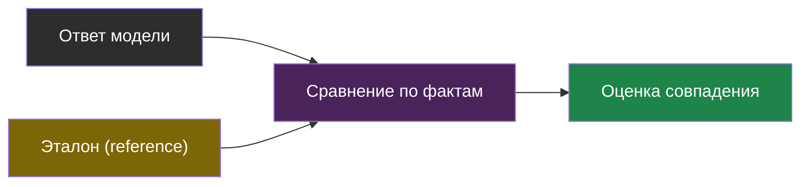

---

**Calibration (калибровка судьи)** — измерение согласия оценок модели-судьи с ручной разметкой до масштабирования; порог доверия около 80 %. Глава 1, лаба шаг 5.

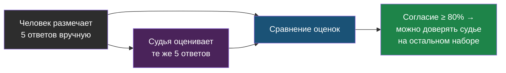

---

**Context precision / context recall** — метрики RAGAS: релевантные фрагменты стоят выше нерелевантных; контекст покрывает утверждения эталона. Глава 1.

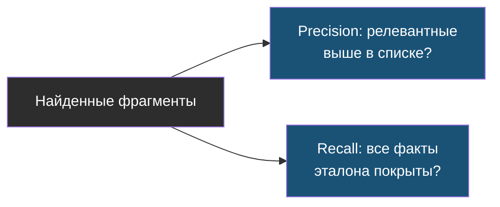

---

**Dataset / experiment run** — golden-набор внутри платформы трейсинга и прогон системы по нему; прогоны сравниваются между версиями. Лаба, шаг 3.

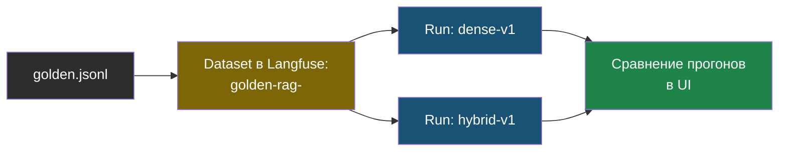

---

**Drift (дрейф качества)** — деградация без изменения кода: обновление модели провайдером, новые типы вопросов, устаревший индекс; ловится трендами. Главы 1 и 3.

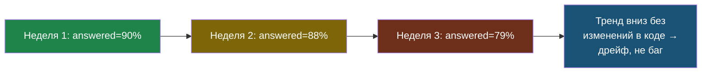

---

**Evals** — систематическая оценка LLM-системы на наборе примеров с известным ожиданием; офлайн и онлайн, детерминированные и модельные. Главы 1–3.

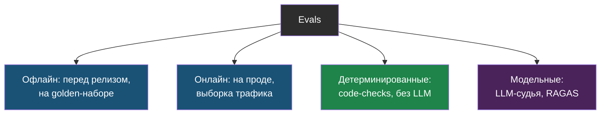

---

**Faithfulness** — доля утверждений ответа, подтверждённых контекстом; главная метрика против выдумок в RAG. Главы 1–2.

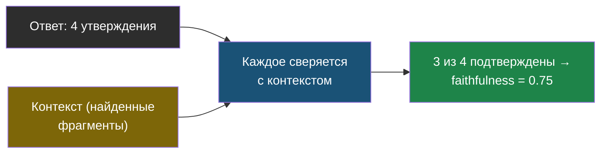

---

**Gate (регрессионный гейт)** — автоматическая проверка в CI, блокирующая изменение при падении метрики ниже порога; детерминированная на PR, модельная на релиз. Лаба, шаг 6.

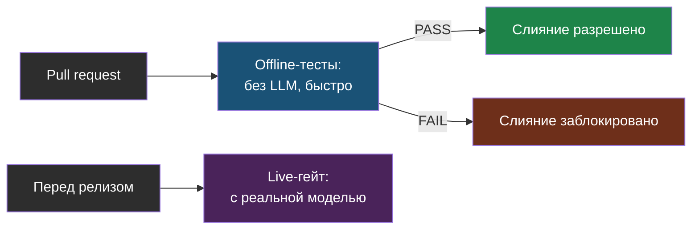

---

**Generation** — наблюдение в трейсе, соответствующее вызову модели: промпт, ответ, модель, токены, стоимость, TTFT. Глава 1.

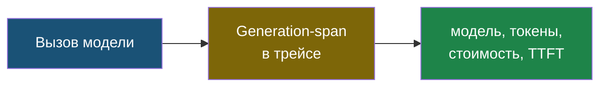

---

**Golden-набор с эталонами** — вопросы с указанием источника и эталонным ответом человека; версионируется в git, меняется осознанно. Глава 1.

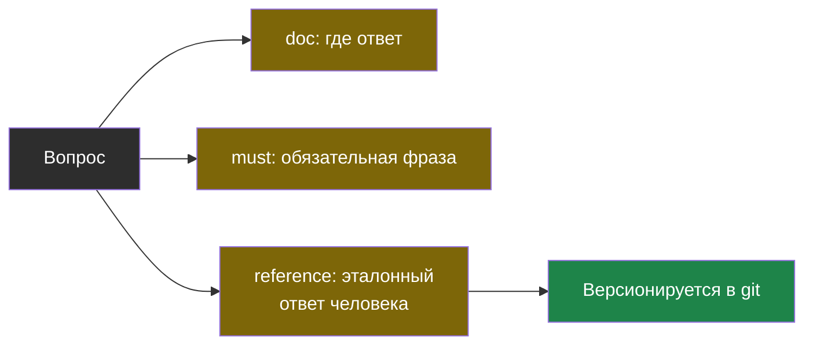

---

**Implicit feedback (неявный сигнал)** — событие в проде, косвенно отражающее качество: честный отказ, передача оператору, повтор вопроса, оставленный контакт. Главы 1 и 3.

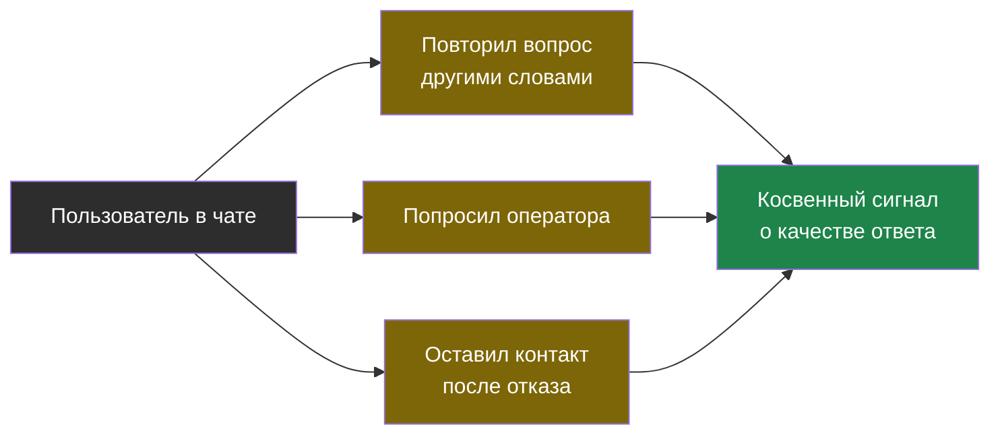

---

**Langfuse** — open source платформа наблюдаемости LLM: трейсы, генерации, оценки, датасеты, версии промптов; self-hosted через Docker Compose. Главы 1–2.

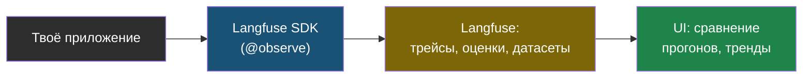

---

**LLM-as-judge** — использование модели для оценки ответов по рубрике; требует structured output, temperature 0, калибровки и знания смещений. Главы 1–3.

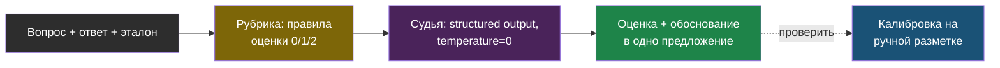

---

**Masking (маскирование PII)** — удаление или замена персональных данных в промптах и ответах до отправки в трейсы. Лаба, шаг 7.

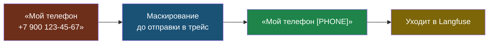

---

**Observability (наблюдаемость)** — способность понять поведение системы по трейсам, метрикам и логам; для LLM — с содержимым промптов, токенами и стоимостью. Глава 1.

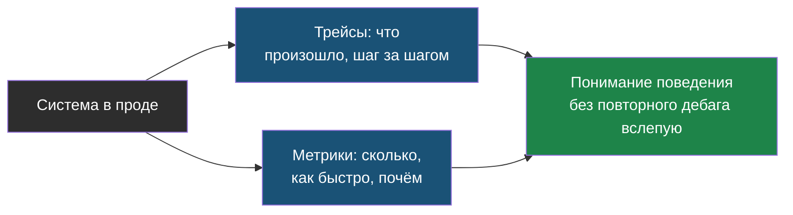

---

**Position bias / verbosity bias** — смещения судьи: предпочтение первого варианта в паре и более длинного ответа. Глава 1.

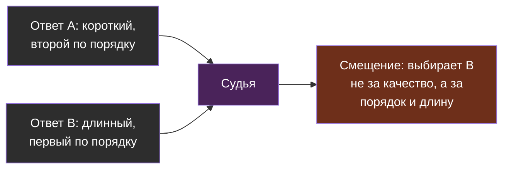

---

**RAGAS** — библиотека метрик оценки RAG с моделью-судьёй; результаты сравнимы только внутри одной системы и судьи. Главы 1–2.

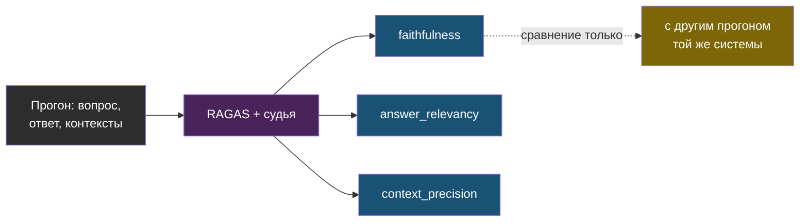

---

**Response relevancy (answer relevancy)** — метрика соответствия ответа вопросу через эмбеддинги сгенерированных вопросов; занижает честный отказ. Глава 1.

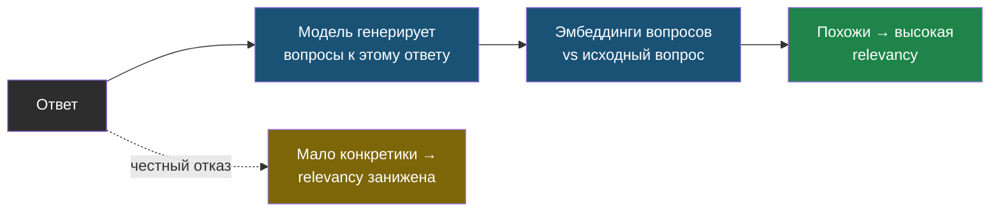

---

**Score** — оценка, привязанная к трейсу: от пользователя, судьи или детерминированной проверки. Лаба, шаги 3–5.

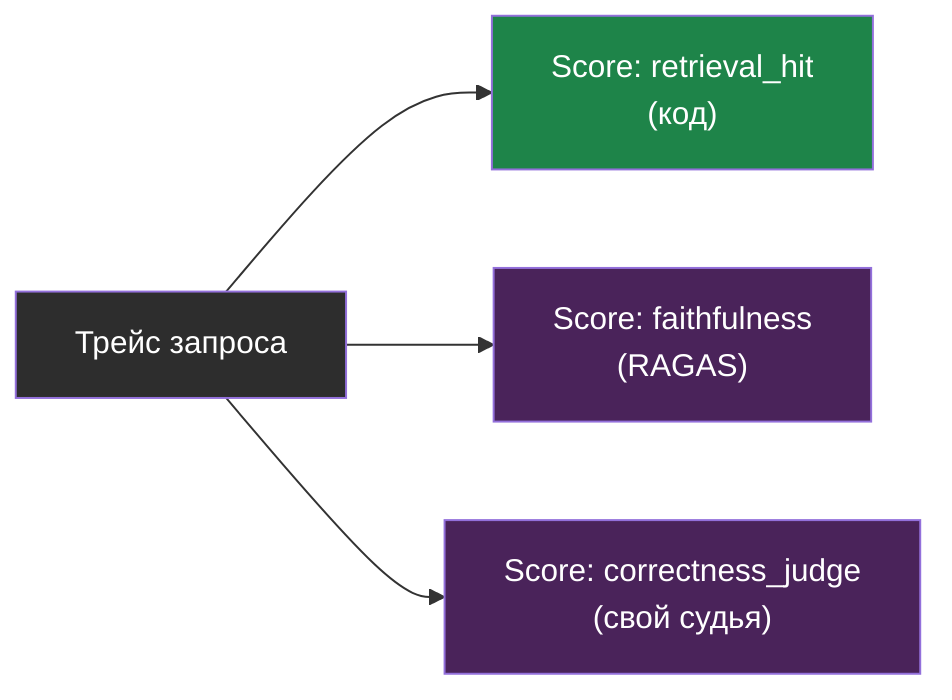

---

**Span** — шаг внутри трейса с длительностью и входом-выходом: поиск, реранкинг, инструмент. Глава 1.

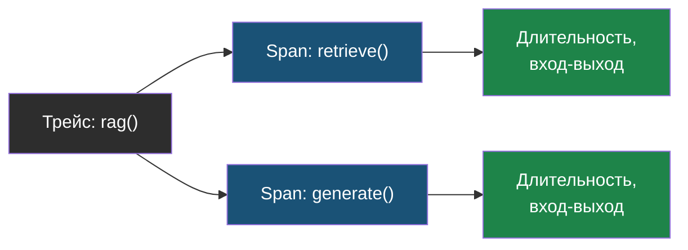

---

**Trace** — один запрос пользователя целиком с метаданными: сессия, tenant, версия промпта, теги. Глава 1.

```mermaid
flowchart LR
    REQ["Запрос пользователя"] --> TR["Trace"]
    TR --> META["session, tenant,\nversion, tags"]
    TR --> SPANS["Вложенные spans:\nretrieve, generate"]
    style REQ fill:#2d2d2d,color:#fff
    style TR fill:#7d6608,color:#fff
    style META fill:#1a5276,color:#fff
    style SPANS fill:#1a5276,color:#fff
```

---

**Allowlist telemetry** — экспорт только явно разрешённых метрик/технических идентификаторов; отключение автоматического захвата аргументов, результатов и секретов. Лаба, шаг 7.

```mermaid
flowchart LR
    ALL["Всё, что можно\nзалогировать"] --> LIST["Allowlist: только\nmodel, tokens, id"]
    LIST --> SEND["Уходит в трейс"]
    ALL -. текст, ключи, PII .-> BLOCK["Не в allowlist →\nне уходит"]
    style ALL fill:#2d2d2d,color:#fff
    style LIST fill:#7d6608,color:#fff
    style SEND fill:#1e8449,color:#fff
    style BLOCK fill:#6e2f1a,color:#fff
```

---

**Ошибка проверки (ERROR)** — сценарий нельзя оценить из-за API/формата/данных; не равен провалу поведения (FAIL), пропуску (SKIPPED) или успеху (PASS). Главы 1–2.

```mermaid
flowchart LR
    T["Проверка"] --> PASS["PASS: поведение верное"]
    T --> FAIL["FAIL: поведение неверное"]
    T --> SKIP["SKIPPED: осознанно\nне запускалась"]
    T --> ERR["ERROR: нельзя оценить\n(сбой API/данных)"]
    style T fill:#2d2d2d,color:#fff
    style PASS fill:#1e8449,color:#fff
    style FAIL fill:#6e2f1a,color:#fff
    style SKIP fill:#7d6608,color:#fff
    style ERR fill:#4a235a,color:#fff
```
