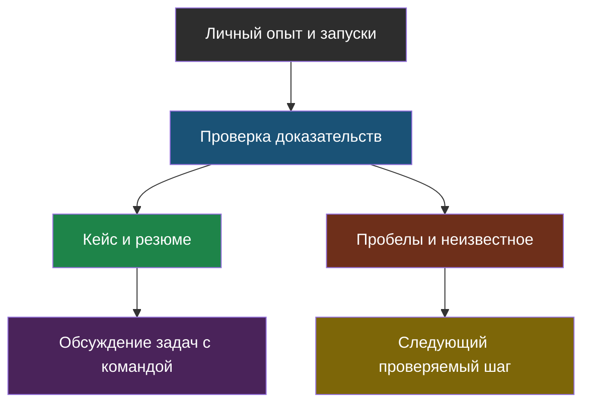

# День 7. Доказательства навыков и поиск роли

## Зачем это на собеседовании

Уметь что-то делать и уметь ясно рассказать, что именно ты делал — это два разных навыка, и второй на собеседовании важен не меньше первого. Сегодняшняя задача — не изобразить из себя уже готового опытного специалиста, а научиться ясно показывать: что именно сделал лично ты, как ты это проверил, и где честно проходит граница твоего опыта. Порядок этапов найма и конкретные требования сильно зависят от компании — приведённая ниже схема этапов это просто ориентир для подготовки, а не гарантированный сценарий и не обещание, что именно столько собеседований приведёт к офферу.

## Сначала доказательства, затем формулировки

Прежде чем писать что-то в резюме, полезно чётко понимать, к какому из трёх уровней относится конкретное утверждение — и что каждый уровень на самом деле доказывает, а что нет:

| Уровень утверждения | Достаточное подтверждение | Чего не доказывает |
|---|---|---|
| Концепт | объяснение принципа, trade-off и ошибки без подсказки | что инструмент запущен |
| Лаба | воспроизводимая команда, версии, безопасные данные, результат и негативный тест | production-надёжность |
| Прод | конкретная роль, релиз, период эксплуатации, разрешённые наблюдения | масштаб и эффект, которые не измерялись |

То есть если ты можешь объяснить принцип работы чего-то и знаешь его типичные ловушки — это уровень «концепт», и это ценно само по себе, но это ещё не значит, что ты хоть раз это запускал. Если ты реально запускал лабу и можешь воспроизвести результат — это уже следующий уровень, но это всё ещё не то же самое, что надёжность в реальном проде под реальной нагрузкой. Смешивать эти уровни в резюме — типичная ошибка, которая быстро вскрывается на техническом интервью первым же уточняющим вопросом.

Отдельно стоит проговорить один частный, но важный случай: файл с кодом, который сгенерировал ИИ-агент (например, Claude Code), становится по-настоящему **твоим** проверенным артефактом только после того, как ты сам его запустил и разобрался, что и почему он делает — а не в момент, когда агент его написал. То, что осталось невыполненным из плана «на будущее» (stretch), так и остаётся планом, а не выполненной задачей. Периоды работы, число реальных клиентов, конкретные прошлые инциденты и то, насколько улучшилось качество — всё это нужно писать по факту из своего опыта, а не копировать из шаблонных примеров резюме, найденных где-то в интернете.

## Возможные этапы найма

| Этап | Что подготовить |
|---|---|
| Резюме/первый разговор | профиль, личный вклад, ограничения, подходящие задачи |
| Технический разговор | один глубокий кейс, код/измерения, отрицательные результаты |
| Практика | уточнение требований, простой baseline, тесты и README |
| Проектирование | требования, оценка нагрузки, варианты, риски, rollout |
| Встреча с командой | вопросы о задачах, процессе, данных и ответственности |
| Обсуждение условий | собственные приоритеты, ясность о составе предложения |

В реальности некоторые из этих этапов могут объединяться в один разговор, а какие-то вообще отсутствовать в конкретном процессе найма — это нормально и не значит, что с тобой что-то не так. Полезно вести свою собственную таблицу откликов и результатов, но важно не делать далеко идущих выводов из маленькой выборки: если из пяти откликов не пришло ни одного ответа, это ещё не «нормальная вероятность найма» на рынке — вывод, для которого выборки просто мало. Слова «junior», «middle» и «senior» в названиях вакансий тоже не заменяют реального сопоставления задач вакансии с твоим опытом и независимой самооценки навыков — компании используют эти слова очень по-разному.

## Резюме без завышения

Название позиции в резюме должно соответствовать тем задачам, которые тебе реально интересны, а не быть максимально широким «на всякий случай». Навыки стоит группировать по роли в проекте, а не просто перечислять как можно больше названий библиотек подряд, чтобы выглядеть внушительнее. Для каждого тезиса в резюме держи в голове одну и ту же структуру: «что сделал лично → каким инструментом или методом → как проверил результат → в чём ограничение». Слово «изучаю» вполне уместно в разделе про развитие и планы, но не должно маскироваться под уже выполненный, законченный проект. При этом черновик резюме совсем не обязан быть опубликован немедленно или переписываться каждый день ради недоказанного эффекта «чаще мелькаю в выдаче у рекрутеров» — спешка тут не помогает.

Для каждой вакансии, на которую откликаешься, стоит сохранять: дату отклика, ссылку на вакансию, в каком формате откликался, какие задачи и требования там были указаны, и какие из твоих собственных подтверждений им соответствуют. Ожидания по зарплате при этом зависят не только от рынка, но и от твоих личных условий и от того, что конкретно входит в предложение целиком (не только оклад) — медиана зарплат по нескольким разным вакансиям сама по себе не определяет ни твой реальный уровень, ни справедливую именно для тебя цену.

## Кейс и STAR

Хороший кейс для собеседования строится по одной и той же схеме: задача пользователя или бизнеса → условия и твоя личная роль в решении → как была устроена схема решения → какие были рассмотрены варианты и почему выбран именно этот, с какой ценой (компромиссом) → какой результат реально наблюдался → какое есть ограничение у этого решения и какой следующий эксперимент напрашивается. Если детали проекта закрыты договором о неразглашении — можно либо опубликовать разрешённый, специально обезличенный пример, либо просто устно обсуждать только те факты, которые точно согласованы и не нарушают договорённостей.

Формат STAR (Situation, Task, Action, Result — ситуация, задача, действия, результат) устроен похоже: ситуация → какая конкретно задача стояла перед тобой → какие действия ты предпринял, основываясь на реальных наблюдениях → какой результат в итоге удалось проверить. Для этого формата вполне подходит и учебная неудача — если она честно так и названа учебной, а не выдана за прод. Не стоит придумывать драматичный инцидент, которого не было, ради более интересного рассказа; а профилактическое изменение, которое ты сделал заранее, лучше отдельно и честно пометить как план, как тест или как реальный production-релиз — это разные по весу вещи, и путать их не стоит.

## System design — не список инструментов

На вопросах вида «спроектируйте систему X» сначала стоит уточнить, а не сразу рисовать схему: сколько будет пользователей, насколько параллельна нагрузка, как часто обновляются данные, какие нужны права доступа, какая допустима погрешность, какой требуется SLA (гарантированный уровень обслуживания) и какой есть бюджет. И только после этого выбирать простой baseline (отправную точку) и план того, как будешь измерять его качество — а не сразу перечислять все известные модные инструменты подряд. Важно помнить: количество файлов в корпусе документов само по себе не определяет размер нужного индекса или то, окупится ли свой GPU (день 6) — это отдельные, реально считаемые вещи; название конкретного хранилища данных тоже само по себе не гарантирует изоляцию доступа между клиентами (день 3) — изоляцию обеспечивает конкретная настройка, а не выбор бренда.

Полезная практика — нарисовать явные границы доверия и все потоки данных, уходящие наружу системы: к провайдеру модели, к сервису эмбеддингов, к судье (день 5), в телеметрию, в бэкапы. Требования к персональным данным и договорным ограничениям стоит согласовывать с ответственными специалистами применительно к каждому конкретному потоку данных отдельно; сам факт self-hosted-развёртывания (у себя, не в чужом облаке) при этом не является автоматическим доказательством соответствия закону. Подробные источники и юридические оговорки на эту тему — в [дне 6](../06-models-serving-ru-security/chapter-01.md).

## Схема

## Что у тебя уже есть

Исходный опыт, перечисленный в README курса — это лишь предпосылка для твоего персонального трека, а не что-то, что уже подтверждено самим фактом прохождения этой недели. Каждый нужный факт стоит подтверждать своими реальными проектами, а не ссылкой на программу курса. Результаты недели берутся из твоих заполненных отчётов по дням: если каких-то данных нет или какой-то запуск не удался — это тоже честный, нормальный статус, а не повод заменить его красивым, но неправдивым обещанием.

## Практика

1. Для одной интересующей вакансии сопоставь три задачи со своими доказательствами и одним пробелом.
2. Проверь два буллета: нет ли в них чужой биографии, переноса smoke-результата на production или причинности без сравнения.

## Что проверить

- [ ] Различаю концепт, воспроизведённую лабу и production-опыт.
- [ ] Могу показать личный вклад, а неподтверждённые факты удалены.
- [ ] Выбор роли и условия не выведены из гарантии курса или выдуманной конверсии.
- [ ] Есть вопрос работодателю о задачах и процессах, а не только о стеке.
