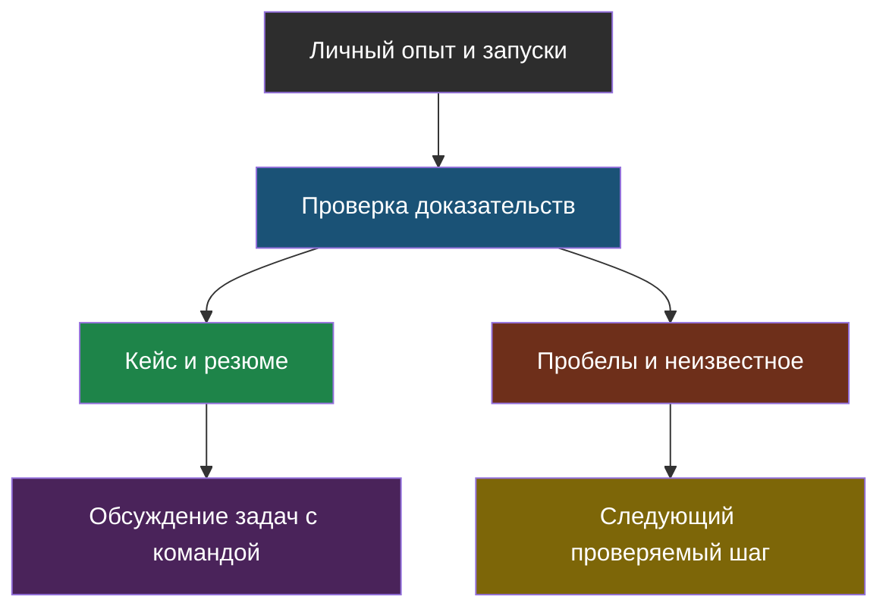

# День 7. Доказательства навыков и поиск роли

## Зачем это на собеседовании

Техническая работа и её изложение — разные навыки. Сегодня задача не изобразить готового специалиста, а ясно показать личный вклад, методы проверки и границы опыта. Порядок этапов найма и требования зависят от компании; приведённая схема — ориентир подготовки, не прогноз конверсии или присвоение уровня.

## Сначала доказательства, затем формулировки

| Уровень утверждения | Достаточное подтверждение | Чего не доказывает |
|---|---|---|
| Концепт | объяснение принципа, trade-off и ошибки без подсказки | что инструмент запущен |
| Лаба | воспроизводимая команда, версии, безопасные данные, результат и негативный тест | production-надёжность |
| Прод | конкретная роль, релиз, период эксплуатации, разрешённые наблюдения | масштаб и эффект, которые не измерялись |

Файл с кодом, сгенерированный агентом, становится твоим проверенным артефактом после собственного запуска и разбора. Непройденный stretch остаётся планом. Периоды, число клиентов, исторические инциденты и улучшение качества не копируются из шаблонов.

## Возможные этапы найма

| Этап | Что подготовить |
|---|---|
| Резюме/первый разговор | профиль, личный вклад, ограничения, подходящие задачи |
| Технический разговор | один глубокий кейс, код/измерения, отрицательные результаты |
| Практика | уточнение требований, простой baseline, тесты и README |
| Проектирование | требования, оценка нагрузки, варианты, риски, rollout |
| Встреча с командой | вопросы о задачах, процессе, данных и ответственности |
| Обсуждение условий | собственные приоритеты, ясность о составе предложения |

Этапы могут объединяться или отсутствовать. Веди собственную таблицу откликов, но не экстраполируй маленькую выборку в «нормальную» вероятность найма. Junior/middle/senior в названиях не заменяют сопоставление задач и независимую оценку навыков.

## Резюме без завышения

Название соответствует интересующим задачам; навыки группируются по роли, а не по количеству библиотек. Для каждого тезиса: «что сделал лично → чем → как проверил → ограничение». «Изучаю» допустимо в плане развития, но не должно маскировать отсутствие запуска в разделе выполненных проектов. Черновик не требует немедленной публикации или ежедневных изменений ради недоказанного эффекта выдачи.

Для вакансий сохраняй дату, ссылку, формат, задачи, требования и свои подтверждения. Зарплатные ожидания зависят также от собственных условий и состава предложения; медиана нескольких разных вакансий не определяет уровень или справедливую цену автоматически.

## Кейс и STAR

Кейс: пользовательская задача → условия и личная роль → схема → варианты и цена выбранного решения → наблюдаемый результат → ограничение и следующий эксперимент. Если коммерческие сведения закрыты, публикуй разрешённый обезличенный пример или только обсуждай согласованные факты.

STAR: ситуация → твоя задача → действия на основе наблюдений → проверенный результат. Подходит и учебный сбой, если он так и назван. Не выдумывай инцидент ради драматичного рассказа; профилактическое изменение отдельно отмечай как план, тест или production-релиз.

## System design — не список инструментов

Сначала уточни пользователей, параллелизм, обновления данных, права, допустимую ошибку, SLA и бюджет. Затем выбери простой baseline и план измерений. Количество файлов не даёт автоматически размер индекса или окупаемость GPU; название хранилища не определяет изоляцию доступа.

Нарисуй границы доверия и все исходящие потоки: провайдер, embedding, judge, телеметрия, backup. Требования к персональным данным и договорным ограничениям согласуются с ответственными специалистами по конкретным потокам; self-hosted сам по себе не является доказательством соответствия. Подробные источники и оговорки — в [дне 6](../06-models-serving-ru-security/chapter-01.md).

## Схема

## Что у тебя уже есть

Исходный опыт, перечисленный в README, — предпосылка персонального трека, не проверка этой сессией. Подтверди нужные факты своими проектами. Результаты недели берутся из заполненных отчётов: отсутствие данных или неудачный запуск — тоже честный статус, а не повод заменить его обещанием.

## Практика

1. Для одной интересующей вакансии сопоставь три задачи со своими доказательствами и одним пробелом.
2. Проверь два буллета: нет ли в них чужой биографии, переноса smoke-результата на production или причинности без сравнения.

## Что проверить

- [ ] Различаю концепт, воспроизведённую лабу и production-опыт.
- [ ] Могу показать личный вклад, а неподтверждённые факты удалены.
- [ ] Выбор роли и условия не выведены из гарантии курса или выдуманной конверсии.
- [ ] Есть вопрос работодателю о задачах и процессах, а не только о стеке.
