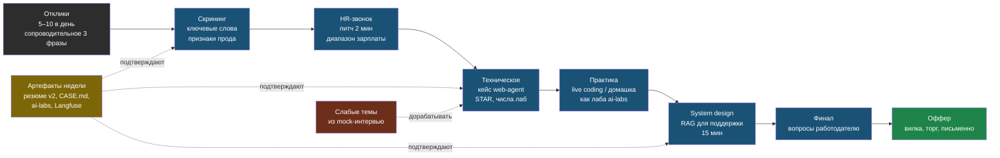

# День 7. Как нанимают AI-инженера в РФ: суть

## Зачем это на собеседовании

Шесть дней ты наращивал содержание. Сегодня — форма, и она решает не меньше: рекрутер тратит на резюме секунды, технический интервьюер ждёт структуру, а не поток, руководитель ищет человека, который принесёт результат, а не ещё одного изучающего. Ошибки формы стоят дороже пробелов в знаниях: сильного кандидата с плохим резюме не позовут, а среднего с хорошей подачей позовут и проверят. Эта глава — про то, как пройти каждый этап воронки, зная, что на нём проверяют.

## Воронка найма и что проверяют на каждом этапе

| Этап | Кто | Что проверяет | Что показать |
|---|---|---|---|
| **Скрининг резюме** | Рекрутер, 6–10 секунд на первый взгляд; поиск по ключевым словам | Совпадение названия и стека с вакансией, признаки прода, отсутствие красных флагов | Название резюме = название вакансии; первые четыре строки «О себе» — вся суть; ключевые слова текстом |
| **HR-звонок** | Рекрутер, 15–20 минут | Мотивация, зарплатные ожидания, формат работы, адекватность, готовность к процессу | Питч на две минуты, диапазон зарплаты, вопросы про процесс найма |
| **Техническое интервью** | Инженер или лид, 45–90 минут | Понимание, а не заученность; глубина на одном проекте; умение говорить о trade-off и ошибках | Кейс продукта, истории инцидентов, числа из лаб, честные границы |
| **Практическое задание** | Live coding 30–60 минут или домашнее 4–8 часов | Код, структура, тесты, README; в AI-вакансиях — мини-RAG, парсер, async-клиент к API, Pydantic-схемы | Код как в `ai-labs`: короткий, с проверками и измерениями |
| **System design** | Лид или архитектор, 45 минут | Способ мышления: требования → компоненты → trade-off → риски → метрики | 15-минутная структура «RAG для поддержки» с переходами по вопросам интервьюера |
| **Финал** | Руководитель, иногда команда | Совместимость, самостоятельность, отношение к неопределённости | Вопросы к работодателю, ясность про то, что ты ищешь |
| **Оффер** | HR и руководитель | Согласие по деньгам, дате, формату | Диапазон из таблицы вакансий, спокойный торг, письменное подтверждение |

Воронка — это числа: из тридцати откликов на middle-позиции обычно пять-восемь ответов, два-три технических, один-два финала. Поэтому отклики каждый день, а не «когда всё выучу».

## Как читают резюме AI-инженера

Что ищут глазами за первые секунды: **слова из вакансии** — RAG, LangGraph, векторные базы, evals, Python, FastAPI; **признаки прода** — «в проде», «клиенты», «пользователи», «инцидент», «стоимость»; **числа** — recall, латентность, стоимость, объёмы; **ссылки** — GitHub с кодом и результатами, демо. Что отталкивает: список из сорока технологий без глубины; «изучаю», «знакомлюсь», «базовые знания»; «промпт-инженер» как самоназвание; отсутствие проектов с результатом; общие слова про «интерес к ИИ».

Структура резюме, которая проходит скрининг: **заголовок** = название позиции; **О себе** — четыре строки: кто, что в проде, чем отличаешься, что ищешь; **Навыки** — группами (LLM и RAG / данные и инфраструктура / инструменты), только подтверждённое; **Проекты** — три главных с буллетами «сделал → чем → результат»; **Опыт** — годы и роли, кратко; **Материалы** — книги, статьи, репозитории. Всё это ты собирал по главам 4 шесть дней — сегодня складываешь.

## Кейс продукта: как рассказать о web-agent за семь минут

Интервьюер спрашивает «расскажите о самом значимом проекте» и слушает структуру. Рабочий каркас:

1. **Контекст** (30 секунд): для кого, какая боль, почему LLM. «Малому бизнесу нужен ассистент по их документам на сайте и в Telegram без разработчика в штате».
2. **Архитектура** (1 минута): пять предложений и одна схема — сервисы, хранилища, каналы, деплой. Схема — из `CASE.md`, нарисуй её на доске.
3. **Три-пять решений с trade-off** (2–3 минуты): коллекция на tenant vs фильтр; лёгкие парсеры vs unstructured; честный fallback со сбором лидов вместо галлюцинации; self-test-гейт в CI перед переключением трафика; workflow, а не агент. Каждое — «выбрал X, потому что Y, ценой Z».
4. **Инцидент и урок** (1–1.5 минуты): миграция на multi-tenant без переноса Chroma — причина, диагностика, фикс, что добавил в процесс (контроль расхождения слоёв).
5. **Цифры** (30 секунд): из дней 2–6 — recall до и после гибрида, latency, стоимость запроса, red team до и после.
6. **Что бы сделал иначе и что дальше** (30 секунд): pgvector вместо Chroma, condense question, Langfuse в проде — план, не оправдание.

Ошибки: начинать с технологий вместо боли; перечислять всё, что есть; не называть ни одной цифры; не иметь истории провала.

## STAR: истории вместо утверждений

На вопрос «расскажите о сложной ситуации» отвечают историей по схеме **Situation → Task → Action → Result**, 60–90 секунд, с числами и тем, что изменилось в процессе. Три истории, которые у тебя есть:

- **Инцидент миграции**: после релиза multi-tenant бот отвечал «нет информации» на всё → задача: восстановить за часы, не потерять данные → диагностика запросом к Chroma напрямую, перенос коллекции, self-test → результат: восстановлено, добавлен контроль расхождения и бэкап LXC перед релизами.
- **Геоблок провайдера**: агент в проде перестал отвечать, 403 от Cloudflare на все эндпоинты → задача: восстановить без смены провайдера → диагностика (DNS-решение не помогло — блок по IP), socks5 через exit-node в systemd, урок про `Environment=` внутри `[Service]` → результат: работает, схема задокументирована, риск для прода заказчиков проговорен.
- **Честный fallback**: живой тест с клиентом показал тупиковые ответы «этого нет в базе» → задача: не терять клиента при отсутствии ответа → агент признаёт отсутствие ответа и собирает контакт, маркер в промпте, обработка в коде, уведомление владельцу → результат: лиды вместо потерянных диалогов, версия в проде по тегу.

Запасная — **переполнение диска зависимостями unstructured** → лёгкие парсеры: история про осознанный trade-off.

## Как говорить о пробелах и о зарплате

**Пробелы**: формула «в проде не делал, в лабе сделал с таким результатом, в проде делал бы так». Это честно и сильнее, чем «знаю». Именно для этого неделя строилась вокруг лаб в своих проектах: у каждого слова в резюме есть файл.

**Зарплата**: диапазон, а не число, из медианы твоей таблицы вакансий; нижняя граница — та, ниже которой не пойдёшь; называй спокойно, без оправданий; спроси про вилку вакансии первым, если возможно. Уровень — **middle**: у тебя прод, клиенты и измерения; на junior не откликайся, на senior — если вакансия про платформу и эксплуатацию.

**Вопросы работодателю** — они тоже оценка: есть ли evals и как меряют качество; как деплоят и кто владеет промптами; какие данные и где живут (152-ФЗ); какие модели и почему; есть ли GPU; кто заказчик и как принимают решения; почему открыта позиция.

## Практическое задание: как сделать его портфолио

Домашнее задание — это шанс, а не повинность. Делай как лабу: README с постановкой и решениями, структура кода, тесты хотя бы на ключевую логику, Docker, **измерения** — golden-набор и метрика даже там, где не просили; ограничь время и напиши, что не успел и почему. Live coding — говори вслух, что делаешь, уточняй требования, пиши простое и рабочее, потом улучшай.

## Публичность как ускоритель

Две статьи на Хабре из твоих лаб — «Как я измерил свой RAG: recall, RAGAS и судья» и «Red team собственного LLM-бота по OWASP» — дают больше откликов, чем десять сопроводительных писем, и это твой сильный навык: 38 книг. GitHub `ai-labs` с индексом результатов — ссылка в каждом отклике. Профиль на hh.ru — обновляется каждый день (поднимает в выдаче).

## Схема

## Что у тебя уже есть

- **Продукт в проде с клиентами** — web-agent; **сервис памяти агентов**; **эксплуатация агента**; **инференс на своём железе**; всё это — на языке вакансий после недели.
- **Измерения**: recall@k и MRR (день 2), сравнение хранилищ и планы EXPLAIN (день 3), трейсы агента с стоимостью (день 4), RAGAS и судья (день 5), память и red team (день 6).
- **Истории**: три STAR из реальных инцидентов и одна запасная.
- **Навык объяснять**: 38 книг по DevOps и серия по веб-разработке — готовый аргумент для ролей с наставничеством и документированием, и основа для статей.
- **Пробел**: ничего из этого пока не собрано в одном месте и не сформулировано для человека, у которого шесть секунд. Сегодня это исправляется.

## Практика

1. Открой три вакансии из таблицы дня 1, которые нравятся больше всего, и для каждой выпиши пять слов, которые обязаны быть в резюме, и один вопрос, который задашь работодателю.
2. Расскажи кейс web-agent по шести пунктам вслух с таймером. Если больше восьми минут — режь пункты 2 и 3.

## Что проверить

- Называю семь этапов воронки и для каждого — что проверяют и что показать.
- Знаю, что ищет рекрутер за шесть секунд, и три красных флага.
- Рассказываю кейс web-agent по шести пунктам за семь минут с одной схемой и тремя цифрами.
- Три STAR-истории укладываются в 90 секунд каждая и заканчиваются изменением процесса.
- Формулирую пробел по формуле «в проде не делал, в лабе сделал, делал бы так».
- Называю диапазон зарплаты из своей таблицы без оправданий и пять вопросов работодателю.
- Домашнее задание планирую как лабу: README, тесты, Docker, измерения, ограничение по времени.
