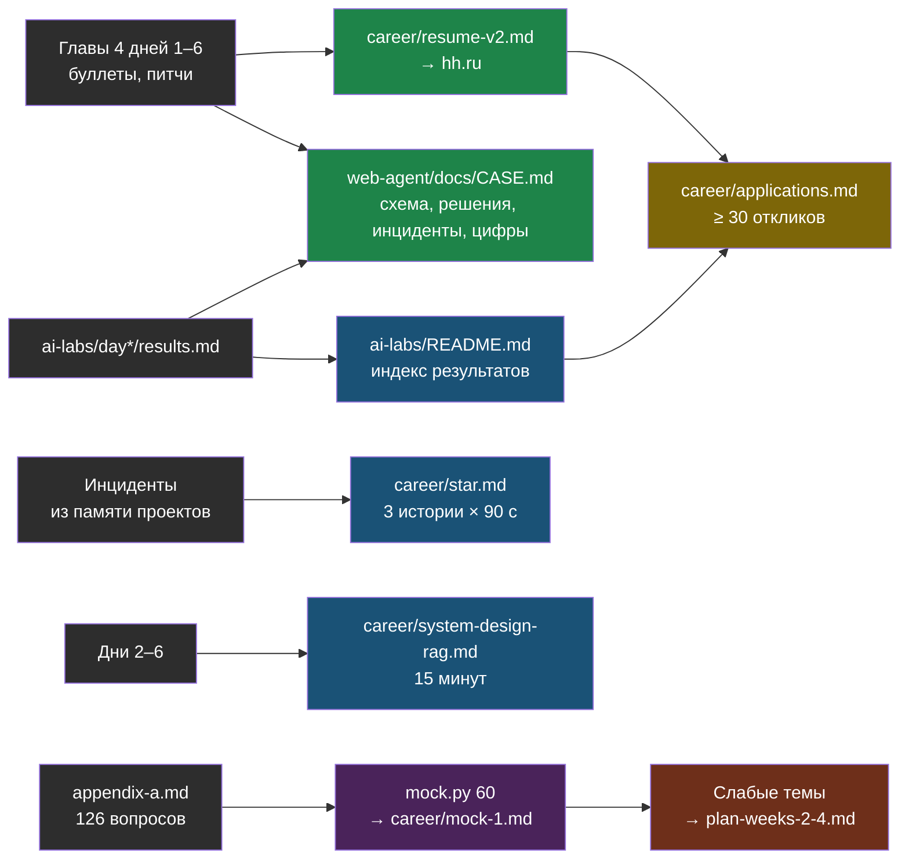

# День 7. Лаба: кейс, резюме v2, STAR, mock-интервью

## Результат

К концу дня существуют и опубликованы: кейс `CASE.md` в репозитории web-agent, индекс лаб в `ai-labs/README.md`, резюме v2 на hh.ru, три STAR-истории и 15-минутный разбор system design в `career/`, результат mock-интервью на 60 вопросах с списком слабых тем, таблица откликов с не менее чем тридцатью строками за неделю и план недель 2–4. Артефакты не технические, но именно они превращают шесть дней работы в приглашения.

## Карта лабы



## Подготовка

Открой рядом: `results.md` всех шести лаб, главы 4 дней 1–6 (буллеты и питчи), `career/resume-v1.md`, `career/vacancies-2026-09.md`. Таймер — обязательный инструмент дня.

## Шаг 1. Кейс web-agent для работодателя (45 минут)

Файл `~/proj/web-agent/docs/CASE.md` — публичный документ, по которому интервьюер поймёт продукт за пять минут, а ты расскажешь за семь. Структура и объём — не больше двух экранов:

```markdown
# web-agent — RAG-платформа для ответов по документам компаний

## Для кого и зачем
Малый и средний бизнес: ассистент по своим документам в виджете на сайте и в Telegram, без разработчика в штате.
Один инстанс обслуживает несколько компаний (multi-tenant). В проде с <месяц год>, клиенты: <число>.

## Архитектура
<mermaid: пользователь → виджет/Telegram → agent-api (FastAPI) → ChromaDB (коллекция на tenant) + PostgreSQL
→ OpenRouter; doc-parser (watcher, краулер) → индексация; админка с ролями; CI/CD: тег → Ansible rolling update
с self-test-гейтом>

## Пять решений и их цена
1. Коллекция на tenant, не фильтр — утечка невозможна без ошибки в имени; цена — больше коллекций.
2. Лёгкие парсеры вместо unstructured — десятки МБ зависимостей вместо гигабайт; цена — таблицы в PDF хуже.
3. Честный отказ со сбором контакта вместо галлюцинации — лиды вместо потерянных диалогов; цена — маркер в промпте и его обработка.
4. Self-test round-trip перед переключением трафика — ловит «модель настроена, но не используется»; цена — вызовы к провайдеру раз в N минут.
5. Workflow, не агент — предсказуемость и стоимость; цена — нет инструментов; план: маршрутизация к инструментам чтения.

## Два инцидента и что изменилось
- Миграция на multi-tenant перенесла метаданные, но не векторы → все ответы «нет информации» → диагностика запросом к Chroma, перенос,
  контроль расхождения слоёв, бэкап LXC перед релизом.
- Геоблок провайдера (403 Cloudflare на RU IP) → socks5 exit-node в systemd, урок про Environment внутри [Service], риск проговорен.

## Цифры (сентябрь 2026, golden-набор 25 вопросов)
| поиск dense / hybrid+rerank | recall@5 … → … | MRR … → … |
| RAGAS faithfulness dense / hybrid | … / … |
| latency p50 ответа | … мс; реранкер на CPU … мс |
| стоимость запроса | $… (модель …) |
| red team OWASP LLM | до … /10, после … /10 |

## Стек
Python 3.12, FastAPI, SQLAlchemy + Alembic, PostgreSQL, ChromaDB, LangChain text splitters, OpenRouter, httpx, Telegram Bot API,
Docker Compose, Ansible, GitHub Actions (self-hosted runner), Proxmox LXC.

## Что дальше
pgvector с RLS вместо Chroma (план из 5 шагов), condense question, Langfuse в проде, порог релевантности, гибрид под фича-флагом.
```

Схему нарисуй в Mermaid по образцу дня 2 — та же палитра. Числа — только из `results.md`. Коммит в репозиторий web-agent и ссылка из его README.

## Шаг 2. Индекс лаб в ai-labs (15 минут)

`~/proj/ai-labs/README.md` — первое, что откроет работодатель по ссылке:

```markdown
# ai-labs — неделя перехода в AI/LLM-инженерию: измеримые лабы

Каждая папка — один день, каждый день — воспроизводимый результат в `results.md`.

| день | тема | главный результат |
|---|---|---|
| [day1-llm-basics](day1-llm-basics/results.md) | токены, structured output, streaming, стоимость, ретраи | RU/EN токены …/…; 30k RAG-запросов/мес: $… vs $… |
| [day2-rag-eval](day2-rag-eval/results.md) | golden-набор, dense / BM25 / hybrid RRF / rerank | recall@5 … → …, MRR … → … |
| [day3-pgvector](day3-pgvector/results.md) | pgvector HNSW, гибрид в SQL, RLS, план миграции | dense = Chroma; RLS утечка 0; план … ч |
| [day4-agent](day4-agent/results.md) | LangGraph: лимиты, HITL, checkpointer; MCP-сервер памяти | 8 прогонов, 3 остановки, MCP в Claude Code |
| [day5-evals](day5-evals/results.md) | Langfuse, RAGAS, судья с калибровкой, гейт в pytest | faithfulness … → …; судья …/5 |
| [day6-serving-security](day6-serving-security/results.md) | VRAM, Ollama Q4/Q8, RU-провайдер, red team OWASP LLM | red team … → … /10 |

Контекст: продукт в проде — [web-agent CASE](https://github.com/iRoboTron/web-agent/blob/main/docs/CASE.md).
Серия книг по неделе — https://ai-engineering.adelfos.ru
```

Проверь, что репозиторий web-agent публичен или что ссылка ведёт на публичный кейс; если код закрыт — CASE.md можно продублировать в `ai-labs/`.

## Шаг 3. Резюме v2 (30 минут)

Собери `career/resume-v2.md` из глав 4 дней 1–6 по структуре главы 1: заголовок = название позиции; «О себе» — четыре строки; навыки тремя группами; три проекта с буллетами; опыт; материалы. Правила: каждое слово в навыках подтверждено файлом в `ai-labs` или кодом в проектах; каждый буллет содержит число или проверяемый факт; убраны «изучаю» и «базовые знания»; добавлены слова из трёх любимых вакансий (практика главы 1). Обнови резюме на hh.ru целиком, вставь ссылки на `ai-labs`, `CASE.md` и `ai-engineering.adelfos.ru` в раздел портфолио. Обновление резюме поднимает его в выдаче — делай это ежедневно.

## Шаг 4. Три STAR-истории (20 минут)

`career/star.md`: три истории из главы 1 по четырём абзацам — Situation, Task, Action, Result — плюс строка «что изменилось в процессе». Запиши каждую голосом, замерь: 60–90 секунд. Если длиннее — режь Action до трёх шагов. Запасную (unstructured) — одним абзацем.

## Шаг 5. System design «RAG для поддержки» за 15 минут (30 минут)

`career/system-design-rag.md` — не текст, а скелет с временем: требования и ограничения (2 мин: пользователи, объём документов, ПДн, латентность, on-prem или API) → данные и индексация (2 мин: парсинг, нарезка, метаданные, инкрементальность) → поиск (3 мин: эмбеддинги для русского, гибрид, реранкер, порог, condense question) → генерация (2 мин: промпт с границами данных, цитаты, честный отказ, structured output) → хранилище и multi-tenancy (2 мин: pgvector с RLS или Qdrant, критерий выбора) → evals и наблюдаемость (2 мин: golden-набор, RAGAS, гейт, трейсы, дрейф) → безопасность и стоимость (2 мин: OWASP, red team, бюджет, роутинг моделей). Проговори с таймером дважды. Рисуй схему по ходу — это оценивают.

## Шаг 6. Mock-интервью на 60 вопросах (45 минут)

Скрипт берёт случайные вопросы из банка приложения A и показывает суть ответа только после твоего ответа:

```python
# ~/proj/ai-labs/day7-interview/mock.py
import random
import re
import sys
from pathlib import Path

BANK = Path.home() / "Documents/lessons/ai-engineering/docs/books/07-portfolio-interview/appendix-a.md"
n = int(sys.argv[1]) if len(sys.argv) > 1 else 60

items = []
section = ""
for line in BANK.read_text(encoding="utf-8").splitlines():
    if line.startswith("## "):
        section = line[3:].strip()
    m = re.match(r"- \*\*(.+?)\*\* — (.+)", line)
    if m:
        items.append((section, m.group(1), m.group(2)))

picked = random.sample(items, min(n, len(items)))
scores = []
for i, (section, q, a) in enumerate(picked, 1):
    input(f"\n[{i}/{len(picked)}] ({section})\n{q}\n— отвечай вслух, Enter когда закончишь ")
    print(f"суть: {a}")
    s = input("оценка 0 (не смог) / 1 (частично) / 2 (уверенно): ").strip()
    scores.append((section, q, int(s) if s in "012" and s else 0))

total = sum(s for _, _, s in scores)
print(f"\nитого: {total}/{2 * len(scores)} ({100 * total / (2 * len(scores)):.0f} %)")
weak = [(sec, q) for sec, q, s in scores if s < 2]
print("слабые вопросы:")
for sec, q in weak:
    print(f"  - [{sec}] {q}")
```

Запуск: `python mock.py 60`, отвечай вслух, честно ставь оценки. Итог и список слабых вопросов — в `career/mock-1.md`. Ниже 70 % по какому-то дню — этот день в план недели 2 первым. Повтори mock через два дня.

## Шаг 7. Отклики и таблица (30 минут)

`career/applications.md` — таблица: дата, компания, вакансия, ссылка, зарплата, канал, статус (отклик → ответ → HR → тех → финал → оффер/отказ), следующий шаг и дата. Внеси всё, что отправлено за неделю, и добавь сегодня столько, чтобы всего было не меньше тридцати. Сопроводительное — три фразы: кто ты одной строкой; что в проде и одна цифра из лаб; ссылка на `ai-labs` и готовность к техническому разговору. Через пять рабочих дней без ответа — вежливый follow-up.

## Шаг 8. План недель 2–4 (20 минут)

`career/plan-weeks-2-4.md` — по неделям, три раздела в каждой: **углубить** (слабые темы из mock), **в прод** (одно изменение в своих проектах из планов лаб), **публично** (статья, доклад, обновление резюме). Заготовка — в главе 4.

## Если не получилось

- **Кейс не влезает в два экрана** — режь решения до трёх и инциденты до одного; остальное — в разговор.
- **В резюме есть слово без файла** — убирай слово, не выдумывай файл.
- **STAR длиннее 90 секунд** — убери детали диагностики, оставь причину и фикс.
- **System design «плывёт»** — говори по скелету и рисуй; интервьюер ведёт вопросами, это нормально.
- **Mock ниже 60 %** — не паника, а план: слабые дни повторить по главам 1 и 3, лабы не переделывать.
- **Откликов мало** — расширь поиск названиями вакансий из дня 1 и удалёнкой по всей стране; middle-позиции, не junior.

## Практика

1. Две статьи на Хабре: составь планы по пять пунктов — «Как я измерил свой RAG» (дни 2 и 5) и «Red team своего LLM-бота по OWASP» (день 6); первая — в неделю 2.
2. Попроси знакомого инженера провести mock по кейсу web-agent и задать пять «а что если»; запиши, где споткнулся.
3. Английская версия резюме на одну страницу — на неделю 3, если рассматриваешь удалёнку за рубеж.

## Что проверить

- `CASE.md` в репозитории web-agent: схема, пять решений, два инцидента, таблица цифр, коммит запушен.
- `ai-labs/README.md` — индекс шести дней с числами и ссылками.
- Резюме v2 опубликовано на hh.ru; ни одного неподтверждённого навыка; три ссылки в портфолио.
- `star.md` — три истории по 60–90 секунд, записаны голосом.
- `system-design-rag.md` — скелет на 15 минут, проговорён дважды с таймером.
- `mock-1.md` — 60 вопросов, итоговый процент, список слабых тем.
- `applications.md` — не меньше тридцати откликов за неделю, у каждого — следующий шаг.
- `plan-weeks-2-4.md` заполнен.
