# Глоссарий дня 7

Термины по алфавиту, с английским оригиналом и указанием, где встречаются. К каждому термину — схема-подсказка в палитре курса: серый — вход, синий — процесс, зелёный — результат, коричневый — ошибка/опасность, жёлтый — данные/хранение, фиолетовый — внешнее.

---

**Follow-up** — вежливое напоминание работодателю через пять рабочих дней после отклика или интервью без ответа. Лаба, шаг 7.

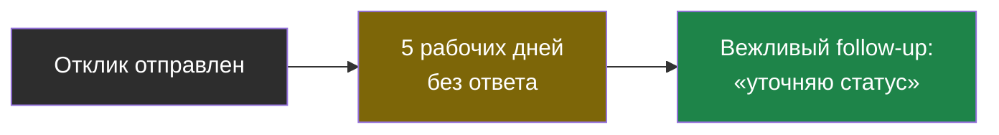

---

**HR-скрининг (HR screening)** — первый звонок рекрутера: мотивация, зарплата, формат, адекватность; проверяется питч и диапазон. Глава 1.

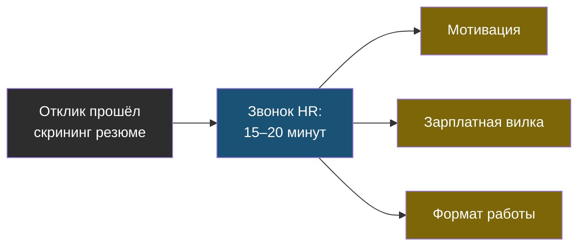

---

**Live coding** — практическое задание в реальном времени, 30–60 минут; оценивают ход мысли и рабочий код, не идеальный. Глава 1.

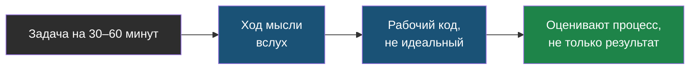

---

**Mock-интервью (mock interview)** — тренировочное собеседование с оценкой ответов; в серии — 60 случайных вопросов из банка. Лаба, шаг 6.

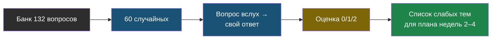

---

**Оффер (offer)** — формальное предложение о работе: должность, деньги, дата, формат; просить письменно, сравнивать по нескольким критериям. Главы 1 и 4.

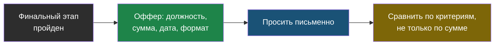

---

**Питч (pitch)** — рассказ о себе на две минуты: кто, что в проде, чем отличаешься, что ищешь. Главы 1, 3, 4.

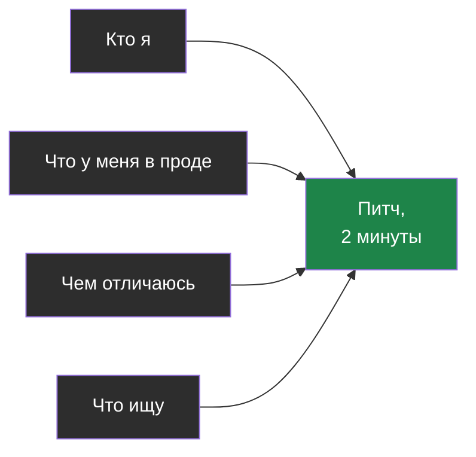

---

**Портфолио (portfolio)** — публичные артефакты, подтверждающие навыки: `ai-labs` с результатами, `CASE.md`, серия книг, Langfuse-демо. Главы 1–2.

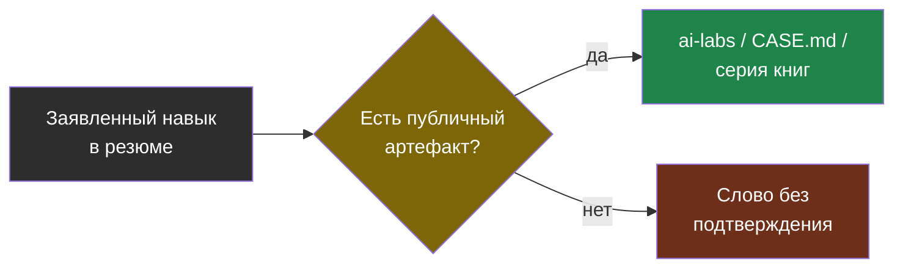

---

**Практическое (домашнее) задание (take-home assignment)** — задача на 4–8 часов; делается как лаба: README, тесты, Docker, измерения, ограничение по времени. Глава 1.

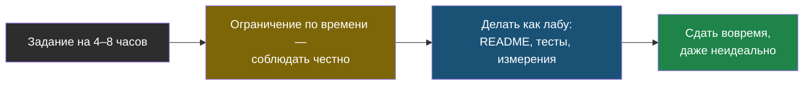

---

**Скрининг резюме (resume screening)** — отбор рекрутером за секунды по ключевым словам, признакам прода и красным флагам. Глава 1.

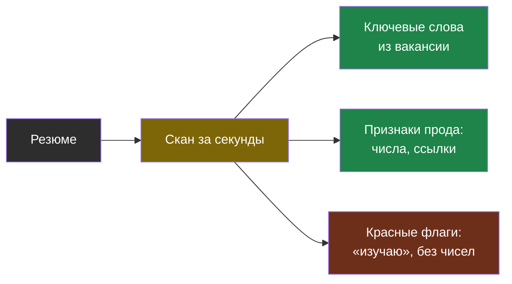

---

**Сопроводительное письмо (cover letter)** — три фразы: кто ты, что в проде с одной цифрой, ссылка на портфолио. Лаба, шаг 7.

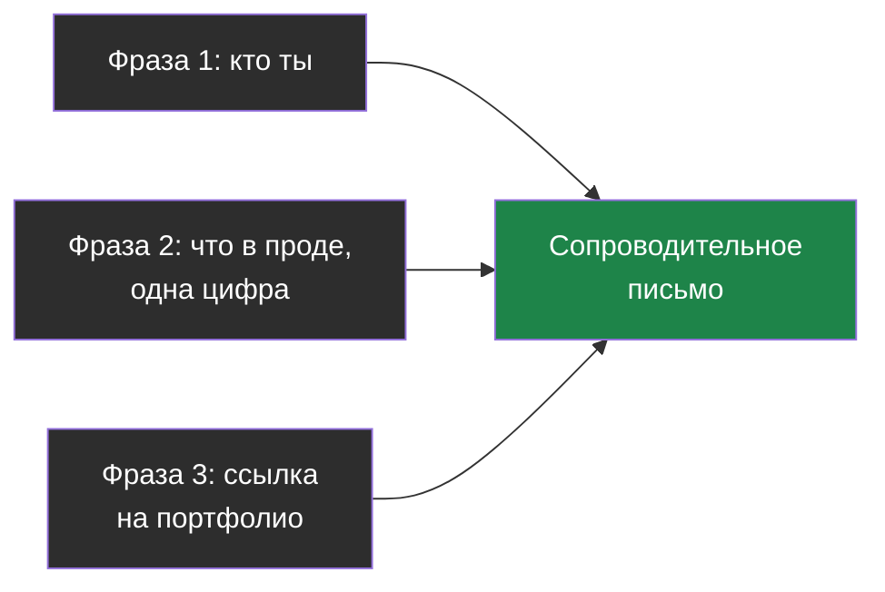

---

**STAR** — структура истории: Situation, Task, Action, Result, плюс изменение процесса; 60–90 секунд. Главы 1–3.

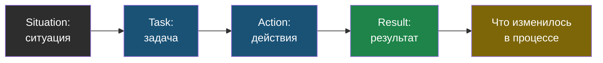

---

**System design interview** — разбор архитектуры системы по требованиям и ограничениям за 45 минут; оценивают способ мышления и trade-off. Главы 1–3.

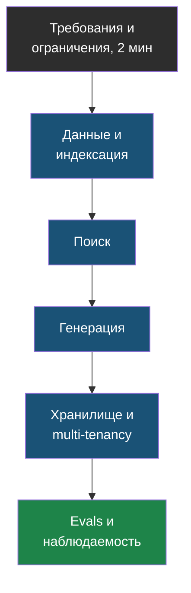

---

**Вилка (salary range)** — диапазон зарплаты вакансии или ожиданий кандидата; называть диапазон, не число. Главы 1 и 3.

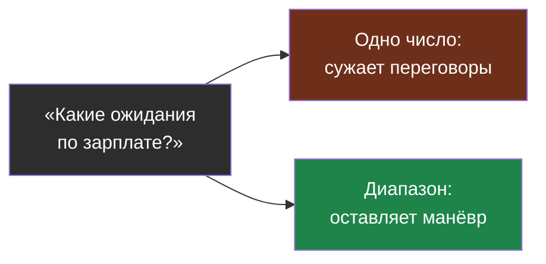

---

**Воронка найма (hiring funnel)** — этапы от отклика до оффера с конверсией на каждом; из тридцати откликов — один-два финала. Глава 1.

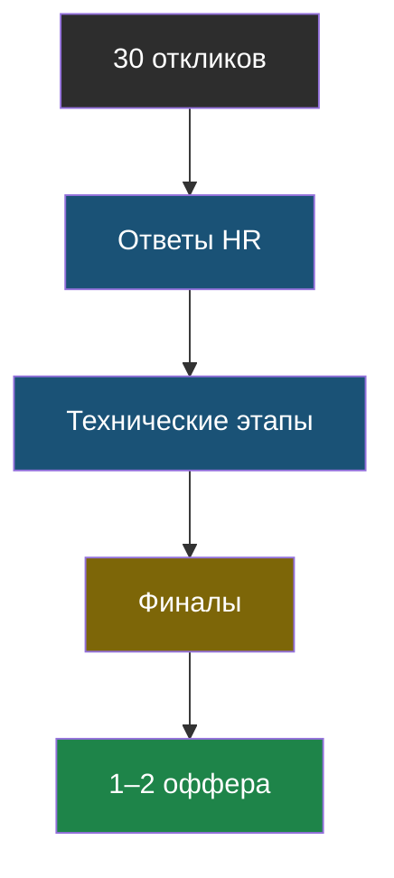

---

**Кейс продукта (case study)** — структурированный рассказ о проекте: контекст, архитектура, решения с trade-off, инцидент, цифры, что дальше. Главы 1–2.

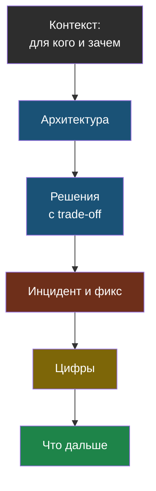

---

**Красные флаги резюме (red flags)** — длинные списки технологий без глубины, «изучаю», отсутствие чисел и проектов, «промпт-инженер» как самоназвание. Глава 1.

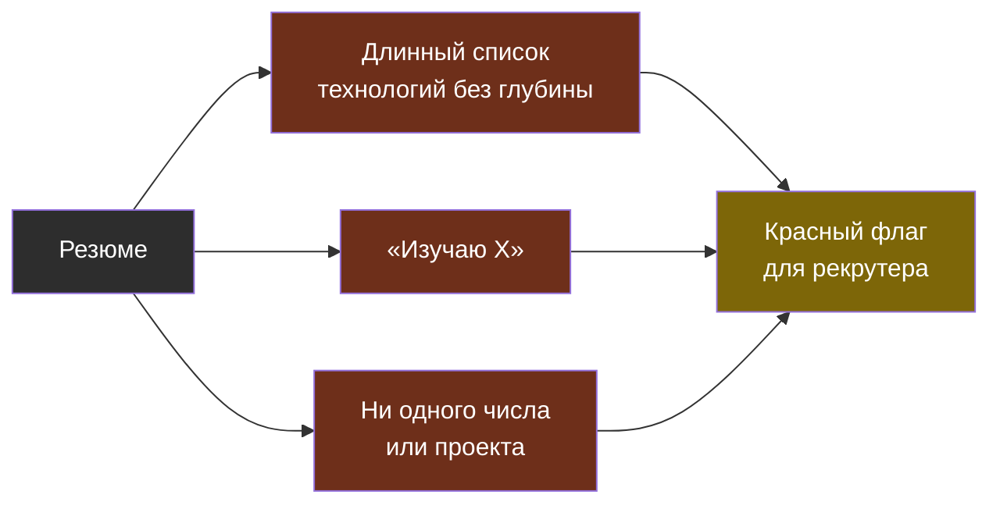
